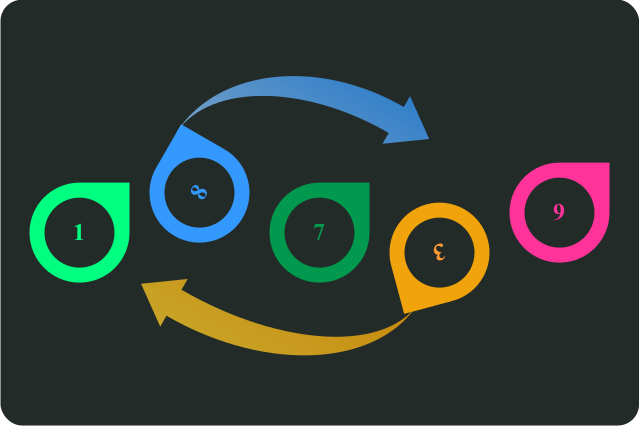

# Sắp xếp

<div class="result" markdown>
{ align=left width=360 }

Trong quá trình luyện công, người học phải tự mình viết những hàm **sắp xếp** nhằm rèn luyện tư duy và kỹ thuật lập trình. Tuy nhiên, khi làm bài thi, thời gian là yếu tố quan trọng, thí sinh nên sử dụng những công cụ có sẵn của ngôn ngữ, hạn chế viết lại hoặc tạo lại nhằm dành thời giờ và công sức cho ý tưởng.

Bài viết này hướng dẫn cách sử dụng hàm sort() có sẵn để sắp xếp các phần tử trong một vector.

## Sắp xếp vector gồm các số nguyên

Đặt `v` là vector gồm các số nguyên.

=== "C++"

    ``` c++ linenums="1"
    vector<int> v;
    ```
=== "Python"

    Nội dung này sẽ cập nhật sau khi chủ thớt được đồ-nét :)

Các phần tử của `v` được phát sinh ngẫu nhiên bằng đoạn mã sau:

=== "C++"

    ``` c++ linenums="1"
    void generate()
    {
        int x;
        for (int i = 0; i < n; ++i)
        {
            x = rand() % 10; // (1)
            v.push_back(x);
        }    
    }
    ```
    { .annotate }

    1.  `rand() % 10` dùng để phát sinh ngẫu nhiên một số nằm trong [0, 10).

=== "Python"

    Nội dung này sẽ cập nhật sau khi chủ thớt được đồ-nét :)

Output:

```pycon
Vector ban đầu:
1 7 4 0 9 4 8 8 2 4 5 5 1
```

Trong C++, để sắp xếp vector gồm các phần tử là số nguyên, ta sử dụng hàm `sort()` của thư viện `algorithm`.

Một điểm hay của `sort()` là cho phép sắp xếp chỉ một phần nào đó của vector.

Đoạn mã sau sắp xếp 5 phần tử đầu tiên của vector. 

=== "C++"

    ``` c++ linenums="1" hl_lines="1"
        sort(v.begin(), v.begin() + 5);
        show("Sắp xếp 5 phần tử đầu tiên tăng dần:");
    ```
=== "Python"

    Nội dung này sẽ cập nhật sau khi chủ thớt được đồ-nét :)


Output:

```pycon
Sắp xếp 5 phần tử đầu tiên tăng dần:
0 1 4 7 9 4 8 8 2 4 5 5 1
```

Đoạn mã sau sắp xếp toàn bộ vector. 

=== "C++"

    ``` c++ linenums="1" hl_lines="1"
        sort(v.begin(), v.end());
        show("Sắp xếp toàn bộ vector tăng dần:");
    ```
=== "Python"

    Nội dung này sẽ cập nhật sau khi chủ thớt được đồ-nét :)

Output:

```pycon
Sắp xếp toàn bộ vector tăng dần:
0 1 1 2 4 4 4 5 5 7 8 8 9
```

!!! note "Lưu ý"

    `v.end()` là con duyệt (iterator) trỏ ra ***sau*** vector, chứ không phải trỏ vào phần tử cuối cùng.

Mặc định, hàm `sort()` sắp xếp theo thứ tự tăng dần. Để sắp xếp giảm dần, ta truyền thêm tham số thứ ba là `greater<int>()` (1).
{ .annotate }

1.  `greater<int>()` là một đối tượng hàm (function object), nghĩa là đối tượng được sử dụng như thể là hàm. (Hình như chủ thớt giải thích như thể không giải thích)

=== "C++"

    ``` c++ linenums="1" hl_lines="1"
        sort(v.begin(), v.end(), greater<int>());
        show("Sắp xếp toàn bộ vector giảm dần:");
    ```
=== "Python"

    Nội dung này sẽ cập nhật sau khi chủ thớt được đồ-nét :)

Output:

```pycon
Sắp xếp toàn bộ vector giảm dần:
9 8 8 7 5 5 4 4 4 2 1 1 0
```

## Sắp xếp vector gồm các cặp số nguyên

Đặt `pv` là vector gồm các cặp số nguyên.

=== "C++"

    ``` c++ linenums="1"
    vector<pair<int, int>> pv;
    ```
=== "Python"

    Nội dung này sẽ cập nhật sau khi chủ thớt được đồ-nét :)

`pv` được phát sinh ngẫu nhiên bằng đoạn mã sau:

=== "C++"

    ``` c++ linenums="1"
    void generate_pairs()
    {
        int x;
        int y;
        for (int i = 0; i < n; ++i)
        {
            x = rand() % 13;
            y = rand() % 13;
        
            pv.push_back(make_pair(x, y)); // (1)
        }
    }

    ```
    { .annotate }

    1.  Hàm `make_pair()` dùng để tạo một cặp gồm hai thành phần.


=== "Python"

    Nội dung này sẽ cập nhật sau khi chủ thớt được đồ-nét :)

Output:

```pycon
Vector ban đầu:
(5, 3) (10, 5) (8, 4) (2, 8) (5, 2) (10, 6) (6, 1) (9, 10) (5, 0) (3, 3) (7, 10) (9, 5) (0, 5)
```   

Giả sử ta muốn sắp xếp theo thứ tự thành phần thứ nhất giảm dần, không quan tâm thành phần thứ hai.

Để giải quyết yêu cầu này, trước hết, ta viết hàm so sánh hai cặp số với nhau, đặt là hàm `compare1()`.

=== "C++"

    ``` c++ linenums="1"
    bool compare1(const pair<int, int>& a, const pair<int, int>& b)
    {
        return a.first > b.first; // (1)
    }
    ```
    { .annotate }

    1.  Để truy xuất hai thành phần của một biến `p` có kiểu `pair<>`, ta viết là `p.first` và `p.second`.

=== "Python"

    Nội dung này sẽ cập nhật sau khi chủ thớt được đồ-nét :)

Sau đó, ta truyền hàm `compare1()` vừa viết vào hàm `sort()`.

=== "C++"

    ``` c++ linenums="1" hl_lines="1"
        sort(pv.begin(), pv.end(), compare1);
        show_pairs("Sắp xếp giảm dần theo thành phần thứ nhất:");
    ```

=== "Python"

    Nội dung này sẽ cập nhật sau khi chủ thớt được đồ-nét :)

Output:

```pycon
Sắp xếp giảm dần theo thành phần thứ nhất:
(10, 5) (10, 6) (9, 10) (9, 5) (8, 4) (7, 10) (6, 1) (5, 3) (5, 2) (5, 0) (3, 3) (2, 8) (0, 5)
```

Giả sử ta muốn sắp xếp theo hai mức ưu tiên sau:

- Ưu tiên 1: Sắp xếp theo thành phần thứ nhất tăng dần.
- Ưu tiên 2: Nếu thành phần thứ nhất bằng nhau, sắp xếp theo thành phần thứ hai giảm dần.

Tương tự như trên, ta cũng viết hàm so sánh hai cặp số với nhau, đặt là hàm `compare2()`.

=== "C++"

    ``` c++ linenums="1"
    bool compare2(const pair<int, int>& a, const pair<int, int>& b)
    {
        // Nếu thành phần thứ nhất khác nhau thì so sánh thành phần thứ nhất
        if (a.first != b.first)
        {
            return a.first < b.first;
        }

        // Ngược lại, nếu thành phần thứ nhất bằng nhau
        // thì so sánh thành phần thứ hai
        return a.second > b.second;
    }
    ```

=== "Python"

    Nội dung này sẽ cập nhật sau khi chủ thớt được đồ-nét :)

Truyền hàm `compare2()` vừa viết vào hàm `sort()`.

=== "C++"

    ``` c++ linenums="1" hl_lines="1"
        sort(pv.begin(), pv.end(), compare2);
        show_pairs("Sắp xếp tăng dần thành phần thứ nhất, giảm dần thành phần thứ hai:");
    ```

=== "Python"

    Nội dung này sẽ cập nhật sau khi chủ thớt được đồ-nét :)

Output:

```pycon
Sắp xếp tăng dần thành phần thứ nhất, giảm dần thành phần thứ hai:
(0, 5) (2, 8) (3, 3) (5, 3) (5, 2) (5, 0) (6, 1) (7, 10) (8, 4) (9, 10) (9, 5) (10, 6) (10, 5)
```

## Toàn bộ chương trình

=== "C++"

    Chương trình C++ hoàn chỉnh đặt tại [Gist của GitHub](https://gist.github.com/vtchitruong/5d3096473f138b15ad948937d1477288){target="_blank"}.

=== "Python"

    Nội dung này sẽ cập nhật sau khi chủ thớt được đồ-nét :)