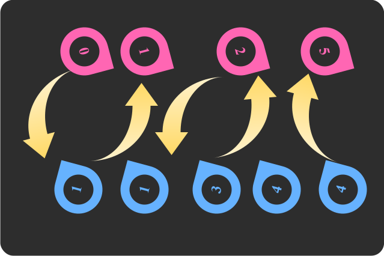

# Hợp và trộn

<div class="result" markdown>
{ align=left width=360 }

Trong quá trình luyện công, người học phải tự mình viết những hàm **hợp và trộn** nhằm rèn luyện tư duy và kỹ thuật lập trình. Tuy nhiên, khi làm bài thi, thời gian là yếu tố quan trọng, thí sinh nên sử dụng những công cụ có sẵn của ngôn ngữ, hạn chế viết lại hoặc tạo lại nhằm dành thời giờ và công sức cho ý tưởng.

Bài viết này hướng dẫn cách sử dụng một số hàm có sẵn để hợp, trộn và kiểm tra hai vector chứa nhau.

## Hợp nhất hai vector

Khởi tạo `v1`, `v2` và `v3` là các vector gồm số nguyên.

=== "C++"

    ``` c++ linenums="1"
    vector<int> v1 {0, 1, 2, 2, 4, 4, 5, 7, 7, 7};
    vector<int> v2 {1, 1, 1, 4, 5, 5, 6, 8, 8, 9};
    vector<int> v3 {1, 4, 4};
    ```
=== "Python"

    Nội dung này sẽ cập nhật sau khi chủ thớt được đồ-nét :)

!!! note "Lưu ý"

    Cả ba vector đều có thứ tự tăng dần.

    Các hàm liên quan trong bài này chỉ áp dụng cho vector đã sắp xếp tăng dần.

Trong C++, để hợp nhất hai vector `v1` và `v2`, ta dùng hàm `set_union()`. 

Đoạn mã sau hợp nhất vector `v1` và `v2` thành vector `u`. Trong đó, ta đính kèm thêm hàm `back_inserter()` để gắn vào vector kết quả.

=== "C++"

    ``` c++ linenums="1" hl_lines="6"
        show("Vector 1:", v1);
        show("Vector 2:", v2);
        
        // Hợp nhất hai vector 1 và 2
        vector<int> u;
        set_union(v1.begin(), v1.end(), v2.begin(), v2.end(), back_inserter(u));
        show("Sau khi hợp nhất:", u);
    ```
=== "Python"

    Nội dung này sẽ cập nhật sau khi chủ thớt được đồ-nét :)

Output:

```pycon
Vector 1: 0 1 2 2 4 4 5 7 7 7 
Vector 2: 1 1 1 4 5 5 6 8 8 9
Sau khi hợp nhất: 0 1 1 1 2 2 4 4 5 5 6 7 7 7 8 8 9
```

Đối với phần tử mà cả hai vector `v1` và `v2` đều có, vector hợp `u` chỉ lấy một lần phần tử này.

Trong trường hợp `v1` chứa một phần tử `1`, v2 chứa ba phần tử `1`, vector `u` sẽ lấy ba phần tử `1` của `v2`.

## Trộn hai vector

Trong C++, để trộn hai vector, ta dùng hàm `merge()`.

Trước khi trộn, ta phải chỉ định kích thước cho vector kết quả, là bằng kích thước của hai vector con cộng lại. Kết đến mới gọi hàm trộn.

Đoạn mã sau trộn hai vector `v1` và `v2` thành vector `merged`. 

=== "C++"

    ``` c++ linenums="1" hl_lines="2 3"
        vector<int> merged;
        merged.resize(v1.size() + v2.size());
        merge(v1.begin(), v1.end(), v2.begin(), v2.end(), merged.begin());
        show("Sau khi trộn:", merged);
    ```
=== "Python"

    Nội dung này sẽ cập nhật sau khi chủ thớt được đồ-nét :)

Output:

```pycon
Sau khi trộn: 0 1 1 1 1 2 2 4 4 4 5 5 5 6 7 7 7 8 8 9
```

## Kiểm tra hai vector chứa nhau

Để kiểm tra vector này có chứa vector kia hay không, ta dùng hàm `includes()`.

=== "C++"

    ``` c++ linenums="1" hl_lines="6 10"
        show("Vector 1:", v1);
        show("Vector 2:", v2);
        show("Vector 3:", v3);

        // Kiểm tra vector 1 có chứa vector 3 không
        bool res1 = includes(v1.begin(), v1.end(), v3.begin(), v3.end());
        cout << "Vector 1 chứa vector 3: " << boolalpha << res1 << endl; // (1)

        // Kiểm tra vector 2 có chứa vector 3 không
        bool res2 = includes(v2.begin(), v2.end(), v3.begin(), v3.end());
        cout << "Vector 2 chứa vector 3: " << boolalpha << res2 << endl;
    ```
    { .annotate }

    1.  `boolalpha` giúp in ra biến kiểu `bool` ở dạng `true` và `false`, thay vì `1` và `0`.

=== "Python"

    Nội dung này sẽ cập nhật sau khi chủ thớt được đồ-nét :)

Output:

```pycon
Vector 1: 0 1 2 2 4 4 5 7 7 7
Vector 2: 1 1 1 4 5 5 6 8 8 9
Vector 3: 1 4 4
Vector 1 chứa vector 3: true
Vector 2 chứa vector 3: false
```

Quan sát output, vector `v1` chứa vector `v3`, mặc dù các phần tử `1` và `4` của `v1` không nằm liền kề nhau. Ngược lại, `v2` không chứa `v3`, vì `v2` chỉ có một phần tử `4`, trong khi `v3` có đến hai phần tử `4`.

## Toàn bộ chương trình

=== "C++"

    Chương trình C++ hoàn chỉnh đặt tại [Gist của GitHub](https://gist.github.com/vtchitruong/ac9e8dfd0550445d038f76460b2277e7){target="_blank"}.

=== "Python"

    Nội dung này sẽ cập nhật sau khi chủ thớt được đồ-nét :)