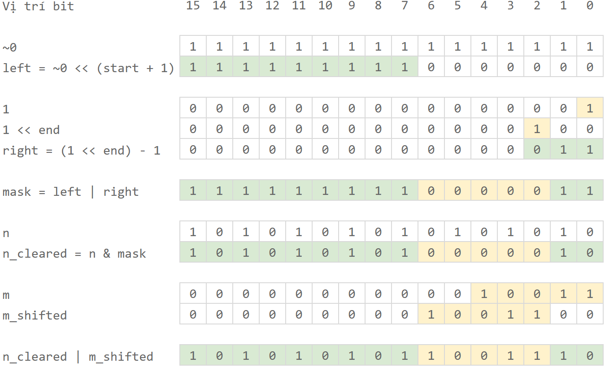

---
tags:
    - bitwise
    - chèn bit
level: "nâng cao"
level_url: "/advanced/advanced-index/"

difficulty: "easy"
updated: "28/09/2026"
---

# Chèn bit

## Đề bài

Cho hai số nguyên 32 bit $n$ và $m$, cùng hai vị trí bit $start$ và $end$, với $start \ge end$.

**Yêu cầu**:  
Chèn toàn bộ các bit của $m$ vô trong $n$ sao cho $m$ nằm từ vị trí bit $start$ đến vị trí bit $end$.

**Input**:  
$n, m, start, end$.

```pycon
n = 10101010 10101010
m = 10011
start = 6
n = 2
```

**Output**:  
$n$ mới sau khi chèn vô.

```pycon
n = 10101010 1 10011 10
```

**Giải thích**:  
Các bit của $n$ tại vị trí từ 2 đến 6 được thay thế bằng các bit của $m = 10011$.

**Điều kiện:**  
Đoạn bit từ $start$ đến $end$ luôn có đủ chỗ để chứa trọn vẹn $m$.

---

## Bài giải đề xuất

### Ý tưởng chính

Ta cần dịch chuyển các bit của `m` sang trái để khớp với các vị trí cần chèn vô là `start` và `end`.

```
m = 10011
m_shifted = m << end = m << 2 = 1001100
```

Để có thể chèn vô vị trí `start` và `end` trong `n`, ta cần *"xóa"* đoạn bit này của `n`, tức là chuyển các bit từ `start` đến `end` thành bit `0`.

Để làm điều này, ta dùng toán tử `&` đối với `n` và `mask`:

```
n_cleared = n & mask
```

Trong đó, `mask` là mặt nạ dùng để che các bit bên trái của `start` và các bit bên phải của `end`, đồng thời để hở các bit nằm giữa `start` và `end` (để chèn `m` vô).

`mask` có dạng: `1..1  00000 11`.

Để tạo `mask`, ta cần tạo hai chuỗi:

- `left` là chuỗi các bit `1` nằm bên trái của `start`.
- `right` là chuỗi các bit `1` nằm bên phải của `end`.

Để tạo `left`, ta tạo một chuỗi toàn bit `1` bằng lệnh `~0`. Sau đó, dịch trái chuỗi này `start + 1` bước.

```
~0 = 11111111 11111111
left = ~0 << (start + 1) = 11111111 10000000
```

Để tạo `right`, ta dịch chuyển các bit của số nguyên `1` sang trái `end` bước, rồi thực hiện trừ đi 1 để các bit từ vị trí `0` đến `i - 1` trở thành bit `1` và các bit cao hơn trở thành bit `0`.

```
1 = 00000000 00000 001
1 << end = 00000000 00000 100
right = (1 << end) - 1 = 00000000 00000 011
```

Kết hợp `left` và `right` bằng toán tử `|` để tạo thành mask.

```
mask = left | right = 11111111 1 00000 11
```

Như vậy,

```
n_cleared = n & mask = 10101010 1 00000 10
```

Cuối cùng, ta chèn `m_shifted` vô `n_cleared` bằng toán tử `|`:

```
result = n_cleared | m_shifted = 10101010 1 10011 10
```

Hình sau đây minh họa lại các bước vừa trình bày:

{loading=lazy}

### Viết chương trình

=== "C++"

    ```c++ linenums="7"
    int insert_bits(int n, int m, int start, int end)
    {
        // Tạo chuỗi bit 1 nằm bên trái của start
        int left = ~0 << (start + 1);

        // Tạo chuỗi bit 1 nằm bên phải của end
        int right = (1 << end) - 1;

        // Tạo mặt nạ để che hai bên của start và end, đồng thời để hở khoảng giữa từ start đến end
        int mask = left | right;

        // Áp mặt nạ vào n để "xóa" các bit ở vị trí từ start đến end
        int n_cleared = n & mask;

        // Dịch chuyển các bit của m sang trái end bước để khớp với đoạn cần chèn trong n
        int m_shifted = m << end;

        // Chèn m vô n
        return n_cleared | m_shifted;
    }

    ```
=== "Python"

    ```py linenums="1"
    def insert_bits(n, m, start, end) -> int:
        # Tạo chuỗi bit 1 nằm bên trái của start
        left = ~0 << (start + 1)

        # Tạo chuỗi bit 1 nằm bên phải của end
        right = (1 << end) - 1

        # Tạo mặt nạ để che hai bên của start và end, đồng thời để hở khoảng giữa từ start đến end
        mask = left | right

        # Áp mặt nạ vào n để "xóa" các bit ở vị trí từ start đến end
        n_cleared = n & mask

        # Dịch chuyển các bit của m sang trái end bước để khớp với đoạn cần chèn trong n
        m_shifted = m << end

        # Chèn m vô n
        return n_cleared | m_shifted
    ```

---

## Mã nguồn

Code đầy đủ được đặt tại [GitHub](https://github.com/vtchitruong/thnc/tree/main/bitwise/insert-bits){target="_blank"}.