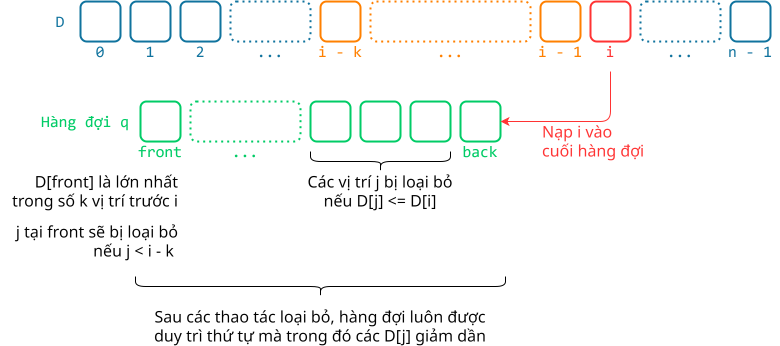

# Trò chơi di chuyển sang phải

## Khái quát

Bài toán trình bày dưới đây là một ví dụ về quy hoạch động và có thể được xếp vào dạng bài toán **quy hoạch động với cửa sổ trượt và tối ưu hoá bằng hàng đợi hai đầu (deque)**.

Kỹ thuật vừa nêu trên giúp giảm số phép tính cần thiết và đạt độ phức tạp $O(n)$, phù hợp để giải quyết bài toán có kích thước dữ liệu lớn.

## Bài toán

### Yêu cầu

Cho một dãy gồm $n$ ô ($n \leq 10^6$), mỗi ô có giá trị trong khoảng từ $-10^9$ đến $10^9$. 

Ban đầu, bạn bắt đầu ở ô có vị trí 0 với tổng điểm là 0. Mỗi lần đi, bạn có thể di chuyển sang phải ít nhất 1 ô và nhiều nhất là $k$ ô ($k \leq 100$). Khi bạn dừng lại ở một ô nào đó, giá trị của ô đó sẽ được cộng vào tổng điểm. Bạn có quyền dừng chơi tại bất kỳ ô nào và mục tiêu là tối ưu hóa tổng điểm đạt được.

### Input

```pycon
5 2
-2 3 -6 -4 5
```

### Output

```pycon
4
```

### Giải thích

Dữ liệu được cung cấp từ file `TROCHOI.INP`:

- Dòng đầu tiên chứa hai số nguyên $n$ và $k$.
- Dòng thứ hai chứa $n$ số nguyên của dãy ô, cách nhau bởi một dấu cách.

Kết quả được ghi vào file `TROCHOI.OUT` là một số nguyên cho biết tổng điểm lớn nhất đạt được.

## Cách giải đề xuất

### Xây dựng bảng quy hoạch

Bảng quy hoạch là mảng một chiều `D`. Trong đó, `D[i]` là tổng điểm lớn nhất đạt được khi ta chọn ô `A[i]` để dừng lại.

Nói cách khác, mảng `D` lưu trữ tổng điểm lớn nhất tại mỗi vị trí.

**Bước 1:** Khởi tạo

Khởi tạo `D[0] = 0` theo yêu cầu bài toán.

=== "C++"

    ```c++ linenums="38"
        // Khởi tạo giá trị 0 cho toàn mảng D
        vector<lli> D(n, 0); // (1)!
    ```
    { .annotate }

    1. `typedef long long int lli;`

=== "Python"

    ```py linenums="24"
        # Khởi tạo giá trị 0 cho toàn mảng D
        D = [0] * n
    ```

**Bước 2:** Điền giá trị cho `D[i]`

Để tính phần tử `D[i]` tiếp theo, ta phải tìm ra giá trị tổng điểm lớn nhất trong số các tổng điểm lưu tại các phần tử `D[j]` trong phạm vi `[i - k..i - 1]` và cộng thêm `A[i]`:

$$
\begin{align}
D[i] &= max(D[j]) + A[i], j \in [i - k, i - 1] \\
&= max(D[i - k], ..., D[i - 2], D[i - 1]) + A[i]
\end{align}
$$

Như vậy, ứng với mỗi `D[i]`, ta phải duyệt qua `k` phần tử D[j] trước đó. Việc này khiến cho độ phức tạp tăng lên thành $O(nk)$.

Để cải thiện, thay vì duyệt `k` lần, ta sử dụng hàng đợi `q` như sau:

- Hàng đợi chứa các phần tử là vị trí, tức chỉ số `i` hoặc `j`.
- Phần tử nằm ở đầu hàng đợi luôn là vị trí `j` mà `D[j]` là lớn nhất, với `j` nằm trong phạm vi `[i - k..i - 1]`.
- Nếu phần tử đầu hàng đợi này không còn nằm trong phạm vi `[i - k..i - 1]` thì ta gỡ loại bỏ nó khỏi hàng đợi.
- Sau khi tính `D[i]`, ta nạp phần tử là vị trí `i` vào cuối hàng đợi.
- Vì `D[i]` là giá trị tổng điểm lớn nhất khi chọn dừng tại `A[i]` nên ta sẽ loại bỏ những phần tử nào ở cuối hàng đợi mà có giá trị `D` nhỏ hơn `D[i]`. Nói cách khác, chúng bị loại bỏ vì không còn hữu ích trong việc tính tổng điểm lớn nhất nữa.

{ loading=lazy }

Để loại bỏ cả phần tử nằm ở đầu lẫn phần tử nằm ở cuối, ta sử dụng hàng đợi hai đầu `deque` (double ended queue).

=== "C++"

    ```c++ linenums="41"
        // Khai báo hàng đợi hai đầu q
        deque<int> q;

        // Nạp vị trí 0 hàng đợi
        q.push_back(0);

        // Duyệt từng phần tử D[i] trong phạm vi [1..n - 1]
        for (int i = 1; i < n; ++i)
        {
            // Nếu hàng đợi q vẫn còn phần tử và phần tử đầu nằm ngoài phạm vi [i - k..i - 1]
            if (!q.empty() && q.front() < i - k)
            {
                // thì loại bỏ phần tử đầu khỏi hàng đợi
                q.pop_front();
            }

            // Cập nhật D[i] bằng cách lấy phần tử D lớn nhất trước đó cộng thêm A[i]
            D[i] = D[q.front()] + A[i];

            // Trong khi hàng đợi q vẫn còn phần tử và D[j] nào đó nhỏ hơn hoặc bằng D[i]
            while (!q.empty() && D[q.back()] <= D[i])
            {
                // thì loại bỏ D[j] đó
                q.pop_back();
            }

            // Nạp vị trí i vào hàng đợi q
            q.push_back(i);
        }
    ```

=== "Python"

    ```py linenums="27"
        # Khai báo hàng đợi hai đầu q
        q = deque()

        # Nạp vị trí 0 hàng đợi
        q.append(0)

        # Duyệt từng phần tử D[i] trong phạm vi [1..n - 1]
        for i in range(1, n):
            # Nếu hàng đợi q vẫn còn phần tử và phần tử đầu nằm ngoài phạm vi [i - k..i - 1]
            if q and q[0] < i - k:
                # thì loại bỏ phần tử đầu khỏi hàng đợi
                q.popleft()

            # Cập nhật D[i] bằng cách lấy phần tử D lớn nhất trước đó cộng thêm A[i]
            D[i] = D[q[0]] + A[i]

            # Trong khi hàng đợi q vẫn còn phần tử và D[j] nào đó nhỏ hơn hoặc bằng D[i]
            while q and D[q[-1]] <= D[i]:
                # thì loại bỏ D[j] đó
                q.pop()

            # Nạp vị trí i vào hàng đợi q
            q.append(i)
    ```

**Bước 3:** Xuất kết quả

Kết quả cuối cùng là giá trị lớn nhất trong mảng `D`.

=== "C++"

    ```c++ linenums="71"
        // Lấy giá trị lớn nhất của mảng D
        result  = *max_element(D.begin(), D.end());
    ```

=== "Python"

    ```py linenums="51"
        # Lấy giá trị lớn nhất của mảng D
        result  = max(D)
    ```

## Mã nguồn

Code đầy đủ được đặt tại <a href="https://github.com/vtchitruong/DynamicProgramming/tree/main/moveright" target="_blank">GitHub</a>.