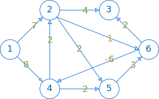
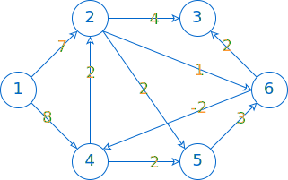

# Bellman-Ford

## Khái quát

Thuật toán Bellman-Ford là kết quả của những công trình nghiên cứu độc lập. Tên thuật toán được kết hợp từ phần họ của hai nhà khoa học nhằm ghi nhận đóng góp của cả hai:

- Nhà toán học người Mỹ Richard Bellman
- Nhà khoa học máy tính người Mỹ Lester Ford Jr

Đặc điểm của Bellman-Ford là đi khắp mọi ngõ ngách của đồ thị, kể cả những con đường "*âm tính*", chứ không như Dijkstra chỉ xử lý được đồ thị có trọng số không âm.

Mục tiêu của Bellman-Ford là tìm ra đường đi ngắn nhất từ một đỉnh đến các đỉnh khác, kể cả đồ thị có những cạnh mang trọng số âm.

Ý tưởng chủ yếu của Bellman-Ford là lặp *(v - 1)* lần thao tác cập nhật khoảng cách từ đỉnh xuất phát đến các đỉnh khác. Trong đó, *v* là số đỉnh của đồ thị.

Sở dĩ lặp *(v - 1)* lần là vì:

- Trong trường hợp xấu nhất, đường đi ngắn nhất đi qua hết *(v - 1)* cạnh.
- Giả sử đường đi có nhiều hơn *(v - 1)* cạnh, thì đường đi chắc chắn tồn tại chu trình, mà chu trình là cái không nên có trong đường đi ngắn nhất. Mặt khác, nếu chu trình lại mang trọng số âm thì mỗi khi đi qua chu trình này, khoảng cách sẽ bị giảm đi, khiến cho không thể xác định được đường đi ngắn nhất.

Nói cách khác, sau *(v - 1)* lần lặp mà khoảng cách của đường đi ngắn nhất vẫn còn thay đổi, thì thuật toán đã phát hiện ra chu trình mang trọng số âm.

## Bài toán

### Yêu cầu

Dùng thuật toán Bellman-Ford để tìm đường đi ngắn nhất từ đỉnh *start* đến đỉnh *finish* hoặc phát hiện sự tồn tại của chu trình mang trọng số âm trên đường đi xuất phát từ đỉnh *start*.

### Input 1

```pycon
6 10 1 4
1 2 7
1 4 8
2 3 4
2 5 2
2 6 1
4 2 2
4 5 2
5 6 3
6 3 2
6 4 -6
```

Phác thảo đồ thị theo input 1 như sau:

{loading=lazy}

### Output 1

```pycon
-2
```

### Giải thích 1

Input:

- Dòng đầu tiên chứa bốn số lần lượt là: 6 đỉnh, 10 cạnh, đỉnh xuất phát là 1 và đỉnh đích là 5.
- Mỗi dòng tiếp theo chứa hai đỉnh theo chiều từ *u* đến *v* và trọng số của cạnh *uv*.

Output:

- Dòng đầu tiên là khoảng cách ngắn nhất từ đỉnh *start* đến đỉnh *finish*, cụ thể là từ 1 đến 4.

- `-1` nếu không có đường đi đến đỉnh đích. `-2` nếu có tồn tại chu trình âm.

- Dòng thứ hai liệt kê các đỉnh nằm trên đường đi tìm được.


### Input 2

Input 2 giống như input 1, ngoại trừ trọng số của cạnh 6-4 được sửa lại thành -2.

```pycon
6 10 1 4
1 2 7
1 4 8
2 3 4
2 5 2
2 6 1
4 2 2
4 5 2
5 6 3
6 3 2
6 4 -2
```

Phác thảo đồ thị theo input 2 như sau:

{loading=lazy}

### Output 2

```pycon
6
1 2 6 4
```

### Giải thích 2

Trong output 2:

- 6 là khoảng cách ngắn nhất tìm được.
- Đường đi ngắn nhất từ đỉnh 1 đến đỉnh 4 là: 1 -> 2 -> 4 -> 6.

## Minh hoạ thực thi thuật toán

Dựa theo ý tưởng đã nêu ở đầu bài, với *số đỉnh = 6*, thuật toán lặp *6 - 1 = 5* lần. Ứng với mỗi lần lặp, duyệt tất cả cạnh và cập nhật khoảng cách mới đến mỗi đỉnh.

Đây được gọi là thao tác relaxation, nghĩa là cải thiện đường đi từ đỉnh 1 đến các đỉnh khác.

Bảng 1a dưới đây minh họa thao tác này cho input 1:

- Hàng tiêu đề gồm lần lặp thứ *i* và các đỉnh *v = 1..6*

- Trong mỗi ô, cặp số *(d, u)* bao gồm:

    - *d* là khoảng cách từ đỉnh *1* đến đỉnh *v* tương ứng trên hàng tiêu đề.
    - *u* là đỉnh liền trước đỉnh *v* tương ứng trên hàng tiêu đề.

Bảng 1a. Thao tác cải thiện đường đi

| i | v1 | v2 | v3 | v4 | v5 | v6 |
| --- | --- | --- | --- | ---| --- | --- |
| - | (0, 0) | (∞, -) | (∞, -) | (∞, -) | (∞, -) | (∞, -) | (∞, -) | 
| 1 | (0, 0) | (7, 1) |(10, 6) |(2, 6) |(9, 2) |(8, 2) |
| 2 | (0, 0) |(4, 4) |(9, 6) |(1, 6) |(4, 4) |(7, 5) |
| 3 | (0, 0) |(3, 4) |(7, 6) |(-1, 6) |(3, 4) |(5, 2) |
| 4 | (0, 0) |(1, 4) |(6, 6) |(-2, 6) |(1, 4) |(4, 2) |
| 5 | (0, 0) |(0, 4) |(4, 6) |(-4, 6) |(0, 4) |(2, 2) |

Khi kết thúc thao tác trên, ta chắc chắn có được đường đi ngắn nhất từ đỉnh 1 đến các đỉnh còn lại của đồ thị.

Ở bước tiếp theo, ta thử duyệt lại các cạnh một lần nữa. Nếu *"bỗng nhiên"* nhận được đường đi ngắn hơn thì điều này đồng nghĩa đường đi có chu trình mang trọng số âm.

Bảng 1b dưới đây minh hoạ thao tác duyệt thêm một lần, cụ thể là lần *i = 6*, để phát hiện chu trình âm.

Bảng 1b. Thao tác phát hiện chu trình âm

| i | v1 | v2 | v3 | v4 | v5 | v6 |
| --- | --- | --- | --- | ---| --- | --- |
| 5 | (0, 0) |(0, 4) |(4, 6) |(-4, 6) |(0, 4) |(2, 2) |
| 6 | (0, 0) |(0, 4) |(4, 6) |(-4, 6) |(0, 4) |(1, 2) |

Quan sát bảng 1b, ta nhận thấy hàng 5 và hàng 6 có sự khác biệt, cụ thể ở cột cuối, tức đường đi không ổn định, nghĩa là có chu trình âm. Chu trình âm là: 4 -> 2 -> 6 -> 4.

Đối với input 2, thực hiện thuật toán một cách tương tự, ta có kết quả như bảng 2 dưới đây.

Bảng 2. Thực hiện thuật toán cho input 2

| i | v1 | v2 | v3 | v4 | v5 | v6 |
| --- | --- | --- | --- | ---| --- | --- |
| - | (0, 0) | (∞, -) | (∞, -) | (∞, -) | (∞, -) | (∞, -) | (∞, -) | 
| 1 | (0, 0) |(7, 1) |(10, 6) |(6, 6) |(9, 2) |(8, 2) |
| 2 | (0, 0) |(7, 1) |(10, 6) |(6, 6) |(8, 4) |(8, 2) |
| 3 | (0, 0) |(7, 1) |(10, 6) |(6, 6) |(8, 4) |(8, 2) |
| 4 | (0, 0) |(7, 1) |(10, 6) |(6, 6) |(8, 4) |(8, 2) |
| 5 | (0, 0) |(7, 1) |(10, 6) |(6, 6) |(8, 4) |(8, 2) |
| 6 | (0, 0) |(7, 1) |(10, 6) |(6, 6) |(8, 4) |(8, 2) |

Quan sát bảng 2, ta nhận thấy hàng 5 và hàng 6 không thay đổi, tức đường đi đã ổn định.

Kết quả không chỉ là đường đi ngắn nhất từ đỉnh 1 đến đỉnh 4 cần tìm, mà còn là đường đi ngắn nhất từ đỉnh 1 đến các đỉnh còn lại trong đồ thị.

## Viết chương trình

### Đọc input

Lưu input vào biến `edges`.

`edges` là vector mà mỗi phần tử cũng là một vector lưu dữ liệu của một cạnh. Dữ liệu bao gồm: đỉnh đầu `u`, đỉnh cuối `v` và trọng số `w`.

=== "C++"
    ``` c++ linenums="1"
        for (int i = 0; i < numberOfEdges; ++i)
        {
            int u, v, w; // weight
            f >> u >> v >> w;
            vector<int> edge{u, v, w};
            edges.push_back(edge);
        }
    ```
=== "Python"
    ``` py linenums="1"
 
    ```

### Thực hiện Bellman-Ford

**Bước 0: Khởi tạo** 

Khai báo `d` là mảng lưu khoảng cách, trong đó `d[v]` là khoảng cách ngắn nhất từ `start` đến `v`.

Khởi tạo giá trị vô cực cho cả mảng `d`, ngoại trừ `d[start] = 0`.

Khai báo `trace` là mảng dùng để truy vết đường đi, trong đó `trace[v] = u` nghĩa là trước đỉnh `v` là đỉnh `u`.

=== "C++"
    ``` c++ linenums="1"
        // Khởi tạo d[v] là khoảng cách ngắn nhất từ start đến v
        d.resize(numberOfVertices + 1, INF);
        d[start] = 0;

        // Khởi tạo trace[v] = u, nghĩa là trước đỉnh v là đỉnh u
        trace.resize(numberOfVertices + 1, 0);
    ```
=== "Python"
    ``` py linenums="1"

    ```

**Bước 1: Cập nhật đường đi**

Lặp `numberOfVertices - 1` lần, ứng với mỗi lần lặp:

&emsp;Duyệt tất cả cạnh, ứng với mỗi cạnh `uv`:

&emsp;&emsp;Xét xem đường đi từ `start` đến `v`, với `d[v]` đã biết, liệu có thể ngắn hơn được hay không nếu đi qua `u` (nghĩa là thử đi từ `start` đến `u`, rồi từ `u` đến `v`, xem có tốt hơn không).

&emsp;&emsp;Nếu đường đi qua trung gian `u` mà ngắn hơn thì cập nhật giá trị mới cho `d[v]`. Đồng thời, ghi nhận `trace[v] = u` để truy vết đường đi sau này.

=== "C++"
    ``` c++ linenums="1"
        // Lặp (v - 1) lần cập nhật khoảng cách
        for (int i = 1; i <= numberOfVertices - 1; ++i)
        {
            for (int j = 0; j < numberOfEdges; ++j)
            {
                int u = edges[j][0];
                int v = edges[j][1];
                int weight = edges[j][2] ;

                // Xét xem có đường đi từ start đến u hay không
                if (d[u] != INF)
                {
                    // Xét đường đi từ start đến v mà thông qua u liệu có thể ngắn hơn được hay không
                    if (d[u] + weight < d[v])
                    {
                        d[v] = d[u] + weight;
                        trace[v] = u;
                    }
                }
            }
        }
    ```

=== "Python"
    ``` py linenums="1"

    ```

**Bước 2: Phát hiện chu trình âm**

Thử duyệt các cạnh lại một lần nữa để xem mảng `d` đã ổn định chưa.

=== "C++"
    ``` c++ linenums="1"
        for (int i = 0; i < numberOfEdges; ++i)
        {
            int u = edges[i][0];
            int v = edges[i][1];
            int weight = edges[i][2] ;

            if (d[u] != INF)
            {
                // Nếu weight là âm thì khoảng cách d sẽ bị giảm
                // Suy ra có chu trình âm
                if (d[u] + weight < d[v])
                {          
                    negativeCycle = true;
                    return;
                }
            }
        }
    ```

=== "Python"
    ``` py linenums="1"

    ```

### Output

`d[finish]` là khoảng cách ngắn nhất cần tìm.

Để xuất đường đi, ta dựa theo mảng `trace` và cho `finish` *"lùi"* dần về `start`.

=== "C++"
    ``` c++ linenums="1"
        stack<int> path;

        if (d[finish] == INF)
        {
            path.push(-1);
        }
        else if (negativeCycle)
        {
            path.push(-2);
        }
        else
        {
            int fn = finish; // biến tạm

            // Dựa vào mảng trace, cho fn "lùi" dần về start
            while (fn != start)
            {
                path.push(fn);
                fn = trace[fn];
            }

            path.push(start);
        }
    ```
=== "Python"
    ``` py linenums="1"

    ```

## Toàn bộ chương trình

Code đầy đủ được đặt tại <a href="https://github.com/vtchitruong/Graph/tree/main/BellmanFord" target="_blank">GitHub</a>.

## Một vài lưu ý

1. Về đồ thị:

    1. Thuật toán Bellman-Ford dùng để giải quyết bài toán đường đi ngắn nhất từ đỉnh xuất phát đến mọi đỉnh khác, chứ không chỉ đến một đỉnh đích cụ thể.

    2. Thuật toán Bellman-Ford có thể hoạt động trên đồ thị có cạnh trọng số âm.

    3. Thuật toán Bellman-Ford phát hiện được chu trình âm, nếu có, và chu trình âm này có đường đi đến tính từ đỉnh xuất phát. Nói cách khác, nếu tồn tại chu trình âm nhưng không nằm trên đường đi tính từ đỉnh xuất phát thì thuật toán không phát hiện được.

    4. Thuật toán Bellman-Ford chậm hơn thuật toán Dijkstra nhưng linh hoạt hơn trong việc xử lý cạnh âm.

2. Về độ phức tạp:

    Độ phức tạp thời gian là $O(VE)$, với $V$ là số đỉnh và $E$ là số cạnh.