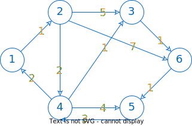
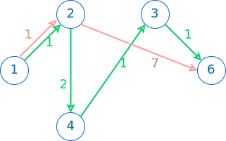

# Dijkstra

## Khái quát

**Dijkstra** (1) là thuật toán tìm đường đi ngắn nhất từ một đỉnh đến tất cả đỉnh còn lại trong đồ thị có trọng số không âm.
{ .annotate }

1.  Đọc là /ˈdaɪkstrəz/ DYKE-strəz. Giang hồ thường đọc /đís sờ tra/.

Thuật toán này được nhà khoa học máy tính người Hà Lan Edsger Wybe Dijkstra thai nghén năm 1956 và công bố năm 1959.

Ý tưởng chính của Dijkstra là dùng kỹ thuật tham lam (greedy) để tìm đỉnh tiếp theo *tốt nhất* và hy vọng rằng kết quả cuối cùng là giải pháp tốt nhất cho bài toán.

Dijkstra có thể áp dụng cho đồ thị:

- Có hướng hoặc vô hướng
- Có trọng số không âm
- Có thể có hoặc không có chu trình

## Bài toán

### Yêu cầu

Tìm đường đi ngắn nhất từ đỉnh *start* đến đỉnh *finish* bằng thuật toán Dijkstra.[^1]

[^1]: Phần nào đó nội dung của bài toán này được tham khảo từ tài liệu lập trình của Võ Ngọc Hà Sơn vnhason@gmail.com nhưng giả vờ quên xin phép tác giả.

### Input

```pycon
6 10 1 5
1 2 1
2 3 5
2 4 2
2 6 7
3 6 1
4 1 2
4 3 1
4 5 4
5 4 3
6 5 1
```

### Output

```pycon
6
1 2 4 3 6 5
```

### Giải thích

Input:

- Dòng đầu tiên chứa bốn số lần lượt là: 6 đỉnh, 10 cạnh, đỉnh xuất phát là 1 và đỉnh đích là 5.
- Mỗi dòng tiếp theo chứa hai đỉnh theo chiều từ u đến v và khoảng cách giữa chúng.

Output:

- Dòng đầu tiên là khoảng cách ngắn nhất từ đỉnh *start* đến đỉnh *finish*. Cụ thể, khoảng cách ngắn nhất từ đỉnh 1 đến đỉnh 5 là 6.
- Dòng thứ hai liệt kê các đỉnh nằm trên đường đi tìm được: 1 -> 2 -> 4 -> 3 -> 6 -> 5.

Phác thảo đồ thị theo input như sau:

{loading=lazy}

## Minh hoạ thuật toán

Dựa theo ý tưởng đã nêu ở đầu bài, ta tìm đỉnh *v* tiếp theo sao cho khoảng cách từ đỉnh xuất phát đến đỉnh *v* là ngắn nhất.

Bảng 1 dưới đây minh họa từng bước ý tưởng này:

- Hàng tiêu đề là các đỉnh *v = 1..6*

- Trong mỗi ô, cặp số *(d, u)* bao gồm:

    - *d* là khoảng cách (được liên tục cộng dồn) từ đỉnh *start* đến đỉnh *v* tương ứng trên hàng tiêu đề.
    - *u* là đỉnh liền trước đỉnh *v* tương ứng trên hàng tiêu đề.

- Dấu * dùng để đánh dấu đỉnh *v* được chọn để đi tiếp, mà tại *v* đó, giá trị *d* là nhỏ nhất trong số các *d* cùng hàng.

Bảng 1. Thực hiện thuật toán Dijkstra

| 1 | 2 | 3 | 4 | 5 | 6 |
| --- | --- | --- | --- | --- | --- |
| (0, -)* | (∞, -) | (∞, -) | (∞, -) | (∞, -) | (∞, -) |
| - | (1, 1)* | (∞, -) | (∞, -) | (∞, -) | (∞, -) |
| - | - | (6, 2) | (3, 2)* | (∞, -) | (8, 2) |
| - | - | (4, 4)* | - | (7, 4) | (8, 2) |
| - | - | - | - | (7, 4) | (5, 3)* |
| - | - | - | - | (6, 6)* | - |

## Viết chương trình

### Đọc input

Lưu dòng đầu tiên của input vào bốn biến `number_of_vertices`, `number_of_edges`, `start`, `finish`.

Đọc các dòng còn lại của input và biểu diễn các cạnh của đồ thị bằng ma trận kề `graph`, với `graph[u][v]` là trọng số của cạnh u -> v.

=== "C++"

    ```c++ linenums="32"
        cin >> number_of_vertices >> number_of_edges >> start >> finish;

        graph.resize(number_of_vertices + 1);

        int u, v, weight;
        for (int i = 0; i < number_of_edges; ++i)
        {
            cin >> u >> v >> weight;
            graph[u].push_back({v, weight});
        }
    ```
=== "Python"

    ```py linenums="22"
        with open(input_file, 'r') as f:        
            number_of_vertices, number_of_edges, start, finish = list(map(int, f.readline().split()))

            graph = [[] for row in range(number_of_vertices + 1)]
            for i in range(number_of_edges):
                u, v, weight = list(map(int, f.readline().split()))
                graph[u].append((v, weight))     
    ```

### Thực hiện Dijkstra

**Bước 0: Khởi tạo** 

Khởi tạo mảng `D` dùng để lưu khoảng cách, trong đó `D[v]` là khoảng cách ngắn nhất từ đỉnh `start` đến đỉnh `v`.

Khởi tạo mảng `trace` dùng để truy vết đường đi, trong đó `trace[v] = u` nghĩa là trước đỉnh `v` là đỉnh `u`, với `v` và `u` đề cập trong bảng 1.

=== "C++"

    ```c++ linenums="47"
        // Khởi tạo mảng khoảng cách D
        D.resize(number_of_vertices + 1, INF);
        D[start] = 0;

        // Khởi tạo mảng trace
        trace.resize(number_of_vertices + 1, -1);
    ```
=== "Python"

    ```py linenums="34"
        # Khởi tạo mảng khoảng cách D
        D = [INF] * (number_of_vertices + 1)
        D[start] = 0;

        # Khởi tạo mảng trace
        trace = [-1] * (number_of_vertices + 1)
    ```

**Bước 1:** Khởi tạo hàng đợi 

Đầu tiên, khởi tạo biến `q` đóng vai trò hàng đợi. Mỗi phần tử của `q` là một cặp số nguyên:

- Số thứ nhất là khoảng cách `d`.
- Số thứ hai là đỉnh `v`.

Cặp số này có ý nghĩa: tại đỉnh `v` đang xét, khoảng cách ngắn nhất từ đỉnh `start` đến đỉnh `v` là `d`.

=== "C++"

    Đối với C++, ta tận dụng kiểu `set` cho `q` vì hai lẽ:

    - Mỗi phần tử trong `set` là duy nhất.
    - Kiểu `set` tự động sắp xếp tăng dần. Điều này giúp cho phần tử đầu tiên luôn là phần tử nhỏ nhất, đồng nghĩa khoảng cách `d` là nhỏ nhất (so với các `d` khác trong `q`).

    ```c++ linenums="57"
        set<pair<int, int>> q;
        q.insert({0, start});
    ```

=== "Python"

    Đối với Python, ta dùng kiểu `list`. Để tìm phần tử có khoảng cách nhỏ nhất, ta dùng hàm `min` với tham số `key` là một hàm lambda. Hàm lambda này sẽ trả về phần tử có giá trị nhỏ nhất trong `q` dựa vào giá trị `d`.

    ```py linenums="44"
        q = []
        q.append((0, start))
    ```

**Bước 2:** Duyệt đỉnh và cập nhật đường đi

Duyệt hàng đợi `q`, lặp các thao tác sau:

&emsp;Xét phần tử đầu tiên của hàng đợi `q`. Lưu đỉnh của phần tử đầu tiên này vào biến tạm `u`.

&emsp;Thiết lập điều kiện để dừng vòng lặp: đó là khi đến được đích, tức `u == finish`.

&emsp;Duyệt các đỉnh kề với đỉnh `u`:

&emsp;&emsp;Dùng biến `v` để biểu thị đỉnh *v*, lưu tại vị trí `i` của `graph[u]`.

&emsp;&emsp;Dùng biến `w` để biểu thị khoảng cách từ `u` đến `v`.

&emsp;&emsp;Xét xem một trong hai khoảng cách sau, cái nào là ngắn hơn:

&emsp;&emsp;1. `D[v]` là khoảng cách ngắn nhất từ `start` đến `v`, hiện đang lưu trong mảng `d`.

&emsp;&emsp;2. `D[u] + w` là khoảng cách từ `start` đến `u` cộng với khoảng cách từ `u` đến `v`.    

&emsp;&emsp;Nói cách khác, để đến được đỉnh `v`, ta xét xem đường đi mới "*quá cảnh*" tại `u` có tốt hơn không. Nếu có, ta thực hiện:

&emsp;&emsp;- Gỡ bỏ phần tử `{D[v], v}` ra khỏi hàng đợi `q`.

&emsp;&emsp;- Cập nhật lại giá trị của `D[v]`.

&emsp;&emsp;- Ghi nhận vào mảng `trace`, nghĩa là con đường đến `v` mà ghé qua `u` thì tốt hơn.

&emsp;&emsp;- Thêm phần tử mới `{D[v], v}` vào hàng đợi `q`.

Ví dụ:

Giá trị đang lưu trong mảng `d` là *D[6] = 8*, nghĩa là khoảng cách từ đỉnh 1 đến đỉnh 6 là 8.

Xét đường đi đến đỉnh 6 mà "*quá cảnh*" tại đỉnh 3. Ta nhận thấy:

*D[3] + w = 4 + 1 = 5 < D[6]*, với *w* là khoảng cách từ đỉnh 3 đến đỉnh 6. Điều này đồng nghĩa đường đi đến đỉnh 6 mà qua đỉnh 3 thì tốt hơn.

Như vậy, ta gán giá trị mới cho `D[6]` là *D[6] = D[3] + w = 5*.

Hình sau cho thấy đường đi đến đỉnh 6 mà qua đỉnh 3 là tốt hơn so với đường đi 1 -> 2 -> 6.

{loading=lazy}

=== "C++"

    ```c++ linenums="60"
        // Trong khi q vẫn còn phần tử
        while (!q.empty())
        {
            // Lấy ra đỉnh u có khoảng cách ngắn nhất từ start (vì set đã sắp xếp theo khoảng cách)
            int u = q.begin()->second;
            q.erase(q.begin());

            // Dừng thuật toán khi đã đến đích
            if (u == finish)
                break;

            // Duyệt từng đỉnh v kề với đỉnh u
            for (int i = 0; i < graph[u].size(); ++i)
            {
                // v là đỉnh kề với u
                int v = graph[u][i].first;

                // w là trọng số của cạnh u -> v
                int w = graph[u][i].second;

                // Nếu có thể đi start -> u -> v nhanh hơn so với start -> v
                if (D[u] + w < D[v])
                {
                    // Nếu v đã có trong q thì xóa phần tử liên quan
                    q.erase({D[v], v});

                    // Cập nhật lại khoảng cách ngắn nhất từ đỉnh start đến đỉnh v
                    D[v] = D[u] + w;

                    // Lưu vết đường đi từ start đến v thông qua u
                    trace[v] = u;

                    // Thêm v vào q với khoảng cách ngắn nhất từ start đến v là d[v]
                    q.insert({D[v], v});
                }
            }
        }
    ```
=== "Python"

    ```py linenums="47"
        # Trong khi q vẫn còn phần tử
        while q:
            # Lấy phần tử có giá trị D[u] nhỏ nhất
            min_element = min(q, key=lambda x: x[0])

            # Lấy ra đỉnh u có khoảng cách ngắn nhất từ start
            u = min_element[1]
            d_u = min_element[0]
            q.remove((d_u, u))

            # Dừng thuật toán khi đã đến đích
            if u == finish:
                break

            # Duyệt từng đỉnh v kề với đỉnh u
            for i in range(len(graph[u])):
                # v là đỉnh kề với u
                v = graph[u][i][0]

                # w là trọng số của cạnh u -> v
                w = graph[u][i][1]

                # Nếu có thể đi start -> u -> v nhanh hơn so với start -> v
                if D[u] + w < D[v]:
                    # Nếu v đã có trong hàng đợi thì xoá phần tử liên quan
                    if (D[v], v) in q:
                        q.remove((D[v], v))

                    # Cập nhật lại khoảng cách ngắn nhất từ đỉnh start đến đỉnh v
                    D[v] = D[u] + w
                    
                    # Lưu vết đường đi từ start đến v thông qua u
                    trace[v] = u
                    
                    # Thêm vào q
                    q.append((D[v], v))
    ```

### Truy vết đường đi

Truy vết từ đỉnh `start` đến đỉnh `finish` và lưu vào ngăn xếp `path`.

=== "C++"

    ```c++ linenums="112"
        stack<int> path;

        // Biến tạm fn để lưu đỉnh hiện hành    
        int fn = finish;

        // Trong khi fn chưa về đến đỉnh start
        while (fn != start)
        {
            // Thêm đỉnh fn vào đường đi
            path.push(fn);

            // Lùi về đỉnh trước đó
            fn = trace[fn];
        }

        // Thêm đỉnh start vào đường đi
        path.push(start);
    ```
=== "Python"

    ```py linenums="95"
        path = list()
    
        # Biến tạm fn để lưu đỉnh hiện hành
        fn = finish

        # Trong khi fn chưa về đến đỉnh start
        while not fn == start:
            # Thêm đỉnh fn vào đường đi
            path.append(fn)

            # Lùi về đỉnh trước đó
            fn = trace[fn]
        
        # Thêm đỉnh start vào đường đi
        path.append(start)
    ```

### In kết quả

Dựa vào ngăn xếp `path`, ta in ra đường đi bằng cách lấy từng phần tử ra khỏi ngăn xếp.

=== "C++"

    ```c++ linenums="130"
        // In ra khoảng cách ngắn nhất từ đỉnh start đến đỉnh finish
        cout << D[finish] << '\n';

        // In ra đường đi ngắn nhất từ đỉnh start đến đỉnh finish
        while (!path.empty())
        {
            cout << path.top();
            if (path.size() != 1) cout << ' ';
            path.pop();
        }
    ```
=== "Python"

    ```py linenums="111"
        with open(output_file, 'w') as f:
            # In ra khoảng cách ngắn nhất từ đỉnh start đến đỉnh finish
            f.write(f'{D[finish]}\n')

            # In ra đường đi ngắn nhất từ đỉnh start đến đỉnh finish
            output_path = ' '.join([str(v) for v in reversed(path)])
            f.write(output_path)
    ```

## Mã nguồn

Code đầy đủ được đặt tại [GitHub](https://github.com/vtchitruong/Graph/tree/main/Dijkstra){:target="_blank"}.

## Một vài lưu ý về độ phức tạp

Gọi $V$ là số đỉnh, $E$ là số cạnh.

Nếu thực thi Dijkstra trên ma trận kề thì độ phức tạp thời gian là $O(V^2)$.

Nếu thực thi trên danh sách kề với hàng đợi ưu tiên (`heapq` hoặc `priority_queue`), độ phức tạp là $O((V+E)logV)$, tốt hơn $O(V^2)$ khi đồ thị thưa.

Nếu đồ thị quá lớn thì có thể cân nhắc sử dụng những cấu trúc dữ liệu tốt hơn như Fibonacci heap, giúp giảm thao tác cập nhất xuống $O(1)$.
