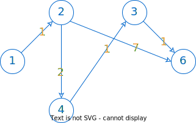

# Dijkstra

## Khái quát về thuật toán Dijkstra

Sống, vốn cũng là lần mò tìm con đường để đi. Mà đã đi thì cũng nên đi theo chỉ dẫn, theo thuật toán, bởi ai cũng muốn nhanh đạt tới đích.

Một trong những thuật toán tìm đường cơ bản mà người học Computer Science nào cũng trải qua là Dijkstra, đọc là /ˈdaɪkstrəz/ DYKE-strəz, chứ không phải /đís sờ tra/. Thuật toán được nhà khoa học máy tính người Hà Lan Edsger Wybe Dijkstra thai nghén năm 1956 và công bố năm 1959.

Đặc điểm của thuật toán Dijkstra là xử lý được mọi đồ thị có hướng và có trọng số **không âm**, thậm chí cả đồ thị có chu trình.

Ý tưởng chủ yếu của Dijkstra là sử dụng kỹ thuật tham lam (greedy) tìm đỉnh tiếp theo *tốt nhất* và hy vọng rằng kết quả cuối cùng là giải pháp tốt nhất cho bài toán.

## Bài toán ví dụ

### Yêu cầu

Tìm đường đi ngắn nhất từ đỉnh *start* đến đỉnh *finish* bằng thuật toán Dijkstra.[^1]

[^1]: Phần lớn nội dung của bài toán này được tham khảo từ tài liệu lập trình của Võ Ngọc Hà Sơn vnhason@gmail.com nhưng giả vờ quên xin phép tác giả.

### Input

```pycon
6 10 1 5
1 2 1
2 3 5
2 4 2
2 6 7
3 6 1
4 1 2
4 3 1
4 5 4
5 4 3
6 5 1
```

### Output

```pycon
6
1 2 4 3 6 5
```

### Giải thích

Input:

- Dòng đầu tiên chứa 4 số lần lượt là: 6 đỉnh, 10 cạnh, đỉnh xuất phát là 1 và đỉnh đích là 5.
- Mỗi dòng tiếp theo chứa 2 đỉnh theo đúng chiều từ u đến v và khoảng cách giữa chúng.

Output:

- Dòng đầu tiên là khoảng cách ngắn nhất từ đỉnh *start* đến đỉnh *finish*, cụ thể là từ 1 đến 5.
- Dòng thứ hai liệt kê các đỉnh nằm trên đường đi tìm được.

{loading=lazy}

Hình 1. Đồ thị minh họa

### Chạy thuật toán trên  giấy

Dựa theo ý tưởng đã nêu ở đầu bài, ta tìm đỉnh *v* tiếp theo sao cho khoảng cách từ đỉnh xuất phát đến đỉnh *v* là ngắn nhất.

Bảng 1 dưới đây minh họa từng bước ý tưởng này:

- Hàng tiêu đề là các đỉnh *v = 1..6*

- Trong mỗi ô, cặp số *(d, u)* bao gồm:

    - *d* là khoảng cách (được liên tục cộng dồn) từ đỉnh *start* đến đỉnh *v* (hàng tiêu đề).
    - *u* là đỉnh liền trước đỉnh *v* (hàng tiêu đề).

- Dấu * dùng để đánh dấu đỉnh *v* được chọn để đi tiếp, mà tại giá trị *d* là nhỏ nhất trong số các *d* cùng hàng.

Bảng 1. Minh họa từng bước thuật toán Dijkstra

| 1 | 2 | 3 | 4 | 5 | 6 |
| --- | --- | --- | --- | --- | --- |
| (0, -)* | (∞, -) | (∞, -) | (∞, -) | (∞, -) | (∞, -) |
| - | (1, 1)* | (∞, -) | (∞, -) | (∞, -) | (∞, -) |
| - | - | (6, 2) | (3, 2)* | (∞, -) | (8, 2) |
| - | - | (4, 4)* | - | (7, 4) | (8, 2) |
| - | - | - | - | (7, 4) | (5, 3)* |
| - | - | - | - | (6, 6)* | - |

### Cách giải đề xuất

#### Đọc input

Lưu input vào biến `graph`.

`graph` là danh sách các đỉnh kề, trong đó `graph[u]` chứa các đỉnh kề với đỉnh `u`.

Mỗi phần tử của `graph` cũng là một cặp số: số thứ nhất là đỉnh kề `v` và số thứ hai là khoảng cách từ `u` đến `v`. 

=== "C++"
    ``` c++ linenums="1"
        graph.resize(vertices + 1);

        int u, v, weight;
        for (int i = 0; i < edges; ++i)
        {
            f >> u >> v >> weight;
            graph[u].push_back({v, weight});
        }
    ```
=== "Python"
    ``` py linenums="1"
        global d
        d = [INF for _ in range(vertices + 1)]
        d[start] = 0

        global trace
        trace = [0 for _ in range(vertices + 1)]        
    ```

#### Khởi tạo

Khởi tạo giá trị vô cực cho cả mảng `d`, trong đó `d[v]` lưu khoảng cách ngắn nhất từ `start` đến `v`.

Mảng `trace` dùng để truy vết đường đi. Cụ thể, `trace[v] = u` nghĩa là trước đỉnh `v` là đỉnh `u`, với `v` và `u` đề cập trong bảng 1.

=== "C++"
    ``` c++ linenums="1"
        // d[v] là khoảng cách ngắn nhất từ start đến v
        d.resize(vertices + 1, INF);
        d[start] = 0;

        // trace[v] = u nghĩa là trước đỉnh v là đỉnh u
        trace.resize(vertices + 1);
    ```
=== "Python"
    ``` py linenums="1"
        # d[v] là khoảng cách ngắn nhất từ start đến v
        global d # distance
        d = [INF for _ in range(vertices + 1)]
        d[start] = 0

        # trace[v] = u nghĩa là trước đỉnh v là đỉnh u
        global trace
        trace = [0 for _ in range(vertices + 1)]
    ```

#### Thực hiện Dijkstra

1. Bước 1

    Đầu tiên, khai báo biến `q` hoạt động như một hàng đợi, nghĩa là lần lượt lấy ra và xử lý phần tử đầu tiên cho đến khi không còn phần tử nào nữa.

    Mỗi phần tử của `q` là một cặp số nguyên: số thứ nhất là khoảng cách `d` và số thứ hai là đỉnh `v`, mang ý nghĩa tại đỉnh `v` đang xét, khoảng cách ngắn nhất từ `start` đến `v` là `d`.

    Đối với C++, ta tận dụng kiểu `set` cho `q` vì hai lẽ:

    - Mỗi phần tử trong `set` là duy nhất.
    - Kiểu `set` tự động sắp xếp tăng dần. Điều này giúp cho phần tử đầu tiên luôn là phần tử nhỏ nhất, đồng nghĩa là khoảng cách `d` nhỏ nhất (so với các `d` khác trong `q`).

    === "C++"
        ``` c++ linenums="1"
            set<pair<int, int>> q;
            q.insert({0, start});
        ```

    === "Python"
        ``` py linenums="1"
            q = []
            q.append((0, start))
        ```

2. Bước 2

    Duyệt hàng đợi `q` bằng cách lặp các thao tác sau:

    &emsp;&emsp;Xét phần tử đầu tiên của hàng đợi. Biến tạm `u` lưu đỉnh của phần tử đầu tiên này.

    &emsp;&emsp;Vòng lặp dừng khi đến được đích, tức `u == finish`.

    &emsp;&emsp;Duyệt các đỉnh kề với đỉnh `u`:

    &emsp;&emsp;&emsp;&emsp;Biến tạm `v` là đỉnh `v`, lưu tại vị trí `i` của `graph[u]`.

    &emsp;&emsp;&emsp;&emsp;Biến tạm `w` là khoảng cách từ `u` đến `v`.

    &emsp;&emsp;&emsp;&emsp;Ta xét xem một trong hai khoảng cách sau, cái nào là ngắn hơn:

    &emsp;&emsp;&emsp;&emsp;&emsp;&emsp;1. `d[v]` là khoảng cách ngắn nhất từ `start` đến `v`, hiện đang lưu trong mảng `d`.

    &emsp;&emsp;&emsp;&emsp;&emsp;&emsp;2. `d[u] + w` là khoảng cách từ `start` đến `u` cộng với khoảng cách từ `u` đến `v`.    

    &emsp;&emsp;&emsp;&emsp;Nói cách khác, để đến được đỉnh `v`, ta xét xem đường đi mới "*quá cảnh*" tại `u` có tốt hơn không. Nếu có, ta thực hiện:

    &emsp;&emsp;&emsp;&emsp;- Gỡ bỏ phần tử `{d[v], v}` ra khỏi hàng đợi `q`.

    &emsp;&emsp;&emsp;&emsp;- Cập nhật lại giá trị của `d[v]`.

    &emsp;&emsp;&emsp;&emsp;- Ghi nhận vào mảng `trace`, nghĩa là con đường đến `v` mà ghé qua `u` thì tốt hơn.

    &emsp;&emsp;&emsp;&emsp;- Thêm phần tử mới `{d[v], v}` vào hàng đợi.

    Ví dụ:  
    Giá trị đang lưu trong mảng `d` là d[6] = 8, nghĩa là đường đi từ đỉnh `start` đến đỉnh `6` là 8.  
    Xét đường đi đến đỉnh 6 mà "*quá cảnh*" tại đỉnh 3. Ta nhận thấy:  
    d[3] + w = 4 + 1 = 5 < d[6], với w là khoảng cách từ đỉnh 3 đến đỉnh 6.
    Như vậy, ta sẽ gán giá trị mới cho d[6] là d[6] = d[3] + w = 5. Nghĩa là đường đi đến đỉnh 6 mà qua đỉnh 3 thì tốt hơn.

    {loading=lazy}

    Hình 2. Đường đi tốt hơn đến đỉnh 6 là đi qua đỉnh 3

    === "C++"
        ``` c++ linenums="1"
            while (!q.empty())
            {
                // Xét đỉnh u của phần tử đầu tiên
                int u = q.begin()->second;
                q.erase(q.begin());

                // Dừng thuật toán khi đã đến đích
                if (u == finish)
                    break;

                // Duyệt các đỉnh kề với đỉnh u
                for (int i = 0; i < graph[u].size(); ++i)
                {
                    int v = graph[u][i].first;
                    int w = graph[u][i].second;

                    if (d[u] + w < d[v])
                    {
                        // Xóa phần tử có giá trị d[v] trong hàng đợi
                        q.erase({d[v], v});

                        // Lưu khoảng cách ngắn nhất mới
                        d[v] = d[u] + w;

                        // Lưu vết
                        trace[v] = u;

                        // Thêm vào hàng đợi
                        q.insert({d[v], v});
                    }
                }
            }
        ```
    === "Python"
        ``` py linenums="1"
            global graph, d
            while not len(q) == 0:
                # Xét đỉnh u của phần tử có d_u nhỏ nhất
                min_element = min(q, key=lambda x: x[0])
                u = min_element[1]
                d_u = min_element[0]
                q.remove((d_u, u))

                # Dừng thuật toán khi đã đến đích
                if u == finish:
                    break

                # Duyệt các đỉnh kề với đỉnh u
                for i in range(len(graph[u])):
                    v = graph[u][i][0]
                    w = graph[u][i][1]

                    if d[u] + w < d[v]:
                        # Xóa phần tử có giá trị d[v] trong hàng đợi
                        if (d[v], v) in q:
                            q.remove((d[v], v))

                        # Lưu khoảng cách ngắn nhất mới
                        d[v] = d[u] + w
                        
                        # Lưu vết
                        trace[v] = u
                        
                        # Thêm vào hàng đợi
                        q.append((d[v], v))            
        ```

#### Output

`d[finish]` là khoảng cách ngắn nhất cần tìm.

Để xuất đường đi, ta cho `finish` *"lùi"* dần về `start` bằng mảng `trace`.

=== "C++"
    ``` c++ linenums="1"
        stack<int> path;

        if (d[finish] != INF)
        {
            int fn = finish; // biến tạm

            // Dựa vào mảng trace, cho fn "lùi" dần về start      
            while (fn != start)
            {
                path.push(fn);
                fn = trace[fn];
            }

            path.push(start);
        }
    ```
=== "Python"
    ``` py linenums="1"
        path = list()
        global d

        if not d[finish] == INF:
            fn = finish # biến tạm

            # Dựa vào mảng trace, cho fn "lùi" dần về start
            while not fn == start:
                path.append(fn)
                fn = trace[fn]
            
            path.append(start)  
    ```

### Toàn bộ chương trình

Code đầy đủ được đặt tại <a href="https://github.com/vtchitruong/Graph/tree/main/Dijkstra" target="_blank">GitHub</a>.

### Một vài lưu ý

1. Về đồ thị:

    1. Thuật toán Dijkstra chỉ áp dụng được cho đồ thị có **trọng số không âm**. Nếu gặp phải trọng số âm, ta nên sử dụng thuật toán Bellman-Ford hoặc Johnson.

    2. Thuật toán Dijkstra yêu cầu đồ thị phải liên thông. Nếu có đỉnh cô lập, thì phải xử lý riêng.

    3. Thuật toán Dijkstra không xử lý các đường đi khác nhau có **trọng số bằng nhau**. Do đó, nếu muốn tìm tất cả đường đi thỏa yêu cầu, ta nên điều chỉnh thuật toán hoặc thử thuật toán khác.

    4. Thuật toán Dijkstra tìm đường đi ngắn nhất **đến tất cả các đỉnh** trong đồ thị. Cho nên, nếu muốn cải tiến, ta cho thuật toán dừng khi đã đến được đỉnh đích. Bài toán ví dụ trên đã thực hiện điều này.

2. Về độ phức tạp:

    Gọi $V$ là số đỉnh, $E$ là số cạnh.

    Nếu thực thi Dijkstra trên ma trận kề, thì độ phức tạp độ phức tạp là $O(V^2)$.

    Nếu thực thi trên danh sách kề, thì độ phức tạp độ phức tạp là $O(V^2 + E)$.

    Nếu đồ thị quá lớn, nên cân nhắc sử dụng những cấu trúc dữ liệu tốt hơn như Fibonacci heap hoặc `priority_queue`.

