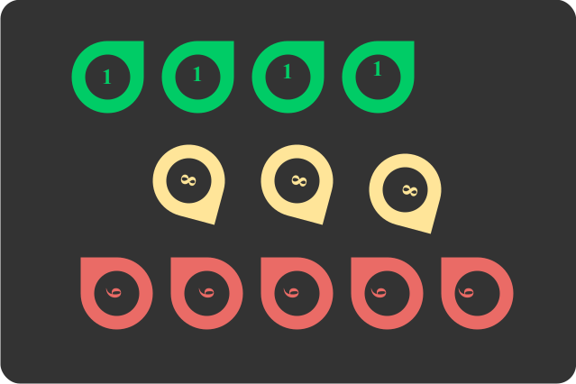

---
categories:
    - CPP to see sharply
    - Set up & Code down
authors: [mrschool]
date: 2024-04-03
---

# Một số kỹ thuật dành cho dân nghiệp dư trong các kỳ thi học sinh giỏi: Tần số xuất hiện 


<div class="result" markdown>
{ align=left width=360 }

Trong quá trình luyện công, người học phải tự mình viết những hàm **đếm** nhằm rèn luyện tư duy và kỹ thuật lập trình. Tuy nhiên, khi làm bài thi, thời gian là yếu tố quan trọng, thí sinh nên sử dụng những công cụ có sẵn của ngôn ngữ, hạn chế viết lại hoặc tạo lại nhằm dành thời giờ và công sức cho ý tưởng.

Bài viết này hướng dẫn cách sử dụng một số hàm có sẵn liên quan đến *đếm số loại* và *tần số xuất hiện* của một phần tử trong vector.

</div>

<!-- more -->

<br>

## Đếm số loại phần tử

Đặt `vec` là vector gồm các số nguyên.

=== "C++"

    ``` c++ linenums="1"
    vector<int> vec;
    ```
=== "Python"

    Nội dung này sẽ cập nhật sau khi chủ thớt được đồ-nét :)

Các phần tử của `vec` được phát sinh ngẫu nhiên bằng đoạn mã sau:

=== "C++"

    ``` c++ linenums="1"
    void generate()
    {
        int x;
        for (int i = 0; i < n; ++i)
        {
            x = rand() % 10; // (1)
            vec.push_back(x);
        }
    }
    ```
    { .annotate }

    1.  `rand() % 10` dùng để phát sinh ngẫu nhiên một số nằm trong [0, 10).

=== "Python"

    Nội dung này sẽ cập nhật sau khi chủ thớt được đồ-nét :)

Output:

```pycon
Vector ban đầu:
1 7 4 0 9 4 8 8 2 4 5 5 1 7 1 1 5 2 7 6
```

Giả sử `vector` có nhiều phần tử trùng nhau. Ta muốn đếm số lượng giá trị phân biệt (số loại phần tử) có trong `vector` này.

Một trong những cách đơn giản là chuyển đổi `vector` thành `set`, rồi trả về số phần tử trong `set` này.

Lý do: `set` là kiểu dữ liệu của C++ chứa các phần tử có giá trị phân biệt với nhau. Nói cách khác, nếu ta thêm vào một phần tử đã tồn tại trong `set` thì không có gì xảy ra cả, `set` vẫn giữ nguyên như cũ.

Ngoài ra, các phần tử trong `set` mặc định được sắp xếp tăng dần. 

Đoạn mã sau chuyển đổi `vector` thành `set` và trả về số phần tử của `set`.

=== "C++"

    ``` c++ linenums="1"
    int count_unique(vector<int> v)
    {
        // Chuyển đổi vector thành set
        set<int> S(v.begin(), v.end());

        // Trả về số phần tử của set
        return S.size();
    }
    ```
=== "Python"

    Nội dung này sẽ cập nhật sau khi chủ thớt được đồ-nét :)

Gọi hàm `count_unique()` vừa tạo.

=== "C++"

    ``` c++ linenums="1"
        int res1 = count_unique(vec);
        cout << "Số loại phần tử: " << res1 << endl;
    ```
=== "Python"

    Nội dung này sẽ cập nhật sau khi chủ thớt được đồ-nét :)

Output:

```pycon
Số loại phần tử: 9
```

## Tìm phần tử có tần số xuất hiện cao nhất

Để tìm phần tử xuất hiện nhiều lần nhất trong vector `vec`, trước hết ta tìm giá trị lớn nhất của `vec`.

=== "C++"

    ``` c++ linenums="1" hl_lines="4"
    pair<int, int> frequency(vector<int> v)
    {
        // Tìm giá trị lớn nhất của vector
        int max_value = *max_element(v.begin(), v.end());

        ...
    }
    ```
=== "Python"

    Nội dung này sẽ cập nhật sau khi chủ thớt được đồ-nét :)

Tiếp theo, ta khởi tạo mảng `f` là mảng tần số gồm toàn phần tử `0`, trong đó:

- Chỉ số `i` của phần tử `f[i]` là giá trị của phần tử `vec[i]`.
- Giá trị của phần tử `f[i]` là số lần xuất hiện (tần số) của phần tử `vec[i]`. 

=== "C++"

    ``` c++ linenums="1"
        // Khởi tạo mảng tần số f gồm các phần tử 0
        vector<int> f(max_value + 1, 0);
    ```
=== "Python"

    Nội dung này sẽ cập nhật sau khi chủ thớt được đồ-nét :)

Kế đến, ta duyệt `vec` và ghi nhận tần số xuất hiện của các phần tử `vec[i]` vào mảng `f`.

=== "C++"

    ``` c++ linenums="1"
        for (int i = 0; i < n; ++i)
        {
            f[v[i]]++;
        }
    ```
=== "Python"

    Nội dung này sẽ cập nhật sau khi chủ thớt được đồ-nét :)

Cuối cùng, dựa vào mảng `f`, ta lấy ra phần tử lớn nhất của `f`, chính là tần số xuất hiện cao nhất của một phần tử trong `vec`.

=== "C++"

    ``` c++ linenums="1"
        // Con duyệt trỏ vào phần tử lớn nhất của f
        vector<int>::iterator max_occur = max_element(f.begin(), f.end());

        // Lấy chỉ số của phần tử lớn nhất trong f
        int max_occur_index = max_occur - f.begin();

        // Lấy giá trị của phần tử lớn nhất trong f 
        int max_occur_value = *max_occur;

        // Trả về cặp (chỉ số, giá trị) của f
        // cũng chính là cặp (giá trị, tần số) của v
        return make_pair(max_occur_index, max_occur_value);
    ```
=== "Python"

    Nội dung này sẽ cập nhật sau khi chủ thớt được đồ-nét :)

Gọi hàm `frequency()` ra thực hiện. Hàm này trả về một cặp số kiểu `pair<>`, với thành phần thứ nhất là giá trị của phần tử `vec` xuất hiện nhiều nhất, thành phần thứ hai là tần số xuất hiện của nó.

=== "C++"

    ``` c++ linenums="1"
        pair<int, int> res2 = frequency(vec);
        cout << "Phần tử xuất hiện nhiều nhất: " << res2.first << endl;
        cout << "Số lần xuất hiện: " << res2.second;
    ```
=== "Python"

    Nội dung này sẽ cập nhật sau khi chủ thớt được đồ-nét :)

Output:

```pycon
Phần tử xuất hiện nhiều nhất: 1
Tần số xuất hiện: 4
```

## Toàn bộ chương trình

=== "C++"

    Chương trình C++ hoàn chỉnh đặt tại [Gist của GitHub](https://gist.github.com/vtchitruong/be955063e4fe434911cda0f9adcd5287){target="_blank"}.

=== "Python"

    Nội dung này sẽ cập nhật sau khi chủ thớt được đồ-nét :)