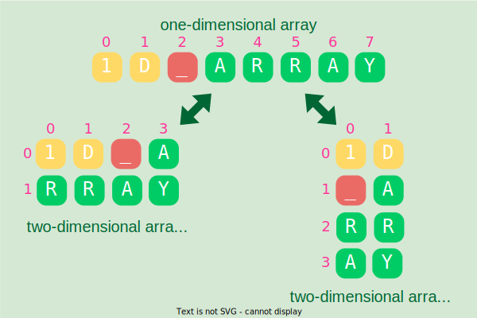

---
categories:
    - CPP to see sharply
    - Moron in Python
    - Set up & Code down
authors: [mrschool]
date: 2023-07-28
---

# Một vài bài tập về mảng hai chiều

<div class="result" markdown>
{ align=left width=360 }
Đây là những bài tập dùng để luyện ngón đối với mảng hai chiều.

Các chương trình C++ trong bài này sử dụng kiểu `array` hoặc con trỏ `int**`, còn các chương trình Python sử dụng kiểu `list`, thế nên cách viết có thể khác nhau. Nếu muốn viết gần giống với Python, bạn có thể dụng kiểu `vector` của C++.
</div>

<br>

<!-- more -->

<br>

## Khởi tạo ma trận vuông

### Yêu cầu  

1. Khởi tạo ma trận vuông gồm các phần tử đều là 0.
2. Gán các phần tử nằm trên đường chéo chính là 1.
3. Gán các phần tử nằm trong tam giác dưới đường chéo chính là 2.

### Input

n = 8 là kích thước của ma trận vuông.  

### Output

``` pycon
1 0 0 0 0 0 0 0
2 1 0 0 0 0 0 0
2 2 1 0 0 0 0 0
2 2 2 1 0 0 0 0
2 2 2 2 1 0 0 0
2 2 2 2 2 1 0 0
2 2 2 2 2 2 1 0
2 2 2 2 2 2 2 1
```

### Cách giải đề xuất

Chương trình C++ dưới đây sử dụng kiểu `array`

``` c++
int a[MAX][MAX];
```

và thực hiện theo hướng gán `0` trước cho mọi phần tử, sau đó mới gán `1` và `2` vào đường chéo chính và tam giác dưới.

1. Khởi tạo ma trận vuông gồm các phần tử đều là `0`.

    ``` c++ linenums="1"
    void Init(int size)
    {
        for (int r = 0; r < size; r++)
        {
            for (int c = 0; c < size; c++)
            {
                a[r][c] = 0;
            }
        }
    }
    ```

2. Gán các phần tử nằm trên đường chéo chính là `1`.

    ``` c++ linenums="1"
    void FillMainDiagonal(int size, int value)
    {
        for (int i = 0; i < size; i++)
        {
            a[i][i] = value;
        }
    }
    ```

3. Gán các phần tử nằm trong tam giác dưới đường chéo chính là `2`.  

    ``` c++ linenums="1"
    void FillLowerTriangle(int size, int value)
    {
        for (int r = 0; r < size; r++)
        {
            for (int c = 0; c < r; c++)
            {
                a[r][c] = value;
            }
        }
    }
    ```

Khác với chương trình C++ trên, chương trình Python không khởi tạo ma trận toàn `0`, mà thực hiện *gắn* các phần tử `0`, `1`, `2` và `3` vào đúng vị trí của ma trận.

``` py linenums="1"
def init_matrix(size, value_main_diagonal, value_lower, value_upper):
    matrix = []
    
    for r in range(size):
        # Các ô thuộc tam giác dưới
        matrix.append([value_lower for c in range(r)])
        
        # Các ô nằm trên đường chéo chính 
        matrix[r].append(value_main_diagonal)
        
        # Các ô thuộc tam giác trên
        matrix[r].extend([value_upper for c in range(r + 1, size)])

    return matrix
```

## Bàn cờ vua

### Yêu cầu

Viết chương trình tạo ma trận mô phỏng bàn cờ vua, nghĩa là các ô 0 và 1 xen kẽ nhau.

### Input

n = 8 là kích thước của bàn cờ.

### Output

``` pycon
0 1 0 1 0 1 0 1 
1 0 1 0 1 0 1 0 
0 1 0 1 0 1 0 1 
1 0 1 0 1 0 1 0 
0 1 0 1 0 1 0 1 
1 0 1 0 1 0 1 0 
0 1 0 1 0 1 0 1 
1 0 1 0 1 0 1 0 
```

### Cách giải đề xuất

Vì trong bàn cờ, các ô 0 và 1 xen kẽ nhau theo chiều ngang lẫn chiều dọc, nên ta chỉ cần lấy tổng của chỉ số hàng và chỉ số cột của mỗi ô, chia 2 lấy dư, sẽ nhận được giá trị 0 hoặc 1 để gán cho ô đó.

=== "C++"
    ``` c++ linenums="1"

    void FillChessBoard(int size)
    {
        for (int r = 0; r < size; r++)
        {
            for (int c = 0; c < size; c++)
            {
                a[r][c] = (r + c) % 2;
            }
        }
    }
    ```
=== "Python"
    ``` py linenums="1"

    def fill_chess_board(size):
        board = [[(r + c) % 2 for c in range(size)] for r in range(size)]
        return board
    ```

## Chuyển đổi qua lại giữa mảng hai chiều và mảng một chiều

### Yêu cầu

Viết chương trình chuyển đổi từ mảng hai chiều thành mảng một chiều và ngược lại.

### Input 1

``` pycon
3 6 7 5 3 5
6 2 9 1 2 7
0 9 3 6 0 6
2 6 1 8 7 9
```

### Output 1

``` pycon
3 6 7 5 3 5 6 2 9 1 2 7 0 9 3 6 0 6 2 6 1 8 7 9  
```

### Input 2

``` pycon
2 0 2 3 7 5 9 2 2 8 9 7 3 6 1 2 9 3 1 9 4  
```

### Output 2

``` pycon
2 0 2 3 7 5 9  
2 2 8 9 7 3 6  
1 2 9 3 1 9 4  
```

### Cách giải đề xuất

Xét một phần tử bất kỳ trong mảng, gọi:

&emsp;&emsp;`i` là chỉ số của phần tử này trong mảng một chiều.

&emsp;&emsp;`r` và `c` lần lượt là chỉ số hàng và chỉ số cột của phần tử này trong mảng hai chiều.

1. Chuyển đổi từ mảng hai chiều thành mảng một chiều:

    Công thức tính `i` là: `i = r * số-phần-tử-mỗi-hàng + c`

    === "C++"
        ``` c++ linenums="1"

        int* Convert_2D_To_1D(int** a, int rows, int cols)
        {
            int size = rows * cols;

            int* b = new int[size];

            for (int r = 0; r < rows; r++)
            {
                for (int c = 0; c < cols; c++)
                {
                    // Công thức tính vị trí của phần tử nào đó trong mảng-1-chiều
                    int i = r * cols + c;
                    b[i] = a[r][c];
                }
            }

            return b;
        }
        ```
    === "Python"
        ``` py linenums="1"

        def convert_2d_to_1d(L2):
            rows = len(L2)
            cols = len(L2[0])
            
            # Khởi tạo số lượng phần tử cho mảng-1-chiều
            L1 = [0 for i in range(rows * cols)]   

            for r in range(rows):
                for c in range(cols):
                    # Công thức tính vị trí của phần tử nào đó trong mảng-1-chiều
                    i = r * cols + c;
                    L1[i] = L2[r][c]
            
            return L1
        ```

2. Chuyển đổi từ mảng một chiều thành mảng hai chiều:

    Công thức tính `r` và `c` là:

    - `r = i / số-phần-tử-mỗi-hàng`
    - `c = i % số-phần-tử-mỗi-hàng`

    === "C++"
        ``` c++ linenums="1"

        int** Convert_1D_To_2D(int* a, int size, int rows, int cols)
        {
            if (rows * cols == size)
            {
                // Cấp phát bộ nhớ cho các hàng của mảng-2-chiều b        
                int** b = new int*[rows];

                for (int r = 0; r < rows; r++)
                {
                    // Ứng với mỗi hàng, cấp phát bộ nhớ cho các cột
                    b[r] = new int[cols];
                }

                // Duyệt các phần tử của mảng-1-chiều
                for (int i = 0; i < size; i++)
                {
                    // Công thức tính chỉ số hàng và chỉ số cột của phần tử nào đó trong mảng-2-chiều
                    int r = i / cols;
                    int c = i % cols;

                    b[r][c] = a[i];
                }

                return b;
            }
            else
            {
                // Trả về con trỏ rỗng khi kích thước của mảng-1-chiều không thể chia thành kích thước hàng và cột của mảng-2-chiều 
                return nullptr;
            }
        }
        ```
    === "Python"
        ``` py linenums="1"

        def convert_1d_to_2d(L1, rows, cols):
            size = len(L1)
                
            if rows * cols == size:
                # Khởi tạo mảng-2-chiều
                L2 = [[0 for c in range(cols)] for r in range(rows)]

                # Duyệt các phần tử của mảng-1-chiều
                for i in range(size):
                    # ông thức tính chỉ số hàng và chỉ số cột của phần tử nào đó trong mảng-2-chiều
                    r = i // cols
                    c = i % cols
                    L2[r][c] = L1[i]
                
                return L2
            else:
                # Trả về mảng rỗng khi kích thước của mảng-1-chiều không thể chia thành kích thước hàng và cột của mảng-2-chiều
                return []
        ```

## Ma trận chuyển vị

### Yêu cầu

Viết chương trình tạo ma trận chuyển vị của ma trận đã cho, nghĩa là chuyển hàng thành cột và cột thành hàng.

### Input

``` pycon
3 6 7 5 3 5 6 2
9 1 2 7 0 9 3 6
0 6 2 6 1 8 7 9
2 0 2 3 7 5 9 2
```

### Output

``` pycon
3 9 0 2
6 1 6 0
7 2 2 2
5 7 6 3
3 0 1 7
5 9 8 5
6 3 7 9
2 6 9 2
```

### Cách giải đề xuất

=== "C++"
    ``` c++ linenums="1"

    int** Transpose(int rows, int cols)
    {
        int newRows = cols;
        int newCols = rows;

        // Khai báo mảng mới, cấp phát bộ nhớ cho các hàng
        int** aTranspose = new int*[newRows];

        // Duyệt mảng a theo hàng
        for (int r = 0; r < newRows; r++)
        {
            // Cấp phát bộ nhớ cho các cột trong từng hàng
            aTranspose[r] = new int[newCols];

            for (int c = 0; c < newCols; c++)
            {
                aTranspose[r][c] = a[c][r];
            }
        }
        
        return aTranspose;
    }
    ```
=== "Python"
    ``` py linenums="1"
    
    def transpose_matrix(m):
        rows = len(m)
        cols = len(m[0])

        m_transpose = [[m[r][c] for r in range(rows)] for c in range(cols)] 
        return m_transpose
    ```

## Tam giác Pascal

### Yêu cầu

Viết chương trình tạo tam giác Pascal.

### Input

n = 10 là số hàng của tam giác Pascal.

### Output

``` pycon
1
1   1
1   2   1 
1   3   3   1 
1   4   6   4   1 
1   5  10  10   5   1 
1   6  15  20  15   6   1 
1   7  21  35  35  21   7   1 
1   8  28  56  70  56  28   8   1 
1   9  36  84 126 126  84  36   9   1
```

### Cách giải đề xuất

Mỗi hàng của tam giác Pascal có đặc điểm sau:

- Phần tử đầu tiên và phần tử cuối cùng đều là 1.

- Mỗi phần tử ở giữa là tổng của hai phần tử thuộc hàng liền bên trên: một nằm ở cùng cột và một ở cột liền trước. Cụ thể: `a[r][c] =  a[r - 1][c] +  a[r  -  1][c  -  1] `

=== "C++"
    ``` c++ linenums="1"

    void FillPascalTriangle(int size)
    {
        // Khởi tạo hàng đầu tiên của tam giác Pascal
        a[0][0] = 1;

        // Duyệt từng hàng
        for (int r = 1; r < size; r++)
        {
            // Gán phần tử đầu tiên của hàng là 1
            a[r][0] = 1;

            // Gán các phần tử giữa
            for (int c = 1; c < r; c++)
            {
                a[r][c] = a[r - 1][c] + a[r - 1][c - 1];
            }

            // Gán phần tử cuối cùng của hàng là 1
            a[r][r] = 1;
        }
    }
    ```
=== "Python"
    ``` py linenums="1"

    def fill_pascal_triangle(size):   
        # Khởi tạo hàng đầu tiên của tam giác Pascal
        T = [[] for r in range(size)]
        T[0].append(1)

        # Duyệt từng hàng, bắt đầu từ hàng 1
        for r in range(1, size):
            # Gán phần tử đầu tiên của hàng là 1
            T[r].append(1)

            # Gán các phần tử ở giữa
            for c in range(1, r):
                T[r].append(T[r - 1][c] + T[r - 1][c - 1])

            # Gán phần tử đầu tiên của hàng là 1
            T[r].append(1)

        return T
    ```

## Ma trận zigzag

### Yêu cầu

Viết chương trình tạo ma trận zigzag (cách gọi khác là hình con rắn).

### Input

n = 8 là kích thước của ma trận.

### Output

``` pycon
 1  2  3  4  5  6  7  8
16 15 14 13 12 11 10  9
17 18 19 20 21 22 23 24
32 31 30 29 28 27 26 25
33 34 35 36 37 38 39 40
48 47 46 45 44 43 42 41
49 50 51 52 53 54 55 56
64 63 62 61 60 59 58 57
```

### Cách giải đề xuất

Mỗi hàng của ma trận zigzag có đặc điểm sau:

- Nếu là hàng chẵn 0, 2, 4, etc, thì các ô có giá trị tăng dần từ trái sang phải.
- Nếu là hàng lẻ 1, 3, 5, etc, thì các ô có giá trị tăng dần từ phải sang trái.

=== "C++"
    ``` c++ linenums="1"

    void FillZigzagMatrix(int size)
    {
        int value = 1;

        for (int r = 0; r < size; r++)
        {
            for (int c = 0; c < size; c++)
            {
                // Đối với hàng lẻ 1, 3, 5, etc, thì gán giá trị value từ phải sang trái
                // Đối với hàng chẵn 0, 2, 4, etc, thì gán giá trị value từ trái sang phải 
                if (r % 2)
                {
                    a[r][size - c - 1] = value++;
                }
                else
                {
                    a[r][c] = value++;
                }
            }
        }
    }
    ```
=== "Python"
    ``` py linenums="1"

    def fill_zigzag_matrix(size):
        # Khởi tạo ma trận rỗng
        M = []
        
        value = 1

        for r in range(size):
            # Đối với hàng lẻ 1, 3, 5, etc, thì gán giá trị value từ phải sang trái
            # Đối với hàng chẵn 0, 2, 4, etc, thì gán giá trị value từ trái sang phải 
            if r % 2 == 0:
                M.append([i for i in range(value, value + size)])
            else:
                M.append([i for i in range(value + size - 1, value - 1, -1)])

            # Gán giá trị lớn nhất của hàng đang xét cho value
            value += size

        return M        
    ```

## Ma trận xoắn ốc

### Yêu cầu

Viết chương trình tạo ma trận xoắn ốc từ ngoài vào trong.

### Input

n = 8 là kích thước của ma trận.

### Output

``` pycon
 1  2  3  4  5  6  7  8
28 29 30 31 32 33 34  9
27 48 49 50 51 52 35 10
26 47 60 61 62 53 36 11
25 46 59 64 63 54 37 12
24 45 58 57 56 55 38 13
23 44 43 42 41 40 39 14
22 21 20 19 18 17 16 15
```

### Cách giải đề xuất

Dùng vòng lặp while, lần lượt điền số vào bốn cạnh biên của từng ma trận con (là ma trận có kích thước nhỏ hơn khi *bị* xoắn ốc):

- Cạnh trên: Điền số từ trái sang phải, cho đến ô *liền trước* cạnh phải.
- Cạnh phải: Điền số từ trên xuống dưới, cho đến ô *liền trên* cạnh dưới.
- Cạnh dưới: Điền số từ phải sang trái, cho đến ô *liền trước* cạnh trái.
- Cạnh trái: Điền số từ dưới lên trên, cho đến ô *liền dưới* cạnh trên.

Vòng lặp dừng khi số điền vào bằng với số lượng phần tử phải có của ma trận. Ví dụ: kích thước ma trận là 8, thì vòng lặp dừng sau khi điền số 64.

=== "C++"
    ``` c++ linenums="1"

    void FillSpiralMatrix(int size)
    {
        int r = 0;
        int c = 0;

        // value là giá trị sẽ gán vào từng phần tử
        int value = 0;

        // Mỗi while sẽ chạy một "vòng" của ma trận con (sub-matrix), ứng với 4 cạnh
        while (1)
        {
            // Ứng với cạnh trên (hàng đầu), gán value từ cột đầu đến cột áp chót
            do
            {
                a[r][c] = ++value;;
                c++;
            } while (c < size - r - 1);

            // Ứng với cạnh phải (cột cuối), gán value từ hàng đầu đến hàng áp chót
            do
            {
                a[r][c] = ++value;;
                r++;
            } while (c > r);

            // Ứng với cạnh dưới (hàng cuối), gán value từ cột cuối về cột áp đầu
            do
            {
                a[r][c] = ++value;;
                c--;
            } while (c > size - r - 1);

            // Ứng với cạnh trái (cột đầu), gán value từ hàng cuối về hàng áp đầu
            do
            {
                a[r][c] = ++value;;
                r--;
            } while (c < r - 1);
        
            // Khi value đạt đến giá trị cuối cùng thì ngắt vòng lặp while
            if (value == size * size) break;
        }
    }    
    ```
=== "Python"
    ``` py linenums="1"

    def fill_spiral_matrix(size):
        
        # Khởi tạo ma trận toàn 0
        M = [[0 for c in range(size)] for r in range(size)]
        
        r = 0
        c = 0

        #  value là giá trị sẽ gán vào từng phần tử
        value = 0   

        while True:
            
            # Ứng với cạnh trên (hàng đầu), gán value từ cột đầu đến cột áp chót
            for i in range(c, size - r - 1):
                value += 1
                M[r][i] = value
            
            # Cho c nhảy đến cột cuối cùng của vòng xoăn
            c = size - r - 1;

            # Ứng với cạnh phải (cột cuối), gán value từ hàng đầu đến hàng áp chót
            for i in range(r, c):
                value += 1
                M[i][c] = value

            # Cho r nhảy đến hàng cuối cùng của vòng xoăn
            r = c

            # Ứng với cạnh dưới (hàng cuối), gán value từ cột cuối về cột áp đầu
            for i in range(c, size - r - 1, -1):
                value += 1
                M[r][i] = value

            # Cho c nhảy về cột đầu tiên của vòng xoắn
            c = size - r - 1

            # Ứng với cạnh trái (cột đầu), gán value từ hàng cuối về hàng áp đầu
            for i in range(r, c, -1):
                value += 1
                M[i][c] = value
            
            # Cho r nhảy về hàng áp đầu của vòng xoắn
            r = c + 1
            
            # Tăng thêm một cột để bắt đầu vòng xoắn mới
            c += 1

            # Khi value đạt đến giá trị cuối cùng thì ngắt vòng lặp while
            if size * size == value:
                break
        
        return M
    ```

## Toàn bộ chương trình¶

Code đầy đủ được đặt tại [GitHub](https://github.com/vtchitruong/2DArray){:target="_blank"}.