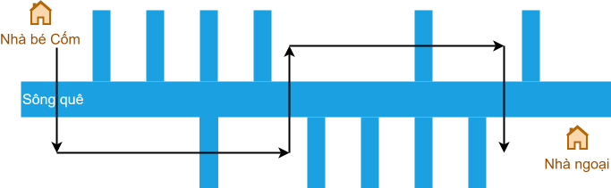

---
categories:
    - Solve to surpass
authors: [mrschool]
date: 2024-11-08
---

# Olympic 10 Hồ Chí Minh 2014-2015

<div class="result" markdown>
{ align=left width=360 }

SỞ GIÁO DỤC VÀ ĐÀO TẠO TP. HỒ CHÍ MINH  
KỲ THI OLYMPIC THÁNG 4 TP. HỒ CHÍ MINH NĂM HỌC 2014-2015  
Môn: Tin học 10  
Thời gian làm bài: 150 phút (không kể thời gian giao đề)  
</div>

<br>

<!-- more -->

<br>

## Câu 1 (5.0 điểm)

### Số vùng dương

Trên một lưới $R \times C$, mỗi ô vuông mang một giá trị nguyên.

Yêu cầu: xác định số vùng dương (mang số khác 0). Một vùng dương khi có các cạnh liền kề bất kể hướng.

Dữ liệu vào: trong file văn bản positive.inp với dạng thức:

- Dòng đầu: hai số $R$ và $C$ cách nhau ít nhất một khoảng trắng.
- $R$ dòng kế tiếp: mỗi dòng cho biết $C$ ký số của dòng.

Kết quả: ghi vào file văn bản positive.out một số duy nhất là số vùng dương tìm được.

Ví dụ:

| positive.inp | positive.out |
| --- | --- |
| 8 7 <br> **4 3 2 2 1** 0 *1* <br> **3 3 3 2 1** 0 *1* <br> **2 2 2 2 1** 0 0 <br> **2 1 1 1 1** 0 0 <br> **1 1** 0 0 0 **1** 0 <br> 0 0 0 **1 1 1** 0 <br> 0 **1 2 2 1 1** 0 <br> 0 **1 1 1 2 1** 0 <br> | 2 |

Giải thích: hai vùng là vùng in đậm và in nghiên.

### Bài giải tham khảo

**Bước 0:**

Khởi tạo cấu trúc cell để lưu trữ toạ độ hàng và cột.

=== "C++"

    ```c++ linenums="10"
    struct cell
    {
        int r;
        int c;
    };
    ```

=== "Python"

    ```py linenums="8"
    class cell:
        def __init__(self, r, c):
            self.r = r
            self.c = c
    ```

Khởi tạo mảng `directions` để lưu trữ tám hướng di chuyển khi áp dụng duyệt lưới theo BFS.

=== "C++"

    ```c++ linenums="21"
    vector<cell> directions = {
        {-1, 0}, // lên
        {0, 1}, // phải
        {1, 0}, // xuống
        {0, -1}, // trái
        {-1, 1}, // phải trên     
        {1, 1}, // phải dưới     
        {1, -1}, // trái dưới    
        {-1, -1} // trái trên
        };
    ```

=== "Python"

    ```py linenums="18"
    directions = [
        cell(-1, 0), # lên
        cell(0, 1), # phải
        cell(1, 0), # xuống
        cell(0, -1), # trái
        cell(-1, 1), # phải trên
        cell(1, 1), # phải dưới 
        cell(1, -1), # trái dưới   
        cell(-1, -1) # trái trên
        ]
    ```

Khởi tạo mảng `visited` để đánh dấu các ô đã duyệt trong lưới.

=== "C++"

    ```c++ linenums="105"
    visited.resize(R, vector<bool>(C, false));
    ```

=== "Python"

    ```py linenums="77"
    visited = [[False] * C for _ in range(R)]
    ```

**Bước 1:** Viết hàm để thực hiện duyệt lưới theo BFS.

=== "C++"

    ```c++ linenums="56"
    void bfs(cell start)
    {
        // Khởi tạo hàng đợi q
        queue<cell> q;
        q.push(start);

        cell current; // ô đang xét
        cell next;    // ô lân cận

        // Duyệt lưới grid theo BFS và đánh dấu đã duyệt cho tất cả ô trong cùng một vùng
        while (!q.empty())
        {
            current.r = q.front().r;
            current.c = q.front().c;
            q.pop();

            visited[current.r][current.c] = true;

            for (int d = 0; d < directions.size(); ++d)
            {
                // Lấy giá trị của ô next
                next.r = current.r + directions[d].r;
                next.c = current.c + directions[d].c;

                // Kiểm tra xem ô next có thoả các điều kiện sau không:
                // 1. nằm trong lưới
                // 2. có giá trị dương
                // 3. chưa duyệt
                if (next.r > -1)
                    if (next.r < R)
                        if (next.c > -1)
                            if (next.c < C)
                                if (grid[next.r][next.c] > 0)
                                    if (visited[next.r][next.c] == false)
                                    {
                                        // Đánh dấu ô next đã duyệt
                                        visited[next.r][current.c] = true;

                                        // Đẩy ô next vào hàng đợi
                                        q.push(next);
                                    }
            }
        }
    }
    ```

=== "Python"

    ```py linenums="40"
    def bfs(start):
        global R, C, grid, visited

        # Khởi tạo hàng đợi q
        q = deque([start])

        # Duyệt lưới grid theo BFS và đánh dấu đã duyệt cho tất cả ô trong cùng một vùng
        while q:
            current = q.popleft()
            visited[current.r][current.c] = True

            for direction in directions:
                # Lấy giá trị của ô next
                next_r = current.r + direction.r
                next_c = current.c + direction.c

                # Kiểm tra xem ô next có thoả các điều kiện sau không:
                # 1. nằm trong lưới
                # 2. có giá trị dương
                # 3. chưa duyệt
                if next_r > -1:
                    if next_r < R:
                        if next_c > -1:
                            if next_c < C:
                                if grid[next_r][next_c] > 0:
                                    if visited[next_r][next_c] == False:
                                        # Đánh dấu ô next đã duyệt
                                        visited[next_r][next_c] = True

                                        # Đẩy ô next vào hàng đợi
                                        q.append(cell(next_r, next_c))
    ```

**Bước 2:** Duyệt từng ô trong lưới, gọi hàm `bfs()` để duyệt lưới và đánh dấu các ô đã duyệt.

Vì hàm `bfs()` duyệt và đánh dấu đã duyệt các ô có giá trị dương trong lưới nên khi `bfs()` hoàn thành đồng nghĩa đã duyệt xong một vùng dương trong lưới.

Do đó, khi gặp một ô có giá trị dương và chưa duyệt, ta tính đây là ô bắt đầu của một vùng mới, tăng biến đếm `region_count` thêm 1.

=== "C++"

    ```c++ linenums="107"
        cell start_cell;

        // Duyệt từng ô trong lưới grid
        for (int r = 0; r < R; ++r)
        {
            for (int c = 0; c < C; ++c)
            {
                // Nếu ô có giá trị dương và chưa duyệt
                if (grid[r][c] > 0)
                {
                    if (visited[r][c] == false)
                    {
                        // thì bắt đầu tính là một vùng mới
                        region_count += 1;

                        // thực hiện bfs từ ô này
                        start_cell.r = r;
                        start_cell.c = c;
                        bfs(start_cell);
                    }
                }
            }
        }
    ```

=== "Python"

    ```py linenums="79"
        # Duyệt từng ô trong lưới grid
            for r in range(R):
                for c in range(C):
                    # Nếu ô có giá trị dương và chưa duyệt
                    if grid[r][c] > 0:
                        if visited[r][c] == False:
                            # thì bắt đầu tính là một vùng mới
                            region_count += 1

                            # thực hiện bfs từ ô này
                            bfs(cell(r, c))
    ```

### Mã nguồn

Code đầy đủ được đặt tại [GitHub](https://github.com/vtchitruong/hsg/tree/main/olympic-hcm/2015-lop10/positive){:target="_blank"}.

## Câu 2 (7.0 điểm)

### Vượt sông

Nhà của bé Cốm nằm ở bên bờ trái của con sông quê, còn nhà ngoại của bé nằm ở bên bờ phải của sông. Con đường dòng bờ sông còn có rất nhiều nhánh sông bên trái và bên phải, cóo nhánh chảy về bên trái, có nhánh chảy về bên phải, có nhánh chảy cả về bên trái và bên phải.

Yêu cầu: bạn có được sơ đồ đoạn sông từ nhà bé Cốm đến nhà ngoại của bé. Hãy chỉ giúp bé phương án đi đến nhà ngoại sao cho số lần "vượt sông" là ít nhất.

Dữ liệu vào: cho từ file văn bản river.inp gồm một xâu ký tự độ dài $N (N \le 10^6)$ mô tả bản đồ con sông từ nhà bé đến nhà ngoại. Ký tự 'L' ký hiệu nhánh sông bên trái, ký tự 'R' ý hiệu có nhánh sông bên phải, ký tự 'B' ký hiệu có nhánh sông cả bên trái và bên phải.

Kết quả: ghi vào file văn bản river.out một số duy nhất là số lần ít nhất mà bé phải vượt sông để đến nhà ngoại của bé.

Ví dụ:

| river.inp | river.out |
| --- | --- |
| LLBLRRBRL | 5 |

{ loading=lazy }

Ràng buộc: có 50% số text tương ứng 50% số điểm của bài có $N \le 20$.

### Bài giải tham khảo

**Ý tưởng:**

Đặt vị trí của xuất phát của Cốm là `0`. Duyệt từng nhánh sông (biểu thị bằng các ký tự trong chuỗi input), mỗi lần duyệt xong một ký tự thì Cốm đến một vị trí mới.

Vì có hai bờ sông nằm ở bên trái và bên phải nên ứng với một vị trí mới của Cốm, ta xét và lưu số lần vượt sông ít nhất tính từ vị trí `0` đến vị trí mới nhất cho cả hai bên bờ sông.

Sau khi duyệt hết chuỗi input, ta so sánh giá trị vượt sông giữa hai bờ thì ra được số lần vượt sông ít nhất tính trên tổng thể để đến được nhà ngoại.

**Bước 0**:

Gọi `River` là chuỗi input. Ta thêm ký tự `'0'` vào đầu chuỗi `River` nhằm "*hợp lý hoá*" tiến trình suy luận: để đến được vị trí `i`, Cốm phải xét nhánh sông `River[i]`.

=== "C++"

    ```c++ linenums="27"
        cin >> River;
        River = '0' + River;
    ```

=== "Python"

    ```py linenums="23"
        River = f.readline().strip()
        River = '0' + River
    ```

Khởi tạo hai mảng `Left` và `Right`. Trong đó:

- `Left[i]` lưu số lần vượt sông ít nhất để đến được vị trí `i` ở bờ trái của sông.
- `Right[i]` lưu số lần vượt sông ít nhất để đến được vị trí `i` ở bờ phải của sông.

Do nhà Cốm nằm ở bờ trái và đây là vị trí `i == 0`, nên để đến được vị trí `0` của bờ trái, Cốm không cần vượt sông. Còn để đến được vị trí `0` của bờ phải, Cốm phải băng ngang sông, nghĩa là số lần vượt là `1`.

Theo đó, ta khởi tạo `Left` và `Right` như sau:

=== "C++"

    ```c++ linenums="39"
        Left[0] = 0;
        Right[0] = 1;
    ```

=== "Python"

    ```py linenums="34"
        Left[0] = 0
        Right[0] = 1
    ```

**Bước 1:** Tính số lần vượt sông ít nhất ở cả hai bờ

Duyệt từng nhánh sông bằng biến `i` (lưu tại `River[i]`) trong phạm vi `[1..n - 1]`, cũng chính là duyệt từng vị trí `i` mà Cốm đến, lặp thao tác: 

- Xét ba trường hợp `'L'`, `'R'` và `'B'` của nhánh sông `River[i]`. Trong mỗi trường hợp, ta cần xét các cách để Cốm đến được vị trí `i` ở bờ trái và vị trí `i` ở bờ phải. Các cách đó bao gồm đi từ vị trí `i - 1` ở cùng bờ hoặc ở khác bờ.

- Đồng thời, ghi nhận số lần vượt sông ít nhất giữa các cách trên.

=== "C++"

    ```c++ linenums="42"
        // Duyệt từng nhánh sông (ký tự của chuỗi River) trong phạm vi [1..n - 1]
        // Xét ba trường hợp: nhánh sông ở bờ trái, ở bờ phải và ở cả hai bờ
        for (int i = 1; i < n; ++i)
        {
            if (River[i] == 'L')
            {
                // Có hai cách đi đến vị trị i ở bờ trái:
                // Cách 1: vượt nhánh sông ở bờ trái
                // Cách 2: vượt sông từ bờ phải sang bờ trái
                Left[i] = min(Left[i - 1] + 1, Right[i - 1] + 1);

                // Có hai cách đi đến vị trị i ở bờ phải:
                // Cách 1: vượt sông từ bờ trái sang bờ phải
                // Cách 2: không vượt lần nào, vì vẫn đang ở bờ phải
                Right[i] = min(Left[i - 1] + 1, Right[i - 1]);
            }
            else if (River[i] == 'R')
            {
                // Có hai cách đi đến vị trị i ở bờ trái:
                // Cách 1: không vượt lần nào, vì vẫn đang ở bờ trái
                // Cách 2: vượt sông từ bờ phải sang bờ trái
                Left[i] = min(Left[i - 1], Right[i - 1] + 1);

                // Có hai cách đi đến vị trị i ở bờ phải:
                // Cách 1: vượt sông từ bờ trái sang bờ phải
                // Cách 2: vượt nhánh sông ở bờ phải
                Right[i] = min(Left[i - 1] + 1, Right[i - 1] + 1);
            }
            else if (River[i] == 'B')
            {
                // Có hai cách đi đến vị trị i ở bờ trái:
                // Cách 1: vượt nhánh sông ở bờ trái
                // Cách 2: vượt nhánh sông ở bờ phải, rồi vượt sông từ bờ phải sang bờ trái
                Left[i] = min(Left[i - 1] + 1, Right[i - 1] + 2);


                // Có hai cách đi đến vị trị i ở bờ phải:
                // Cách 1: vượt nhánh sông ở bờ trái, rồi vượt sông từ bờ trái sang bờ phải
                // Cách 2: vượt nhánh sông ở bờ phải
                Right[i] = min(Left[i - 1] + 2, Right[i - 1] + 1);
            }
        }
    ```

=== "Python"

    ```py linenums="37"
        # Duyệt từng nhánh sông (ký tự của chuỗi River) trong phạm vi [1..n - 1]
        # Xét ba trường hợp: nhánh sông ở bờ trái, ở bờ phải và ở cả hai bờ
        for i in range(1, n):
            if River[i] == 'L':
                # Có hai cách đi đến vị trị i ở bờ trái:
                # Cách 1: vượt nhánh sông ở bờ trái
                # Cách 2: vượt sông từ bờ phải sang bờ trái
                Left[i] = min(Left[i - 1] + 1, Right[i - 1] + 1)

                # Có hai cách đi đến vị trị i ở bờ phải:
                # Cách 1: vượt sông từ bờ trái sang bờ phải
                # Cách 2: không vượt lần nào, vì vẫn đang ở bờ phải
                Right[i] = min(Left[i - 1] + 1, Right[i - 1])
            elif River[i] == 'R':
                # Có hai cách đi đến vị trị i ở bờ trái:
                # Cách 1: không vượt lần nào, vì vẫn đang ở bờ trái
                # Cách 2: vượt sông từ bờ phải sang bờ trái
                Left[i] = min(Left[i - 1], Right[i - 1] + 1)

                # Có hai cách đi đến vị trị i ở bờ phải:
                # Cách 1: vượt sông từ bờ trái sang bờ phải
                # Cách 2: vượt nhánh sông ở bờ phải
                Right[i] = min(Left[i - 1] + 1, Right[i - 1] + 1)
            elif River[i] == 'B':
                # Có hai cách đi đến vị trị i ở bờ trái:
                # Cách 1: vượt nhánh sông ở bờ trái
                # Cách 2: vượt nhánh sông ở bờ phải, rồi vượt sông từ bờ phải sang bờ trái
                Left[i] = min(Left[i - 1] + 1, Right[i - 1] + 2)

                # Có hai cách đi đến vị trị i ở bờ phải:
                # Cách 1: vượt nhánh sông ở bờ trái, rồi vượt sông từ bờ trái sang bờ phải
                # Cách 2: vượt nhánh sông ở bờ phải
                Right[i] = min(Left[i - 1] + 2, Right[i - 1] + 1)
    ```

**Bước 2**: Xác định số lần vượt sông ít nhất trên tổng thể

Sau khi đã duyệt xong nhánh sông cuối cùng, cũng là ký tự cuối cùng `River[n - 1]`, Cốm có hai cách đi đến nhà ngoại:

- Cách 1: nếu đang đứng ở bờ trái, Cốm cần vượt sông từ bờ trái sang bờ phải, nghĩa là thêm một lần vượt.
- Cách 2: nếu đang đứng ở bờ phải, Cốm không cần vượt sông lần nào nữa.

=== "C++"

    ```c++ linenums="88"
        result = min(Left[n - 1] + 1, Right[n - 1]);
    ```

=== "Python"

    ```py linenums="74"
        result = min(Left[n - 1] + 1, Right[n - 1])
    ```

### Mã nguồn

Code đầy đủ được đặt tại [GitHub](https://github.com/vtchitruong/hsg/tree/main/olympic-hcm/2015-lop10/river){:target="_blank"}.