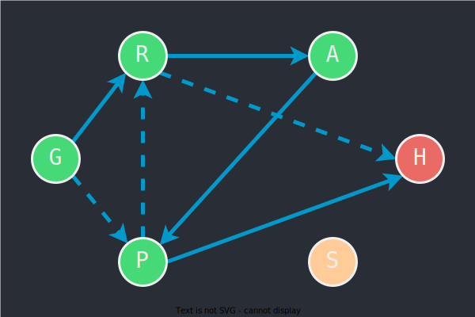

---
categories:
    - Solve to surpass
    - Set up & Code down
authors: [mrschool]
date: 2021-12-11
---

# Tìm đường thoát khỏi khu rừng

<div class="result" markdown>
{ align=left width=360 }

Đôi khi vì quá đam mê cái gì đó mà ta bị lầm đường lạc trôi or lạc lối. Nếu lỡ bị hút vào trận đồ và cảm thấy tuyệt vọng không lối thoát, bạn hãy học Tin học, nó sẽ cho bạn ánh sáng cuối đường hầm, giống như nhà thám hiểm trong bài toán sau đây. Anh đã sử dụng thuật toán DFS để thoát khỏi khu rừng.

</div>

<br>

<!-- more -->

<br>

## Khái quát về bài toán

Bài toán này[^1] dùng để minh họa cho thuật toán tìm đường cơ bản là DFS. Nguyên tắc cơ bản của DFS là **vươn xa đến tận cùng**.

[^1]: Bài toán do chủ thớt tham khảo trên Internet nhưng không còn nhớ lấy từ trang web nào.

### Yêu cầu

Cho một khu rừng được mô phỏng bằng ma trận hàng và cột, trong đó những ô mang ký tự `'O'` là đi vào được, còn những ô mang ký tự `'X'` là cạm bẫy, không đi vào được.

Nhà thám hiểm đang đứng tại ô mang ký tự `'E'` và phải tìm đường thoát ra khỏi khu rừng. Cụ thể hơn, anh có thể di chuyển qua ô khác theo một trong bốn hướng: lên, xuống, trái và phải, và tìm cách đến được bìa rừng, chính là các cạnh biên của ma trận.

### Input
5 5  
XXXXX  
XEOOX  
XXXOX  
XOOOX  
XOXXX  

### Output
1 1  
1 2  
1 3  
2 3  
3 3  
3 2  
3 1  
4 1  

### Giải thích

Trong Input, dòng đầu tiên là kích thước hàng và cột của ma trận; các dòng tiếp theo là các hàng của ma trận, mỗi hàng là một chuỗi ký tự để mô tả khu rừng.

Output là đường đi từ ô của nhà thám hiểm ra đến bìa rừng.

<div>
    <iframe width="100%" height="256px" frameBorder=0 src="../../../../posts/out-of-the-forest.html"></iframe>
    <p style="margin: 0">Hình 1. Minh họa input và output</p>
</div>

## Cách giải đề xuất

### Ý tưởng chính
Nhà thám hiểm sẽ sử dụng tuyệt chiêu *phân thân chi thuật*, xuất ra một bản sao của cơ thể để đi thử qua các ô khác cho đến khi ra đến bìa rừng.

Lúc đến bìa rừng thì ghi nhận ô đang đứng là ô đích, rồi thực hiện truy ngược về ô xuất phát ban đầu.

Theo ý tưởng này, ta áp dụng thuật toán DFS như sau:

- Xây dựng hàm đệ quy có tham số là ô mà nhà thám hiểm đang đứng, đặt là ô `current`.

- Ban đầu, xuất phát từ ô có ký tự E, đi thử qua 1 trong 4 ô liền kề.  
    
- Giả sử đi hướng lên vào ô bên trên, đặt là ô `next`. Nếu ô `next` chưa ghé thăm và không có cạm bẫy (ký tự `'X'`), nghĩa là đi vào được, thì đánh dấu đã ghé thăm ô `next`, rồi gọi đệ quy với tham số là ô `next`, tức vai trò của ô `next` trở thành `current` để chuẩn bị cho bước duyệt tiếp theo.

- Trường hợp cơ sở của hàm đệ quy là ô `current` nằm ngay trên đường biên của ma trận khu rừng, tương ứng với hàng đầu hoặc hàng cuối hoặc cột đầu hoặc cột cuối.

### Khởi tạo

1. Xác định vị trí xuất phát của nhà thám hiểm.

    === "C++"
        ``` c++ linenums="1"
            for (int r = 0; r < rows; r++)
            {
                int c = forest[r].find('E');

                if (c != string::npos)
                {
                    start.first = r;
                    start.second = c;
                    break;
                }
            }
        ```
    === "Python"
        ``` py linenums="1"
            global start
            for row_idx, row_data in enumerate(forest):
                if 'E' in row_data:
                    col_idx = row_data.index('E')
                    start = [row_idx, col_idx]
                    break
        ```

2. Khởi tạo 4 nước đi ứng với 4 hướng: lên, xuống, trái và phải.   

    === "C++"
        ``` c++ linenums="1"            
            steps = {{-1, 0}, {1, 0}, {0, -1}, {0, 1}};
        ```

    === "Python"
        ``` py linenums="1"
            global steps
            steps = [(-1, 0), (1, 0), (0, -1), (0, 1)]
        ```

3. Khởi tạo ma trận `trace` với mọi ô đều là `-1`, nghĩa là chưa ghé thăm. Khi ô nào đi vào được, ta đánh dấu bằng một con số kết hợp từ chỉ số hàng và chỉ số cột của ô đó. Phép tính kết hợp sẽ đề cập ở bên dưới.

    === "C++"
        ``` c++ linenums="1"            
            trace.resize(rows);
            for (int r = 0; r < rows; ++r)
            {
                trace[r].resize(cols, -1);   
            }
        ```

    === "Python"
        ``` py linenums="1"
            global trace
            trace = [[-1 for col in range(cols)] for row in range(rows)]
        ```

### Thực hiện DFS

1. Trường hợp cơ sở: ô `current` nằm ngay trên đường biên của ma trận. Tại đây, ta ghi nhận ô đích bằng biến `finish`.

    === "C++"
        ``` c++ linenums="1"            
            if (current.first == 0 || current.first == rows - 1 || current.second == 0 || current.second == cols - 1)
            {
                finish.first = current.first;
                finish.second = current.second;
                return;
            }  
        ```
    === "Python"
        ``` py linenums="1"
            if current[0] == 0 or current[0] == rows - 1 or current[1] == 0 or current[1] == cols - 1:
                global finish
                finish = current
                return
        ```

2. Trường hợp đệ quy:

    Duyệt 4 nước đi (mảng `step`), tức thử di chuyển qua các ô liền kề với ô `current`. Nếu ô liền kề thỏa các điều kiện:  

    - Vẫn còn trong phạm vi khu rừng,
    - Không có bẫy,
    - Chưa ghé thăm.

    thì đánh dấu ô liền kề này bằng mảng `trace`, rồi gọi đệ quy với tham số là *nó* (ô liền kề).

    Vì mỗi phần tử của mảng `trace` chỉ có thể chứa một số nguyên duy nhất, nên ta sử dụng chiêu thức *lưỡng long hợp thể*, như code dưới đây, để kết hợp chỉ số hàng và chỉ số cột của thành một số nguyên. Đến phần output, ta sẽ *giải nén* trở lại.

    === "C++"
        ``` c++ linenums="1"            
            pair<int, int> next;

            // try each step for next move
            for (int s = 0; s < 4; ++s)
            {
                next.first = current.first + steps[s].first;
                next.second = current.second + steps[s].second;

                if (next.first >= 0 && next.first < rows && next.second >= 0 && next.second < cols) // he's still in bound
                    if (forest[next.first][next.second] == 'O') // no trap
                        if (trace[next.first][next.second] == -1) // not yet visited
                        {
                            trace[next.first][next.second] = current.second * MAX + current.first;
                            Dfs(next);
                        }
            }
        ```
    === "Python"
        ``` py linenums="1"
            global MAX    

            # try each step for next move
            for s in steps:
                next = [current[0] + s[0], current[1] + s[1]]

                if 0 <= next[0] < rows and 0 <= next[1] < cols: # he's still in bound
                    if forest[next[0]][next[1]] == 'O': # no trap
                        if trace[next[0]][next[1]] == -1: # not yet visited
                            trace[next[0]][next[1]] = current[1] * MAX + current[0]                                        
                            dfs(next)
        ```

### Output đường đi kết quả

Trong hàm đệ quy, ta đã dùng biến `finish` để ghi nhận tọa độ của ô đích ở bìa rừng. Bây giờ, dựa vào mảng `trace`, ta cho `finish` **lui dần** về ô xuất phát ban đầu của nhà thám hiểm.

Mặt khác, do ở trên đã *lưỡng long hợp thể*, nên tại đây ta *giải nén* bằng cách sử dụng phép chia lấy phần dư và thương, ứng với chỉ số hàng và chỉ số cột.


=== "C++"
    ``` c++ linenums="1"            
        stack<pair<int, int>> path; // result path

        path.push(finish);
        while (trace[finish.first][finish.second] != -1)
        {
            int r = trace[finish.first][finish.second] % MAX;
            int c = trace[finish.first][finish.second] / MAX;

            path.push({r, c});

            finish.first = r;
            finish.second = c;
        }
    ```

=== "Python"
    ``` py linenums="1"
        path = list()
        global finish
        path.append(finish)
        
        while not trace[finish[0]][finish[1]] == -1:
            r = trace[finish[0]][finish[1]] % MAX
            c = trace[finish[0]][finish[1]] // MAX
            path.append([r, c])
            finish = [r, c]

        with open(output_file, 'w') as f:
            result = '\n'.join([str(' '.join([str(number) for number in position])) for position in reversed(path)])    
            f.write(result)
    ```

## Toàn bộ chương trình¶

Code đầy đủ được đặt tại [GitHub](https://github.com/vtchitruong/Graph/tree/main/Forest){:target="_blank"}.


