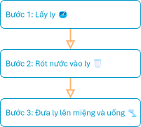
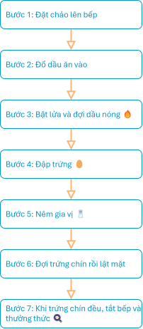

# Thuật toán và chương trình máy tính

!!! abstract "Tóm lược nội dung"

    Bài này trình bày:

    - Khái niệm về thuật toán và chương trình máy tính.
    - Mối quan hệ giữa chúng.

## Thuật toán

**Thuật toán** là **các bước** giải quyết một vấn đề, và các bước này phải được sắp xếp theo một **trình tự hợp lý**.

Ví dụ:

Hình sau đây là lưu đồ minh hoạ thuật toán uống nước.

{loading=lazy width=280}

 

 

Hình sau đây là lưu đồ minh hoạ thuật toán chiên trứng.

{loading=lazy width=280} 

!!! warning "Lưu ý"

    Nội dung và hình ảnh trong các hình trên chỉ nhằm mục đích minh hoạ cho khái niệm thuật toán, chứ không phải là hướng dẫn chính xác về các hoạt động liên quan.

## Chương trình máy tính

**Chương trình máy tính** là **dãy các lệnh** điều khiển máy tính thực hiện một thuật toán.

Chương trình máy tính có thể được viết bằng các ngôn ngữ lập trình, chẳng hạn như: C++, Python, Scratch, v.v...

## Mối quan hệ giữa thuật toán và chương trình máy tính

Thuật toán có thể được xem là *ý tưởng*, là *bản thiết kế*.

Còn chương trình máy tính là *sản phẩm*, là việc *hiện thực hoá* bản thiết kế.

???+ tip "Về lập trình" 

    Lập trình không phải là gõ mã lệnh một cách máy móc, mà là quá trình tư duy để tìm ra thuật toán giải quyết một vấn đề nào đó.

## Some English words

| Vietnamese | Tiếng Anh | 
| --- | --- |
| chương trình (máy tính) | (computer) program |
| thuật toán | algorithm |