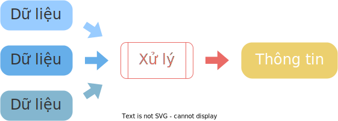

# Dữ liệu và thông tin

!!! abstract "Tóm lược nội dung"

    Bài này trình bày những điểm khác nhau giữa dữ liệu và thông tin, và tầm quan trọng của chúng.

## Dữ liệu

**Dữ liệu** là

- số
- chữ
- hình ảnh
- âm thanh
- v.v...

ở dạng thô, được thu thập từ nhiều nơi khác nhau.

## Thông tin

**Thông tin** là dữ liệu, nhưng đã xử lý (1) để có ngữ cảnh, ý nghĩa và mục đích.
{ .annotate }

1.  Xử lý bao gồm các thao tác:
    
    - Chọn lọc
    - Sắp xếp
    - Tính toán
    - Định dạng
    - Diễn giải
    - Tổ chức
    - Thể hiện
    - Trình bày lại

{loading=lazy width=360}  
<figcaption>Dữ liệu sau khi xử lý trở thành thông tin</figcaption>  

Ví dụ:

!!! question "Hỏi chút chơi - phần 1"
    
    

        <iframe style="width: 100%; height: 360px" frameBorder=0 src="../data-vs-information/quiz1.html">Hỏi chút chơi - phần 1</iframe>
    

## Mối quan hệ giữa dữ liệu và thông tin

Dữ liệu và thông tin là những khái niệm liên quan mật thiết với nhau, nhưng chúng không hoàn toàn là một. Chúng đại diện cho các giai đoạn khác nhau của tiến trình xử lý. Cụ thể như sau:  

!!! note "Mối quan hệ"

    * Khi dữ liệu đã xử lý để trở nên có nghĩa, có ích thì gọi là thông tin.

    * Thông tin có được từ dữ liệu của tiến trình xử lý này có thể trở thành dữ liệu cho một tiến trình xử lý khác.

Ví dụ:

1. Trong tiến trình xác định điểm trung bình:

- Dữ liệu: Điểm số các bài kiểm tra.
- Thông tin: Điểm trung bình môn.

2. Trong tiến trình xác định học lựa:

- Dữ liệu: Điểm trung bình môn, vốn là thông tin của tiến trình 1, lại trở thành dữ liệu của tiến trình 2 này.
- Thông tin: Học lực (giỏi, khá, trung bình, yếu kém).

!!! question "Hỏi chút chơi - phần 2"
    
    

        <iframe style="width: 100%; height: 360px" frameBorder=0 src="../data-vs-information/quiz2.html">Hỏi chút chơi - phần 2</iframe>
    

## Phân biệt dữ liệu và thông tin

| &nbsp; | Dữ liệu	| Thông tin |
| --- | --- | --- |
| Định dạng | Dạng thô.	| Không còn ở dạng thô. |
| Tính liên kết | Là những phần rời rạc, riêng lẻ. | Có liên quan với nhau. |
| Cơ sở ra đời | Ra đời một cách khách quan. | Ra đời tùy mục đích của người sử dụng. |
| Thao tác để có được | Có được nhờ thu thập. | Có được nhờ xử lý. |
| Sự phụ thuộc | Dữ liệu không phụ thuộc vào thông tin. | Thông tin phụ thuộc vào dữ liệu. |
| Ngữ cảnh | Xuất hiện mang tính ngẫu nhiên. | Được thể hiện theo một ngữ cảnh nào đó. |
| Ý nghĩa | Khi đứng một mình thì chưa có ý nghĩa. | Mang một ý nghĩa nào đó. |
| Cơ sở để ra quyết định | Không phải là cơ sở để ra quyết định. | Có thể làm cơ sở để ra quyết định. |

??? note "Nhập nhằng từ ngữ"

    Trong các tài liệu nói chung, hai thuật ngữ dữ liệu và thông tin thường *được/bị* sử dụng thay thế cho nhau với ý nghĩa tương đương.

    Ví dụ:
    
    Thu thập dữ liệu / Thu thập thông tin

    Xử lý dữ liệu / Xử lý thông tin

!!! question "Hỏi chút chơi - phần 3"
    
    

        <iframe style="width: 100%; height: 240px" frameBorder=0 src="../data-vs-information/quiz3.html">Hỏi chút chơi - phần 3</iframe>
    

## Tầm quan trọng của dữ liệu và thông tin

Thông tin đem lại nhiều lợi ích:

- Có thể được sử dụng như các hướng dẫn, chỉ dẫn.
- Có thể tác động cảm xúc.
- Giúp đưa ra quyết định.
- Giúp đưa ra sáng kiến.
- Giúp tạo ra thông tin mới.

Mà để có được thông tin, ta phải dựa trên dữ liệu.

Vì thế, dữ liệu và thông tin là vô cùng quan trọng đối với mọi lĩnh vực của đời sống. Cùng với những tài nguyên quan trọng khác, chẳng hạn như dầu mỏ, thì dữ liệu cũng như thông tin đã và đang là nguồn tài nguyên quan trọng bậc nhất.

!!! tip "Đây là một lưu ý... cần lưu ý"

    Dữ liệu là mỏ dầu của kỷ nguyên kỹ thuật số.

Bài báo đọc thêm nhằm làm rõ ý kiến trên: [The world’s most valuable resource is no longer oil, but data](https://www.economist.com/leaders/2017/05/06/the-worlds-most-valuable-resource-is-no-longer-oil-but-data)

!!! question "Hỏi chút chơi - phần 4"
    
    

        <iframe style="width: 100%; height: 360px" frameBorder=0 src="../data-vs-information/quiz4.html">Hỏi chút chơi - phần 4</iframe>
    

## Sơ đồ tóm tắt nội dung

{!grade-10/topic-A1/data-vs-information.mm.md!}
*Sơ đồ tóm tắt dữ liệu và thông tin*

## Some English words

| Vietnamese | Tiếng Anh | 
| --- | --- |
| dữ liệu | data |
| tài nguyên | resource |
| thông tin | information |
| xử lý | process |