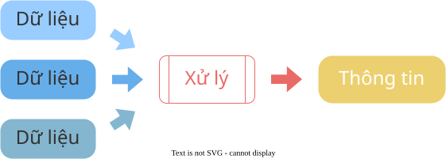
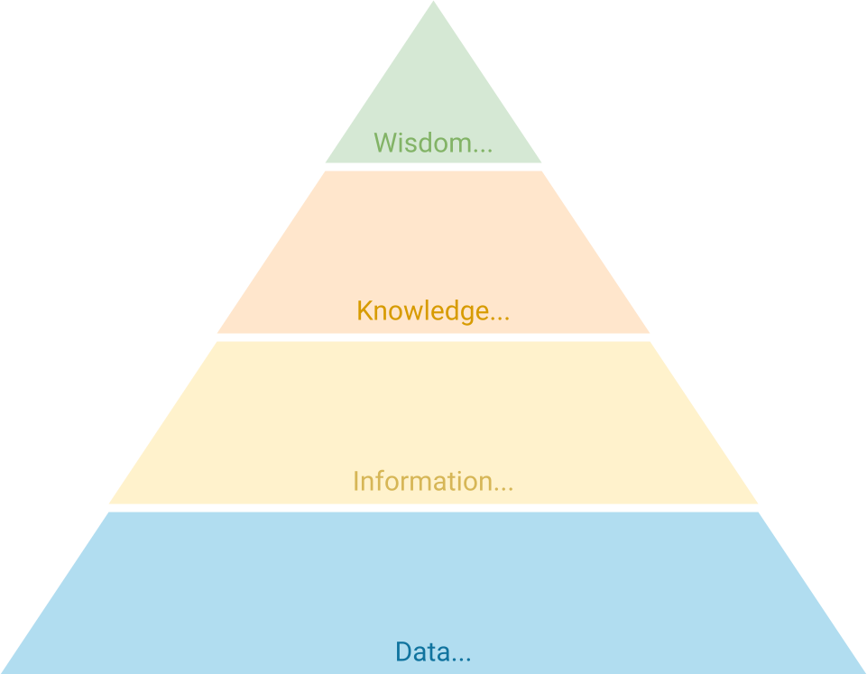

# Dữ liệu và thông tin

!!! abstract "Tóm lược nội dung"

    Bài này trình bày những khái niệm liên quan đến dữ liệu và thông tin.

## Dữ liệu

!!! note "Dữ liệu"

    **Dữ liệu** là

    - số
    - chữ
    - hình ảnh
    - âm thanh
    - v.v.

    ở dạng thô, được thu thập từ nhiều nơi khác nhau.

---

## Thông tin

!!! note "Thông tin"

    **Thông tin** là dữ liệu, nhưng **đã xử lý** (1) để có ngữ cảnh, ý nghĩa và mục đích.
    { .annotate }

    1.  Xử lý bao gồm các thao tác:
        
        - Chọn lọc
        - Sắp xếp
        - Tính toán
        - Định dạng
        - Diễn giải
        - Tổ chức
        - Thể hiện
        - Trình bày lại

{loading=lazy width=480}

Ví dụ:

```mermaid
flowchart LR
    D[Dữ liệu:<br/>Điểm số các bài kiểm tra] --> P
    P[[<span style="color:#ea6b66">Xử lý</span>]] --> I
    I[Thông tin:<br/>Điểm trung bình môn]

    style D fill:#99ccff,stroke:none,rx:30px,color:#fff;
    style I fill:#ecd06f,stroke:none,rx:30px;
    style P fill:#fff,stroke:#ea6b66
```

??? info "Tháp DIKW"

    Tháp DIKW giúp ta hiểu cách mà dữ liệu và thông tin được chuyển hóa, từ cấp độ đơn giản đến sâu sắc. Tìm hiểu thêm [tại đây](../../supplementary-reading/dikw-pyramid.md){:target="_blank"}.

    {loading=lazy width=480}

??? info "Mối quan hệ giữa dữ liệu và thông tin"

    Dữ liệu và thông tin là những khái niệm liên quan mật thiết với nhau, nhưng chúng không hoàn toàn là một. Chúng là **các trạng thái khác nhau của các tiến trình xử lý khác nhau**. Cụ thể như sau:  

    - Khi dữ liệu đã xử lý để trở nên có nghĩa, có ích thì gọi là thông tin.
    - Thông tin có được của tiến trình xử lý này có thể trở thành dữ liệu cho một tiến trình xử lý khác.

    Ví dụ:  
    **Tiến trình 1:** xác định điểm trung bình

    - Dữ liệu: Điểm số các bài kiểm tra.
    - Thông tin: Điểm trung bình môn.

    **Tiến trình 2:** xác định học lực

    - Dữ liệu: Điểm trung bình môn, vốn là thông tin của tiến trình 1, lại trở thành dữ liệu của tiến trình 2 này.
    - Thông tin: Học lực (tốt, khá, đạt, chưa đạt).

---

## Phân biệt

| &nbsp; | Dữ liệu	| Thông tin |
| --- | --- | --- |
| Định dạng | Dạng thô.	| Không còn ở dạng thô. |
| Tính liên kết | Là những phần rời rạc, riêng lẻ. | Có liên quan với nhau. |
| Cơ sở ra đời | Ra đời một cách khách quan. | Ra đời tùy mục đích của người sử dụng. |
| Ngữ cảnh | Xuất hiện mang tính ngẫu nhiên. | Được thể hiện theo một ngữ cảnh nào đó. |
| Thao tác để có được | Có được nhờ thu thập. | Có được nhờ xử lý. |
| Sự phụ thuộc | Dữ liệu không phụ thuộc vào thông tin. | Thông tin phụ thuộc vào dữ liệu. |
| Ý nghĩa | Chưa có ý nghĩa một cách rõ ràng. | Mang một ý nghĩa nào đó. |
| Cơ sở để ra quyết định | Chưa đủ cơ sở để ra quyết định. | Có thể làm cơ sở để ra quyết định. |

??? info "Nhập nhằng từ ngữ"

    Trong các tài liệu nói chung, hai thuật ngữ dữ liệu và thông tin thường *được/bị* sử dụng thay thế cho nhau với ý nghĩa tương đương.

    Ví dụ:  
    Thu thập dữ liệu / Thu thập thông tin  
    Xử lý dữ liệu / Xử lý thông tin

??? info "Tầm quan trọng của dữ liệu và thông tin"

    Thông tin đem lại nhiều lợi ích:

    - Có thể được sử dụng như các hướng dẫn, chỉ dẫn.
    - Có thể tác động cảm xúc.
    - Giúp đưa ra quyết định.
    - Giúp đưa ra sáng kiến.
    - Giúp tạo ra thông tin mới.

    Mà để có được thông tin, ta phải dựa trên dữ liệu.

    Dữ liệu và thông tin ảnh hưởng đến nhiều mặt của đời sống. Dữ liệu và thông tin đã và đang trở thành một trong những nguồn tài nguyên quan trọng bậc nhất.

---

## Sơ đồ tóm tắt

    <iframe style="width: 100%; height: 360px" frameBorder=0 src="../mindmaps/data-vs-information.html">Sơ đồ tóm tắt</iframe>

---

## Some English words

| Vietnamese | Tiếng Anh | 
| --- | --- |
| dữ liệu | data |
| tài nguyên | resource |
| thông tin | information |
| xử lý | process |