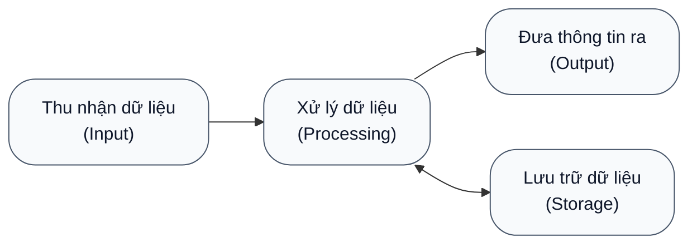
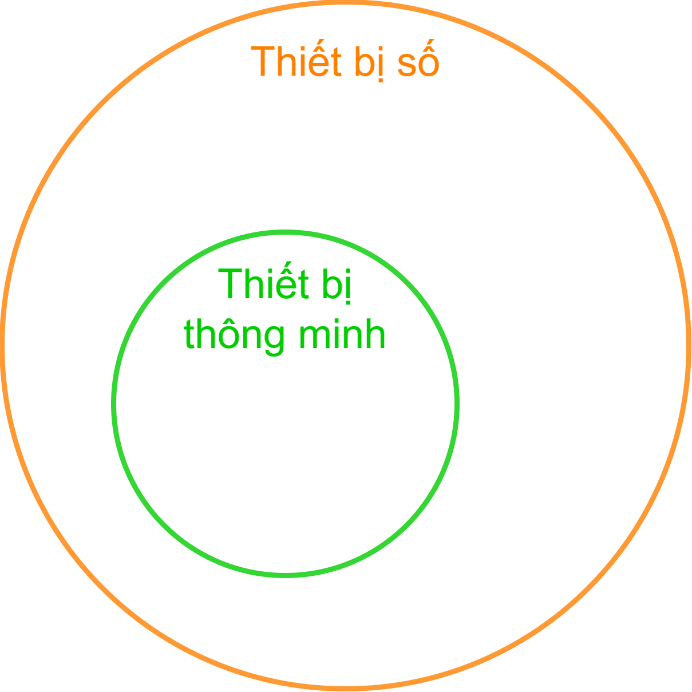

# Thiết bị số và thiết bị thông minh

!!! abstract "Tóm lược nội dung"

    Bài này trình bày:

    - Thiết bị số và những điểm ưu việt của nó.
    - Thiết bị thông minh và vai trò của nó đối với xã hội.

## Thiết bị số

### Khái niệm

!!! note "Thiết bị số"

    Là các thiết bị điện tử có thể **thu nhận**, **xử lý**, **lưu trữ** và **truyền** dữ liệu số (1).
    { .annotate }

    1.  Dữ liệu số là dữ liệu đã được mã hóa ở dạng nhị phân, gồm hai chữ số `0` và `1`.

Ví dụ:  

- Máy tính để bàn, máy tính xách tay
- Điện thoại thông minh, máy tính bảng
- Máy nghe nhạc, máy ghi âm, máy ghi hình
- Máy chơi game

??? info "Digital"

    Trong tiếng Anh, *digit* nghĩa là *chữ số*, ý chỉ hai chữ số `0` và `1`.

    *Digital* là tính từ của *digit*, nghĩa là *thuộc về chữ số*.

    Trước đây ở nước mình, người ta thường dùng thuật ngữ *thiết bị kỹ thuật số*, còn hiện nay hầu như chỉ gọi là *thiết bị số*.

### Chức năng

Mọi thiết bị số đều có các chức năng cơ bản đối với dữ liệu và thông tin như mô hình sau:

Với mô hình này, thiết bị số được xem là một **hệ thống xử lý thông tin hoàn chỉnh**.

### Ưu điểm

Thiết bị số có những đặc điểm ưu việt như sau:

1. **Lưu trữ**

    - Có năng lực lưu trữ **dung lượng lớn**.
    - Có năng lực lưu trữ **lâu dài**.
    - Chiếm không gian vật lý nhỏ.
    - Có thể mở rộng quy mô.
    - Có thể bảo mật, sao lưu và phục hồi dữ liệu.
    - Thuận tiện và nhanh chóng trong việc tìm kiếm và truy xuất dữ liệu.

2. **Xử lý**

    - Có năng lực xử lý **chính xác** (1).
        { .annotate }

        1.  Các sai sót, nếu có, thường là do dữ liệu đầu vào không chính xác hoặc do thao tác của con người.

    - Có tốc độ xử lý **rất nhanh**.
    
        Những máy tính thông thường đã đạt đến hàng tỉ phép tính (1) mỗi giây.
        { .annotate }

        1.  **Phép tính** ở đây không chỉ là cộng, trừ, nhân, chia số học, mà còn là các thao tác trên dữ liệu số, chẳng hạn như:

            - **Di chuyển dữ liệu** giữa các ô nhớ
            - **Tính toán logic**: AND, OR, NOT, v.v.
            - **Điều khiển**: so sánh, rẽ nhánh, lặp, gọi hàm

3. **Truyền dẫn**

    - Có năng lực truyền dẫn dữ liệu với **tốc độ cao** mà vẫn bảo đảm độ tin cậy và tính toàn vẹn của dữ liệu.
    - Truyền dẫn dữ liệu **linh hoạt** thông qua mạng.

---

## Thiết bị thông minh

### Khái niệm

!!! note "Thiết bị thông minh"

    Là thiết bị số được tích hợp thêm các công nghệ tiên tiến, bao gồm **cảm biến** và năng lực **kết nối**, cho phép nó tự động thu thập dữ liệu, tương tác với người dùng và các thiết bị khác.
    
Ví dụ:  

- Máy tính bảng, điện thoại thông minh, đồng hồ thông minh, nhẫn thông minh
- Loa thông minh Amazon Echo, Google Home
- Thiết bị gia dụng thông minh: tivi, máy lạnh, máy giặt, tủ lạnh, robot hút bụi
- Đèn và camera giám sát thông minh

??? info "Mối quan hệ giữa thiết bị số và thiết bị thông minh"
    
    Mọi thiết bị thông minh đều là thiết bị số, nhưng không phải thiết bị số nào cũng là thiết bị thông minh.
    
    Nói cách khác, tập hợp thiết bị thông minh là *tập con* của tập hợp thiết bị số.

    { loading=lazy width=50%}
    
    *Sơ đồ Venn thể hiện mối quan hệ giữa thiết bị số và thiết bị thông minh* 

??? info "Tính năng của thiết bị thông minh"

    1. **Kết nối**

        Thiết bị thông minh **thường xuyên được kết nối mạng**, cho phép gửi và nhận lệnh, truyền dữ liệu và cập nhật phần mềm từ xa.

    2. **Điều khiển từ xa**

        Người dùng có thể **theo dõi hoặc điều khiển** thiết bị thông minh của mình **ở bất cứ nơi đâu có kết nối** Internet, thông qua app trên điện thoại hoặc máy tính.

    3. **Tương tác**
        
        Thiết bị thông minh có thể **giao tiếp và làm việc cùng với thiết bị thông minh khác** trong mạng hoặc trong hệ sinh thái của nó.

    4. **Tự động**

        Thiết bị thông minh có thể **tự vận hành** hoặc **tự điều chỉnh** năng lực xử lý của nó tùy theo môi trường hoặc thói quen của người dùng mà không cần người dùng can thiệp liên tục.

    5. **Hỗ trợ ra quyết định**

        Thiết bị thông minh có thể hoạt động cục bộ hoặc thông qua điện toán đám mây để cung cấp các hiểu biết về một đối tượng nào đó, **đưa ra các dự đoán, các cảnh báo hoặc các đề xuất** cho người dùng.

### Vai trò

Các thiết bị thông minh đóng vai trò then chốt trong việc thúc đẩy sự phát triển của xã hội và vận hành cuộc cách mạng công nghiệp 4.0. Có thể kể đến những vai trò nổi bật sau:  

-   :material-chart-histogram:{ .lg .middle } **Thu thập và phân tích dữ liệu**

    Nhờ vào năng lực thu thập và phân tích được lượng dữ liệu to lớn, thiết bị thông minh giúp tăng cường hiểu biết về các sự vật, hiện tượng, giúp xác định các xu hướng phát triển và giúp đưa ra các quyết định đủ tin cậy.

    Ví dụ:

    - Trong kinh doanh, thiết bị thông minh phân tích hành vi tiêu dùng để dự báo thị trường và cải tiến sản phẩm.
    - Trong y tế, thiết bị thông minh theo dõi chỉ số sinh hiệu liên tục, trợ giúp bác sĩ chẩn đoán chính xác và giúp phát hiện sớm nguy cơ bệnh tật.

-   :material-cogs:{ .lg .middle } **Cải thiện hiệu quả và năng suất**

    Năng lực xử lý công việc một cách tự động giúp cải thiện hiệu quả và năng suất trong các lĩnh vực khác nhau.

    Ví dụ:
    
    - Trong nhà máy thông minh, robot và dây chuyền sản xuất tự động vận hành liên tục và tự điều chỉnh để giảm thiểu sản phẩm lỗi.
    - Trong khía cạnh nghề nghiệp, thiết bị thông minh giúp tạo ra việc làm mới như: lập trình IoT, phân tích dữ liệu, an ninh mạng, v.v..

-   :material-transit-connection-variant:{ .lg .middle } **Tăng cường kết nối và giao tiếp**

    Năng lực kết nối của thiết bị thông minh giúp tiến trình giao tiếp và làm việc cộng tác giữa người với người, giữa người với máy diễn ra một cách liên tục, không phụ thuộc vào sự cách biệt thời gian và không gian. Từ đó cải thiện năng lực quản lý chuỗi cung ứng và thúc đẩy hợp tác toàn cầu.

    Ví dụ:

    - Trong chuỗi cung ứng, thiết bị thông minh giúp định vị và truy vết hàng hóa theo thời gian thực.

    - Trong giáo dục, thiết bị thông minh giúp tăng cường trải nghiệm dạy và học thông qua các nền tảng trực tuyến, hệ thống thực tế ảo (VR) và thực tế tăng cường (AR).

-   :material-leaf:{ .lg .middle } **Tối ưu hóa nguồn tài nguyên và bảo vệ môi trường**

    Thiết bị thông minh giúp tối ưu hóa việc sử dụng các nguồn tài nguyên như năng lượng, nước và nguyên vật liệu. Từ đó góp phần vào việc bảo vệ sự bền vững của môi trường.

    Ví dụ:

    - Trong công nghiệp và đời sống, hệ thống thông minh tự động điều chỉnh hệ thống chiếu sáng, hệ thống sưởi hoặc làm mát dựa trên thời gian thực.
    - Trong nông nghiệp, thiết bị thông minh giúp đo lường chính xác lượng nước tưới tiêu và phân bón.

-   :material-account-star:{ .lg .middle } **Cá nhân hóa trải nghiệm**

    Thiết bị thông minh cung cấp các trải nghiệm và dịch vụ cá nhân hóa, giúp đáp ứng các nhu cầu và sở thích của riêng từng người dùng.

    Ví dụ:

    - Tự động nhắc nhở lịch trình làm việc hoặc đề xuất danh sách nhạc, phim ảnh và tin tức dựa trên thói quen của từng người dùng.

---

## Sơ đồ tóm tắt

    <iframe style="width: 100%; height: 360px" frameBorder=0 src="../mindmaps/digital-devices-vs-smart-devices.html">Sơ đồ tóm tắt</iframe>

---

## Some English words

| Vietnamese | Tiếng Anh | 
| --- | --- |
| điện thoại thông minh | smartphone |
| lưu trữ | store |
| máy tính bảng | tablet |
| máy tính để bàn | desktop |
| máy tính xách tay | laptop |
| thiết bị số | digital device |
| thiết bị thông minh | smart device |
| truyền dẫn | transfer |
| xử lý | process |
