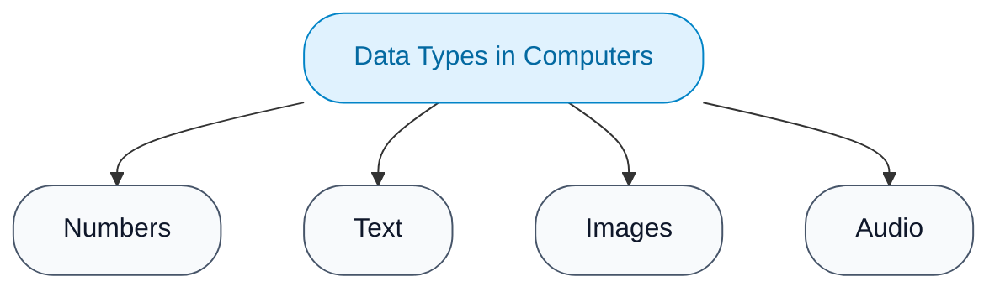
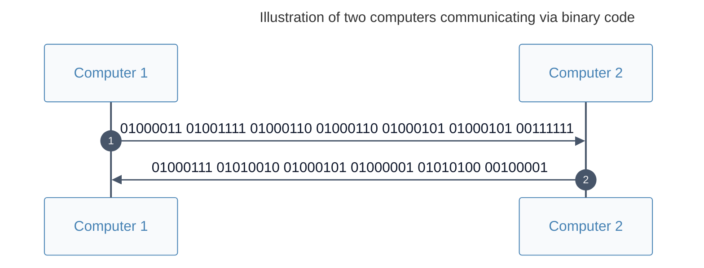

# Data types and the binary system

!!! abstract "Content summary"

    This lesson covers:

    - Basic computer data types
    - The binary system

## Data types

Before processing, real-world data must be collected, converted, and stored in computer memory in **digital form**.

Real-world data and information are highly diverse; however, when entered into a computer, **they are all reduced to fundamental data types** as shown below:



<div class="grid cards" markdown>

-   :material-numeric:{ .lg .middle } **Numbers**

    Consist of two fundamental types:
    
    - **Integers**: numbers without a fractional component.
    - **Real numbers**: floating-point numbers.
    
    To humans, `7` and `7.0` have the exact same value. To a computer, however, these two numbers are stored using two completely different binary structures.

-   :material-format-text:{ .lg .middle } **Text**

    Consists of two types:
    
    - **Character**
    - **String**: sequences of zero, one, or more adjacent characters.
    
    In many programming languages, individual characters are enclosed in **single quotes `''`**, whereas strings are enclosed in **double quotes `""`** (1).
    { .annotate }
    
    1.  In the Python programming language, both single quotes `''` and double quotes `""` are used to represent strings. Python does not have a distinct data type for single characters. Characters are treated simply as strings of length one.

-   :material-image:{ .lg .middle } **Images**

    Real-world images are divided by computers into a **grid of picture elements**, called **pixels**. Each pixel is encoded using numerical values that represent colors.

-   :material-waveform:{ .lg .middle } **Audio**

    Real-world sound waves are ***"sampled"*** by computers at extremely short time intervals and converted into a sequence of numbers representing the sound wave's amplitude.
    
    An audio file is a sequence of numbers representing the amplitude of a sound wave, sampled at discrete, equally spaced time intervals.

</div>

??? info "Video data"

    Video is not a primitive data type, but rather a composite data type. A video file consists of:

    - A sequence of still frames displayed continuously at a high rate, such as 30 fps or 60 fps (fps = frames per second).
    - Synchronized audio tracks.

??? info "Environmental data"

    **Environmental data** is a general term for **physical, chemical, or biological data** gathered from the surrounding natural environment.

    For example:  
    Environmental data that computers are currently capable of storing and processing include:

    - Physical data: light, temperature, humidity, pressure, acceleration, geographical location, and orientation.
    - Biometric data: fingerprints, irises, retinas, heart rate, and brain waves.

    Environmental data is collected using **sensors** and converted into digital data for storage and processing in computers.

??? info "Analog-to-Digital signal conversion"

    In nature, environmental data exists in the form of **analog signals** (1), which vary continuously rather than discretely like 0s and 1s.
    { .annotate }

    1.  *"Analog"* does not mean approximate, but rather that it mimics the original physical quantity.
        
        For example:  
        In an analog audio signal, the instantaneous electrical voltage varies continuously in direct proportion to the acoustic pressure of the sound wave.

    To enable computers to store and process environmental data, it must undergo a collection and transformation process:

    ```mermaid
    flowchart LR
        A["Environmental data"] -->|Analog signal| B["Sensor"]
        B -->|ADC encoding| C["Digital data<br/>stored in computer memory"]

        classDef box fill:#f8fafc,stroke:#475569,color:#0f172a,rx:1.5rem,ry:1.5rem
        class A,B,C box
    ```

    1. A **sensor** is a device used to measure changes in a physical, chemical, or biological quantity in the environment and convert them into electrical signal (typically continuous voltage or current variations).
    
    2. An **ADC** (Analog-to-Digital Converter) is a system used to convert analog signals into binary number sequences for storage and processing in computer memory. (This process consists of two primary steps: sampling the continuous signal at discrete intervals and quantizing the continuous values into finite binary numbers.)

---

## The binary system

!!! note "The binary system"

    A **numeral system** that uses only **two symbols, `0` and `1`**, to represent all data values.

Every number, letter, image, or sound in a computer is represented by combining sequences of `0`s and `1`s.

??? info "Why do computers use the binary system?"


    Humans use the decimal system because we have ten fingers. Computers, on the other hand, use the binary system because they are built from tiny electronic components called **transistors**.

    Manufacturing components that reliably distinguish between two distinctly different states, corresponding to two voltage levels (LOW and HIGH), is much easier than creating components for ten distinct states corresponding to ten voltage levels. It is also far less susceptible to signal noise and signal degradation.

    - The LOW voltage level, corresponding to the off state, is represented by the digit `0`.
    - The HIGH voltage level, corresponding to the on state, is represented by the digit `1`.

The ingenuity of the binary system lies in the fact that, despite the vast richness of real-world data, when processed by a computer, everything is encoded into **bit sequences** (1), known as **binary code**.
{ .annotate }

1. bit = **b**inary dig**it**, meaning *binary digit*.
Based on binary code, computers can store, compute, and transmit data between devices with high accuracy without distortion or information loss `[Note: While binary representations eliminate cumulative signal degradation inherent in analog signals, reliable transmission in practice relies on network protocols and error-checking mechanisms like checksums or parity bits to correct physical transmission errors]`.

For example, when computers *"talk"* to one another over a network, they send and receive sequences of electrical pulses or optical signals corresponding to bit streams of `0`s and `1`s.



??? info "What did the two computers say to each other?"

    Each 8-bit sequence corresponds to a character in the ASCII table as follows:

    | Binary code | ASCII character | Binary code | ASCII character |
    | --- | --- | --- | --- |
    | 01000011 | C | 01000111 | G |
    | 01001111 | O | 01010010 | R |
    | 01000110 | F | 01000001 | A |
    | 01000101 | E | 01010100 | T |
    | 00111111 | ? | 00100001 | ! |

    Computer 1: COFFEE?

    Computer 2: GREAT!

---

## Summary mindmap

<div>
    <iframe style="width: 100%; height: 300px" frameBorder=0 src="/grade-10/topic-A2/mindmaps/data-types-and-binary-system.html">Sơ đồ tóm tắt</iframe>
</div>

---

## Some English words

| Vietnamese | Tiếng Anh | 
| --- | --- |
| âm thanh | sound |
| cảm biến | sensor |
| hệ nhị phân | binary |
| hình ảnh | image |
| số | number |
| số nguyên | integer |
| số thập phân | floating-point number |
| văn bản | text |