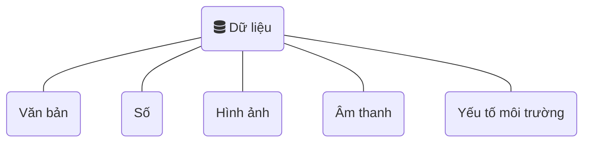
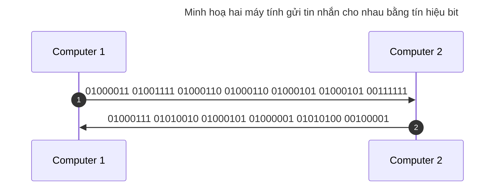

# Kiểu dữ liệu và hệ nhị phân

!!! abstract "Tóm lược nội dung"

    Bài này trình bày:
    
    - Một số kiểu dữ liệu của máy tính
    - Hệ nhị phân

## Kiểu dữ liệu

Trước khi xử lý, dữ liệu phải được đưa vào và lưu trữ trên máy tính.

Dữ liệu và thông tin của thế giới thực rất đa dạng; trong khi đó, không phải mọi dữ liệu đều lưu trữ được trên máy.

Dữ liệu lưu trữ và xử lý được bằng máy tính có thể quy về những kiểu cơ bản sau:

### Số

Có hai kiểu số cơ bản:

- **Số nguyên**: là số không có phần thập phân.
- **Số thực**: là số có phần thập phân.

Ví dụ:  
`7` là số *bảy nguyên*, còn `7.0` là số *bảy thập phân*. Mặc dù đối với người, hai số này là như nhau, song máy tính lưu trữ khác nhau.

### Văn bản

Văn bản bao gồm cả **ký tự** lẫn **chuỗi**. Chuỗi là tập hợp gồm *không*, *một* hoặc *nhiều* ký tự.
    
Trong một số ngôn ngữ lập trình, ký tự thường đặt trong cặp **dấu nháy đơn** `''`, còn chuỗi đặt trong cặp **dấu nháy kép**/ngoặc kép `""` (1).
{ .annotate }

1.  Đối với ngôn ngữ lập trình Python, dùng dấu nháy đơn hay nháy kép đều được xem là chuỗi.

Ví dụ:  
`'7'` là ký tự, còn `"7"` là chuỗi gồm một ký tự.

Cả ký tự lẫn chuỗi đều không thể tham gia các phép toán cộng, trừ, nhân, chia. Muốn tham gia tính toán, lập trình viên phải chuyển đổi kiểu dữ liệu từ kiểu văn bản sang kiểu số.

### Yếu tố môi trường

Đây là tên gọi chung cho các dữ liệu liên quan đến môi trường tự nhiên xung quanh, bao gồm dữ liệu mang tính vật lý, hoá học và sinh học.

Ví dụ:  
Những dữ liệu môi trường mà máy tính đã có thể lưu trữ và xử lý:

- ánh sáng
- nhiệt độ
- gia tốc
- vị trí
- góc quay
- hướng
- dữ liệu sinh trắc (vân tay, tròng mắt, v.v...)

Dữ liệu yếu tố môi trường được máy tính thu thập thông qua các thiết bị gọi là **cảm biến**.

## Hệ nhị phân

**Hệ nhị phân** là hệ thống số đếm chỉ sử dụng hai ký hiệu `0` và `1` để thể hiện các giá trị số khác nhau. Mọi số trong hệ nhị phân đều được tạo ra bằng cách ghép một hoặc nhiều chữ số `0` và `1` lại với nhau.

Hệ nhị phân là một hệ đếm kỳ diệu. Sự kỳ diệu thể hiện ở chỗ, dù dữ liệu có nhiều dạng khác nhau, khi đưa vào máy tính, chúng đều được biến đổi thành cùng một dạng là các tín hiệu `0` và `1`, gọi là **dãy bit** (1) hoặc **mã nhị phân** của dữ liệu. Dựa trên mã nhị phân, máy tính có thể lưu trữ và xử lý dữ liệu một cách chính xác.
{ .annotate }

1.  bit = **b**-inary dig-**it**, tạm dịch là *chữ số nhị phân*.

Chẳng hạn, khi các máy tính "*nói chuyện*" với nhau, nghĩa là truyền dữ liệu qua lại dưới dạng **bit 0** và **bit 1**, mọi dữ liệu đều được truyền một cách chính xác và đầy đủ từ máy này sang máy nọ. Nói cách khác, ta có thể nhận được tin nhắn của bạn bè một cách đầy đủ, có thể nghe các âm thanh của bài nhạc một cách rõ ràng; có thể xem hình ảnh của video với độ nét cao.

## Sơ đồ tóm tắt

    <iframe style="width: 100%; height: 360px" frameBorder=0 src="../mindmaps/data-types-and-binary-system.html">Sơ đồ tóm tắt</iframe>

## Some English words

| Vietnamese | Tiếng Anh | 
| --- | --- |
| âm thanh | sound |
| cảm biến | sensor |
| hệ nhị phân | binary |
| hình ảnh | image |
| số | number |
| số nguyên | integer |
| số thập phân | floating-point number |
| văn bản | text |