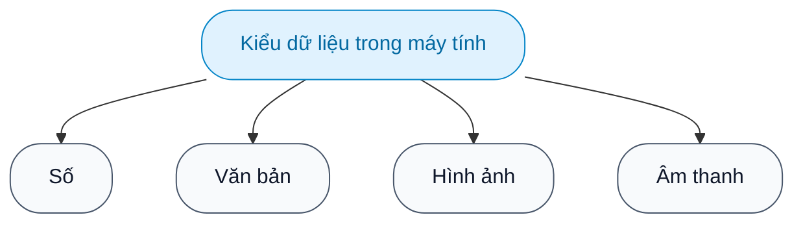
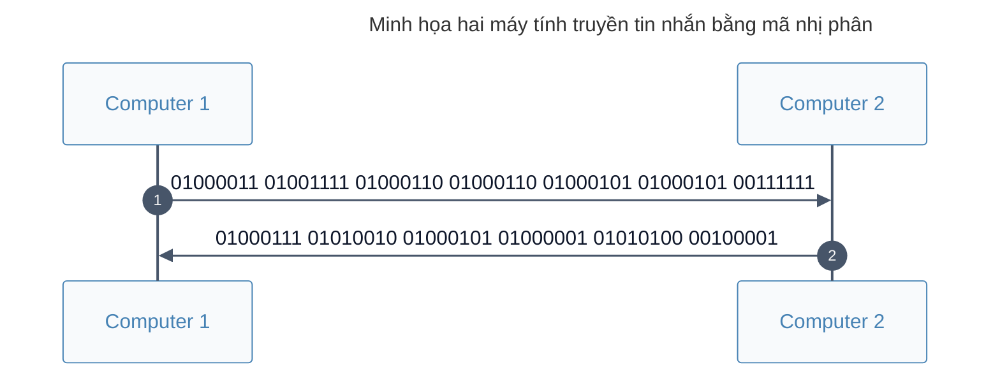

# Kiểu dữ liệu và hệ nhị phân

!!! abstract "Tóm lược nội dung"

    Bài này trình bày:
    
    - Một số kiểu dữ liệu của máy tính
    - Hệ nhị phân

## Kiểu dữ liệu

Trước khi xử lý, dữ liệu từ thế giới thực phải được thu thập, chuyển đổi và lưu trữ trong bộ nhớ máy tính dưới dạng **dữ liệu số**.

Dữ liệu và thông tin từ thế giới thực rất đa dạng, nhưng khi đưa vô máy tính, **tất cả được quy về 4 kiểu dữ liệu nền tảng** như sau:


```mermaid
%%{
  init: {
    'theme': 'default',
    'look': 'classic',
    'flowchart': { 'padding': 15 }
  }
}%%
flowchart TD
    D["Kiểu dữ liệu trong máy tính"]:::main --> N["Số"]:::type
    D --> T["Văn bản"]:::type
    D --> I["Hình ảnh"]:::type
    D --> S["Âm thanh"]:::type

    classDef main fill:#e0f2fe,stroke:#0284c7,color:#0369a1,rx:1.5rem,ry:1.5rem
    classDef type fill:#f8fafc,stroke:#475569,color:#0f172a,rx:1.5rem,ry:1.5rem
```

<div class="grid cards" markdown>

-   :material-numeric:{ .lg .middle } **Số**

    Gồm hai kiểu cơ bản:

    - **Số nguyên**: là số không có phần thập phân.
    - **Số thực**: là số có phần thập phân.

    Đối với con người, `7` và `7.0` có giá trị như nhau. Nhưng đối với máy tính, hai số này được lưu trữ theo hai cấu trúc nhị phân khác nhau.

-   :material-format-text:{ .lg .middle } **Văn bản**

    Gồm hai kiểu:
    
    - **Ký tự**
    - **Chuỗi**: là dãy gồm không, một hoặc nhiều ký tự liền nhau.

    Trong nhiều ngôn ngữ lập trình, ký tự nằm trong **dấu nháy đơn `''`**, còn chuỗi nằm trong **dấu nháy kép `""`** (1).
    { .annotate }

    1.  Trong ngôn ngữ lập trình Python, cả nháy đơn `''` và nháy kép `""` đều được dùng để biểu diễn chuỗi. Python không có kiểu riêng cho ký tự.

-   :material-image:{ .lg .middle } **Hình ảnh**

    Hình ảnh trong thế giới thực được máy tính chia nhỏ thành một **lưới các điểm ảnh**, gọi là **pixel**. Mỗi điểm ảnh được mã hóa bằng các giá trị số biểu diễn màu sắc.

-   :material-waveform:{ .lg .middle } **Âm thanh**
    
    Sóng âm thanh trong thế giới thực được máy tính ***"lấy mẫu"* (sampling) theo các khoảng thời gian** cực ngắn và chuyển thành dãy các số biểu diễn biên độ sóng âm.

    Tập tin âm thanh là một dãy số đại diện cho biên độ của sóng âm được lấy mẫu liên tiếp theo thời gian.

</div>

??? info "Dữ liệu video"

    Video không phải là kiểu dữ liệu nền tảng, mà là kiểu dữ liệu phức hợp. Một tập tin video được tạo thành từ:

    - Một dãy các khung hình (frame) phát liên tục với tốc độ cao, chẳng hạn như 30 fps hoặc 60 fps (fps = frames per second, nghĩa là số khung hình trong một giây).
    - Kết hợp đồng bộ với các dải âm thanh.

??? info "Dữ liệu môi trường"
    
    **Dữ liệu môi trường** là tên gọi chung cho các **dữ liệu vật lý, hóa học hoặc sinh học** từ môi trường tự nhiên xung quanh.

    Ví dụ:  
    Những dữ liệu môi trường mà máy tính đã có thể lưu trữ và xử lý:

    - Dữ liệu vật lý: ánh sáng, nhiệt độ, độ ẩm, áp suất, gia tốc, vị trí địa lý, góc quay.
    - Dữ liệu sinh trắc học: vân tay, mống mắt, võng mạc, nhịp tim, sóng não.

    Dữ liệu môi trường được thu thập bằng các **cảm biến** và được chuyển đổi thành dữ liệu số để lưu trữ trong máy tính.

??? info "Chuyển đổi tín hiệu tương tự thành tín hiệu số"

    Trong tự nhiên, các dữ liệu môi trường tồn tại dưới dạng **tín hiệu tương tự** (analog) (1), biến thiên liên tục, không rời rạc như 0 và 1.
    { .annotate }

    1.  *"Tương tự"* không có nghĩa là gần đúng, mà có nghĩa là mô phỏng (tương tự) theo đại lượng vật lý gốc.
    
        Ví dụ:  
        Trong tín hiệu âm thanh tương tự, điện áp tín hiệu tức thời thay đổi theo cách tương tự với áp suất của sóng âm.

    Để máy tính có thể lưu trữ và xử lý, dữ liệu môi trường phải trải qua quá trình thu thập và biến đổi:

    ```mermaid
    flowchart LR
        A["Dữ liệu môi trường"] -->|Tín hiệu analog| B["Cảm biến"]
        B -->|Mã hóa ADC| C["Dữ liệu số<br/>lưu trên bộ nhớ máy tính"]

        classDef box fill:#f8fafc,stroke:#475569,color:#0f172a,rx:1.5rem,ry:1.5rem
        class A,B,C box
    ```

    1. **Cảm biến** (sensor) là thiết bị dùng để đo đạc sự thay đổi của một đại lượng vật lý, hóa học hoặc sinh học trong môi trường và chuyển đổi nó thành tín hiệu điện.
    2. **Bộ chuyển đổi ADC** (Analog-to-Digital Converter) là hệ thống dùng để chuyển đổi các tín hiệu tương tự thành các dãy số nhị phân để máy tính lưu trữ và xử lý.

---

## Hệ nhị phân

!!! note "Hệ nhị phân"

    Là **hệ thống số đếm** chỉ sử dụng **hai ký hiệu `0` và `1`** để thể hiện mọi giá trị dữ liệu.

Mọi số, chữ cái, hình ảnh hoặc âm thanh trong máy tính đều được tạo ra bằng cách kết hợp chuỗi các chữ số `0` và `1`.

??? info "Tại sao máy tính sử dụng hệ nhị phân?"

    Con người sử dụng hệ thập phân vì chúng ta có 10 ngón tay. Còn máy tính sử dụng hệ nhị phân vì nó được cấu tạo từ các linh kiện điện tử nhỏ bé gọi là **bóng bán dẫn** (transistor).

    Việc chế tạo linh kiện nhận biết chính xác 2 trạng thái khác nhau rõ rệt, ứng với 2 mức điện áp LOW và HIGH, thì dễ dàng hơn so với 10 trạng thái, ứng 10 mức điện áp. Đồng thời cũng ít bị nhiễu tín hiệu hơn.

    - Mức điện áp LOW, ứng với trạng thái tắt (Off), được biểu diễn bằng chữ số `0`.
    - Mức điện áp HIGH, ứng với trạng thái bật (On), được biểu diễn bằng chữ số `1`.

Sự kỳ diệu của hệ nhị phân nằm ở chỗ: dù dữ liệu của thế giới thực vô cùng phong phú, nhưng khi đưa vào máy tính, tất cả đều được mã hóa thành các **dãy bit** (1), gọi là **mã nhị phân**.
{ .annotate }

1.  bit = **b**-inary dig-**it**, nghĩa là *chữ số nhị phân*.

Dựa trên mã nhị phân, máy tính có thể lưu trữ, tính toán và truyền tải dữ liệu giữa các thiết bị một cách chính xác tuyệt đối mà không bị méo mó hay sai lệch thông tin.

Ví dụ:  
Khi các máy tính *"nói chuyện"* với nhau qua mạng, chúng gửi và nhận các chuỗi tín hiệu xung điện hoặc sóng quang học tương ứng với các dãy bit `0` và `1`.


```mermaid
---
title: Minh họa hai máy tính truyền tin nhắn bằng mã nhị phân
config:
    theme: base
    themeVariables:
        actorBkg: "#f8fafc"
        actorBorder: "#4682b4"
        actorTextColor: "#4682b4"
        actorLineColor: "#475569"
        signalColor: "#475569"
        signalTextColor: "#0f172a"
    themeCSS: ".actor { rx: 1.5rem; ry: 1.5rem; }"
---
sequenceDiagram
    autonumber
    participant C1 as Computer 1
    participant C2 as Computer 2

    C1->>C2: 01000011 01001111 01000110 01000110 01000101 01000101 00111111
    C2->>C1: 01000111 01010010 01000101 01000001 01010100 00100001
```

??? info "Hai máy tính đã nói gì với nhau?"

    Mỗi 8 bit ứng với một ký tự trong bảng mã ASCII như sau:

    | Mã nhị phân | Ký tự ASCII | Mã nhị phân | Ký tự ASCII |
    | --- | --- | --- | --- |
    | 01000011 | C | 01000111 | G |
    | 01001111 | O | 01010010 | R |
    | 01000110 | F | 01000001 | A |
    | 01000101 | E | 01010100 | T |
    | 00111111 | ? | 00100001 | ! |

    Máy tính 1: COFFEE?

    Máy tính 2: GREAT!

---

## Sơ đồ tóm tắt

<div>
    <iframe style="width: 100%; height: 300px" frameBorder=0 src="../mindmaps/data-types-and-binary-system.html">Sơ đồ tóm tắt</iframe>
</div>

---

## Some English words

| Vietnamese | Tiếng Anh | 
| --- | --- |
| âm thanh | sound |
| cảm biến | sensor |
| hệ nhị phân | binary |
| hình ảnh | image |
| số | number |
| số nguyên | integer |
| số thập phân | floating-point number |
| văn bản | text |