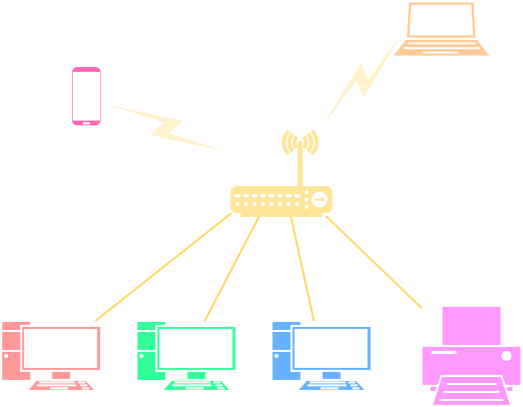

# Tổng quan về mạng máy tính

!!! abstract "Tóm lược nội dung"

    Bài này trình bày đôi nét về mạng máy tính, bao gồm:
    
    - So sánh một số điểm khác nhau giữa mạng LAN và mạng Internet.
    - Vai trò của mạng máy tính đối với xã hội.

## Mạng LAN

!!! note "Mạng LAN"

    Còn gọi là **mạng cục bộ**.
    
    Là hệ thống **kết nối các máy tính** và thiết bị thông minh trong một **phạm vi địa lý giới hạn**, chẳng hạn như gia đình, phòng máy tính, cơ quan, trường học, tòa nhà.

{width=50% loading=lazy}  
*Minh họa mạng LAN*

??? info "Lợi ích của mạng LAN"

    1. **Chia sẻ dữ liệu**

        Người dùng dễ dàng chia sẻ tập tin hoặc thư mục giữa các máy tính trong mạng.

    2. **Chia sẻ phần cứng:**

        Người dùng có thể sử dụng chung máy in, máy quét, ổ đĩa lưu trữ NAS, giúp tiết kiệm chi phí.

    3. **Quản lý và bảo mật**

        Quản trị viên dễ dàng phân quyền truy xuất dữ liệu và cài đặt phần mềm cho các máy tính trong mạng.

    4. **Chia sẻ kết nối Internet:**

        Nhiều thiết bị có thể cùng truy cập Internet thông qua một đường truyền chung.

---

## Mạng WAN và Internet

!!! note "Mạng WAN"

    Còn gọi là **mạng diện rộng**.

    Là hệ thống **kết nối các thiết bị và các mạng LAN** ở **khoảng cách xa** về mặt địa lý, có phạm vi bao phủ rộng lớn, chẳng hạn như tỉnh thành hoặc quốc gia.

!!! note "Internet"

    Là ví dụ **điển hình** và quy mô nhất của mạng diện rộng.
    
    Internet là **mạng của các mạng** trên phạm vi toàn cầu, kết nối hàng tỷ máy tính và thiết bị thông minh thuộc nhiều chủng loại khác nhau.

    <iframe style="width: 100%; height: 360px" frameBorder=0 src="/grade-10/topic-B/images/internet.html">Minh họa mạng Internet</iframe>
    
<em>Minh họa một góc nhỏ của  mạng Internet (Hình được lấy từ <a href="https://www.drawio.com/" target="_blank">drawio.com</a>)</em>

??? info "Sở hữu Internet"

    Mặc dù một phần nào đó của Internet có thể được quản lý bởi một công ty, một tổ chức hoặc một quốc gia, nhưng về cơ bản, Internet là công cộng mà bất kỳ ai cũng có thể truy cập vào, với những quyền nhất định nào đó.

---

## So sánh LAN và Internet

Bảng dưới đây thể hiện một số điểm khác nhau giữa mạng LAN và mạng Internet.

| Đặc điểm | Mạng LAN | Mạng Internet |
| --- | --- | --- |
| **Phạm vi địa lý** | **Nhỏ**, thường dưới 1 kilometre. | **Toàn cầu**, phủ rộng khắp các quốc gia và lục địa. |
| **Tốc độ truyền dữ liệu** | **Rất cao**, thường từ 100 Mbps (megabit mỗi giây) đến 10 Gbps (gigabit mỗi giây). | **Thay đổi**, phụ thuộc vào gói cước nhà mạng và hạ tầng kết nối. |
| **Phương tiện truyền dẫn** | - Cáp **Ethernet** - Sóng **WiFi** | - Cáp **quang** trên mặt đất và dưới đại dương - Sóng 4G/5G - Sóng **vệ tinh** |
| **Quyền sở hữu** | Do một **cá nhân hoặc tổ chức** quản lý. | **Không thuộc sở hữu của riêng ai**, là không gian mạng công cộng do nhiều nhà mạng liên kết quản lý. |
| **Quản lý** | Được **chủ sở hữu** quản lý. | Được **các thực thể khác nhau** khác nhau quản lý, bao gồm các quốc gia, tổ chức, nhà mạng. |
| **Khả năng truy cập** | Chỉ những người trong cùng tổ chức mới được truy cập. | Bất kỳ ai cũng có thể truy cập. |
| **Ứng dụng** | Chủ yếu để chia sẻ dữ liệu nội bộ, dùng chung thiết bị và dùng chung đường truyền ra Internet. | Dùng để truy cập các website, các dịch vụ trực tuyến và giao tiếp với nhau khi cách biệt về địa lý. | 
| **Bảo mật** | Thường dễ bảo mật hơn. | Thách thức về bảo mật lớn hơn. |

??? info "ISP (Internet Service Provider)"

    Gọi đầy đủ là **nhà cung cấp dịch vụ Internet**, gọi tắt thông dụng là **nhà mạng**.    
    
    Là các tổ chức hoặc doanh nghiệp sở hữu hạ tầng viễn thông, chịu trách nhiệm **cung cấp đường truyền và giải pháp kỹ thuật** giúp các cá nhân và tổ chức kết nối thiết bị của mình vào mạng Internet toàn cầu.

    Các ISP phổ biến tại Việt Nam bao gồm:
    
    - VNPT
    - Viettel
    - FPT
    - CMC Telecom
    - NetNam
    - SCTV
    - SPT (Saigon Postel)
    - Hanoi Telecom

---

## Vai trò của mạng máy tính đối với xã hội

Sự phát triển của mạng máy tính đã mang lại những thay đổi sâu sắc trong phương thức học tập, mô hình làm việc và chất lượng cuộc sống của con người.

-   :material-school:{ .lg .middle } **Thay đổi phương thức học tập**
    
    - Lớp học thông minh, e-learning và các nền tảng học tập trực tuyến.
    - Học tập linh hoạt, mọi lúc mọi nơi, tăng cường khả năng tự học, tự nghiên cứu.

-   :material-briefcase-outline:{ .lg .middle } **Thay đổi mô hình làm việc**
    
    - Làm việc từ xa và tương tác theo thời gian thực.
    - Dùng chung tài nguyên, giúp tiết kiệm chi phí và tăng tốc độ xử lý công việc.
    - Mô hình kinh doanh mới, thúc đẩy giao dịch tài chính số, thương mại điện tử, phát triển nền kinh tế số.

-   :material-home-heart:{ .lg .middle } **Nâng cao chất lượng cuộc sống**
    
    - Kết nối và giao tiếp tức thời.
    - Chính phủ điện tử, dịch vụ công trực tuyến, khám chữa bệnh từ xa, nhà thông minh.
    - Các dịch vụ giải trí trực tuyến.

??? info "Thách thức từ Internet"

    Cùng với những lợi ích to lớn, sự phát triển của Internet cũng đặt ra nhiều thách thức cho cá nhân và xã hội:

    

    -   :material-incognito:{ .lg .middle } **Quyền riêng tư**
        
        - Thách thức: thông tin cá nhân bị thu thập trái phép, theo dõi hoặc phát tán ngoài ý muốn.
        - Hậu quả: bị quấy rối bởi cuộc gọi hoặc tin nhắn rác, lộ bí mật đời tư và tăng nguy cơ bị lừa đảo trực tuyến.

    -   :material-shield-alert:{ .lg .middle } **An toàn thông tin**
        
        - Thách thức: các cuộc tấn công mạng.
        - Hậu quả: thiệt hại về tài chính, thất thoát dữ liệu của cá nhân và tổ chức.

    -   :material-scale-unbalanced:{ .lg .middle } **Khoảng cách số**

        **Khoảng cách số** (digital divide) là **sự chênh lệch trong việc tiếp cận và sử dụng công nghệ số**, bao gồm thiết bị, hạ tầng Internet và kỹ năng số, giữa các cá nhân, cộng đồng hoặc lãnh thổ khác nhau, xuất phát từ các điều kiện kinh tế, xã hội và vị trí địa lý.

        - Thách thức: sự bất bình đẳng về hạ tầng mạng, thiết bị công nghệ và năng lực sử dụng công nghệ giữa các khu vực địa lý hoặc tầng lớp xã hội.
        - Hậu quả: tụt hậu về cơ hội học tập, cơ hội việc làm và sự phát triển nói chung.

    

    
---

## Sơ đồ tóm tắt

    <iframe style="width: 100%; height: 280px" frameBorder=0 src="/grade-10/topic-B/mindmaps/computer-network-a-simplified-overview.html">Sơ đồ tóm tắt</iframe>

---

## Some English words

| Vietnamese | Tiếng Anh | 
| --- | --- |
| chia sẻ, dùng chung | share |
| dịch vụ trực tuyến | online service |
| kết nối | connect |
| mạng cục bộ | local area network (LAN) |
| mạng diện rộng | wide area network (WAN) |
| nhà mạng | Internet Service Provider (ISP) | 
