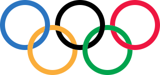

# Vẽ vòng tròn Olympic

!!! abstract "Tóm lược nội dung"

    Bài này hướng dẫn cách vẽ biểu tượng Olympic gồm 5 vòng tròn lồng vào nhau.  
    Các thao tác đề cập:  

    - Nhập tọa độ **X** và **Y** cho đối tượng
    - Nhân đôi đối tượng bằng **Ctrl+D**
    - Nhập mã màu bằng bảng **Fill and Stroke**
    - **Difference** và **Intersection**
    - Tách đối tượng ra nhiều phần bằng lệnh **Break Apart**

## Bước 1. Vẽ hai hình tròn đồng tâm

1. Vẽ hình tròn xám:
    - **Fill**: màu xám
    - **Stroke**: không màu
    - **Width** và **Height**: 100

2. Vẽ hình tròn cam:
    - **Fill**: màu cam
    - **Stroke**: không màu
    - **Width** và **Height**: 80

3. Đặt hình tròn cam nằm trên hình tròn xám và đồng tâm bằng các nút lệnh trong **Align and Distribute**. Kết quả như hình 1.

    { width=480 loading=lazy}

    Hình 1. Hai hình tròn đồng tâm

## Bước 2. Tạo vòng tròn Olympic đầu tiên

1. Quét chọn cả hai hình tròn.
2. Chọn menu **Path**.
3. Chọn mục **Difference** (1) để tạo vòng tròn Olympic.
    { .annotate }

    1. **Difference** dùng để lấy phần hiệu của hai đối tượng, là phần còn lại sau khi đã xóa phần giao.

    { width=480 loading=lazy}

    Hình 2a. Thao tác Difference

    { width=480 loading=lazy}

    Hình 2b. Vòng tròn Olympic đầu tiên   

## Bước 3. Tạo các vòng tròn Olympic còn lại

1. Chọn vòng tròn đầu tiên vừa tạo.
2. Nhấn ++ctrl+d++ bốn lần để sao chép ra bốn vòng tròn khác.
3. Kéo các vòng tròn đến các vị trí bất kỳ, tách rời nhau để dễ quan sát.
4. Lần lượt nhập tọa độ của các vòng tròn như sau:

    - Vòng tròn 1: (**X**: 0, **Y**: 0)
    - Vòng tròn 2: (110, 0)
    - Vòng tròn 3: (220, 0)
    - Vòng tròn 4: (55, 50)
    - Vòng tròn 5: (165, 50)

    { width=600 loading=lazy}

    Hình 3. Vị trí đúng của các vòng tròn

!!! note "Ghi chú"

    Việc tính toán tọa độ chủ yếu dựa trên kích thước của mỗi vòng tròn, cụ thể ở đây, đường kính là 100 và độ dày của phần viền là 10.  

    Hệ trục tọa độ gồm: gốc tọa độ nằm ở góc trên bên trái của trang vẽ, Ox hướng sang phải và Oy hướng xuống. (Khác với lý thuyết trong môn Toán là Oy hướng lên.)  

    Ta cũng có thể căn chỉnh một cách tương đối bằng các nút lệnh trong **Align and Distribute**.

## Bước 4. Tô màu

1. Click chọn vòng tròn 1.
2. Chọn menu **Object**.
3. Chọn mục **Fill and Stroke**.

    { width=360 loading=lazy}
    
    Hình 4a. Thao tác Fill and Stroke

4. Điền mã màu vào mục **RGBA**: #2b75c1

    { width=300 loading=lazy}
    
    Hình 4b. Thao tác điền mã màu RGBA

5. Thực hiện tương tự cho 4 vòng tròn còn lại:
    - Vòng tròn 2: #000000
    - Vòng tròn 3: #ee1641
    - Vòng tròn 4: #faad3a
    - Vòng tròn 5: #00a34d

    { width=600 loading=lazy}
    
    Hình 4c. Các vòng tròn sau khi tô màu

## Bước 5. Móc các vòng tròn vào nhau

1. Chọn vòng tròn xanh dương và vòng tròn vàng.
2. Nhấn ++ctrl+d++ để sao chép hai vòng tròn này, để chúng không bị mất trong thao tác tiếp theo.
3. Chọn menu **Path**.
4. Chọn mục **Intersection** để lấy ra phần giao của hai vòng tròn.

    { width=720 loading=lazy}
    
    Hình 5a. Thao tác lấy phần giao

5. Chọn màu xanh lá để làm nổi bật phần giao.
6. Chọn menu **Path**.
7. Chọn mục **Break Apart** để tách phần giao ra làm hai, tạm gọi là hai *hình thoi*.

    { width=720 loading=lazy}
    
    Hình 5b. Phần giao của hai vòng tròn

8. Chọn hình thoi bên dưới và vòng tròn xanh.
9. Chọn menu **Path**.
10. Chọn mục **Difference**. Lúc này, vòng tròn xanh sẽ nằm dưới vòng tròn vàng.

    { width=480 loading=lazy}
    
    Hình 5c. Vòng tròn xanh nằm dưới vòng tròn vàng

11. Chọn hình thoi còn lại và vòng tròn vàng. Thực hiện lại bước 9 và bước 10, để vòng tròn vàng nằm dưới vòng tròn xanh.

    { width=360 loading=lazy}
    
    Hình 5d. Vòng tròn vàng năm dưới vòng tròn xanh

12. Lặp lại các bước từ 1 đến 11 cho các cặp còn lại, ta sẽ được biểu tượng Olympic hoàn chỉnh.

    {loading=lazy}
    
    Hình 5e. Kết quả cuối cùng

## Tải bản vẽ hoàn chỉnh

Bản vẽ hoàn chỉnh đặt tại [Google Drive](https://drive.google.com/file/d/1drwTezgk2Zv0iGbFFXUxIQ9cXpqGz2GW/view?usp=sharing){:target="_blank"}.

## Some English words

| Vietnamese | Tiếng Anh | 
| --- | --- |
| lấy phần giao | intersection |
| lấy phần không giao | difference |
| tác rời các phần | break apart |