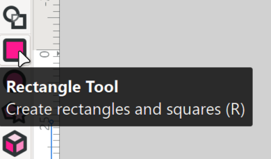
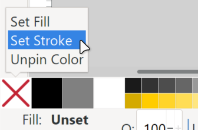
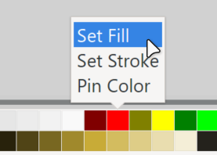
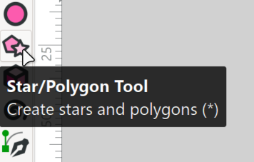
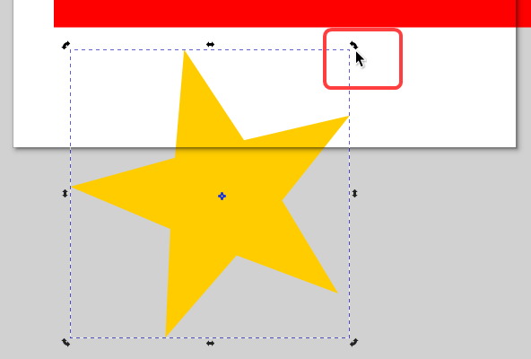
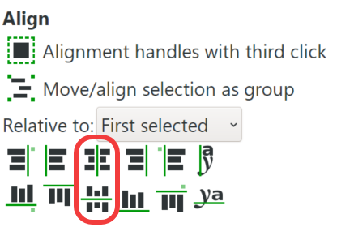
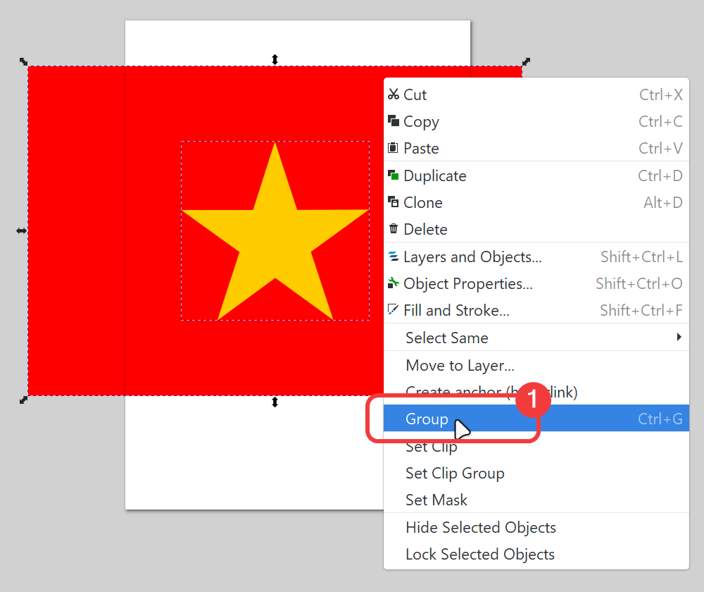
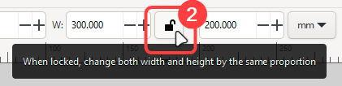

# Vẽ cờ Tổ quốc bằng Inkscape

!!! abstract "Tóm lược nội dung"

    Bài này hướng dẫn các thao tác cơ bản trong Inkscape để tạo hình quốc kỳ, bao gồm:

    - Tạo và lưu tập tin đồ họa vector.
    - Vẽ và thiết lập kích thước cho hình chữ nhật và hình ngôi sao.
    - Thiết lập màu nền và màu đường viền.
    - Căn chỉnh đối tượng bằng công cụ **Align and Distribute**.
    
## Tạo và lưu tập tin

1. **Tạo tập tin mới**

    Chọn menu **File** > **New**.

2. **Lưu tập tin**

    Chọn menu **File** > **Save As...**.

    Trong hộp thoại lưu tập tin:

    - Chọn ổ đĩa và thư mục để lưu.
    - **File name**: nhập tên tập tin là `vietnam-flag`.
    - **Save as type**: giữ nguyên phần tên mở rộng mặc định **Inkscape SVG (`*.svg`)**.
    - Bấm nút **Save**.

---

## Vẽ lá cờ

1. **Chọn công cụ vẽ hình chữ nhật**

    Trên thanh công cụ bên cạnh trái, chọn **Rectangle Tool** (hoặc bấm phím ++r++).

    {width=50% loading=lazy}

2. **Loại bỏ đường viền**

    Trong bảng màu ở cạnh dưới, click phải vào ô màu trong suốt (ô có dấu **X**) > chọn **Set stroke**. 

    {width=50% loading=lazy}

3. **Tạo màu nền đỏ**

    Trong bảng màu, click chuột phải vào ô màu đỏ > chọn **Set fill**.

    {width=50% loading=lazy}

4. **Vẽ hình chữ nhật**

    Kéo chuột để vẽ hình chữ nhật bất kỳ.

5. **Thiết lập kích thước**

    - Nhập chiều rộng **W** (Width): `300`.
    - Nhập chiều cao **H** (Height): `200`.

    {width=50% loading=lazy}

    Ghi chú:  
    Sau khi chỉnh kích thước, hình chữ nhật có thể lớn hơn khung trang giấy. Điều này hoàn toàn bình thường trong đồ họa vector và không ảnh hưởng đến nội dung bài vẽ.

---

## Vẽ ngôi sao

1. **Bỏ chọn hình chữ nhật**

    Chỉ cần click chuột ra vùng trống.

2. **Chọn công cụ vẽ hình ngôi sao**

    Trên thanh công cụ bên cạnh trái, chọn **Star/Polygon Tool**.

    {width=50% loading=lazy}

3. **Vẽ ngôi sao**

    Kéo chuột để vẽ ngôi sao bất kỳ.

    Lưu ý:  
    Ngôi sao lúc này có thể bị lệch nghiêng, sẽ được điều chỉnh sau.

4. **Tạo dáng cho ngôi sao**

    Để làm thẳng các cánh sao, nhập thông số **Spoke ratio**: `0.38` (1).
    { .annotate }

    1.  Gọi $r, R$ lần lượt là bán kính trong và bán kính ngoài của ngôi sao.
    
        Tỷ lệ chuẩn giữa hai bán kính này theo *"công thức vàng"* là: $\frac{r}{R} = \frac{1}{\varphi^2}$

        Trong đó: $\varphi = \frac{1 + \sqrt{5}}{2} \simeq 1.618$

        Suy ra: $\frac{r}{R} = \frac{1}{1.618^2} \simeq 0.381982$

        Vậy ta có thể làm tròn $r \simeq 0.38 R$.

    { width=50% loading=lazy}

5. **Xoay ngôi sao**

    Click chuột lần thứ hai vào ngôi sao (1), rồi rê chuột ở góc để xoay lại cho ngay.
    { .annotate }

    1. Trong Inkscape, có hai chế độ chọn đối tượng:

        - Click lần thứ nhất: hiện các mũi tên hẳng dùng để thay đổi kích thước.
        - Click lần thứ hai: hiện các mũi tên cong dùng để xoay.

    {width=50% loading=lazy}

6. **Thiết lập kích thước**

    Nhập kích thước cho ngôi sao:

    - Nhập chiều rộng **W**: `114`
    - Nhập chiều cao **H**: `108.5` (1)
        { .annotate }

        1.  Cơ sở tính toán kích thước ngôi sao:

            Lá cờ có chiều dài $3a = 300$ và chiều rộng $2a = 200$. 

            Bán kính đường tròn ngoại tiếp ngôi sao là $R = \frac{3a}{5} = 60$.
            
            Dựa theo các công thức lượng giác, ta có:
            
            - Chiều rộng: $W = 2R \cdot \sin(72^\circ) \approx 114$
            - Chiều cao: $H = R \cdot (1 + \cos(36^\circ)) \approx 108.5$

---

## Đặt ngôi sao vào giữa lá cờ

1. **Chọn cả hai đối tượng**

    - Click chọn lá cờ.
    - Nhấn giữ phím ++shift++ và click chọn ngôi sao.

2. **Căn giữa ngôi sao trên lá cờ**

    - Chọn menu **Object** > Chọn mục **Align and Distribute...**
    - Trong bảng thông số bên phải, mục **Relative to**: chọn `First selected`, nghĩa là căn chỉnh theo đối tượng được chọn đầu tiên, ở đây là lá cờ.
    - Nhấn lần lượt hai nút: căn giữa theo trục đứng và căn giữa theo trục ngang.

    {width=50% loading=lazy}

---

## Gom nhóm và khóa tỷ lệ các đối tượng

1. **Gom nhóm**

    Trong khi vẫn đang chọn lá cờ và ngôi sao, click phải > chọn **Group** để gom cả hai thành một khối duy nhất.

    {width=50% loading=lazy}

2. **Khóa tỷ lệ**

    Trên thanh thuộc tính, click nút hình **ổ khóa** để khóa tỷ lệ chiều rộng và chiều cao.

    {width=50% loading=lazy}

3. **Thay đổi kích thước**

    Trong ô độ rộng **W**, nhập `150` để thu nhỏ.
    
    Chiều cao **H** sẽ tự động thu nhỏ tương ứng thành `100` mà không bị méo hình.

4. **Lưu tập tin**

    Nhấn ++ctrl+s++ để lưu tập tin. Kết thúc.

    Lưu ý:  
    Nên thường xuyên lưu bài trong quá trình vẽ.

---

## Bản vẽ mẫu

Bản vẽ hoàn chỉnh được đặt tại [GitHub](https://github.com/vtchitruong/gdpt-2018/blob/main/grade-10/topic-e/vietnam-flag.svg){:target="_blank"}.

---

## Some English words

| Vietnamese | Tiếng Anh | 
| --- | --- |
| căn chỉnh (các đối tượng) | align (objects) |
| chiều cao | height |
| chiều rộng | width |
| chọn màu đường viền | set strike |
| chọn màu nền | set fill |
| gom nhóm | group |