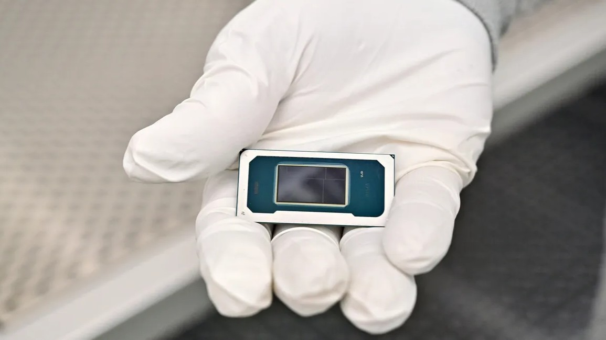
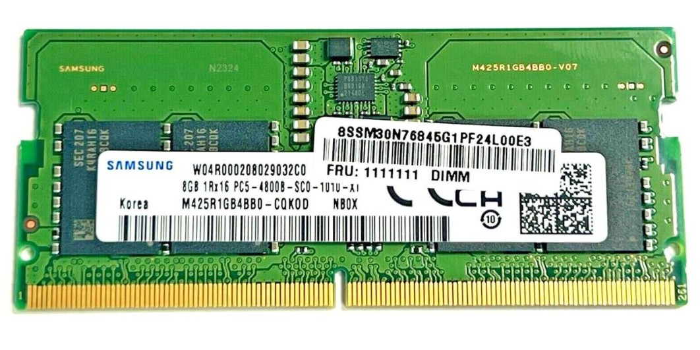
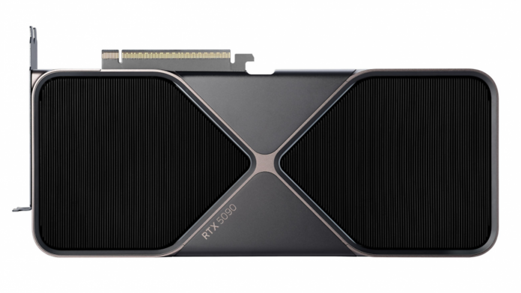
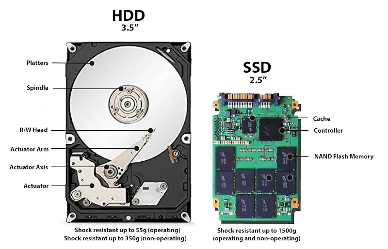

# Phần cứng bên trong

!!! abstract "Tóm lược nội dung"

    Bài này trình bày một số thành phần phần cứng bên trong của máy tính.

## Khái quát

!!! note "Phần cứng"

    Là toàn bộ các **thiết bị vật lý** cấu thành nên hệ thống máy tính. 

Đây là những bộ phận hữu hình mà ta có thể cầm hoặc chạm vô được. Chúng có thể được chia thành hai nhóm:

- Phần cứng bên trong
- Phần cứng bên ngoài

!!! note "Phần cứng bên trong"

    Là các linh kiện **nằm bên trong thùng máy** (case), **gắn trực tiếp lên bo mạch chủ** hoặc các khe cắm mở rộng.

    Là các **thiết bị cốt lõi** quyết định năng lực xử lý, lưu trữ và vận hành của hệ thống.

---

## CPU

{width=75% loading=lazy}  
*Hình: CPU Intel Core Ultra X9*

-   :material-cpu-64-bit:{ .lg .middle } **Đặc điểm và chức năng chính**
    
    - Còn gọi là **bộ xử lý trung tâm**.
    - Là **"bộ não" của máy tính**
    
        Chịu trách nhiệm thực thi các chỉ thị (1) từ hệ điều hành và phần mềm.
        { .annotate }

        1. **Chỉ thị** là một dãy bit nhị phân mà CPU trực tiếp đọc và thực hiện.
    
    - Có năng lực **xử lý đa nhiệm**
    
        Hỗ trợ nhiều nhân (core) và nhiều luồng (thread), cho phép xử lý đồng thời nhiều công việc.

-   :material-speedometer:{ .lg .middle } **Đơn vị đo**
    
    **GHz** (gigahertz)  
    Là đơn vị đo **tần số xung nhịp** trong một giây. Xung nhịp càng cao, tốc độ xử lý mỗi nhân càng nhanh.

    ??? info "Đơn vị đo khác"

        - **Số nhân và số luồng** (core, thread)
        
            Là đơn vị đo năng lực xử lý song song nhiều tác vụ cùng lúc.
            
            Ví dụ:  
            8 nhân 16 luồng
        
        - **MB** (megabyte)
        
            Là đơn vị đo dung lượng bộ nhớ đệm (cache). Đây là bộ nhớ tích hợp bên trong CPU giúp giảm thời gian chờ khi truy xuất RAM.

---

## RAM

{width=75% loading=lazy}  
*Hình: RAM Samsung 8 GB*

-   :material-memory:{ .lg .middle } **Đặc điểm và chức năng chính**
    
    - Còn gọi là **bộ nhớ truy xuất ngẫu nhiên**.
    - **Lưu trữ tạm thời**
    
        Lưu trữ dữ liệu và chương trình mà CPU đang trực tiếp xử lý. Toàn bộ dữ liệu sẽ **mất hết khi tắt máy** hoặc mất điện.
    
    - **Quyền truy xuất**
    
        Cho phép CPU **đọc và ghi** dữ liệu nhanh ở bất kỳ ô nhớ nào với thời gian ngang nhau.
    
    - **Mở rộng không gian làm việc:**
    
        Dung lượng RAM lớn giúp máy tính mở được nhiều ứng dụng cùng lúc mà không bị giật hay chậm trễ.

-   :material-gauge:{ .lg .middle } **Đơn vị đo**
    
    **GB** (gigabyte)  
    Là **đơn vị đo dung lượng**, cho biết lượng dữ liệu và chương trình mà máy tính có thể lưu trữ tạm thời để CPU truy cập cùng lúc.
        
    Ví dụ:  
    8 GB, 16 GB, 32 GB, 64 GB

    ??? info "Đơn vị đo khác"

        - **MT/s** (megatransfers per second)
        
            Là đơn vị đo tốc độ truyền tải dữ liệu giữa RAM và CPU.
            
            Ví dụ:  
            RAM DDR5 5600 nghĩa là RAM này có tốc độ truyền dữ liệu là 5600 triệu lần mỗi giây.
        
        - **Độ trễ** (CAS latency)

            Là khoảng thời gian từ khi CPU gửi yêu cầu đến khi RAM phản hồi. Độ trễ càng nhỏ thì càng tốt.

---

## ROM

-   :material-chip:{ .lg .middle } **Đặc điểm và chức năng chính**
    
    - Còn gọi là **bộ nhớ chỉ đọc**.
    - **Lưu trữ lâu dài**
    
        Dữ liệu được nhà sản xuất ghi sẵn và **không bị mất đi** khi tắt máy hoặc mất điện.

    - **Lưu trữ chương trình khởi động**
    
        Chứa các lệnh cấp thấp, chẳng hạn như **BIOS** hoặc **UEFI**, để kiểm tra phần cứng và nạp hệ điều hành khi bật máy.
    
    - **Quyền truy xuất**
    
        **Chỉ cho phép đọc** dữ liệu trong quá trình vận hành bình thường. Người dùng không thể ghi đè bằng thao tác thông thường.

-   :material-database-clock:{ .lg .middle } **Đơn vị đo**
    
    **MB** (megabyte)  
    Là **đơn vị đo dung lượng**. ROM chỉ chứa các mã lệnh khởi động nhẹ nên dung lượng rất nhỏ, thường từ 8 MB đến 64 MB.

    ??? info "Đơn vị đo khác"

        - **ns** (nano-giây) 
        
            Là thời gian truy xuất bộ nhớ, cho biết khoảng thời gian CPU cần để đọc dữ liệu từ chip ROM trong quá trình khởi động hệ thống.

??? info "Sự nhập nhằng của thuật ngữ ROM giữa máy tính để bàn và điện thoại thông minh"
    
    Đối với điện thoại thông minh, cái gọi là "ROM" thể hiện trên website của một số đại lý phân phối là do thói quen dùng sai thuật ngữ.

    Nó nên được gọi là *"bộ nhớ trong"* hoặc *"thiết bị lưu trữ bên trong"*.
    
    Thực chất, nó là bộ nhớ flash, bao gồm hai phần:
    
    - Một phần dùng để lưu trữ hệ điều hành, người dùng không dễ chỉnh sửa được.
    - Phần còn lại dành cho dữ liệu và ứng dụng của người dùng, có thể tuỳ nghi lưu trữ hoặc cài đặt.

---

## GPU

{width=75% loading=lazy}  
*Hình: GPU RTX 5090 của NVIDIA*

-   :material-expansion-card:{ .lg .middle } **Đặc điểm và chức năng chính**
    
    - Còn gọi là **bộ xử lý đồ họa**.
    - **Chuyên biệt hóa xử lý hình ảnh**
    
        Đảm nhận các phép tính hình học phức tạp để xuất hình ảnh, video, đồ họa 3D và giao diện người dùng.
    
    - **Cấu trúc tính toán song song**
    
        Chứa hàng nghìn nhân xử lý nhỏ hoạt động đồng thời, vượt trội hơn CPU trong các bài toán lặp lại.

    - **Tăng tốc AI**
    
        Được ứng dụng rộng rãi trong học máy, xử lý dữ liệu lớn và mô phỏng khoa học.

-   :material-chart-timeline-variant:{ .lg .middle } **Đơn vị đo**
    
    **TFLOPS** (Tera Floating Point Operations Per Second)  
    Là **đơn vị đo nghìn tỷ phép tính số thực** mà GPU thực hiện trong một giây.

    ??? info "Đơn vị đo khác"

        - **GB** (gigabyte)
        
            Dung lượng VRAM (GB):** Bộ nhớ đồ họa chuyên dụng dùng để lưu trữ kết cấu (textures), mô hình 3D và khung hình hiển thị.
        
        - **Số nhân xử lý** (CUDA core, stream processor)
        
            Số lượng lõi tính toán song song tích hợp bên trong GPU.

---

## Thiết bị lưu trữ

{width=75% loading=lazy}  
*Hình: HDD và SSD*

-   :material-harddisk:{ .lg .middle } **Đặc điểm và chức năng chính**
    
    - **Lưu trữ lâu dài**
    
        Dùng để lưu trữ hệ điều hành, phần mềm ứng dụng và các tập tin của người dùng một cách lâu dài.
    
    - **HDD**
    
        Là đĩa cứng cơ học, sử dụng **phiến đĩa quay có từ tính** và **đầu đọc cơ học**. Tốc độ truy xuất chậm hơn SSD.

    - **SSD**
    
        Là đĩa cứng thể rắn, sử dụng **chip nhớ flash**, không có bộ phận chuyển động. Tốc độ truy xuất rất nhanh, chống sốc tốt.

-   :material-transfer:{ .lg .middle } **Đơn vị đo**
    
    **GB** (gigabyte) và **TB** (terabyte)  
    Là **đơn vị đo dung lương**, cho biết khả năng chứa dữ liệu.
        
    Hiện nay, các đĩa cứng có dung lượng phổ biến từ 256 GB đến vài TB.
    
    ??? info "Đơn vị đo khác"

        - **MB/s** và **GB/s** (megabyte và gigabyte trên mỗi giây)
        
            Là đơn vị đo tốc độ đọc/ghi, cho biết lượng dữ liệu di chuyển trong một giây.
            
            Ví dụ:  
            HDD đạt ~150 MB/s.  
            SSD NVMe đạt từ 3500 MB/s đến 7000 MB/s.
        
        - **IOPS** (Số thao tác vào/ra mỗi giây)
        
            Là đơn vị đo khả năng xử lý các tập tin nhỏ ngẫu nhiên của ổ cứng.

??? info "Dữ liệu trong thiết bị lưu trữ không thực sự bị xóa mất"

    Khi ta thực hiện xóa, dữ liệu không lập tức bị mất đi khỏi thiết bị lưu trữ, mà hệ điều hành chỉ xóa đường dẫn tham chiếu đến dữ liệu đó trong bảng chỉ mục và đánh dấu vùng nhớ tương ứng là *"trống"* để sẵn sàng cho việc ghi dữ liệu mới. Chừng nào vùng nhớ đó chưa bị dữ liệu mới ghi đè lên, dữ liệu cũ vẫn có khả năng được khôi phục.

    Để thực sự xóa dữ liệu vĩnh viễn và ngăn chặn hoàn toàn khả năng truy hồi, ta có các cách sau:

    1. **Ghi đè dữ liệu**
    
        Sử dụng phần mềm chuyên dụng để ghi đè các dãy số ngẫu nhiên hoặc số 0 lên toàn bộ vùng nhớ chứa dữ liệu cần xóa, và thường thực hiện nhiều lần.

    2. **Xóa khóa mã hóa**
    
        Mã hóa toàn bộ dữ liệu trước khi lưu trữ. Khi cần xóa, hệ thống sẽ tiêu hủy khóa giải mã, khiến dữ liệu trở thành dãy bit ngẫu nhiên không thể đọc được.

    3. **Phá hủy thiết bị về mặt vật lý**
    
        Tiêu hủy hoàn toàn thiết bị lưu trữ bằng cách đập nát, băm nhỏ, khử từ tính hoặc đốt cháy để không thể khôi phục hay sửa chữa.

---

## Sơ đồ tóm tắt

    <iframe style="width: 100%; height: 360px" frameBorder=0 src="/grade-11/topic-A2/mindmaps/internal-hardwares.html">Sơ đồ tóm tắt</iframe>

---

## Some English words

| Vietnamese | Tiếng Anh | 
| --- | --- |
| cổng | port |
| chỉ thị | instruction |
| bộ nhớ truy xuất ngẫu nhiên | Random Access Memory (RAM) |
| bộ nhớ chỉ đọc (chỉ cho phép đọc) | Read-Only Memory (ROM) |
| bộ xử lý trung tâm | Central Processing Unit (CPU) |
| bộ xử lý đồ họa | Graphics Processing Unit (GPU) |
| đĩa cứng thể rắn | solid-state drive |
| đĩa cứng ổ quay truyền thống | hard disk drive |
| đĩa quang học | optical disc |
| thùng máy, vỏ máy | case |
| phần cứng bên ngoài | external hardware |
| phần cứng bên trong | internal hardware |
| thiết bị lưu trữ | storage device |