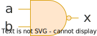

# Cổng logic

!!! abstract "Tóm lược nội dung"

    Bài này trình bày một số cổng logic.

## Khái niệm

**Cổng logic** là mạch điện tử dùng để thực hiện các biến đổi logic trên các tín hiệu nhị phân.

Mỗi cổng logic có:

- Một hoặc nhiều **đầu vào**
- Một **đầu ra** duy nhất

Các cổng logic đóng vai trò quan trọng trong việc vận hành của một hệ thống kỹ thuật số như máy tính hoặc bộ vi điều khiển (microcontroller), đồng thời là nền tảng cho lĩnh vực điện toán và điện tử trong các thao tác xử lý dữ liệu nhị phân.

Người ta kết hợp các cổng logic theo nhiều cách khác nhau để thực hiện các chức năng kỹ thuật số phức tạp.

## Một số cổng logic phổ biến

### Cổng NOT

Cổng NOT có một đầu vào và một đầu ra, dùng để đảo ngược tín hiệu đầu vào, từ `0` thành `1` hoặc ngược lại.  

Ký hiệu:  

Bảng chân trị:

| a | x |
| --- | --- |
| 0 | 1 |
| 1 | 0 |

### Cổng AND

Cổng AND có hai đầu vào và một đầu ra, tạo ra tín hiệu `1` khi cả hai đầu vào đều là `1`.  

Ký hiệu:  

Bảng chân trị:

| a | b | x |
| --- | --- | --- |
| 0 | 0 | 0 |
| 0 | 1 | 0 |
| 1 | 0 | 0 |
| 1 | 1 | 1 |

### Cổng OR

Cổng OR có hai đầu vào và một đầu ra, tạo ra tín hiệu `1` khi có ít nhất một đầu vào là `1`.  

Ký hiệu:  

Bảng chân trị:

| a | b | x |
| --- | --- | --- |
| 0 | 0 | 0 |
| 0 | 1 | 1 |
| 1 | 0 | 1 |
| 1 | 1 | 1 |

### Cổng XOR

Cổng XOR có hai đầu vào và một đầu ra, tạo ra tín hiệu `1` khi số đầu vào `1` là số lẻ.

Ký hiệu:  

Bảng chân trị:

| a | b | x |
| --- | --- | --- |
| 0 | 0 | 0 |
| 0 | 1 | 1 |
| 1 | 0 | 1 |
| 1 | 1 | 0 |

### Cổng NAND

Cổng NAND là kết hợp cổng AND và cổng NOT, tạo ra kết quả đảo ngược của cổng AND.   

Ký hiệu:  

Bảng chân trị:

| a | b | x |
| --- | --- | --- |
| 0 | 0 | 1 |
| 0 | 1 | 1 |
| 1 | 0 | 1 |
| 1 | 1 | 0 |

### Cổng NOR

Cổng NOR là kết hợp cổng OR và cổng NOT, tạo ra kết quả đảo ngược của cổng OR.   

Ký hiệu:  

Bảng chân trị:

| a | b | x |
| --- | --- | --- |
| 0 | 0 | 1 |
| 0 | 1 | 0 |
| 1 | 0 | 0 |
| 1 | 1 | 0 |

## Sơ đồ tóm tắt

    <iframe style="width: 100%; height: 360px" frameBorder=0 src="../mindmaps/logic-gates.html">Sơ đồ tóm tắt</iframe>

## Some English words

| Vietnamese | Tiếng Anh | 
| --- | --- |
| cổng logic | logic gate |
| mạch điện tử | circuit |