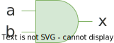
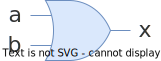
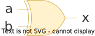
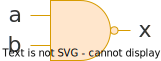
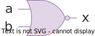

---
markmap:
    colorFreezeLevel: 2
    maxWidth: 300
    color:
        - grey
        - '#c36e6a'
        - '#82b366'
        - '#6c8ebf'
        - '#d6b656'
        - '#d79b00'
        - '#9673a6'
---

# Cổng logic

## Cổng NOT
- Output là đảo ngược của input.
- 

## Cổng AND
- Output `1` khi cả hai input đều là `1`.
- 

## Cổng OR
- Output `1` khi có ít nhất một input là `1`.
- 

## Cổng XOR
- Output `1` khi số input `1` là số lẻ.
- 

## Cổng NAND
- Output là đảo ngược của cổng AND.  
- 

## Cổng NOR
- Output là đảo ngược của cổng OR.  
- 
