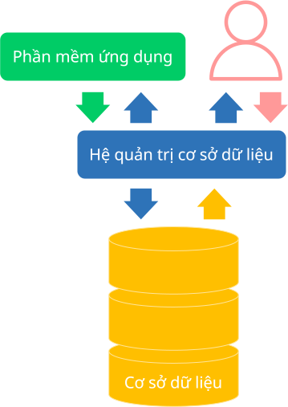

# Overview of databases

!!! abstract "Content summary"

    This lesson introduces the key concepts of:
    - Databases
    - Database Management Systems
    - Database Systems

## Database

### Concept

A **database** is a **collection of data** that is **organized and stored** in a way that makes searching, processing, and managing data more efficient.

Databases are commonly used to handle large amounts of data for individuals and organizations across many different fields.

### Properties

1. **Structured**

    **Structured** means the data is organized and stored in a **specific format**.

    Example:  
    Data can be arranged in tables, where both rows and columns follow predefined rules.

2. **Consistency**

    **Consistency** is part of accuracy and reliability. Specifically, during updates, data must be kept **free of errors, contradictions, or conflicts**.

    Example:  
    When student Tèo transfers from class 11A to 11D, the data in both classes — and all related records — must be updated correctly so there are no inconsistencies, such as:

    - Tèo appearing in both class lists.
    - Competition results still being counted for 11A when they should be for 11D.

3. **Integrity**

    **Integrity** means the data is **correct, reliable**, and consistent. Before being saved, data must follow rules and constraints to ensure it is valid and free from **"garbage"** (invalid) data.

    Example:  
    Test scores must be between 0 and 10. If a user enters 11 and the database allows it, integrity is violated.

4. **Security**

    **Security** refers to **controlling access** to the database to prevent unauthorized access tampering or invalid changes.

    Example:  
    A teacher should not be allowed to edit grades for classes they do not teach.

## Database management system

### Concept

A **database management system**, abbreviated as **DBMS**, is **software** that helps users **store, manage, process, and query** databases.

Examples:  
Some popular DBMSs in use today include:

- Oracle
- MySQL
- Microsoft SQL Server
- PostgreSQL
- MongoDB

### Functions

The DBMS acts as an **intermediary between application software and the database**, providing **efficient and secure** ways to interact with and control data. Its main functions are:

1. **Data storage**

    Manages **physical data storage**, including:

    - How data is stored on disk
    - File organization
    - Indexing (1)
        { .annotate }

        1.  **Indexing** is the process of creating special data structures called indexes to speed up data retrieval.

            With an index, searching becomes much faster because the system can locate the needed data without scanning the entire table.

2. **Data retrieval**

    Allows data to be searched using query languages, such as SQL.

3. **Data processing**

    Enables adding, updating, and deleting data while maintaining consistency and integrity of the database.

    Additionally, a DBMS provides other important features, such as:

    - Data security
    - Data integrity enforcement
    - Concurrent access control
    - Transaction management
    - Backup and recovery
    - Query optimization
    - Statistics, analysis, and reporting
    - Multi-user support
    - and more...

## Database system

A **database system** consists of:

- The database
- The database management system
- Application software

{ loading=lazy width=300 }

*Components of a database system*

Even though the DBMS exists, **application software** is still developed to make it **easier and more convenient** for users to interact with the database.

## Summary mindmap

    <iframe style="width: 100%; height: 360px" frameBorder=0 src="/grade-11/topic-F1/mindmaps/database-a-simplified-overview.html">Sơ đồ tóm tắt</iframe>

## Some English words

| Vietnamese | Tiếng Anh | 
| --- | --- |
| cơ sở dữ liệu | database |
| hệ cơ sở dữ liệu | database system |
| hệ quản trị cơ sở dữ liệu | database management system (DBMS) |
| phần mềm ứng dụng | application software |