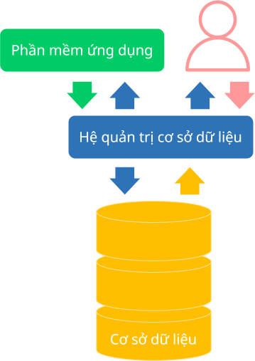

# Khái quát về cơ sở dữ liệu

## Cơ sở dữ liệu

### Khái niệm

**Cơ sở dữ liệu** là một tập hợp dữ liệu được tổ chức và lưu trữ sao cho việc tìm kiếm, xử lý và quản lý dữ liệu trở nên hiệu quả hơn.

Cơ sở dữ liệu được sử dụng để lưu trữ và quản lý một lượng lớn dữ liệu của cá nhân và tổ chức trong nhiều lĩnh vực khác nhau.  

### Tính chất

#### Tính cấu trúc

Dữ liệu **có cấu trúc** nghĩa là dữ liệu được tổ chức và lưu trữ theo một định dạng nhất định.

Ví dụ:  
Dữ liệu được tổ chức thành các bảng gồm nhiều hàng và nhiều cột, trong đó hàng và cột đều tuân theo những quy ước đặt ra ban đầu.

#### Tính nhất quán

**Nhất quán** Là một phần của tính chính xác và tin cậy của dữ liệu. Cụ thể, trong quá trình cập nhật, dữ liệu phải được bảo đảm không có lỗi, không sai lệch hay mâu thuẫn. 

Ví dụ:  
Khi bạn Tèo chuyển từ lớp 11A sang lớp 11D, thì dữ liệu của hai lớp này và dữ liệu liên quan đến Tèo đều phải được cập nhật sao cho không xảy ra những mâu thuẫn như: cả hai lớp đều có dữ liệu về Tèo, hoặc kết quả thi đua vẫn tính cho lớp 11A mà lẽ ra phải tính cho lớp 11D.

#### Tính toàn vẹn

**Toàn vẹn** là tính đúng đắn, tin cậy và bao gồm cả tính nhất quán của dữ liệu. Cụ thể, trước khi chính thức được lưu vào cơ sở dữ liệu, dữ liệu phải tuân theo các quy định và ràng buộc để bảo đảm luôn đúng đắn, không có dữ liệu "*rác*".

Ví dụ:  
Điểm số bài kiểm tra có giá trị từ 0 đến 10. Nếu người dùng nhập vào 11 điểm mà cơ sở dữ liệu vẫn cho phép lưu, thì vi phạm tính toàn vẹn.

#### Tính an toàn

**An toàn** là khả năng kiểm soát các truy xuất vào cơ sở dữ liệu nhằm bảo đảm không có truy xuất trái phép, giả mạo và ngăn chặn các thay đổi không hợp lệ đối với dữ liệu.

## Hệ quản trị cơ sở dữ liệu

### Khái niệm

**Hệ quản trị cơ sở dữ liệu** (viết tắt là DBMS) là phần mềm giúp ngườoi dùng lưu trữ, quản lý, xử lý và truy vấn dữ liệu trong cơ sở dữ liệu.  

Ví dụ:

Một số hệ quản trị cơ sở dữ liệu phổ biến hiện nay:  

- Oracle
- MySQL
- Microsoft SQL Server
- PostgreSQL
- MongoDB

### Chức năng

DBMS đóng vai trò trung gian giữa phần mềm ứng dụng và cơ sở dữ liệu, cung cấp cách thức hiệu quả và an toàn để tương tác và kiểm soát dữ liệu. Cụ thể như sau:  

#### Lưu trữ dữ liệu

Quản lý việc lưu trữ dữ liệu về mặt vật lý, trong đó có cách thức dữ liệu lưu trên đĩa, tổ chức dữ liệu theo tập tin và indexing dữ liệu (1).
{ .annotate }

1.  **Indexing** là quá trình tạo ra các cấu trúc dữ liệu đặc biệt, được gọi là index (chỉ mục), để tăng tốc độ truy xuất dữ liệu trong cơ sở dữ liệu. Khi một cơ sở dữ liệu có chỉ mục, việc tìm kiếm thông tin sẽ diễn ra nhanh hơn rất nhiều vì chỉ mục cho phép xác định vị trí của dữ liệu cần tìm mà không phải duyệt qua toàn bộ bảng dữ liệu.

#### Tìm kiếm dữ liệu

DBMS giúp người dùng và phần mềm ứng dụng tìm kiếm dữ liệu thông qua các ngôn ngữ truy vấn dữ liệu, chẳng hạn như SQL.

#### Xử lý dữ liệu

DBMS giúp người dùng thêm, cập nhật và xóa dữ liệu mà vẫn bảo đảm tính nhất quán và tính toàn vẹn của cơ sở dữ liệu. 

Ngoài ra, DBMS còn cung cấp những chức năng khác như:

- Bảo đảm an toàn dữ liệu
- Bảo đảm tính toàn vẹn dữ liệu
- Kiểm soát các truy xuất đồng thời
- Quản lý giao tác
- Sao lưu và khôi phục
- Tối ưu hóa truy vấn
- Thống kê, phân tích và báo cáo
- Hỗ trợ đa người dùng
- v.v...

## Hệ cơ sở dữ liệu

Hệ cơ sở dữ liệu là hệ thống gồm có:

- Cơ sở dữ liệu
- Hệ quản trị cơ sở dữ liệu
- Phần mềm ứng dụng

{ loading=lazy width=300 }

*Các thành phần trong một hệ cơ sở dữ liệu*

Mặc dù đã có hệ quản trị cơ sở dữ liệu, phần mềm ứng dụng vẫn được tạo ra nhằm giúp người dùng dễ dàng và thuận tiện hơn trong các thao tác với cơ sở dữ liệu.

## Sơ đồ tóm tắt nội dung

{!grade-11/topic-F1/database-a-simplified-overview.mm.md!}
*Sơ đồ tóm tắt về hệ cơ sở dữ liệu*

## Some English words

| Vietnamese | Tiếng Anh | 
| --- | --- |
| cơ sở dữ liệu | database |
| hệ quản trị cơ sở dữ liệu | database management system (DBMS) |
| phần mềm ứng dụng | application |