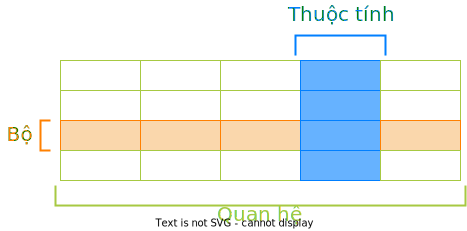
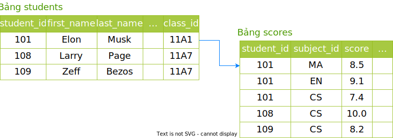

# Cơ sở dữ liệu quan hệ

!!! abstract "Tóm lược nội dung"

    Bài này trình bày những khái niệm liên quan đến mô hình cơ sở dữ liệu quan hệ, chủ yếu ở cách gọi tên và nhận biết những đối tượng liên quan.

## Khái niệm

Mô hình dữ liệu quan hệ được nhà khoa học người Mỹ gốc Anh đề xuất vào năm 1970. Mô hình này đã trở thành một trong những mô hình dữ liệu được sử dụng phổ biến nhất trong nhiều thập kỷ qua, từ những hệ thống nhỏ cho đến những doanh nghiệp quy mô lớn. 

!!! note "Cơ sở dữ liệu quan hệ"

    **Cơ sở dữ liệu quan hệ** lưu trữ và tổ chức dữ liệu theo dạng bảng, gồm hàng và cột.

Một số hệ quản trị có hỗ trợ cơ sở dữ liệu quan hệ là:  

- Oracle
- Microsoft SQL Server
- Microsoft Access
- MySQL
- Microsoft
- PostgreSQL
- IBM Db2
- SQLite
- v.v...

## Những thuật ngữ liên quan

Cơ sở dữ liệu quan hệ có những thuật ngữ và khái niệm sau:

### Quan hệ

Mỗi **bảng** là một **quan hệ**.

!!! note "Quan hệ"
    Một quan hệ là một bảng.  
    Và dữ liệu trong các quan hệ có... *mối quan hệ* với nhau.

Ví dụ 1:  

Một cơ sở dữ liệu trường học có những quan hệ sau:

- Quan hệ `students` là bảng dữ liệu về học sinh.
- Quan hệ `subjects` là bảng dữ liệu về môn học.
- Quan hệ 'scores' là bảng dữ liệu về điểm số.

### Bộ

Mỗi **hàng** trong bảng là một **bộ**, hoặc cách gọi khác là **mẫu tin**, **bản ghi**.

!!! note "Bộ"
    Mỗi bộ là một tập hợp dữ liệu về một thực thể.

Ví dụ 2:

- Trong quan hệ `students`, mỗi hàng là một bộ chứa dữ liệu mô tả một bạn học sinh.
- Trong quan hệ `learning`, mỗi hàng là một bộ chứa dữ liệu mô tả học sinh H học môn M và đạt điểm D.

### Thuộc tính

Mỗi **cột** trong bảng là một **thuộc tính**, hoặc cách gọi khác là **trường**.

!!! note "Thuộc tính"
    Mỗi thuộc tính đều được xác định **kiểu dữ liệu** và **miền giá trị**.

    Miền giá trị là tập hợp các giá trị được cho phép của thuộc tính đó.

Ví dụ 3:  
Trong quan hệ `students`, các thuộc tính có thể có là: `student_id`, `last_name`, `first_name`, `gender`, `birth_date`, `birth_place`, v.v...  
Miền giá trị của thuộc tính `gender` là tập hợp gồm hai giá trị là 0 và 1, biểu thị cho nam và nữ.

<figure markdown>
  {loading=lazy}  
  <figcaption>Hình 1. Minh họa quan hệ, thuộc tính và bộ</figcaption>  
</figure>

### Khóa chính

Trong cùng một quan hệ, không thể có hai bộ trùng nhau hoàn toàn trên mọi thuộc tính. Người ta đặt ra khái niệm **khóa chính** để phân biệt các bộ với nhau.

!!! note "Khóa chính"
    **Khóa chính** của một quan hệ là tập hợp gồm một hoặc nhiều thuộc tính dùng để xác định một bộ là duy nhất, không trùng với bộ khác trong cùng quan hệ. 

Ví dụ 4:  
Trong quan hệ `students`, nếu hai học sinh là anh em sinh đôi, thì dữ liệu có thể trùng nhau ở các thuộc tính như `gender`, `birth_date`, `birth_place`, v.v..., thậm chí là `last_name` và `first_name`.

Việc này khiến cho hai bộ bị trùng nhau.

Để khắc phục, ta chọn `student_id` làm khóa chính, vì thuộc tính này giúp phân biệt các bộ với nhau. Nói cách khác, hai anh em song sinh có thể trùng nhau ở những dữ liệu khác, nhưng mỗi người có *mã số học sinh* khác nhau.

### Khóa ngoại

**Khóa ngoại** của một quan hệ là một thuộc tính được dùng để tạo *mối quan hệ* với quan hệ (bảng) khác.

!!! note "Khóa ngoại"
    *Mối quan hệ* giữa hai quan hệ (bảng) được thể hiện bằng liên kết giữa khóa ngoại của bảng này và khóa chính của bảng kia.  

Ví dụ 5:

Cơ sở dữ liệu trường học còn có một bảng khác là `classrooms`. Bảng này có khóa chính là thuộc tính `class_id` (mã lớp).
    
Bảng `students` có một thuộc tính cũng mang tên là `class_id`, cho biết một học sinh đang ở lớp nào.

Theo đó, `class_id` của bảng `students` là khóa ngoại, được liên kết tới khóa chính `class_id` của bảng `classrooms`.

## Cơ sở dữ liệu quan hệ minh họa

Ví dụ 6:

Cơ sở dữ liệu trường học bao gồm hai quan hệ được thể hiện theo lược đồ và hình 1 dưới đây.

- students(<ins>**student_id**</ins>, first_name, last_name, ..., class_id)
- scores(<ins>**student_id, subject_id**</ins>, score)

<figure markdown>
  {loading=lazy}  
  <figcaption>Hình 2. Một phần cơ sở dữ liệu trường học</figcaption>  
</figure>

Trong đó:

Quan hệ `students`:

- Có nhiều hơn 4 thuộc tính.
- Khóa chính là thuộc tính `student_id`.
- Có 3 bộ trên hình.

Quan hệ `scores`:

- Có nhiều hơn 3 thuộc tính.
- Khóa chính gồm 2 thuộc tính là `student_id` và `subject_id`.
- Có 5 bộ trên hình.
- Khóa ngoại là thuộc tính `student_id`, được liên kết với `student_id` của quan hệ `students`.

## Sơ đồ tóm tắt nội dung

{!grade-11/topic-F1/database/relational-database.mm.md!}
Hình 3. Sơ đồ phân loại phần mềm

## Some English words

| Vietnamese | Tiếng Anh | 
| --- | --- |
| bộ | tuple |
| khóa chính | primary key |
| khóa ngoại | foreign key |
| mối quan hệ | relationship |
| quan hệ (bảng) | relation |
| thuộc tính | attribute |