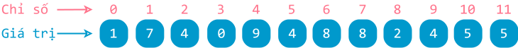

# One-dimensional arrays

!!! abstract "Content summary"

    This lesson covers the general concepts of arrays, with a focus on one-dimensional arrays.

## Overview of arrays

### Problem statement

When managing the computer science grades for a class of 30 students, declaring 30 separate variables feels pretty impractical. Just look at how clunky this declaration code gets: [^1]

[^1]: This introductory problem is similar to the [`list` data structure`](../../grade-10/topic-F/list.en.md){target="_blank"} lesson from grade 10.

```py
hs1 = 10
hs2 = 9
hs3 = 9.5 
.
.
.
hs29 = 9.1
hs30 = 9.4
```

If there were even more students — say, 500 across the whole grade — declaring each variable one by one would be completely impossible.

Fortunately, programming languages provide data structures that make handling grade lists like this much easier, and one of the key ones is the **array**.

### Concept

An **array** is a data structure used to store and process a **collection of elements**, where:

- The elements are usually **stored consecutively** in memory.
- The **number of elements**, also called the **length** of the array, is **fixed** (finite).
- Each element consists of two parts: an **index** and a **value**.
    - The **index** is the position of the element in the array.
    - The **values** of the elements are usually of the **same data type** (all integers, all floating-point numbers, etc.).

Arrays are commonly used to solve problems involving multiple related values of the same type.

Examples:

- Computer science grades of students in a class.
- Time measurements recorded during physics experiments.

!!! info "More details about arrays"

    1. Conceptually, array elements are stored **consecutively** in memory. However, in practice:
       - **Static** and **dynamic arrays** still store elements next to each other.
       - But in other similar data structures (like linked lists), elements may be **scattered** across memory.

    2. In **traditional** programming languages like **C** or **Java**, all elements in an array **must be of the same data type**.

       In contrast, modern languages like **JavaScript**, **Ruby**, or **Python** allow arrays (or similar structures) to hold elements of **different data types**.

### Classification

Arrays are classified by **dimension** into the following types:

- One-dimensional arrays
- Two-dimensional arrays
- Multi-dimensional arrays

This lesson focuses **only on one-dimensional arrays**.

## One-dimensional arrays

### Concept

Real-life examples of a one-dimensional array:

- A row of classrooms
- A row of seats in a movie theater

One-dimensional arrays are useful when working with:

- A sequence of numbers
- A single row or column in a table

The **index** (or **position**) of elements usually starts from **0**.

{loading=lazy}

*Illustration of one-dimensional array A*

### One-dimensional arrays in Python

In Python, arrays can be represented using the `list` data structure or the `array` module.

However, since `list` was already covered in the grade 10 curriculum (1), arrays in grade 11 will no longer use `list`. Instead, these lessons will use the open-source library **[numpy](https://numpy.org/){target="_blank"}**.
{ .annotate }

1.  and `array` still has some limitations

Using `numpy` will focus only on basic operations, and it does not change the main goal: teaching and learning algorithmic ideas.

!!! info "The numpy library"

    Key advantages of the `numpy` library include:

    - Contiguous storage and uniform data types, enabling O(1) access time — very fast.
    - Vectorized operations: process entire arrays at once, making it tens to hundreds of times faster than `for` loops on `list`.
    - Built-in math functions for statistics, linear algebra, and more.
    - Widely used worldwide in data science, AI, physics, and engineering.

### Installing the numpy library

Before using it, you need to install the `numpy` library using the `pip` command.

**For Visual Studio Code:**

1. Open the **Terminal** (or **PowerShell**, or **Command Prompt**) using the shortcut ++ctrl+grave++ (the key to the left of ++1++).

   Or go to the menu: **View** > **Terminal**.

2. In the Terminal window, type the following command:

   ```pycon
   pip install numpy
   ```

**For Google Colab**

1. In any code cell, enter this command:

    ```pycon
    !pip install numpy
    ```

2. Run the cell. If you see output similar to this, installation was successful:

    ```pycon
    Requirement already satisfied: numpy in /usr/local/lib/python3.11/dist-packages (1.26.4)
    ```

    Now you can start writing code in another cell.

### Importing the library

At the beginning of your program, import the `numpy` library using the `import` statement. By convention, we use `np` as the short name for `numpy`.

```py linenums="1"
import numpy as np
```

### Initialization  

To create a one-dimensional array, we use the `array()` function from `numpy`.

The elements are listed inside square brackets `[ ]` and separated by commas `,`.

Example:  
Line 5 creates a one-dimensional array `A` by listing its elements.

```py linenums="1" hl_lines="5"
import numpy as np

if __name__ == '__main__':
    # Khởi tạo mảng A
    A = np.array([1, 7, 4, 0, 9, 4, 8, 8, 2, 4, 5, 5])

    # In mảng
    print(f'Mảng A: {A}') # (1)!
```
{ .annotate }

1.  `f'...'` is Python's **f-string** (formatted string literal) syntax, used to display the value of the variable `A`.

    Inside an f-string, anything within `{}` is replaced with its actual value.

Running the code above gives the following output:

```pycon
Mảng A: [1 7 4 0 9 4 8 8 2 4 5 5]
```

To create a one-dimensional array with all elements having the same value, we use the `full()` function from `numpy`.

Example:  
Line 11 creates an array `zeros` with eight elements, all equal to `0`.

```py linenums="10" hl_lines="11"
    # Khởi tạo mảng zeros gồm tám phần tử đều mang giá trị 0
    zeros = np.full(8, 0)

    # In mảng
    print(f'Mảng zeros: {zeros}')
```

Running the code above gives the following output:

```pycon
Mảng zeros: [0 0 0 0 0 0 0 0]
```

### Accessing elements  

Each element is accessed using its **index**, placed inside square brackets `[ ]`.

The first element has index `0`, and the last element has index `len(array) - 1`.

Example:  
Lines 8 and 11 print the first and last elements of array `A`.


```py linenums="1" hl_lines="8 11"
import numpy as np

if __name__ == '__main__':
    # Khởi tạo mảng A
    A = np.array([1, 7, 4, 0, 9, 4, 8, 8, 2, 4, 5, 5])

    # In ra phần tử đầu tiên
    print(f'Phần tử đầu tiên: {A[0]}')

    # In ra phần tử cuối cùng
    print(f'Phần tử cuối cùng: {A[len(A) - 1]}')
```

Running the code above gives the following output:

```pycon
Phần tử đầu tiên: 1
Phần tử cuối cùng: 5
```

Example:  
Line 14 causes an error because array `A` does not have an element with index `12`.

```py linenums="13" hl_lines="14"
    # Chương trình báo lỗi vì không có chỉ số 12 trong mảng A
    print(f'Phần tử có chỉ số 12: {A[12]}')
```

Running the code above produces an error message similar to the following:

```pycon
IndexError                                Traceback (most recent call last)
/tmp/ipython-input-2733226203.py in <cell line: 0>()
     12 
     13     # Chương trình báo lỗi vì không có chỉ số 12 trong mảng A
---> 14     print(f'Phần tử có chỉ số 12: {A[12]}')

IndexError: index 12 is out of bounds for axis 0 with size 12
```

### Traversing the array  

In many problems, array elements are processed in a similar way. That’s why we often use a loop to traverse the array.

Example:  
Lines 8 and 9 loop through the array to print each element from start to end — one element per line.

```py linenums="1" hl_lines="8 9"
import numpy as np

if __name__ == '__main__':
    # Khởi tạo mảng A
    A = np.array([1, 7, 4, 0, 9, 4, 8, 8, 2, 4, 5, 5])

    # In ra các phần tử trên từng dòng
    for i in range(len(A)):
        print(f'A[{i}] = {A[i]}')
```

Running the code above gives the following output:

```pycon
A[0] = 1
A[1] = 7
A[2] = 4
A[3] = 0
A[4] = 9
A[5] = 4
A[6] = 8
A[7] = 8
A[8] = 2
A[10] = 5
A[11] = 5
```

Example:  
Lines 12 and 13 traverse the array to print the elements from the end back to the start, all on thesame line.

```py linenums="1" hl_lines="12 13"
import numpy as np

if __name__ == '__main__':
    # Khởi tạo mảng A
    A = np.array([1, 7, 4, 0, 9, 4, 8, 8, 2, 4, 5, 5])

    # In ra các phần tử trên từng dòng
    for i in range(len(A)):
        print(f'A[{i}] = {A[i]}')

    # In ra các phần tử theo thứ tự từ cuối ngược về đầu
    for i in range(len(A) - 1, -1, -1):
        print(A[i], end=' ') # (1)!
```
{ .annotate }

1.  The `end` parameter of the `print()` function defaults to `'\n'`, which means a new line after each printed element.

    Setting `end=' '` prints a space after each element instead.

Running the code above gives the following output:

```pycon
5 5 4 2 8 8 4 9 0 4 7 1
```

## Source code

The complete code is available at:

- [Google Colab](https://colab.research.google.com/drive/1pq2-LFJ9I8U52pmCXqe9BMo-aeLyAPAN?usp=sharing){target="_blank"}

## Summary mindmap

<div>
    <iframe style="width: 100%; height: 500px" frameBorder=0 src="/grade-11/topic-F2/mindmaps/array-1d.html">Sơ đồ tóm tắt</iframe>
</div>

## Some English words

| Vietnamese | Tiếng Anh | 
| --- | --- |
| chỉ số (của phần tử) | index |
| đánh chỉ số từ 0 | zero-based indexing |
| giá trị (của phần tử) | value |
| mảng một chiều | one-dimensional array |
| phần tử | element, item |
| vị trí | position |