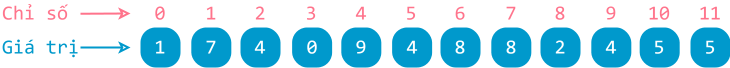

# Mảng một chiều

!!! abstract "Tóm lược nội dung"

    Bài này trình bày những khái niệm chung về mảng và trình bày riêng về mảng một chiều.

## Đặt vấn đề

Vấn đề liên quan đã được nêu ra trong bài [Kiểu dữ liệu list](../../grade-10/topic-F/list.md){:target="_blank"}, và hầu hết các ngôn ngữ lập trình đều có những *kiểu dữ liệu* giúp lưu trữ và xử lý tập hợp gồm nhiều phần tử.  

## Khái quát về mảng

**Mảng** là cấu trúc dữ liệu dùng để lưu trữ và xử lý tập hợp các phần tử, trong đó:

- Các phần tử được lữu trữ liên tiếp nhau trên bộ nhớ.
- **Kích thước** của mảng là số lượng phần tử của mảng. Số phần tử là hữu hạn.
- Mỗi phần tử gồm có hai yếu tố: **giá trị** và **chỉ số**.
    - Mỗi phần tử được truy xuất thông qua chỉ số của nó.
    - Giá trị của các phần tử đều cùng kiểu dữ liệu.

Mảng thường được dùng để giải quyết những bài toán có nhiều giá trị liên quan và cùng kiểu dữ liệu.

Ví dụ:

- Điểm số môn Tin học của các học sinh trong lớp.
- Dữ liệu thời gian ghi nhận được ở các lần đo trong thí nghiệm đo thời gian rơi của một vật.

??? note "Lưu ý"
    
    Về mặt khái niệm, các phần tử của một mảng được lưu trữ liên tiếp nhau trong bộ nhớ. Tuy nhiên, khác với những hệ thống trước đây, một số kiến trúc máy tính hiện đại lưu trữ mảng phức tạp hơn, các phần tử có thể không thực sự nằm liên tiếp nhau trên bộ nhớ vật lý.

    Về mặt *truyền thống*, các phần tử của mảng phải có cùng kiểu dữ liệu. Tuy nhiên, vẫn một số ngôn ngữ như JavaScript, Ruby, Python cho phép mảng chứa các phần tử có kiểu dữ liệu khác nhau. 

Python không có kiểu dữ liệu mảng chuẩn như những ngôn ngữ *truyền thống* (C/C++, Java), mà thay vào đó là kiểu dữ liệu `list` linh hoạt hơn. Ta có thể sử dụng kiểu `list` để giải quyết những bài toán liên quan đến mảng. Các ví dụ trong bài này đều sử dụng `list` để minh họa mảng.

??? note "Về việc xử lý mảng trong Python"
    
    Mặc dù vậy, Python vẫn cung cấp một module tên là `array` giúp người dùng làm việc với mảng theo đúng nghĩa truyền thống.

    Một cách khác để làm việc với mảng là sử dụng thư viện [numpy](https://numpy.org/){target="_blank"}.

Phân loại theo **chiều**, các loại mảng gồm có: mảng một chiều, mảng hai chiều hoặc mảng đa chiều. Bài học này chỉ đề cập **mảng một chiều**.

## Mảng một chiều

Mảng một chiều có thể dùng để xử lý một dãy số, một hàng hoặc một cột nào đó trong bảng.

Chỉ số của các phần tử được đánh từ **0** hoặc từ **1**, tuỳ ngôn ngữ lập trình. Chỉ số còn có thể xem là **vị trí** của phần tử trong mảng.

Hình ảnh mảng một chiều trong thực tế:

- Dãy các phòng học
- Dãy ghế trong rạp chiếu phim

<figure markdown>
  {loading=lazy}
  <figcaption>Minh họa mảng một chiều A</figcaption>
</figure>


### Khởi tạo  

Kiểu `list` của Python cho phép khởi tạo mảng một chiều bằng cách liệt kê các phần tử trong cặp ngoặc vuông `[ ]` và phân cách nhau bằng dấu phẩy `,`.

Ví dụ 1:  
Khởi tạo mảng một chiều bằng cách liệt kê phần tử.

``` py linenums="1"
if __name__ == '__main__':
    # Mảng A gồm các phần tử là số nguyên
    A = [1, 7, 4, 0, 9, 4, 8, 8, 2, 4, 5, 5]
    print(A)
```

Output:
``` pycon
[1, 7, 4, 0, 9, 4, 8, 8, 2, 4, 5, 5]
```

Ví dụ 2:  
Khởi tạo mảng một chiều bằng toán tử `*`.

``` py linenums="1"
if __name__ == '__main__':
    # Mảng zero gồm 8 phần tử đều có giá trị 0
    zero_array = [0] * 8
    print(zero_array)
```

Output:
``` pycon
[0, 0, 0, 0, 0, 0, 0, 0]
```

Ví dụ 3:  
Khởi tạo mảng một chiều bằng cú pháp [list comprehension](https://peps.python.org/pep-0202/){:target="_blank"}.  

``` py linenums="1"
if __name__ == '__main__':
    # Mảng one gồm 8 phần tử đều có giá trị 1
    one_array = [1 for i in range(8)]
    print(one_array)
```

Output:
``` pycon
[1, 1, 1, 1, 1, 1, 1, 1]
```

!!! question "Câu hỏi 1"

    Bạn hãy viết dòng lệnh khai báo mảng `my_array` gồm `n` phần tử đều có giá trị 0 bằng list comprehension.  
    Biết rằng `n` là biến `int` đã được khai báo trước giá trị nào đó. 

    <div>
    <form id="answer-form">
        <label for="userInput_1">Lời giải của bạn:</label><br>
        <textarea id="userInput_1" name="userInput_1" required></textarea>
        <textarea id="solution_1">my_array = [0 for i in range(n)]</textarea><br>
        <button class="submitButton" type="button" onclick="process_answer('userInput_1', 'solution_1', 'appreciate_1')">Submit</button>
        <div id="appreciate_1"></div>
    </form>
    </div>

    ??? tip "Đáp án"

        ``` py linenums="1"
        my_array = [0 for i in range(n)]
        ```

### Truy xuất phần tử  

Mỗi phần tử của mảng một chiều được truy xuất thông qua chỉ số. Chỉ số được đặt trong cặp ngoặc vuông `[ ]`.

Phần tử đầu tiên có chỉ số là `0` và phần tử cuối cùng có chỉ số là `len(mảng) - 1`.

Ví dụ 4:  
In ra màn hình giá trị của một vài phần tử.


``` py linenums="1"
if __name__ == '__main__':
    # Mảng A gồm các phần tử là số nguyên
    A = [1, 7, 4, 0, 9, 4, 8, 8, 2, 4, 5, 5]

    # In ra phần tử đầu tiên
    print(A[0])
    
    # In ra phần tử cuối cùng
    print(A[11])

    # Chương trình báo lỗi vì không có chỉ số 12
    print(A[12])
```

Output:
``` pycon
1
5
---------------------------------------------------------------------------
IndexError                                Traceback (most recent call last)
<ipython-input-8-c722f47501c9> in <cell line: 1>()
     10 
     11     # Chương trình báo lỗi vì không có chỉ số 12
---> 12     print(A[12])

IndexError: list index out of range
```

!!! question "Câu hỏi 2"

    Cũng với mảng A của ví dụ 4, dòng lệnh `print(A[len(A) - 1])` sẽ in ra màn hình kết quả gì?

    <div>
    <form id="answer-form">
        <label for="userInput_2">Lời giải của bạn:</label><br>
        <textarea id="userInput_2" name="userInput_2" required></textarea>
        <textarea id="solution_2">8</textarea><br>
        <button class="submitButton" type="button" onclick="process_answer('userInput_2', 'solution_2', 'appreciate_2')">Submit</button>
        <div id="appreciate_2"></div>
    </form>
    </div>

    ??? tip "Đáp án"

        `len(A) - 1` là chỉ số của phần tử cuối cùng. Như vậy, kết quả in ra màn hình là 8.

### Duyệt mảng  

Trong nhiều bài toán, các phần tử của mảng đều được xử lý *một loạt* tương tự nhau, theo thứ tự từ phần tử đầu đến phần tử cuối. Do đó, ta thường sử dụng vòng lặp để duyệt mảng.  

Ví dụ 5:  
Duyệt mảng để in ra các phần tử từ đầu đến cuối.

``` py linenums="1"
if __name__ == '__main__':
    # Mảng A gồm các phần tử là số nguyên
    A = [1, 7, 4, 0, 9, 4, 8, 8, 2, 4, 5, 5]
    
    # In mỗi phần tử trên một dòng
    n = len(A)
    for i in range(n):
        print(A[i])
```

Output:
``` pycon
1
7
4
0
9
4
8
8
2
4
5
5
```

!!! question "Câu hỏi 3"

    Giả sử lớp có 5 học sinh và ta muốn cộng điểm cho cả lớp.  
    Gọi `scores` là mảng chứa điểm số của lớp: `scores = [9, 7, 9, 8, 8, 7]`.

    Bạn hãy viết vòng lặp for để cộng 1 điểm cho mỗi học sinh.

    <div>
    <form id="answer-form">
        <label for="userInput_3">Lời giải của bạn:</label><br>
        <textarea id="userInput_3" name="userInput_3" required></textarea>
        <textarea id="solution_3">for i in range(len(scores)):.newline.    scores[i] = scores[i] + 1</textarea><br>
        <button class="submitButton" type="button" onclick="process_answer('userInput_3', 'solution_3', 'appreciate_3')">Submit</button>
        <div id="appreciate_3"></div>
    </form>
    </div>

    ??? tip "Đáp án"

        ``` py linenums="1"
        for i in range(len(scores)):
            scores[i] = scores[i] + 1
        ```

Ví dụ 6:  
Duyệt mảng để in ra các phần tử từ cuối ngược về đầu.

``` py linenums="1"
if __name__ == '__main__':
    # Mảng A gồm các phần tử là số nguyên
    A = [1, 7, 4, 0, 9, 4, 8, 8, 2, 4, 5, 5]

    # In mảng theo thứ tự ngược, mỗi phần tử trên một dòng
    n = len(A)
    for i in range(n - 1, -1, -1):
        print(A[i])
```

Output:
``` pycon
5
5
4
2
8
8
4
9
0
4
7
1
```

!!! question "Câu hỏi 4"

    Nếu ta chỉnh sửa vòng lặp for của ví dụ 6 thành `for i in range(n - 2, 0, -1):` thì kết quả in ra màn hình gồm mấy phần tử?

    <div>
    <form id="answer-form">
        <label for="userInput_4">Lời giải của bạn:</label><br>
        <textarea id="userInput_4" name="userInput_4" required></textarea>
        <textarea id="solution_4">10</textarea><br>
        <button class="submitButton" type="button" onclick="process_answer('userInput_4', 'solution_4', 'appreciate_4')">Submit</button>
        <div id="appreciate_4"></div>
    </form>
    </div>

    ??? tip "Đáp án"

        Biến `i` chạy từ `n - 2` nghĩa là xuất phát từ phần tử áp cuối, và kết thúc tại phần tử trước `0`, cụ thể là `1`.

        Do đó, kết quả in ra màn hình gồm mười phần tử:
        
        ```pycon
        5
        4
        2
        8
        8
        4
        9
        0
        4
        7
        ```

## Sơ đồ tóm tắt nội dung

{!grade-11/topic-F2/array-1d.mm.md!}
*Sơ đồ tóm tắt mảng một chiều*

## Google Colab

Các đoạn mã trong bài này được đặt tại <a href="https://colab.research.google.com/drive/1EqTwaewXMPJOQvS2EawPPip_JO46PsEn?usp=sharing" target="_blank">Google Colab</a> để bạn có thể thử nghiệm theo cách của riêng mình.

## Some English words

| Vietnamese | Tiếng Anh | 
| --- | --- |
| chỉ số (của phần tử) | index |
| đánh chỉ số từ 0 | zero-based indexing |
| giá trị (của phần tử) | value |
| mảng một chiều | one-dimensional array |
| phần tử | element, item |