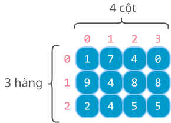

# Mảng hai chiều

!!! abstract "Tóm lược nội dung"

    Bài này trình bày những khái niệm về mảng hai chiều.

## Đặt vấn đề

Làm thế nào xử lý khi dữ liệu không phải là một dãy, mà là một bảng số liệu? 

## Khái quát về mảng

Tương tự [bài học trước](../topic-F2/array-1d.md/#khai-quat-ve-mang){:target="_blank"}, **mảng** là cấu trúc dữ liệu dùng để lưu trữ và xử lý tập hợp các phần tử.

Bài học này đề cập **mảng hai chiều** và cũng sử dụng thư viện `numpy` để viết chương trình minh hoạ.

## Mảng hai chiều

Hình ảnh của mảng hai chiều trong thực tế:

- Bàn cờ vua
- Bảng số Sudoku
- Bảng tính Excel

Mảng hai chiều có thể áp dụng khi xử lý dữ liệu có dạng:

- Bảng
- Lưới
- Ma trận

Trong mảng hai chiều, số phần tử của mỗi hàng ứng với số cột của mảng. Nói cách khác, các hàng đều có số phần tử hoặc số cột bằng nhau.

{loading=lazy}

*Minh họa mảng hai chiều A*

Mảng hai chiều có thể được xem là **mảng của các mảng**, nghĩa là, mỗi phần tử của mảng hai chiều là mảng một chiều.

!!! question "Hỏi chút chơi - phần 1"
    
    <div>
        <iframe style="width: 100%; height: 400px" frameBorder=0 src="../array-2d/quiz1.html">Hỏi chút chơi</iframe>
    </div>

### Khởi tạo  

Tương tự mảng một chiều, ta cũng dùng hàm `array()` của thư viện `numpy` để khởi tạo mảng hai chiều.

Các phần tử được liệt trong các cặp ngoặc vuông lồng nhau: `[[ ], [ ], ... ]`

Ví dụ:

**Yêu cầu:** Khởi tạo mảng hai chiều `A` bằng cách liệt kê phần tử.

```py linenums="1" hl_lines="5"
import numpy as np

if __name__ == '__main__':
    # Khởi tạo mảng hai chiều A gồm 12 phần tử là số nguyên
    A = np.array([[1, 7, 4, 0], [9, 4, 8, 8], [2, 4, 5, 5]])
    print(f'Mảng A:\n{A}') # (1)!
```
{ .annotate }

1.  `\n` là ký tự xuống dòng.

**Output:**

```pycon
Mảng A:
[[1 7 4 0]
 [9 4 8 8]
 [2 4 5 5]]
```

Để khởi tạo mảng hai chiều gồm các phần tử cùng giá trị, ta dùng hàm `full()` của thư viện `numpy`.

Ví dụ:

**Yêu cầu:** Khởi tạo mảng hai chiều `zeros` gồm 3 hàng, 4 cột và các phần tử đều có giá trị `0`.

```py linenums="8" hl_lines="4"
    # Khai báo mảng zeros gồm 3 hàng, 4 cột với các phần tử đều mang giá trị 0
    row_number = 3
    col_number = 4
    zeros = np.full((row_number, col_number), 0)
    print(f'Mảng zeros:\n{zeros}')
```

**Output:**

```pycon
Mảng zeros:
[[0 0 0 0]
 [0 0 0 0]
 [0 0 0 0]]
```

!!! question "Hỏi chút chơi - phần 2"
    
    <div>
        <iframe style="width: 100%; height: 400px" frameBorder=0 src="../array-2d/quiz2.html">Hỏi chút chơi</iframe>
    </div>

### Truy xuất phần tử  

Mỗi phần tử của mảng hai chiều được truy xuất bằng hai chỉ số, gồm **chỉ số hàng** và **chỉ số cột**, đặt trong hai cặp ngoặc vuông `[][]`, chỉ số hàng nằm trước, chỉ số cột nằm sau.

Ví dụ:

**Yêu cầu:** In ra màn hình giá trị của phần tử đầu tiên và phần tử nằm ở hàng 2, cột 3 của mảng A (cũng là phần tử cuối cùng).

```py linenums="14"
    # In ra phần tử đầu tiên của mảng A
    print(f'Phần tử đầu tiên của mảng A: {A[0][0]}')

    # In ra phần tử nằm ở hàng 2, cột 3 của mảng A
    print(f'Phần tử nằm ở hàng 2, cột 3 của mảng A: {A[2][3]}')
```

**Output:**

```pycon
Phần tử đầu tiên của mảng A: 1
Phần tử nằm ở hàng 2 cột 3 của mảng A: 5
```

!!! question "Hỏi chút chơi - phần 3"
    
    <div>
        <iframe style="width: 100%; height: 400px" frameBorder=0 src="../array-2d/quiz3.html">Hỏi chút chơi</iframe>
    </div>

Nếu xem mảng hai chiều `A` là mảng một chiều thì mỗi phần tử của `A` là một hàng.

Do đó, để lấy được số hàng của `A`, ta viết `len(A)`, nghĩa là độ dài của mảng một chiều `A`.

Mỗi hàng của mảng hai chiều `A` cũng là một mảng một chiều.

Do đó, để lấy được số cột của mảng `A`, ta dùng hàm `len()` với một hàng bất kỳ. Chẳng hạn: `len(A[0])`, nghĩa là độ dài của hàng đầu tiên.

Ví dụ:

**Yêu cầu:** In ra số hàng và số cột của mảng hai chiều A.

```py linenums="20"
    # In ra số hàng của mảng A
    A_row_number = len(A)
    print(f'Số hàng của mảng A: {A_row_number}')

    # In ra số cột của mảng A
    A_col_number = len(A[0])
    print(f'Số cột của mảng A: {A_col_number}')
```

**Output:**

```pycon
Số hàng của mảng A: 3
Số cột của mảng A: 4
```

!!! question "Hỏi chút chơi - phần 4"
    
    <div>
        <iframe style="width: 100%; height: 400px" frameBorder=0 src="../array-2d/quiz4.html">Hỏi chút chơi</iframe>
    </div>

### Duyệt mảng  

Khi duyệt mảng hai chiều, ta thường dùng hai vòng lặp lồng nhau:

- **Vòng lặp ngoài** dùng để duyệt các hàng.
- **Vòng lặp trong** dùng để duyệt các cột, tức các phần tử của hàng đang duyệt.

Ví dụ:

**Yêu cầu:** In mảng hai chiều theo dạng hàng và cột.

```py linenums="28"
    # Duyệt từng hàng của mảng A
    for r in range(A_row_number):
        # Duyệt từng cột của mảng A
        for c in range(A_col_number):
            # In ra giá trị của phần tử tại hàng r, cột c
            print(A[r][c], end=' ')
        
        # Xuống hàng tiếp theo
        print()
```

**Output:**

```pycon
1 7 4 0 
9 4 8 8 
2 4 5 5 
```

!!! question "Hỏi chút chơi - phần 5"
    
    <div>
        <iframe style="width: 100%; height: 400px" frameBorder=0 src="../array-2d/quiz5.html">Hỏi chút chơi</iframe>
    </div>

## Sơ đồ tóm tắt nội dung

{!grade-11/topic-F2/array-2d.mm.md!}
*Sơ đồ tóm tắt mảng hai chiều*

## Mã nguồn

Các đoạn mã trong bài được đặt tại:

1. [GitHub](https://github.com/vtchitruong/gdpt-2018/blob/main/g11/topic-f2/array-2-dimension-numpy.py){:target="_blank"}

2. [Google Colab](https://colab.research.google.com/drive/1M7LQMTxdGAOcC6tyqgz-1wE6mtlK5bXF?usp=sharing){:target="_blank"}

## Some English words

| Vietnamese | Tiếng Anh | 
| --- | --- |
| cột | column |
| hàng | row |
| mảng của mảng | array of arrays |
| mảng hai chiều | two-dimensional array |

## Bài tập thực hành

1. [Bài tập 2D-array-1](https://colab.research.google.com/drive/1TtnLVtu1H6N9bG6b23oo5PiWfukcks_p?usp=sharing){:target="_blank"}

2. *Chưa có*