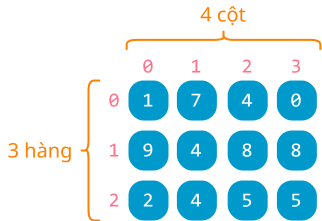

# Mảng hai chiều

!!! abstract "Tóm lược nội dung"

    Bài này trình bày những khái niệm liên quan đến mảng hai chiều.

## Đặt vấn đề

Làm thế nào xử lý khi dữ liệu không phải là một dãy, mà là một bảng?  

## Khái niệm

**Mảng hai chiều** dùng để lưu trữ và xử lý dữ liệu theo dạng **lưới**, **bảng** hoặc **ma trận**, gồm nhiều hàng và nhiều cột. Chẳng hạn, bàn cờ vua, bảng số Sudoku, bảng tính Excel là hình ảnh của mảng hai chiều.  

Trong mảng hai chiều, số phần tử của mỗi hàng ứng với số cột của mảng. Nói cách khác, các hàng đều có số phần tử bằng nhau, hoặc các hàng đều có số cột như nhau.  

<figure markdown>
  {loading=lazy}
  <figcaption>Hình 1. Minh họa mảng hai chiều B</figcaption>
</figure>

Mảng hai chiều có thể được xem là **mảng của các mảng**, nghĩa là, mảng chứa các phần tử mà mỗi phần tử là mảng một chiều.  

## Khởi tạo  

Tương tự mảng một chiều, kiểu `list` của Python cho phép khởi tạo bằng cách liệt kê phần tử hoặc [list comprehension](https://peps.python.org/pep-0202/){:target="_blank"}.  

Để liệt kê, ta sử dụng các cặp ngoặc vuông lồng nhau: `[[ ], [ ], ... ]`

Ví dụ 1:  
Khởi tạo mảng hai chiều bằng cách liệt kê phần tử.

``` py linenums="1"
# Mảng B gồm 3 hàng và 4 cột
B = [[1, 7, 4, 0], [9, 4, 8, 8], [2, 4, 5, 5]]
print(B)
```

Output:
``` pycon
[[1, 7, 4, 0], [9, 4, 8, 8], [2, 4, 5, 5]]
```

Ví dụ 2:  
Khởi tạo mảng hai chiều bằng cú pháp [list comprehension](https://peps.python.org/pep-0202/){:target="_blank"}.

``` py linenums="1"
# Mảng gồm 3 hàng và 4 cột chứa toàn các phần tử 0
rows = 3
cols = 4
zero_array = [[0 for c in range(cols)] for r in range(rows)]
print(zero_array)
```

Output:
``` pycon
[[0, 0, 0, 0], [0, 0, 0, 0], [0, 0, 0, 0]]
```

## Truy xuất phần tử  

Mỗi phần tử trong mảng hai chiều được truy xuất bằng hai chỉ số, gọi là **chỉ số hàng** và **chỉ số cột**.  

Chỉ số hàng và cột được đặt trong hai cặp ngoặc vuông `[][]`, chỉ số hàng nằm trước, chỉ số cột nằm sau.

Ví dụ 3:

``` py linenums="1"
B = [[1, 7, 4, 0], [9, 4, 8, 8], [2, 4, 5, 5]]

print(B[0][0])  # In ra phần tử đầu tiên
print(B[2][3])  # In ra phần tử cuối cùng
```

Output:
``` pycon
1
5
```

!!! question "Câu hỏi 1"

    Cũng với mảng `B` của ví dụ 3, dòng lệnh `print(B[1][2])` sẽ in ra màn hình kết quả gì?
    
    <div>
    <form id="answer-form">
        <label for="userInput_1">Lời giải của bạn:</label><br>
        <textarea id="userInput_1" name="userInput_1" required></textarea>
        <textarea id="solution_1">8</textarea><br>
        <button class="submitButton" type="button" onclick="process_answer('userInput_1', 'solution_1', 'appreciate_1')">Submit</button>
        <div id="appreciate_1"></div>
    </form>
    </div>

    ??? tip "Đáp án"

        `B[1][2]` là phần tử ở hàng giữa, có chỉ số cột là 2. Như vậy, kết quả in ra là 8.

Ví dụ 4:  
In ra số hàng và số cột của mảng hai chiều.

``` py linenums="1"
B = [[1, 7, 4, 0], [9, 4, 8, 8], [2, 4, 5, 5]]
print(len(B))     # In số hàng
print(len(B[0]))  # In số cột
```

Output:
``` pycon
3
4
```

!!! question "Câu hỏi 2"

    Cũng với mảng B của ví dụ 4, dòng lệnh `print(len(B[1])) ` sẽ in ra màn hình kết quả gì?

    <div>
    <form id="answer-form">
        <label for="userInput_2">Lời giải của bạn:</label><br>
        <textarea id="userInput_2" name="userInput_2" required></textarea>
        <textarea id="solution_2">4</textarea><br>
        <button class="submitButton" type="button" onclick="process_answer('userInput_2', 'solution_2', 'appreciate_2')">Submit</button>
        <div id="appreciate_2"></div>
    </form>
    </div>

    ??? tip "Đáp án"

        `B[1]` là hàng có chỉ số 1 của mảng B. Vì các hàng đều có số cột bằng nhau, nên lệnh `len(B[1])` là tương đương với `len(B[0])`.  
        Như vậy, kết quả in ra là 4.

## Duyệt mảng  

Khi duyệt mảng hai chiều, ta thường sử dụng hai vòng lặp lồng nhau:  
- *Vòng lặp ngoài* dùng để duyệt các hàng.  
- *Vòng lặp trong* dùng để duyệt các cột, tức các phần tử của hàng đang duyệt.  

Ví dụ 5:  
In mảng hai chiều theo dạng hàng và cột.

``` py linenums="1"
B = [[1, 7, 4, 0], [9, 4, 8, 8], [2, 4, 5, 5]]

rows = 3
cols = 4
for r in range(rows):            # Duyệt từ hàng đầu đến hàng cuối
    for c in range(cols):        # Ứng với mỗi hàng r, duyệt từ cột đầu đến cột cuối
        print(B[r][c], end=' ')  # In ra phần tử nằm ở hàng r và cột c, kết thúc là khoảng trắng
    print()  # Xuống dòng sau mỗi hàng
```

Output:
``` pycon
1 7 4 0 
9 4 8 8 
2 4 5 5 
```

!!! question "Câu hỏi 3"

    Bạn hãy chỉnh sửa các dòng lệnh của vòng lặp để in ra màn hình tất cả phần tử của mảng B trên cùng một dòng.

    <div>
    <form id="answer-form">
        <label for="userInput_3">Lời giải của bạn:</label><br>
        <textarea id="userInput_3" name="userInput_3" required></textarea>
        <textarea id="solution_3">for r in range(rows):.newline.    for c in range(cols):.newline.        print(B[r][c], end=' ')</textarea><br>
        <button class="submitButton" type="button" onclick="process_answer('userInput_3', 'solution_3', 'appreciate_3')">Submit</button>
        <div id="appreciate_3"></div>
    </form>
    </div>

    ??? tip "Đáp án"

        ``` py linenums="1"
        for r in range(rows):
            for c in range(cols):
                print(B[r][c], end=' ')
        ```

## Sơ đồ tóm tắt nội dung

{!grade-11/topic-F2/array-2d.mm.md!}
*Hình 2. Sơ đồ tóm tắt mảng hai chiều*

## Google Colab

Các đoạn mã trong bài này được đặt tại <a href="https://colab.research.google.com/drive/1jcgXcdZQWSuitaS-9cYGAup7sD77T75F?usp=sharing" target="_blank">Google Colab</a> để bạn có thể thử nghiệm theo cách của riêng mình.

## Some English words

| Vietnamese | Tiếng Anh | 
| --- | --- |
| cột | column |
| hàng | row |
| mảng của mảng | array of arrays |
| mảng hai chiều | two-dimensional array |