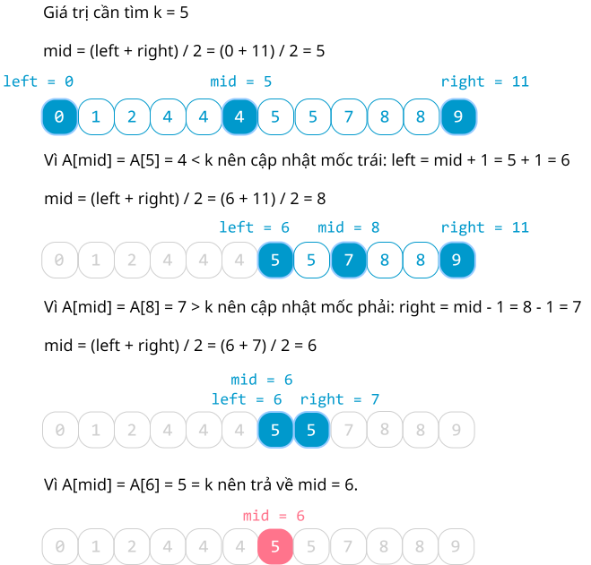
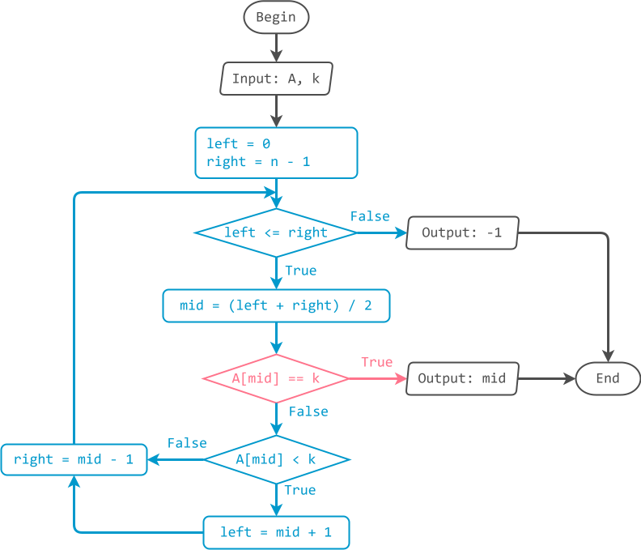

# Tìm kiếm nhị phân

!!! abstract "Tóm lược nội dung"

    Bài này trình bày thuật toán tìm kiếm nhị phân.

## Bài toán và thuật toán tìm kiếm

Tương tự [bài học trước](./linear-search.md#bai-toan-va-thuat-toan-tim-kiem){:target="_blank"}, ta chỉ xét bài toán đơn giản là tìm kiếm phần tử có tồn tại hay không trên mảng một chiều.

## Thuật toán tìm kiếm nhị phân

### Ý tưởng

Hãy tưởng tượng tình huống tìm một thuật ngữ bắt đầu bằng chữ cái T trong từ điển.

Vì các mục từ đều được sắp xếp theo thứ tự bảng chữ cái nên ta không cần lật tìm ở những trang có chữ cái đầu là A, B hay C, mà nên lật ngay đến trang có chữ cái đầu là T.

Áp dụng ý tưởng trên cho mảng, ta có thể thực hiện tìm kiếm nhị phân như sau:

1. Chia mảng lớn thành hai mảng con *trái* và *phải*.
2. Xét xem giá trị cần tìm nằm ở mảng con nào.

Lặp lại nhiều lần hai thao tác này cho đến khi tìm thấy hoặc không còn chia đôi mảng được nữa. Cụ thể như sau:

!!! note "Thuật toán tìm kiếm nhị phân"

    Đặt mốc trái `left` là `0`, tức vị trí đầu tiên của mảng `A`, và mốc phải `right` là `n - 1`, tức vị trí cuối của mảng `A`.

    Dùng vòng lặp while, trong khi mốc `left` vẫn chưa vượt quá mốc `right`, lặp các thao tác sau:
    
    - Xác định mốc giữa: `mid` = (`left` + `right`) / 2, lấy phần nguyên.
    - Nếu `A[mid]` bằng `k` thì trả về `mid`, đây chính là vị trí tìm thấy.
    - Nếu `A[mid]` nhỏ hơn `k` thì *dời* mốc trái: `left = mid + 1` để xét mảng con bên phải.
    - Nếu `A[mid]` lớn hơn `k` thì *dời* mốc phải: `right = mid - 1` để xét mảng con bên trái.

    Nếu mốc `left` vượt quá mốc `right` mà chưa có `mid` nào trả về, đồng nghĩa không có `A[mid]` nào bằng `k`, thì trả về `-1`.

        
    (`-1` là tín hiệu quy ước cho biết không tìm thấy, vì chỉ số của mảng bắt đầu từ `0`, không có chỉ số âm).

### Minh hoạ

<figure markdown="span">
{loading=lazy}
<figcaption>Tiến trình tìm kiếm nhị phân</figcaption>
</figure>

### Lưu đồ

{loading=lazy}

### Trực quan hoá

<div>
    <iframe width="100%" height="760px" frameBorder=0 src="../visualize/binary-search.html"></iframe>
</div>

### Viết chương trình

Khai báo thư viện `numpy`.

```py linenums="1"
import numpy as np
```

Viết hàm `binary_search()` để thực hiện thuật toán tìm kiếm nhị phân.

``` py linenums="4"
def binary_search(A, k):
    # Khởi tạo mốc trái và mốc phải
    left = 0
    right = len(A) - 1

    # Trong khi left chưa vượt quá right
    # thì xác định vị trí mid và so sánh A[mid] với k
    while left <= right:
        mid = (left + right) // 2

        if A[mid] == k:
            return mid
        elif A[mid] < k:
            left = mid + 1
        else:
            right = mid - 1

    # Trả về -1, không tìm thấy
    return -1
```

Trong chương trình chính, ta cho người dùng nhập giá trị cần tìm, rồi gọi hàm `binary_search()` ra thực hiện tìm kiếm.

Dựa vào kết quả trả về của hàm `binary_search()`, ta viết mã lệnh thông báo tìm thấy hoặc không tìm thấy.

```py linenums="25"
# Chương trình chính
if __name__ == '__main__':
    # Khởi tạo mảng Array
    Array = [0, 1, 2, 4, 4, 4, 5, 5, 7, 8, 8, 9]
    
    # Cho người dùng nhập giá trị cần tìm
    key = int(input('Nhập giá trị cần tìm: '))

    # Gọi hàm binary_search()
    found_position = binary_search(Array, key)

    # Nếu kết quả trả về -1 thì thông báo không tìm thấy
    # Ngược lại, thì thông báo vị trí tìm thấy
    if found_position == -1:
        print(f'Không tìm thấy {key}')
    else:
        print(f'Tìm thấy {key} tại vị trí {found_position}')
```

Output:

```pycon
Nhập giá trị cần tìm: 4
Tìm thấy 4 tại vị trí 5
```

Output:

```pycon
Nhập giá trị cần tìm: 6
Không tìm thấy 6
```

!!! question "Câu hỏi 1"

    Bạn có nhận xét gì về mảng trong chương trình này so với mảng trong chương trình tìm kiếm tuần tự?

    ??? tip "Đáp án"

        Trong chương trình này, mảng có thứ tự tăng dần, trong khi mảng của chương trình tìm kiếm tuần tự lại không có thứ tự.

!!! note "Nhận xét"
    
    Muốn thực hiện tìm kiếm nhị phân, trước hết mảng phải được sắp thứ tự, hoặc tăng dần hoặc giảm dần.  

## So sánh hai thuật toán tìm kiếm

Hai thuật toán có một vài khác biệt chủ yếu sau:

| | Tìm kiếm tuần tự | Tìm kiếm nhị phân |
| --- | --- | --- |
| Ý tưởng | Xét từng phần tử từ đầu mảng cho đến khi tìm thấy. | Xét xem phần tử cần tìm nằm ở nửa trái hay nửa phải của mảng. |
| Vị trí tìm thấy | Là vị trí xuất hiện đầu tiên tính từ đầu mảng. | Có thể là bất kỳ vị trí nào. |  
| Áp dụng | Phù hợp cho tập hợp dữ liệu nhỏ và không có thứ tự. | Phù hợp cho tập dữ liệu lớn và đã sắp xếp thứ tự. |
| Độ phức tạp thời gian | $O(n)$ | $O(log n)$ |

## Sơ đồ tóm tắt

<div>
    <iframe style="width: 100%; height: 360px" frameBorder=0 src="../mindmaps/binary-search.html">Sơ đồ tóm tắt</iframe>
</div>

## Mã nguồn

Các đoạn mã trong bài được đặt tại:

1. [GitHub](https://github.com/vtchitruong/gdpt-2018/blob/main/grade-11/topic-f2/binary-search.py){:target="_blank"}

2. [Google Colab](https://colab.research.google.com/drive/1xhy3RfkEaeQQuWfXm1b5Ev_txYnw9jjr?usp=sharing){:target="_blank"}

## Some English words

| Vietnamese | Tiếng Anh | 
| --- | --- |
| tìm kiếm nhị phân | binary search |
| mảng con | subarray |
