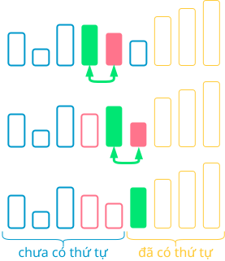
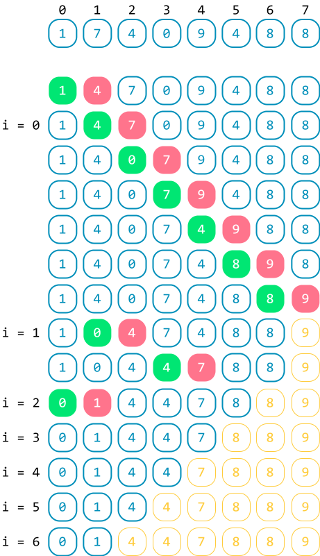
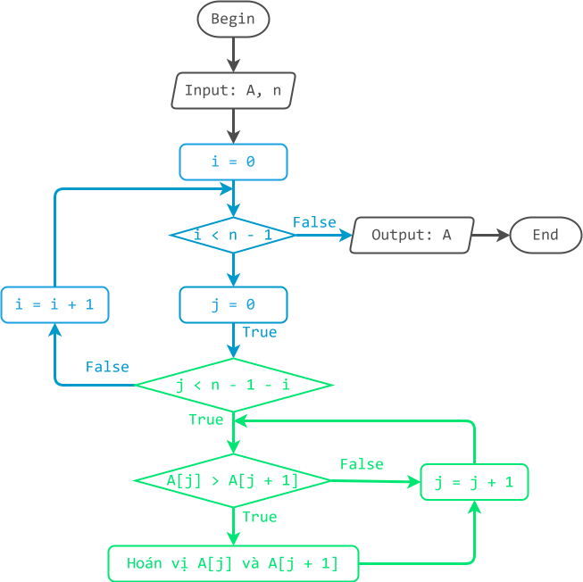

# Sắp xếp nổi bọt

!!! abstract "Tóm lược nội dung"

    Bài này trình bày thuật toán sắp xếp nổi bọt.

## Bài toán và thuật toán sắp xếp

Tương tự [bài học trước](./selection-sort.md#bai-toan-va-thuat-toan-sap-xep){:target="_blank"}, ta chỉ xét bài toán đơn giản là sắp xếp mảng một chiều các số nguyên theo thứ tự **tăng dần**.

Về thuật toán, bài học này đề cập thuật toán **sắp xếp nổi bọt**.

## Sắp xếp nổi bọt

### Ý tưởng

Hãy tưởng tượng hình ảnh các bọt nước ở dưới đáy nổi dần lên trên bề mặt.

Khi ở dưới đáy, bọt nước có kích thước nhỏ và khi đến gần bề mặt, bọt nước có kích thước lớn dần.

Nếu xem đầu mảng là đáy nước và cuối mảng là bề mặt, ta sắp xếp mảng bằng cách lần lượt cho các phần tử lớn hơn "*nổi lên*" bề mặt. Cụ thể như sau:

!!! note "Thuật toán sắp xếp nổi bọt"

    Cho `i` chạy từ đầu đến áp cuối, lặp thao tác:
    
    - Duyệt từng phần tử `A[j]` của mảng con từ vị trí `0` đến vị trí trước `i` phần tử cuối, tức vị trí trước `n – 1 – i`, thực hiện:

        So sánh và hoán vị hai phần tử cạnh nhau `A[j]` và `A[j + 1]` sao cho phần tử nhỏ hơn đứng trước và phần tử lớn hơn đứng sau.

Như vậy, sau mỗi lần lặp của vòng lặp trong (biến `j`), các phần tử lớn sẽ *trôi* về phía cuối mảng, và sau mỗi lần lặp của vòng lặp ngoài (biến `i`), phần tử lớn nhất sẽ về đúng vị trí của nó ở cuối mảng.

Có thể thấy, với mỗi lần lặp tiếp theo của vòng lặp ngoài (biến `i`), phạm vi duyệt sẽ thu nhỏ lại, từ đầu mảng cho đến trước phần tử lớn nhất của lần duyệt trước đó.  

<figure markdown="span">
{loading=lazy}
<figcaption>Phác hoạ ý tưởng chính</figcaption>
</figure>

### Minh hoạ

<figure markdown="span">
{loading=lazy width=400px}
<figcaption>Tiến trình sắp xếp nổi bọt</figcaption>
</figure>

### Lưu đồ

{loading=lazy width=720px}

### Trực quan hoá

<div>
    <iframe width="100%" height="690px" frameBorder=0 src="../visualize/bubble-sort.html"></iframe>
</div>  

### Viết chương trình

Khai báo thư viện `numpy`.

```py linenums="1"
import numpy as np
```

Viết hàm `bubble_sort()` để thực hiện thuật toán sắp xếp nổi bọt.

```py linenums="4"
def bubble_sort(A):
    # n là số lượng phần tử
    n = len(A)

    # Cho i chạy trong phạm vi [0..n - 2]
    for i in range(n - 1):
        # Duyệt từng phần tử A[j] của mảng con [0..n - 1 - i]
        for j in range(n - 1 - i):
            # So sánh và hoán vị hai phần tử cạnh nhau
            if A[j] > A[j + 1]:
                A[j], A[j + 1] = A[j + 1], A[j]
```

Trong chương trình chính, ta gọi hàm `bubble_sort()` ra thực hiện sắp xếp mảng `Array`.

```py linenums="17"
# Chương trình chính
if __name__ == '__main__':
    # Khởi tạo mảng Array
    Array = np.array([1, 7, 4, 0, 9, 4, 8, 8])

    # In mảng ban đầu
    print(f'Mảng gốc chưa có thứ tự: {Array}')

    # Gọi hàm bubble_sort()
    bubble_sort(Array)

    # In mảng sau khi sắp xếp
    print(f'Mảng có thứ tự tăng dần: {Array}')
```

Output:

```pycon
Mảng gốc chưa có thứ tự: [1 7 4 0 9 4 8 8]
Mảng có thứ tự tăng dần: [0 1 4 4 7 8 8 9]
```

## Sơ đồ tóm tắt

<div>
    <iframe style="width: 100%; height: 360px" frameBorder=0 src="../mindmaps/bubble-sort.html">Sơ đồ tóm tắt</iframe>
</div>

## Mã nguồn

Các đoạn mã trong bài được đặt tại:

1. [GitHub](https://github.com/vtchitruong/gdpt-2018/blob/main/grade-11/topic-f2/bubble-sort.py){:target="_blank"}

2. [Google Colab](https://colab.research.google.com/drive/1c3INW2H5BhjXAfn18KiXWXlA0vLvDo7n?usp=sharing){:target="_blank"}

## Some English words

| Vietnamese | Tiếng Anh | 
| --- | --- |
| hoán vị (hai phần tử) | swap |
| sắp xếp nổi bọt | bubble sort |
| so sánh | compare |