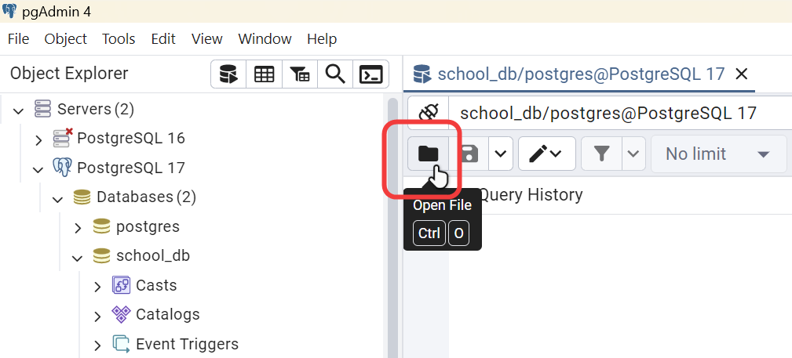

# Xây dựng cơ sở dữ liệu trong PostgreSQL - Phần 2

!!! abstract "Tóm lược nội dung"
    
    Bài này trình bày:

    - Cách tạo một bảng
    - Cách thêm mẫu tin vào bảng
    - Cách xem dữ liệu trong bảng

## Khái quát

Cơ sở dữ liệu cần xây dựng là `school_db`, dùng để quản lý điểm số của học sinh.

`school_db` gồm có các bảng sau:

| Tên bảng | Nội dung của dữ liệu |
| --- | --- |
| `classrooms` | Dữ liệu về lớp học |
| `students` | Dữ liệu về học sinh |
| `subjects` | Dữ liệu về môn học |
| `scores` | Dữ liệu về điểm số của học sinh |

Bài này đề cập cách tạo một bảng duy nhất là bảng `students`.

---

## Mở tập tin .sql

Nếu tập tin **school_db.sql** ở bài trước đã bị đóng thì ta mở lại như sau:

1\. Mở **pgAdmin 4**.

2\. Kết nối vào server.

3\. Click chọn cơ sở dữ liệu `school_db`.

4\. Click nút **Query Tool**.

Một tab mới sẽ mở ra, tiêu đề có dạng `school_db/postgres@PostgreSQL 18` (1).
{ .annotate }

1.  `school_db` là tên của cơ sở dữ liệu hiện hành.

    `postgres` là tên của user mà ta đang đăng nhập để truy vấn dữ liệu.

    `PostgreSQL 18` là tên của máy chủ mà ta đang làm việc.


5\. Nhấn nút **Open File**.

{loading=lazy width=420}

6\. Tìm nơi lưu tập tin **school_db.sql** và mở tập tin này.

---

## Tạo bảng

!!! info "Cú pháp SQL tạo bảng"

    ```sql
    CREATE TABLE table_name (
    	thuộc_tính_1 kiểu_dữ_liệu_1 [ràng buộc],
    	thuộc_tính_2 kiểu_dữ_liệu_2 [ràng buộc],
    	...
    	[các ràng buộc của bảng]
	);
    ```

Ví dụ:  
Bảng `students` cần tạo có lược đồ như sau:

students(<ins>student_id</ins>, last_name, first_name, gender, birth_date, birth_place)

Bảng dưới đây mô tả các **thuộc tính** (còn gọi là **cột**) của `students`:

| Thuộc tính | Ý nghĩa | Kiểu dữ liệu |
| --- | --- | --- |
| `student_id` | mã định danh của mỗi học sinh và là khoá chính | `char(6)`: chuỗi gồm 6 ký tự |
| `last_name` | họ và chữ đệm của học sinh | `varchar(50)`: chuỗi gồm 50 ký tự |
| `first_name` | tên của học sinh | `varchar(50)`: chuỗi gồm 50 ký tự |
| `gender` | giới tính | `smallint`: số nguyên, với quy ước `0` là nam, `1` là nữ |
| `birth_date` | ngày sinh | `date`: giá trị gồm ngày, tháng và năm |
| `birth_place` | nơi sinh | `varchar(50)`: chuỗi gồm 50 ký tự |

Các bước thực hiện:

1\. Trong tab **Query**, viết câu lệnh SQL (từ dòng 5) để tạo bảng `students`.

```sql linenums="1" hl_lines="5-12"
-- Tạo cơ sở dữ liệu
create database school_db;

-- Tạo bảng students
create table students (
	student_id char(6) primary key, -- (1)!
	last_name varchar(50), -- (2)!
	first_name varchar(50),
	gender smallint, -- (3)!
	birth_date date, -- (4)!
	birth_place varchar(50)
);
```
{ .annotate }

1.	Khai báo thuộc tính `student_id` có kiểu dữ liệu là `char`, chứa tối đa 6 ký tự và đặt làm khoá chính.
2.	Khai báo các thuộc tính `last_name`, `first_name` và `birth_place` đều có kiểu dữ liệu là `varchar`, chứa tối đa 50 ký tự.
3.	Khai báo thuộc tính `gender` có kiểu dữ liệu là `smallint`, với quy ước `0` là nam, `1` là nữ`.
4.	Khai báo  thuộc tính `birth_date` có kiểu dữ liệu là `date`.

2\. Để chạy câu lệnh SQL vừa viết, ta quét khối câu lệnh, nhấn ++f5++.

Hoặc chỉ cần đặt con trỏ tại vị trí bất kỳ trong câu lệnh, nhấn ++alt++ + ++f5++.

Để thấy được bảng vừa tạo, ta thực hiện như sau:

3\. Trong **Object Explorer**, click phải vào **school_db** rồi chọn **Refresh...**.

4\. Click mở **school_db**.

5\. Click mở **Schemas**.

6\. Click mở **public**.

7\. Click mở **Tables**, xem đã có bảng `students` hay chưa.

{loading=lazy width=420}

---

## Thêm mẫu tin vào bảng

!!! info "Cú pháp SQL thêm mẫu tin vào bảng"

    ```sql
    INSERT INTO bảng(thuộc_tính_1, thuộc_tính_2, ..., thuộc_tính_n)
    VALUES (giá_trị_1, giá_trị_2, ..., giá_trị_n);
    ```

    Trong trường hợp mẫu tin có đầy đủ tất cả thuộc tính (cột), ta có thể bỏ qua tên cột.

    ```sql
    INSERT INTO bảng
    VALUES (giá_trị_1, giá_trị_2, ..., giá_trị_n);
    ```

Ví dụ:  
1\. Viết câu lệnh SQL để thêm ba mẫu tin mới (1) vào bảng `students`.
{ .annotate }

1.	Mỗi **mẫu tin** là một hàng trong bảng, chứa dữ liệu của một thực thể hoặc một sự kiện, cụ thể ở đây, mỗi mẫu tin là dữ liệu của một học sinh.

```sql linenums="14"
-- Thêm mẫu tin vào bảng students
insert into students(student_id, last_name, first_name, gender, birth_date, birth_place) 
values
	('221001', 'Tào', 'Tháo', 0, '2007-01-15', 'Osaka, Japan'),
	('231001', 'Lưu', 'Bị', 0, '2008-01-14', 'Istanbul, Turkey'),
	('241021', 'Tôn', 'Quyền', 0, '2009-02-18', 'Dublin, Ireland');
```

!!! info "Dữ liệu chuỗi và ngày tháng"

    Trong SQL, khi gõ dữ liệu kiểu chuỗi (`char`, `varchar`) hoặc ngày tháng (`date`), ta phải đặt giá trị vào trong cặp dấu nháy đơn `' '`.

2\. Quét khối câu lệnh vừa viết, nhấn ++f5++ để chạy.

---

## Xem dữ liệu trong bảng

Để xem tất cả mẫu tin hiện có trong bảng `student`, ta thực hiện như sau:

1\. Trong **Object Explorer**, click phải vào bảng **students**.

2\. Chọn **View/Edit Data**.

3\. Chọn **All rows**.

{loading=lazy}

Như vậy, cơ sở dữ liệu `school_db` đã có một bảng là `students`. Bảng này đang lưu trữ ba mẫu tin, là dữ liệu của ba học sinh.

---

## Mã nguồn

Code đầy đủ được đặt tại:

- [GitHub](https://github.com/vtchitruong/gdpt-2018/blob/main/grade-11/topic-f2/building-a-database-in-postgresql-part-2.sql){target="_blank"}

---

## Sơ đồ tóm tắt

<div>
    <iframe style="width: 100%; height: 360px" frameBorder=0 src="../mindmaps/building-a-database-in-postgresql-part-2.html">Sơ đồ tóm tắt</iframe>
</div>