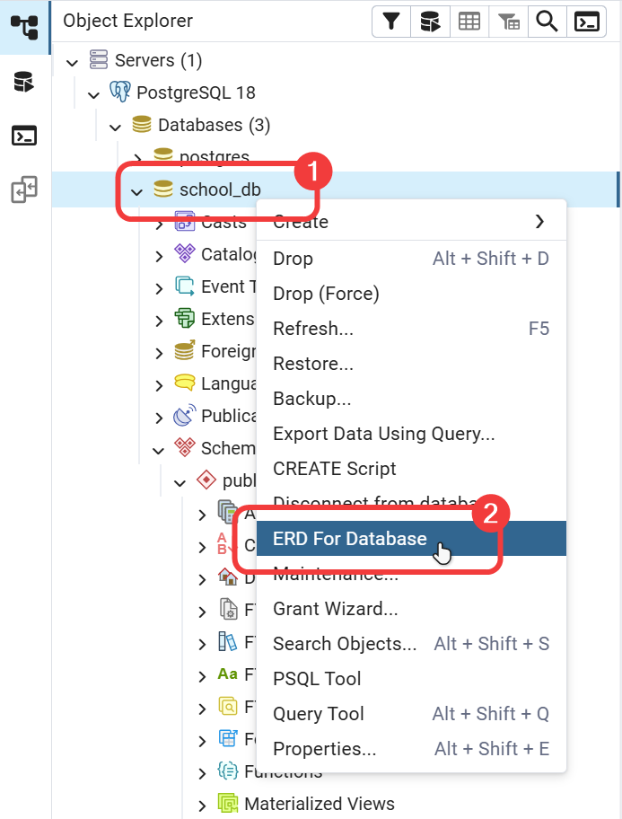
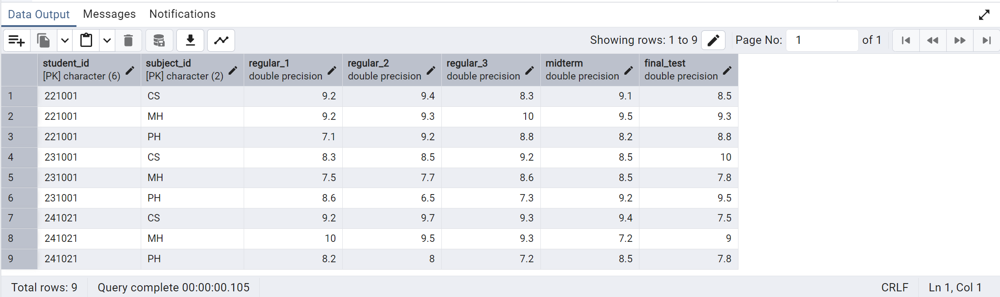

# Xây dựng cơ sở dữ liệu trong PostgreSQL - Phần 4

!!! abstract "Tóm lược nội dung"
    
    Bài này trình bày:
	
	- Cách tạo thêm bảng
	- Liên kết các bảng

## Khái quát

Cơ sở dữ liệu cần xây dựng là `school_db`, dùng để quản lý điểm số của học sinh.

`school_db` gồm có các bảng sau:

| Tên bảng | Nội dung của dữ liệu |
| --- | --- |
| `classrooms` | Dữ liệu về lớp học |
| `students` | Dữ liệu về học sinh |
| `subjects` | Dữ liệu về môn học |
| `scores` | Dữ liệu về điểm số của học sinh |

Bài này đề cập cách tạo hai bảng còn lại là `subjects` và `scores`, và liên kết các bảng với nhau để hoàn thành cơ sở dữ liệu.

---

## Bảng subjects

### Mô tả

Bảng `subjects` có lược đồ như sau:

subjects(<ins>subject_id</ins>, subject_name, description, is_mandatory)

Bảng dưới đây mô tả các thuộc tính (cột) của `subjects`:

| Thuộc tính | Ý nghĩa | Kiểu dữ liệu |
| --- | --- | --- |
| `subject_id` | mã định danh của mỗi môn học và là khóa chính | `char(2)`: chuỗi gồm 2 ký tự và là khóa chính |
| `subject_name` | tên đầy đủ của mỗi môn học | `varchar(100)`: chuỗi gồm 100 ký tự |
| `description` | mô tả môn học | `text`: văn bản dài |
| `is_mandatory` | là môn học bắt buộc hoặc không | `boolean`: `true` là bắt buộc, `false` là không |

### Tạo bảng

Các bước thực hiện:

1\. Viết câu lệnh SQL để tạo bảng `subjects`:

```sql linenums="57"
-- Tạo bảng subjects
create table subjects (
    subject_id char(2) primary key,
    subject_name varchar(100),
    description text, -- (1)!
    is_mandatory boolean default true -- (2)!
);
```
{ .annotate }

1.	`text` là kiểu dữ liệu dùng cho văn bản không xác định độ dài. Trong PostgreSQL, không có sự khác biệt về hiệu năng giữa `text`, `varchar`, `varchar(n)`.
2.	Giá trị mặc định của thuộc tính `is_mandatory` trong mỗi mẫu tin là `true`.

2\. Quét khối câu lệnh vừa viết, nhấn ++f5++ để chạy.

3\. Refresh lại `school_db` để kiểm tra đã có bảng chưa.

### Thêm mẫu tin

Các bước thực hiện:

1\. Viết câu lệnh SQL để thêm ba mẫu tin vô bảng `subjects`.

```sql linenums="65"
-- Thêm mẫu tin vô bảng subjects
insert into subjects
values
	('CS', 'Khoa học máy tính', 'Khoa học xử lý dữ liệu và thông tin bằng máy tính', true),
	('PH', 'Phòng chống nghệ thuật hắc ám', 'Phương pháp và kỹ thuật hiệu quả chống lại nghệ thuật và các sinh vật hắc ám', true),
	('MH', 'Muggle học', 'Khoa học về những người không có phép thuật', false);
```

2\. Quét khối câu lệnh vừa viết, nhấn ++f5++ để chạy.

3\. Chọn menu **View/Edit Data** để xem dữ liệu của bảng.

---

## Bảng scores

Ta cần có một bảng đóng vai trò trung gian, liên kết dữ liệu từ cả hai bảng `students` và `subjects`.

### Mô tả

Bảng `scores` có lược đồ như sau:

scores(<ins>student_id, subject_id</ins>, regular_1, regular_2, regular_3, midterm, final_test)

Trong đó:

- khóa chính gồm cả hai thuộc tính là `student_id` và `subject_id`.

	Vì một học sinh có thể kiểm tra nhiều môn, và một môn có thể có nhiều học sinh làm kiểm tra, nên ta cần kết hợp cả hai thuộc tính này để định danh duy nhất cho mỗi mẫu tin trong bảng.

	Nói cách khác, không thể tồn tại hai cặp (mã học sinh, mã môn học) trùng nhau trong bảng.

	Ví dụ:  
	Nếu đã có mẫu tin ('221001', 'DH') trong bảng thì ta không thể nhập thêm mẫu tin ('221001', 'DH') lần nữa.

- Hai thuộc tính này cũng đồng thời là hai khóa ngoại riêng lẻ:

	- khóa ngoại thứ nhất: `student_id` tham chiếu đến khóa chính `student_id` của bảng `students`.
	- khóa ngoại thứ hai: `subject_id` tham chiếu đến khóa chính `subject_id` của bảng `subjects`.

Bảng dưới đây mô tả các thuộc tính (cột) của `scores`:

| Thuộc tính | Ý nghĩa | Kiểu dữ liệu | Ghi chú |
| --- | --- | --- | --- |
| `student_id` | mã định danh của mỗi học sinh | `char(6)`: chuỗi gồm 6 ký tự | - Là khóa ngoại<br>- Đồng thời là thuộc tính của khóa chính |
| `subject_id` | mã định danh của mỗi môn học | `char(2)`: chuỗi gồm 2 ký tự | - Là khóa ngoại<br>- Đồng thời là thuộc tính của khóa chính |
| `regular_1` | điểm kiểm tra thường xuyên 1 | `float`: số thực |
| `regular_2` | điểm kiểm tra thường xuyên 2 | `float`: số thực |
| `regular_3` | điểm kiểm tra thường xuyên 3 | `float`: số thực |
| `midterm` | điểm kiểm tra giữa kỳ | `float`: số thực |
| `final_test` | điểm kiểm tra cuối kỳ | `float`: số thực |

### Tạo bảng

Các bước thực hiện:

1\. Viết câu lệnh SQL để tạo bảng `scores`.

```sql linenums="72"
-- Tạo bảng scores
create table scores (
	student_id char(6),
	subject_id char(2),
	regular_1 float,
	regular_2 float,
	regular_3 float,
	midterm float,
	final_test float,

	-- Thiết lập khóa chính tổng hợp
	primary key (student_id, subject_id),

    -- Thiết lập khóa ngoại thứ nhất để tham chiếu đến bảng students
    foreign key (student_id) references students(student_id),

    -- Thiết lập khóa ngoại thứ hai để tham chiếu đến bảng subjects
    foreign key (subject_id) references subjects(subject_id)
);
```

2\. Quét khối câu lệnh vừa viết, nhấn ++f5++ để chạy.

3\. Refresh lại `school_db` để kiểm tra đã có bảng chưa.

### Hiển thị lược đồ quan hệ

Cho đến lúc này, ta đã có được cơ sở dữ liệu cơ bản hoàn chỉnh.

Ta có thể hiển thị lược đồ quan hệ dưới dạng sơ đồ trực quan như sau:

1\. Click phải lên `school_db`.

2\. Chọn **ERD For Database** (1).
{ .annotate }

1.	**ERD** là viết tắt của **Entity Relationship Diagram**.

	ERD giúp thấy rõ các đường nối (mối quan hệ) giữa khóa chính và khóa ngoại của các bảng.

{loading=lazy width=300}

Lược đồ quan hệ của cơ sở dữ liệu được hiển thị như hình dưới đây.

{loading=lazy}

### Thêm mẫu tin

Các bước thực hiện:

1\. Viết câu lệnh SQL để thêm chín mẫu tin vô bảng `scores`.

```sql linenums="92"
-- Thêm mẫu tin vô bảng scores
insert into scores
values
    ('221001', 'CS', 9.2, 9.4, 8.3, 9.1, 8.5),
    ('221001', 'PH', 7.1, 9.2, 8.8, 8.2, 8.8),
    ('221001', 'MH', 9.2, 9.3, 10, 9.5, 9.3),
    ('231001', 'CS', 8.3, 8.5, 9.2, 8.5, 10),
    ('231001', 'PH', 8.6, 6.5, 7.3, 9.2, 9.5),
    ('231001', 'MH', 7.5, 7.7, 8.6, 8.5, 7.8),
    ('241021', 'CS', 9.2, 9.7, 9.3, 9.4, 7.5),
    ('241021', 'PH', 8.2, 8, 7.2, 8.5, 7.8),
    ('241021', 'MH', 10, 9.5, 9.3, 7.2, 9);
```

Vì bảng `scores` phụ thuộc vào cả bảng `students` và bảng `subjects` nên ta phải nhập dữ liệu cho hai bảng cha trước, sau đó mới có thể nhập điểm cho bảng con `scores`.

!!! warning "Về việc nhập liệu"

	Ta phải nhập dữ liệu liệu cho bảng cha trước rồi mới nhập dữ liệu liệu cho bảng con.	

2\. Quét khối câu lệnh vừa viết, nhấn ++f5++ để chạy.

3\. Chọn menu **View/Edit Data** để xem dữ liệu của bảng. Kết quả như hình dưới đây.

{loading=lazy}

---

## Mã nguồn

Code đầy đủ được đặt tại:

- [GitHub](https://github.com/vtchitruong/gdpt-2018/blob/main/grade-11/topic-f2/building-a-database-in-postgresql-part-4.sql){target="_blank"}

---

## Sơ đồ tóm tắt

<div>
    <iframe style="width: 100%; height: 360px" frameBorder=0 src="../mindmaps/building-a-database-in-postgresql-part-4.html">Sơ đồ tóm tắt</iframe>
</div>