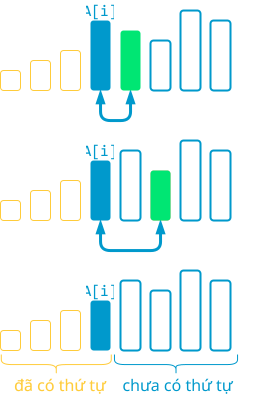
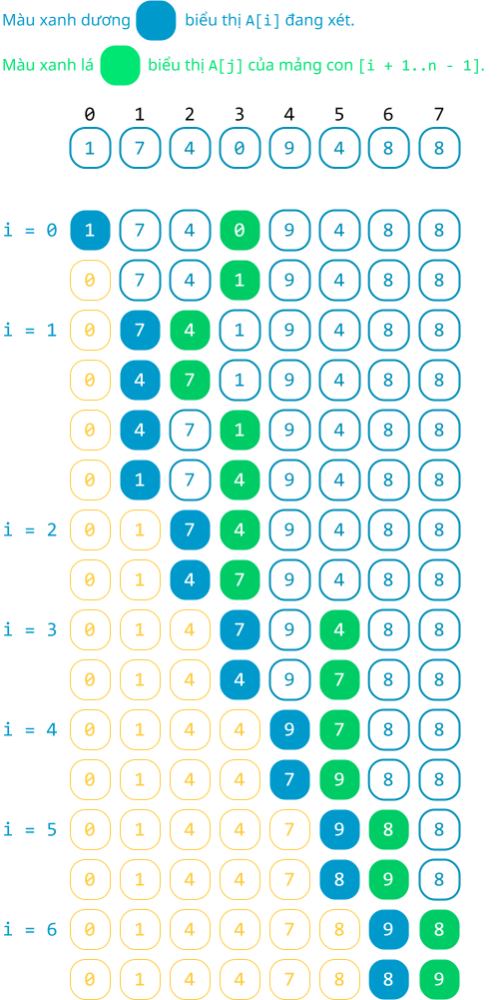
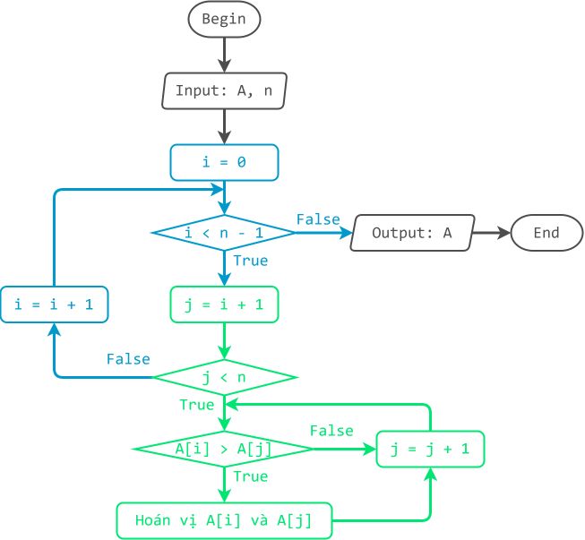

# Sắp xếp tráo đổi

!!! abstract "Tóm lược nội dung"

    Bài này trình bày thuật toán sắp xếp tráo đổi.

## Bài toán và thuật toán sắp xếp

Tương tự [bài học trước](./selection-sort.md#bai-toan-va-thuat-toan-sap-xep){:target="_blank"}, ta chỉ xét bài toán đơn giản là sắp xếp mảng một chiều các số nguyên theo thứ tự **tăng dần**.

Về thuật toán, bài học này đề cập thuật toán **sắp xếp tráo đổi**.

## Sắp xếp tráo đổi

### Ý tưởng

Ý tưởng chính của thuật toán sắp xếp tráo đổi là lặp lại nhiều lần thao tác so sánh phần tử đang xét với các phần tử theo sau nó và tráo đổi (hoán vị) sao cho phần tử nhỏ hơn lên trước và phần tử lớn hơn ra sau. Cụ thể như sau:

!!! note "Thuật toán sắp xếp tráo đổi"

    Duyệt từng phần tử `A[i]` từ đầu đến áp cuối, lặp thao tác sau:

    - Duyệt từng phần tử `A[j]` của mảng con từ `i + 1` đến cuối:
    
        So sánh và tráo đổi (hoán vị) `A[i]` và `A[j]` sao cho phần tử nhỏ hơn đứng trước và phần tử lớn hơn đứng sau.

Như vậy, sau mỗi lần duyệt của vòng lặp ngoài (biến `i`), phần tử nhỏ nhất của mảng con `[i..n - 1]` được đưa về vị trí đầu của mảng con đó, cũng chính là vị trí `i`. 

<figure markdown="span">
{loading=lazy}
<figcaption>Phác hoạ ý tưởng chính</figcaption>
</figure>

### Minh hoạ

<figure markdown="span">
{loading=lazy width=400px}
<figcaption>Tiến trình sắp xếp tráo đổi</figcaption>
</figure>

### Lưu đồ

{loading=lazy width=720px}

### Trực quan hoá

<div>
    <iframe width="100%" height="690px" frameBorder=0 src="../visualize/exchange-sort.html"></iframe>
</div>   

### Viết chương trình

Khai báo thư viện `numpy`.

```py linenums="1"
import numpy as np
```

Viết hàm `exchange_sort()` để thực hiện thuật toán sắp xếp tráo đổi.

```py linenums="4"
def exchange_sort(A):
    # n là số lượng phần tử
    n = len(A)

    # Duyệt từng phần tử A[i] trong phạm vi [0..n - 2]
    for i in range(n - 1):
        # Duyệt từng phần tử A[j] của mảng con [i + 1..n - 1]
        for j in range(i + 1, n):
            # So sánh và tráo đổi A[i] và A[j]
            if A[i] > A[j]:
                A[i], A[j] = A[j], A[i]
```

Trong chương trình chính, ta gọi hàm `exchange_sort()` ra thực hiện sắp xếp mảng `Array`.

```py linenums="17"
# Chương trình chính
if __name__ == '__main__':
    # Khởi tạo mảng Array
    Array = np.array([1, 7, 4, 0, 9, 4, 8, 8])

    # In mảng ban đầu
    print(f'Mảng gốc chưa có thứ tự: {Array}')

    # Gọi hàm exchange_sort()
    exchange_sort(Array)

    # In mảng sau khi sắp xếp
    print(f'Mảng có thứ tự tăng dần: {Array}')
```

Output:

```pycon
Mảng gốc chưa có thứ tự: [1 7 4 0 9 4 8 8]
Mảng có thứ tự tăng dần: [0 1 4 4 7 8 8 9]
```

## Sơ đồ tóm tắt

<div>
    <iframe style="width: 100%; height: 360px" frameBorder=0 src="../mindmaps/exchange-sort.html">Sơ đồ tóm tắt</iframe>
</div>

## Mã nguồn

Các đoạn mã trong bài được đặt tại:

1. [GitHub](https://github.com/vtchitruong/gdpt-2018/blob/main/grade-11/topic-f2/exchange-sort.py){:target="_blank"}

2. [Google Colab](https://colab.research.google.com/drive/1dg_zTANTcBFwKDcV3MdsN5Ksw2Hy9fr_?usp=sharing){:target="_blank"}

## Some English words

| Vietnamese | Tiếng Anh | 
| --- | --- |
| hoán vị (hai phần tử) | swap |
| sắp xếp tráo đổi | exchange sort |
| so sánh | compare |