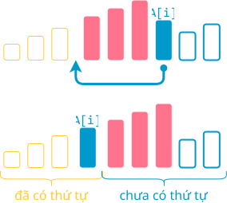
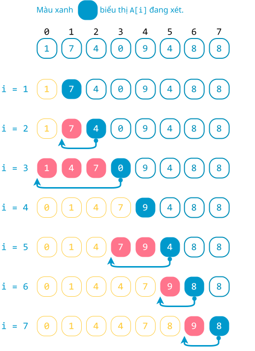
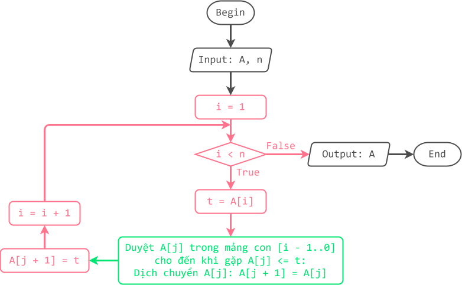

# Sắp xếp chèn

!!! abstract "Tóm lược nội dung"

    Bài này trình bày thuật toán sắp xếp chèn.

## Bài toán và thuật toán sắp xếp

Tương tự [bài học trước](./selection-sort.md#bai-toan-va-thuat-toan-sap-xep){:target="_blank"}, ta chỉ xét bài toán đơn giản là sắp xếp mảng một chiều các số nguyên theo thứ tự **tăng dần**.

Về thuật toán, bài học này đề cập thuật toán **sắp xếp chèn**.

## Sắp xếp chèn

### Ý tưởng

Hãy tưởng tượng hình ảnh cả lớp đang xếp một hàng dọc.

Xét một bạn Tèo nào đó. Lần lượt các bạn đứng trước Tèo mà cao hơn Tèo thì lùi về sau một vị trí, cho đến khi *gặp* một bạn không cao hơn Tèo thì dừng. Lúc này, do các bạn cao đã lùi về sau, một chỗ trống sẽ *lộ ra* cho Tèo đứng chèn vào.   

Dựa vào cách thức trên, ý tưởng chính của thuật toán sắp xếp chèn là lặp lại nhiều lần thao tác di chuyển một phần tử lên trước các phần tử lớn hơn nó. Cụ thể như sau:


!!! note "Thuật toán sắp xếp chèn"

    Duyệt từng phần tử `A[i]` từ từ vị trí `1` đến cuối, lặp các thao tác sau:

    1. Lưu giá trị của `A[i]` vào biến tạm `t`. (Vì `A[i]` sẽ bị ghi đè bởi các phần tử `A[j]` trong thao tác tiếp theo)
    
    2. Duyệt từng phần tử `A[j]` của mảng con từ vị trí `i - 1` ngược về đầu mảng (vị trí `0`), cho đến khi gặp `A[j]` nhỏ hơn hoặc bằng `A[i]`, lặp các theo tác: dịch chuyển `A[j]` một vị trí về phía cuối mảng.
    
    3. Chèn `A[i]` vào "*chỗ trống*" bằng cách gán biến tạm `t` cho `A[j + 1]`. (Vì sau khi vòng lặp while dừng, `j` là vị trí mà `A[j]` không còn lớn hơn `A[i]` nữa, và `j + 1` là vị trí mà `A[i]` được chèn vào).

<figure markdown="span">
{loading=lazy}
<figcaption>Phác hoạ ý tưởng chính</figcaption>
</figure>

### Minh hoạ

<figure markdown="span">
{loading=lazy width=400px}
<figcaption>Tiến trình sắp xếp chèn</figcaption>
</figure>

### Lưu đồ

{loading=lazy width=720px}

### Trực quan hoá

<div>
    <iframe width="100%" height="690px" frameBorder=0 src="../visualize/insertion-sort.html"></iframe>
</div>   

### Viết chương trình

Khai báo thư viện `numpy`.

```py linenums="1"
import numpy as np
```

Viết hàm `insertion_sort()` để thực hiện thuật toán sắp xếp chèn.

```py linenums="4"
def insertion_sort(A):
    # n là số lượng phần tử
    n = len(A)

    # Duyệt từng phần tử A[i] trong phạm vi [1..n - 1]
    for i in range(1, n):
        # Lưu giá trị A[i] vào biến tạm t
        t = A[i]

        # Duyệt từng phần tử A[j] của mảng con [i - 1..0]
        # Trong khi A[j] vẫn lớn hơn t
        j = i - 1
        while j >= 0 and A[j] > t:
            # Dịch chuyển A[j] về phía sau một vị trí
            A[j + 1] = A[j]

            # Giảm j để tiếp tục xét những A[j] mà lớn hơn t
            j = j - 1

        # Chèn t vào vị trí j + 1
        A[j + 1] = t # (1)!
```
{ .annotate }

1.  Sau khi vòng lặp while kết thúc, `j` là vị trí mà `A[j]` nhỏ hơn hoặc bằng `A[i]`, còn `j + 1` là vị trí sẽ được `A[i]` đứng chèn vào.

Trong chương trình chính, ta gọi hàm `insertion_sort()` ra thực hiện sắp xếp mảng `Array`.

```py linenums="27"
# Chương trình chính
if __name__ == '__main__':
    # Khởi tạo mảng Array
    Array = np.array([1, 7, 4, 0, 9, 4, 8, 8])

    # In mảng ban đầu
    print(f'Mảng gốc chưa có thứ tự: {Array}')

    # Gọi hàm insertion_sort()
    insertion_sort(Array)

    # In mảng sau khi sắp xếp
    print(f'Mảng có thứ tự tăng dần: {Array}')
```

Output:

```pycon
Mảng gốc chưa có thứ tự: [1 7 4 0 9 4 8 8]
Mảng có thứ tự tăng dần: [0 1 4 4 7 8 8 9]
```

## Sơ đồ tóm tắt

<div>
    <iframe style="width: 100%; height: 360px" frameBorder=0 src="../mindmaps/insertion-sort.html">Sơ đồ tóm tắt</iframe>
</div>

## Mã nguồn

Các đoạn mã trong bài được đặt tại:

1. [GitHub](https://github.com/vtchitruong/gdpt-2018/blob/main/grade-11/topic-f2/insertion-sort.py){:target="_blank"}

2. [Google Colab](https://colab.research.google.com/drive/1zkDywixSi1Le7XikA4njlg72Kpz5E7dY?usp=sharing){:target="_blank"}

## Some English words

| Vietnamese | Tiếng Anh | 
| --- | --- |
| biến tạm thời | temporatory variable |
| hoán vị (hai phần tử) | swap |
| sắp xếp chèn | insertion sort |
| so sánh | compare |