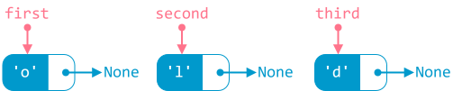
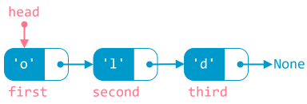
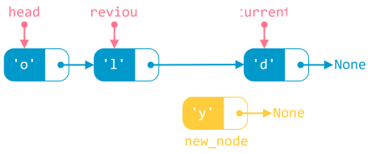
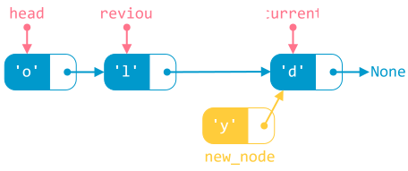
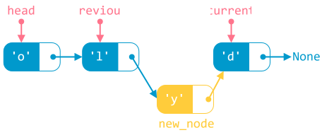
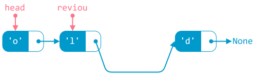

# Danh sách liên kết

!!! abstract "Tóm lược nội dung"

    Bài này trình bày những khái niệm về danh sách liên kết.

## Đặt vấn đề

Khi lưu trữ và xử lý tập hợp gồm nhiều phần tử, mảng là một lựa chọn phù hợp. Song mảng vẫn có những hạn chế như:

- Kích thước của mảng là cố định. Nói cách khác, số lượng phần tử của mảng không thể tăng hoặc giảm một cách linh hoạt. Số lượng phần tử của mảng thường phải khai báo dư so với số lượng sử dụng thực tế.

- Khi cần chèn hoặc xoá phần tử, mảng cần phải dịch chuyển các phần tử, dẫn đến hao phí về mặt thời gian và bộ nhớ. Thậm chí, có trường hợp phải khai báo mảng mới, rồi sao chép các phần tử từ mảng gốc sang mảng mới, hiệu quả thực thi lại càng kém hơn.

Do đó, ta cần một cấu trúc dữ liệu khác có thể khắc phục những hạn chế này.  

## Khái niệm

**Danh sách liên kết** là một cấu trúc dữ liệu gồm các phần tử kết nối với nhau. Mỗi phần tử được gọi là một **node**, thường được tổ chức thành hai thành phần:

<div class="annotate" markdown>
- Phần thứ nhất chứa dữ liệu, tạm gọi là `data`.
- Phần thứ hai chứa địa chỉ của một node khác, tạm gọi là `next`. (1)
</div>

1.  Khi `next` của node liền trước chứa địa chỉ của node liền sau, ta nói rằng, node trước là **trỏ vào** / **trỏ tới** / **trỏ đến** node liền sau.

<figure markdown>
  {loading=lazy}
  <figcaption>Minh node</figcaption>
</figure>

Bên cạnh đó, danh sách liên kết còn có một biến được dùng để nắm giữ node đầu tiên, tạm gọi là `head`. Biến `head` đóng vai trò là điểm khởi đầu hoặc đầu vào của danh sách liên kết. Dựa vào `head`, ta có thể duyệt qua các node trong danh sách liên kết.

Node cuối cùng có thành phần `next` trỏ đến `None`, là đối tượng mang ý nghĩa **rỗng**, không có giá trị. `None` là dấu hiệu giúp nhận biết không còn node tiếp theo nữa.

<figure markdown>
  {loading=lazy}
  <figcaption>Minh họa danh sách liên kết</figcaption>
</figure>

Xe lửa có thể xem là hình ảnh minh họa cho danh sách liên kết: xe lửa gồm nhiều toa, toa liền trước *móc nối* với toa liền sau.

<figure markdown>
  {loading=lazy}
  <br>
  <em>Xe lửa, theo nghĩa nào đó, là một danh sách liên kết</em>[^1]
</figure>

[^1]: Hình được tải tại [Free SVG](https://freesvg.org/){:target="_blank"}.

Danh sách liên kết được sử dụng hiệu quả trong những trường hợp như:

- Thao tác chèn thêm hoặc xoá bớt thường xuyên diễn ra.
- Quản lý bộ nhớ động, tức bộ nhớ thay đổi trong khi chạy chương trình, chứ không cố định từ đầu.

Có nhiều loại danh sách liên kết, ví dụ như: danh sách liên kết **đơn**, danh sách liên kết **đôi**, danh sách liên kết **vòng**, v.v... 

Bài học này chỉ đề cập **danh sách liên kết đơn**, và từ đây gọi tắt là *danh sách liên kết*.

## Một vài thao tác xử lý

Ngoài thành phần `data`, mỗi node còn có thành phần `next` trỏ đến node liền sau nó, giúp các node liên kết với nhau. Các thao tác thêm node và xoá node thực chất đều là thay đổi thành phần `next` này, nghĩa là thay đổi liên kết giữa các node.

!!! warning "Về mã lệnh trong bài này"
    
    Việc viết mã lệnh để minh họa danh sách liên kết trong bài này đòi hỏi hiểu biết về lập trình hướng đối tượng và kỹ thuật lập trình, là kiến thức nằm ngoài chương trình phổ thông. Do đó, một số câu lệnh sẽ chỉ diễn giải sơ nét. Bạn có thể ghép các đoạn mã lệnh thành chương trình hoàn chỉnh để chạy mà không cần quá quan tâm chi tiết kỹ thuật.   

### Khởi tạo

Để khởi tạo một danh sách liên kết gồm ba node, ta thực hiện theo những bước sau. Giả sử, mỗi node chỉ chứa dữ liệu là một ký tự.  

**Bước 1:**  
Tạo kiểu dữ liệu `node` gồm hai thành phần `data` và `next`.  

``` py linenums="1"
# Tạo kiểu dữ liệu node gồm hai thành phần data và next
class node:
    def __init__(self, data):
        self.data = data
        self.next = None
```

**Bước 2:**  
Tạo kiểu dữ liệu danh sách liên kết, đặt tên là `linked_list`. Kiểu dữ liệu `linked_list` này có thuộc tính `head` dùng để nắm giữ node đầu tiên trong danh sách liên kết.  

``` py linenums="8"
# Tạo kiểu dữ liệu danh sách liên kết, đặt tên là linked_list
class linked_list:
    def __init__(self):
        self.head = None # (1)!
```

1. Lệnh này chỉ là khai báo mang tính thủ tục, thuộc tính `head` *tạm thời* trỏ đến `None`.

**Bước 3:**  
Trong chương trình chính, ta khai báo biến danh sách liên kết, đặt tên là `L`. Lúc này, danh sách liên kết `L` là rỗng, chưa có node nào, do thuộc tính `head` của `L` đang trỏ đến `None` như khai báo tại bước 2.  

``` py linenums="65"
# Chương trình chính
if __name__ == '__main__':
    L = linked_list()  # Khai báo biến danh sách liên kết L
```

**Bước 4:**  
Khởi tạo 3 node, lần lượt đặt tên là `first`, `second` và `third`, chứa dữ liệu lần lượt là `'o'`, `'l'` và `'d'`. Lúc này, cả ba node đều đơn lẻ, rời rạc, chưa có kết nối với nhau.  

``` py linenums="69"
    # Khởi tạo 3 node đơn lẻ
    first = node('o')
    second = node('l')
    third = node('d')
```

<figure markdown>
  {loading=lazy}
  <figcaption>3 node đơn lẻ</figcaption>
</figure>

**Bước 5:**  
Liên kết các node với nhau bằng cách cho thuộc tính `head` của `L` trỏ đến một node nào đó, rồi cho node này trỏ đến một node khác, và cứ như thế đối với các node còn lại.

- **Bước 5.1**: Cho `head` của `L` trỏ đến `first`.

    <figure markdown>
    {loading=lazy}
    <figcaption>Bước 5.1 của thao tác khởi tạo</code></figcaption>
    </figure>

- **Bước 5.2**: Cho `next` của `first` trỏ đến `second`.

    <figure markdown>
    {loading=lazy}
    <figcaption>Bước 5.2 của thao tác khởi tạo</figcaption>
    </figure>

- **Bước 5.3**: Cho `next` của `second` trỏ đến `third`.  

    <figure markdown>
    {loading=lazy}
    <figcaption>Bước 5.3 của thao tác khởi tạo</figcaption>
    </figure>

``` py linenums="74"
    # Liên kết các node với nhau
    L.head = first       # Cho head của L trỏ đến first
    first.next = second  # Cho first trỏ đến second
    second.next = third  # Cho second trỏ đến third
```

### Duyệt

Duyệt danh sách liên kết là tiến trình di chuyển lần lượt qua các node, xuất phát từ node đầu tiên, do biến `head` trỏ đến, cho đến node cuối cùng, là node có thành phần `next` trỏ đến `None`.

Cụ thể, ta sử dụng biến `current`, xuất phát từ `head`, rồi dùng vòng lặp cho `current` lần lượt trỏ đến các node tiếp theo, cho đến khi gặp `None`.

Hàm sau đây thực hiện duyệt danh sách liên kết và in ra màn hình dữ liệu của từng node.

``` py linenums="14"
# Hàm in ra dữ liệu của các node trong danh sách liên kết
def print_linked_list(l, message):
    print(message)                          # In ra thông báo nào đó

    current =  l.head                       # Cho current trỏ đến head
    while current is not None:              # Trong khi chưa gặp None
        print(current.data , end = ' -> ')  # thì in ra data của current,
                                            # kèm theo mũi tên
        current = current.next              # Cho current trỏ đến node tiếp theo

    print()                                 # Xuống dòng
```

Trong chương trình chính, ta gọi hàm vừa viết trên.  

``` py linenums="79"
    # Gọi hàm print_linked_list để in ra danh sách liên kết
    print_linked_list(L, 'Danh sách liên kết ban đầu:')
```

Output:
``` pycon
Danh sách liên kết ban đầu:
o -> l -> d -> 
```

### Chèn vào trước một node có dữ liệu key

Giả sử node có dữ liệu `key` đã tồn tại trong danh sách liên kết và không phải là node đầu tiên.

Để chèn node mới vào trước node `key`, ta thực hiện các bước sau:

**Bước 0:**  
Tạo node mới, đặt tên là `new_node`, chứa dữ liệu `new_data`.

**Bước 1:**  
Duyệt danh sách liên kết bằng hai biến `previous` và `current` cho đến khi tìm thấy node `key`:

- **Bước 1.1:** Cho `current` trỏ đến node đầu tiên.
- **Bước 1.2:** Dùng vòng lặp để tìm node có dữ liệu `key`:

    - Nếu tìm thấy `key` thì ngắt vòng lặp. Chuyển sang bước 2.
    - Ngược lại, chưa tìm thấy, thì cho `previous` thay thế `current` và cho `current` di chuyển đến node tiếp theo.

    Bước 1.2 mang ý nghĩa rằng, biến `previous` luôn bước *nối gót* theo biến `current`.

<figure markdown>
{loading=lazy}
<figcaption>Bước 1 của thao tác chèn</figcaption>
</figure>

**Bước 2:**  
Cho `next` của node mới trỏ đến `current`.

<figure markdown>
{loading=lazy}
<figcaption>Bước 2 của thao tác chèn</figcaption>
</figure>

**Bước 3:**  
Cho `next` của `previous` trỏ đến node mới.

<figure markdown>
{loading=lazy}
<figcaption>Bước 3 của thao tác chèn</figcaption>
</figure>

Hàm chèn thêm node mới vào trước node có dữ liệu `key` viết như sau:

``` py linenums="27"
# Hàm chèn vào trước một node có dữ liệu key
def insert_before(l, key, new_data):
    new_node = node(new_data)    # Tạo node mới

    # Dùng vòng lặp để tìm node có dữ liệu key
    current = l.head             # Cho current trỏ đến head
    while current is not None:
        if current.data == key:  # Nếu tìm thấy key thì ngắt vòng lặp
            break

        previous = current       # Ngược lại, nếu chưa tìm thấy,
                                 # thì cho previous thay thế current
        current = current.next   # và current di chuyển đến node tiếp theo

    new_node.next = current      # Cho next của node mới trỏ đến current
    previous.next = new_node     # Cho next của previous trỏ đến node mới
```

Trong chương trình chính, ta gọi hàm vừa viết trên.  

``` py linenums="82"
    # Gọi hàm insert_before để chèn thêm node mới có dữ liệu 'y'
    # vào trước node có dữ liệu 'd'
    insert_before(L, 'd', 'y')

    # Gọi hàm print_linked_list để in ra danh sách liên kết
    print_linked_list(L, 'Danh sách liên kết sau khi chèn thêm:')
```

Output:
``` pycon
Danh sách liên kết sau khi chèn thêm:
o -> l -> y -> d -> 
```

!!! warning "Lưu ý"
    
    Như đã nói trên, hàm này áp dụng cho trường hợp lý tưởng, đó là node `key` có tồn tại trong danh sách liên kết và không phải là node đầu tiên.

    Khi viết đầy đủ, ta cần xét thêm các trường hợp:

    - Danh sách liên kết rỗng, chưa có node nào.
    - Node `key` là node đầu tiên.
    - Node `key` không tồn tại.

### Xoá node có dữ liệu key

Giả sử node có dữ liệu `key` đã tồn tại trong danh sách liên kết và không phải là node đầu tiên.

Để xoá node có dữ liệu `key`, ta thực hiện các bước sau:

**Bước 1:**  
Duyệt danh sách liên kết bằng hai biến `previous` và `current` cho đến khi tìm thấy node `key`:

- **Bước 1.1:** Cho `current` trỏ đến node đầu tiên.
- **Bước 1.2:** Dùng vòng lặp để tìm node có dữ liệu `key`:

    - Nếu tìm thấy `key` thì ngắt vòng lặp. Chuyển sang bước 2.
    - Ngược lại, chưa tìm thấy, thì cho `previous` thay thế `current` và cho `current` di chuyển đến node tiếp theo.

    Tương tự thao tác chèn, tại bước 1.2 này, ta cũng cho `previous` di chuyển *nối gót* `current`. 

<figure markdown>
{loading=lazy}
<figcaption>Bước 1 của thao tác xoá</figcaption>
</figure>

**Bước 2:**  
Ngắt liên kết từ `previous` đến `current`, là node chứa `key` cần xoá, bằng cách cho `next` của `previous` trỏ đến node liền sau `current`.

<figure markdown>
{loading=lazy}
<figcaption>Bước 2 của thao tác xoá</figcaption>
</figure>

**Bước 3:**  
*Thủ tiêu* `current`.

<figure markdown>
{loading=lazy}
<figcaption>Bước 3 của thao tác xoá</figcaption>
</figure>

Hàm xoá một node có dữ liệu `key` viết như sau:

``` py linenums="45"
# Hàm xoá node có dữ liệu key
def remove(self, key):
    current = self.head           # Cho current trỏ đến node đầu tiên

    # Dùng vòng lặp để tìm node có dữ liệu key
    while current is not None:
        if current.data == key:   # Nếu tìm thấy key thì ngắt vòng lặp
            break

        previous = current        # Ngược lại, nếu chưa tìm thấy,
                                  # thì cho previous thay thế current
        current = current.next    # và current di chuyển đến node tiếp theo


    previous.next = current.next  # Ngắt liên kết đến current bằng cách
                                  # cho next của previous trỏ đến
                                  # node liền sau current
    del current                   # xoá current
```

Trong chương trình chính, ta gọi hàm vừa viết trên.  

``` py linenums="89"
    # Gọi hàm remove để xoá node có dữ liệu 'y'
    remove(L, 'y')

    # Gọi hàm print_linked_list để in ra danh sách liên kết
    print_linked_list(L, 'Danh sách liên kết sau khi xoá node:')
```

Output:
``` pycon
Danh sách liên kết sau khi xoá node:
o -> l -> d -> 
```

!!! warning "Lưu ý"
    
    Hàm này cũng áp dụng cho trường hợp lý tưởng, đó là node `key` cần xoá có tồn tại trong danh sách liên kết và không phải là node đầu tiên.

    Khi viết đầy đủ, ta cần xét thêm các trường hợp:

    - Danh sách liên kết rỗng, chưa có node nào.  
    - Node `key` là node đầu tiên.  
    - Node `key` không tồn tại.  

## Google Colab

Các đoạn mã trong bài này được đặt tại <a href=""https://colab.research.google.com/drive/1erfVlrVQm3g5DRsLROjWFEjDlhLEglPu?usp=sharing" target="_blank">Google Colab</a> để bạn có thể thử nghiệm theo cách của riêng mình.

## Some English words

| Vietnamese | Tiếng Anh |
| ----------- | ----- |
| danh sách liên kết đôi | doubly linked list |
| danh sách liên kết đơn | singly linked list |
| danh sách liên kết vòng | circular linked list |