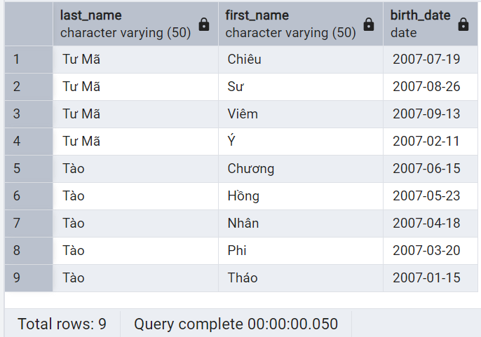

# Truy vấn dữ liệu - Phần 3

!!! abstract "Tóm lược nội dung"

    Bài này trình bày câu lệnh SELECT để sắp xếp dữ liệu trích xuất.

## Yêu cầu về cơ sở dữ liệu

Tiếp tục sử dụng cơ sở dữ liệu `school_db` như ở bài trước.

---

## Sắp xếp dữ liệu

!!! note "Từ khóa `ORDER BY`"

    Dùng để sắp xếp dữ liệu được trích xuất theo một thứ tự nào đó.

    Hai từ khóa chỉ định thứ tự sắp xếp là:

    | Từ khóa | Thứ tự sắp xếp | Ghi chú |
    | --- | --- | --- |
    | `ASC` | tăng dần | Nếu không chỉ định thì mặc định sẽ sắp xếp tăng dần |
    | `DESC` | giảm dần | |

`ORDER BY` chỉ sắp xếp dữ liệu trong kết quả trích xuất, không ảnh hưởng đến dữ liệu thực trong cơ sở dữ liệu.

!!! note "Cú pháp SQL sắp xếp dữ liệu"

    ```sql
    SELECT thuộc_tính_1, thuộc_tính_2,...
    FROM tên_bảng
    WHERE biểu_thức_điều_kiện
    ORDER BY thuộc_tính_1 [ASC|DESC], thuộc_tính_2 [ASC|DESC],...
    ```

Ví dụ:  
**Yêu cầu:**

Lập danh sách các học sinh mang họ Tào và họ Tư Mã. Danh sách cần có cột họ, tên và ngày sinh.

Danh sách phải được sắp xếp theo thứ tự: họ từ Z về A và tên từ A đến Z.

**Phân tích:**

Họ Tào và họ Tư Mã được lưu trong thuộc tính `last_name`. Để trích xuất học sinh mang họ Tào và họ Tư Mã, ta dùng biểu thức điều kiện `last_name = 'Tào' or last_name = 'Tư Mã'`.

Để sắp xếp họ theo thứ tự Z-A, tức giảm dần, ta viết `last_name DESC`.

Để sắp xếp tên theo thứ tự A-Z, tức tăng dần, ta không cần viết rõ `ASC`.

Như vậy, mệnh đề sắp xếp là `order by last_name DESC, first_name`.

Với cách sắp xếp này, các mẫu tin có họ Tư Mã sẽ nằm trước các mẫu tin có họ Tào. Nếu trùng họ thì mới bắt đầu sắp xếp theo tên, tăng dần theo thứ tự bảng chữ cái.

**Cách thực hiện:**

1\. Viết mã lệnh SQL.

```sql linenums="1"
-- Trích xuất họ, tên và ngày sinh của các học sinh mang họ Tào và họ Tư Mã
-- Sắp xếp họ theo thứ tự Z-A (giảm dần) và tên theo thứ tự A-Z (tăng dần)
select last_name, first_name, birth_date
from students
where last_name = 'Tào' or last_name = 'Tư Mã'
order by last_name DESC, first_name;
```

2\. Chạy câu lệnh trên, kết quả như sau:

{loading=lazy width=420}

---

## Mã nguồn

Code đầy đủ được đặt tại:

- [GitHub](https://github.com/vtchitruong/gdpt-2018/blob/main/grade-11/topic-f2/school_db_select_3.sql){target="_blank"}

---

## Sơ đồ tóm tắt

<div>
    <iframe style="width: 100%; height: 360px" frameBorder=0 src="../mindmaps/retrieve-data-from-tables-part-3.html">Sơ đồ tóm tắt</iframe>
</div>

---

## Some English words

| Vietnamese | Tiếng Anh | 
| --- | --- |
| giảm dần | descending |
| tăng dần | ascending |