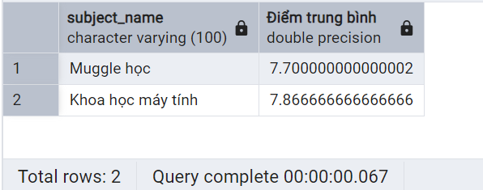

# Truy vấn dữ liệu - Phần 6

!!! abstract "Tóm lược nội dung"

    Bài này trình bày câu lệnh SELECT có dùng hàm tổng hợp và mệnh đề gom nhóm dữ liệu.

## Yêu cầu về cơ sở dữ liệu

Tiếp tục sử dụng cơ sở dữ liệu `school_db` như ở bài trước.

---

## Tính giá trị trung bình

!!! note "Hàm `AVG()`"

    Dùng để tính trung bình cộng của một thuộc tính kiểu số, bỏ qua giá trị `NULL`.

---

## Kết hợp với `INNER JOIN` và `GROUP BY`

Ví dụ:  
**Yêu cầu:**

Nhằm đánh giá chất lượng giảng dạy, hãy tính giá trị trung bình của cột điểm cuối kỳ theo từng môn. Kết quả trả về phải có tên môn học cụ thể.

**Phân tích:**

{loading=lazy}

1\. Quan sát lược đồ trên, ta thấy điểm cuối kỳ được lưu trong bảng `scores`, tên môn học được lưu trong bảng `subjects`.

Do đó, ta liên kết hai bảng này bằng `INNER JOIN`.

2\. Để biết điểm trung bình của tất cả học sinh trong trường, ta dùng hàm `AVG` đối với cột `final_test`.

3\. Để phân theo từng môn, ta thực hiện gom nhóm các mẫu tin theo tên môn.

Như vậy, mệnh đề `GROUP BY` sẽ là `group by subject_name`.

**Cách thực hiện:**

1\. Viết mã lệnh SQL.

```sql linenums="1"
-- Tính giá trị trung bình của cột điểm cuối kỳ theo từng môn
select subject_name, avg(final_test) as "Điểm trung bình"
from scores
inner join subjects using(subject_id)
group by subject_name;
```

2\. Chạy câu lệnh trên, kết quả như sau:

{loading=lazy width=300}

---

## Kết hợp với `INNER JOIN`, `WHERE` và `GROUP BY`

Ví dụ:  
**Yêu cầu:**

Tính giá trị trung bình của cột điểm cuối kỳ cho riêng môn Khoa học máy tính.

**Phân tích:**

Truy vấn này tương tự truy vấn trên, nhưng chỉ lấy môn Khoa học máy tính.

Như vậy, ta thêm mệnh đề `WHERE` vô truy vấn: `where subject_name = 'Khoa học máy tính'`.

**Cách thực hiện:**

1\. Viết mã lệnh SQL.

```sql linenums="7"
-- Tính giá trị trung bình của cột điểm cuối kỳ cho riêng môn Khoa học máy tính
select subject_name, avg(final_test) as "Điểm trung bình"
from scores
inner join subjects using(subject_id)
where subject_name = 'Khoa học máy tính'
group by subject_name;
```

2\. Chạy câu lệnh trên, kết quả như sau:

{loading=lazy width=360}

---

## Kết hợp với `INNER JOIN`, `GROUP BY` và `HAVING`

Ví dụ:  
**Yêu cầu:**

Lọc ra các môn mà giá trị trung bình của cột điểm cuối kỳ lớn hơn 7.

**Phân tích:**

Truy vấn này tương tự truy vấn trên, nhưng không lấy môn Khoa học máy tính, mà lấy các môn nào có giá trị trung bình lớn hơn 7.

Như vậy, ta bỏ mệnh đề `WHERE` của truy vấn trên, thay bằng mệnh đề `HAVING`: `having avg(final_test) > 7`.

**Cách thực hiện:**

1\. Viết mã lệnh SQL.

```sql linenums="14"
-- Lọc ra các môn mà giá trị trung bình của cột điểm cuối kỳ lớn hơn 7
select subject_name, avg(final_test) as "Điểm trung bình"
from scores
inner join subjects using(subject_id)
group by subject_name
having avg(final_test) > 7;
```

2\. Chạy câu lệnh trên, kết quả như sau:

{loading=lazy width=360}

---

## Mã nguồn

Code đầy đủ được đặt tại:

- [GitHub](https://github.com/vtchitruong/gdpt-2018/blob/main/grade-11/topic-f2/school_db_select_6.sql){target="_blank"}