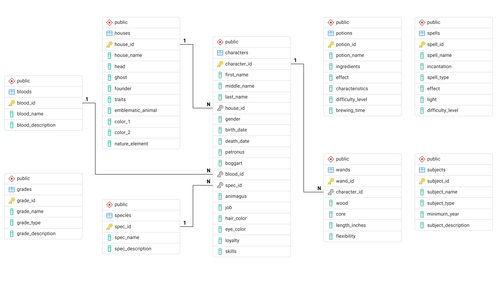

# Thực hành truy vấn dữ liệu - Phần 3

!!! abstract "Tóm lược nội dung"

    Bài này hướng dẫn truy vấn cơ sở dữ liệu Hogwarts.

## Yêu cầu về cơ sở dữ liệu

1\. Tải về [tập tin hogwarts-script.sql](https://github.com/vtchitruong/gdpt-2018/blob/main/grade-11/topic-f2/hogwarts-script.sql){:target="_blank"}.

{loading=lazy}

2\. Mở tập tin bằng pgAdmin của PostgreSQL.

3\. Lần lượt chạy từng đoạn mã trong tập tin để tạo cơ sở dữ liệu `hogwarts` [^1].

[^1]: Dữ liệu được tham khảo từ tập tin .csv tại website [Kaggle](https://www.kaggle.com/), và đã được bổ sung cũng như chuyển đổi để phù hợp với PostgreSQL.

    Dữ liệu có thể chưa đúng hoàn toàn với nguyên tác của Harry Potter. Nếu bạn phát hiện sai sót, xin vui lòng góp ý để chúng tôi điều chỉnh.

---

## Lược đồ cơ sở dữ liệu

Hình sau là lược đồ cơ sở dữ liệu Hogwarts:

{loading=lazy}

---

## Truy vấn 1

### Đề bài

Hãy cho biết người sáng lập nhà Slytherin và hai màu sắc đặc trưng của nhà này.

### Cách giải đề xuất

??? tip "Ý tưởng chính"

    **1\. Xác định cột dữ liệu:**
    
    Theo yêu cầu, ta cần hiển thị các cột: tên nhà(`house_name`), người sáng lập `founder`, màu sắc (`color_1` và `color_2`).

    **2\. Xác định bảng:**
    
    Các cột này đều nằm trong bảng `houses`.
    
    **3\. Xác định điều kiện:**
    
    `house_name = 'Slytherin'`.

??? tip "Viết truy vấn"

    ```sql linenums="2"
    SELECT
        house_name,
        founder,
        color_1,
        color_2
    FROM
        houses
    WHERE
        house_name = 'Slytherin';
    ```

---

## Truy vấn 2

### Đề bài

Hãy cho biết huyết thống lai (half-blood) là huyết thống như thế nào.

### Cách giải đề xuất

??? tip "Ý tưởng chính"

    **1\. Xác định cột dữ liệu:**
    
    Theo yêu cầu, ta cần hiển thị hai cột là tên huyết thống (`blood_name`) và mô tả huyết thống (`blood_description`).

    **2\. Xác định bảng:**
    
    Các cột này đều nằm trong bảng `bloods`.
    
    **3\. Xác định điều kiện:**

    Trong thực tế, dữ liệu chuỗi có thể bị viết hoa hoặc viết thường không đồng bộ. Để bảo đảm truy vấn không bỏ sót kết quả, ta dùng hàm `lower()` để chuyển đổi dữ liệu về dạng chữ thường trước khi so khớp với chuỗi `'half-blood'`: `lower(blood_name) = 'half-blood'`.

??? tip "Viết truy vấn"

    ```sql linenums="13"
    SELECT
        blood_name,
        blood_description
    FROM
        bloods
    WHERE
        lower(blood_name) = 'half-blood';
    ```

---

## Truy vấn 3

### Đề bài

Có bao nhiêu câu thần chú nguyền rủa và bùa ám?

### Cách giải đề xuất

??? tip "Ý tưởng chính"

    **1\. Xác định cột dữ liệu:**
    
    Vì yêu cầu của đề bài là thống kê số lượng nên ta dùng hàm `count(*)` để đếm số mẫu tin thỏa điều kiện.

    Ta có thể đặt tên cho cột này là `"Số lời nguyền"` bằng từ khóa `AS`.

    **2\. Xác định bảng:**
    
    Toàn bộ dữ liệu về các câu thần chú nằm trong bảng `spells`.

    **3. Xác định điều kiện:**
    
    Ta chỉ quan tâm đến các mẫu tin tại cột loại thần chú (`spell_type`) mà có giá trị là `'curse'` hoặc `'jinx'`: `lower(spell_type) = 'curse' or lower(spell_type) = 'jinx'`.

    Lưu ý:  
    Mặc dù diễn đạt của yêu cầu là "và", ta phải dùng toán tử `OR`, vì `spell_type` chỉ mang một trong hai giá trị, không thể mang cùng lúc cả hai, và giá trị nào ta cũng tính chung vào thống kê.

??? tip "Viết truy vấn"

    ```sql linenums="22"
    SELECT
        count(*) AS "Số lời nguyền"
    FROM
        spells
    WHERE
        lower(spell_type) = 'curse'
        OR lower(spell_type) = 'jinx';
    ```

---

## Truy vấn 4

### Đề bài

Liệt kê các môn học bắt buộc (`core`). Đồng thời hiển thị kết quả theo thứ tự bảng chữ cái đối với tên môn.

### Cách giải đề xuất

??? tip "Ý tưởng chính"

    **1\. Xác định cột:**
    
    Theo yêu cầu, ta cần hiển thị hai cột là tên môn (`subject_name`) và loại môn (`subject_type`).

    **2\. Xác định bảng:**
    
    Các cột này đều nằm trong bảng `subjects`.
    
    **3\. Xác định điều kiện:**
    
    Chỉ lấy các môn có giá trị là `'core'`: `lower(subject_type) = 'core'`.

    **4\. Sắp xếp thứ tự:**
    
    Sắp xếp tăng dần (từ A đến Z) theo cột `subject_name`. Không cần viết `ASC` do thứ tự tăng dần là mặc định.
    
??? tip "Viết truy vấn"

    ```sql linenums="31"
    SELECT
        subject_name,
        subject_type
    FROM
        subjects
    WHERE
        lower(subject_type) = 'core'
    ORDER BY
        subject_name;
    ```

---

## Truy vấn 5

### Đề bài

Dựa vào phần mô tả, hãy kể ra các chủng loại là người hoặc biến thể người hoặc có liên quan đến người.

### Cách giải đề xuất

??? tip "Ý tưởng chính"

    **1\. Xác định cột:**
    
    Theo yêu cầu, ta cần hiển thị hai cột là tên chủng loại (`spec_name`) và mô tả chủng loại (`spec_description`).

    **2\. Xác định bảng:**
    
    Các cột này đều nằm trong bảng `species`.
    
    **3\. Xác định điều kiện:**
    
    Vì từ khóa "human" hoặc "homo" có thể nằm ở bất kỳ đâu trong đoạn mô tả nên ta không thể dùng toán tử `=` mà phải dùng toán tử `LIKE` kết hợp với ký tự đại diện `%`.
    
    Ngoài ra, vì còn có một từ khóa khác chỉ người, đó là "homo", nên ta dùng toán từ `OR` để kết hợp hai điều kiện.

    Như vậy, điều kiện để trích xuất dữ liệu là: `lower(spec_description) like '%human%' OR lower(spec_description) like '%homo%'`.

??? tip "Viết truy vấn"

    ```sql linenums="42"
    SELECT
        spec_name,
        spec_description
    FROM
        species
    WHERE
        lower(spec_description) like '%human%'
        OR lower(spec_description) like '%homo%';
    ```

---

## Truy vấn 6

### Đề bài

Hãy liệt kê năng lực nổi bật của các thành viên trong gia đình Weasley. Dữ liệu kết quả phải có họ tên đầy đủ, được sắp xếp tăng dần theo họ; trường hợp trùng họ thì sắp xếp giảm dần theo tên.

### Cách giải đề xuất

??? tip "Ý tưởng chính"

    **1\. Xác định cột:**
    
    Theo yêu cầu, ta cần hiển thị các cột gồm: tên (`first_name`), tên đệm (`middle_name`), họ (`last_name`) và năng lực (`skills`).

    **2\. Xác định bảng:**
    
    Các cột này đều nằm trong bảng `characters`.
    
    **3\. Xác định điều kiện:**

    Ta dùng ký tự đại diện `%` để tìm các họ có chuỗi `'weasley'`.

    Trong PostgreSQL, thay vì dùng hàm `lower()` để viết thường, ta có thể dùng toán tử `ILIKE`, là một biến thể của `LIKE`, để so khớp chuỗi mà không phân biệt chữ in hay thường.

    Như vậy, điều kiện để trích xuất dữ liệu là: `last_name ilike '%weasley%'`.

    Trong thực tế, dữ liệu chuỗi có thể bị viết hoa hoặc viết thường không đồng bộ. Để bảo đảm truy vấn không bỏ sót kết quả, ta dùng hàm `lower()` để chuyển đổi dữ liệu về dạng chữ thường trước khi so khớp với chuỗi `'half-blood'`: `lower(blood_name) = 'half-blood'`.

    **4\. Sắp xếp thứ tự:**
    
    Theo yêu cầu, ta phải sắp xếp đa tầng. Nghĩa là, tầng 1 được ưu tiên sắp xếp trước. Nếu dữ liệu tầng 1 bị trùng thì sắp xếp theo tầng tiếp theo.

    - Tầng 1: `last_name` tăng dần, ta không cần viết `ASC`.
    - Tầng 2: `first_name` giảm dần, ta viết `DESC`.

??? tip "Viết truy vấn"

    ```sql linenums="52"
    SELECT
        first_name,
        middle_name,
        last_name,
        skills
    FROM
        characters
    WHERE
        last_name ilike '%weasley%'
    ORDER BY last_name,
        first_name desc;
    ```

---

## Truy vấn 7

### Đề bài

Hãy cho biết thông tin chi tiết về đũa phép của Tom Riddle.

### Cách giải đề xuất

??? tip "Ý tưởng chính"

    **1\. Xác định cột dữ liệu:**
    
    Theo yêu cầu, ta cần hiển thị: thông tin nhân vật liên quan gồm cột `first_name` và `last_name`, thông tin về đũa phép gồm cột `wood` và `core`.

    **2\. Xác định bảng:** 
    
    Dùng mệnh đề `INNER JOIN` để liên kết bảng `characters` và bảng `wands`.

    Vì cả hai bảng này đều có chung cột `character_id` nên ta dùng mệnh đề `USING (character_id)`.

    **3. Xác định điều kiện:**
    
    Vì cần xác định một nhân vật cụ thể nên ta dùng toán tử `AND` để kết hợp cả họ và tên: `first_name = 'Tom' AND last_name = 'Riddle'`.

??? tip "Viết truy vấn"

    ```sql linenums="1"
    SELECT
        first_name,
        last_name,
        wood,
        core
    FROM
        characters
    INNER JOIN 
        wands USING (character_id)
    WHERE 
        first_name = 'Tom'
        AND last_name = 'Riddle';
    ```

---

## Mã nguồn

Code đầy đủ được đặt tại:

- [GitHub](https://github.com/vtchitruong/gdpt-2018/blob/main/grade-11/topic-f2/retrieve-data-from-tables-practice-3.sql){target="_blank"}