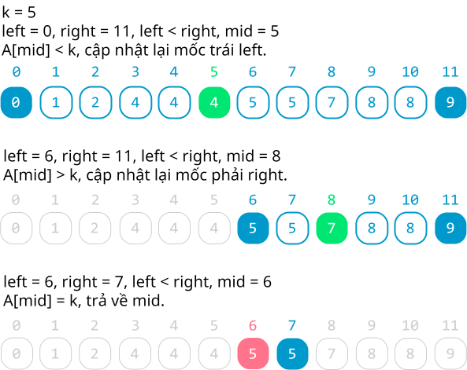
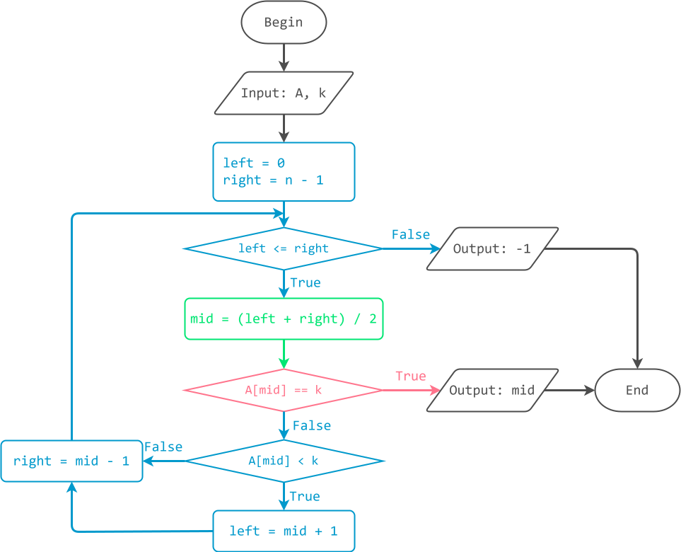

# Tìm kiếm nhị phân

!!! abstract "Tóm lược nội dung"

    Bài này trình bày thuật toán tìm kiếm nhị phân.

## Bài toán và thuật toán tìm kiếm

Tương tự [bài học trước](../topic-F2/searching-algorithm-linear-search.md/#bai-toan-va-thuat-toan-tim-kiem){:target="_blank"}, ta chỉ xét bài toán đơn giản là tìm kiếm phần tử có tồn tại hay không trên mảng một chiều.

## Thuật toán tìm kiếm nhị phân

### Ý tưởng

Hãy tưởng tượng tình huống tìm một thuật ngữ bắt đầu bằng chữ cái T trong từ điển. Vì các mục từ trong từ điển đều đã được sắp xếp theo thứ tự bảng chữ cái nên ta không cần lật tìm những trang có chữ cái đầu là A, B hay C, mà chỉ cần lật ngay đến trang có chữ cái đầu là T. Thao tác cứ thế tiếp tục đối với những chữ cái tiếp theo của thuật ngữ cần tìm.

Áp dụng cách trên cho mảng, ta thực hiện hai thao tác:

1. Chia mảng `A` thành hai mảng con *trái* và *phải*.
2. Xét xem `k` nằm ở mảng con nào.

Lặp lại nhiều lần hai thao tác này cho đến khi tìm thấy `k` hoặc không còn chia đôi mảng được nữa. Cụ thể như sau:

!!! note "Thuật toán tìm kiếm nhị phân"

    Đặt mốc trái `left` là `0`, mốc phải `right` là `n - 1`, tức vị trí cuối của mảng `A`.

    Dùng vòng lặp while, trong khi mốc `left` vẫn chưa vượt quá mốc `right`, lặp các thao tác sau:
    
    - Xác định mốc giữa `mid`: (`left` + `right`) / 2, lấy phần nguyên.
    - Nếu `A[mid]` bằng `k` thì `mid` trả về `mid`, chính là vị trí tìm thấy, trả về `mid`.
    - Nếu `A[mid]` nhỏ hơn `k` thì *dời* mốc `left`: `left = mid + 1` để xét mảng con bên phải.
    - Nếu `A[mid]` lớn hơn `k` thì *dời* mốc `right`: `right = mid - 1` để xét mảng con bên trái.

    Nếu mốc `left` đã vượt quá mốc `right` mà chưa có `mid` nào trả về thì trả về `-1`. (`-1` là tín hiệu quy ước cho biết không tìm thấy)  

### Ví dụ

<figure markdown="span">
{loading=lazy width=600px}
<figcaption>Tiến trình tìm kiếm nhị phân</figcaption>
</figure>

### Lưu đồ thuật toán

{loading=lazy width=720px}

### Trực quan hóa thuật toán

<div>
    <iframe width="100%" height="680px" frameBorder=0 src="../visualize/binary-search.html"></iframe>
</div>

### Chương trình minh họa

``` py linenums="1"
# Hàm tìm kiếm nhị phân
def binarySearch(A, k):
    # Khởi tạo mốc trái và mốc phải
    left = 0
    right = len(A) - 1
    
    # Trong khi left chưa vượt quá right
    # thì xác định vị trí mid và xét k
    while left <= right:
        
        mid = (left + right) // 2
        
        if A[mid] == k:
            return mid
        elif A[mid] < k:
            left = mid + 1
        else:
            right = mid - 1

    # Trả về -1, không tìm thấy
    return -1


# Chương trình chính
if __name__ == '__main__':
    array = [0, 1, 2, 4, 4, 4, 5, 5, 7, 8, 8, 9]
    key = 5

    found_at = binarySearch(array, key)
    if found_at == -1:
        print(f'Không tìm thấy key = {key}')
    else:
        print(f'Tìm thấy key = {key} tại vị trí {found_at}')
```

Output:
``` pycon
Tìm thấy key = 5 tại vị trí 6
```

!!! question "Câu hỏi 1"

    Bạn có nhận xét gì về mảng trong chương trình này so với mảng trong chương trình tìm kiếm tuần tự?

    ??? tip "Đáp án"

        Trong chương trình này, mảng có thứ tự tăng dần, trong khi mảng của chương trình tìm kiếm tuần tự lại không có thứ tự.

!!! note "Nhận xét"
    
    Muốn thực hiện tìm kiếm nhị phân, trước hết mảng phải được sắp thứ tự, hoặc tăng dần hoặc giảm dần.  

## So sánh hai thuật toán tìm kiếm

### Giống nhau

Cả hai thuật toán đều áp dụng cho mảng.

### Khác nhau

Hai thuật toán có một vài khác biệt chủ yếu sau:

| | Tìm kiếm tuần tự | Tìm kiếm nhị phân |
| --- | --- | --- |
| Ý tưởng | Xét từng phần tử từ đầu mảng cho đến khi tìm thấy. | Xét xem phần tử cần tìm nằm ở nửa trái hay nửa phải của mảng. |
| Vị trí tìm thấy | Là vị trí xuất hiện đầu tiên tính từ đầu mảng. | Có thể là bất kỳ vị trí nào. |  
| Áp dụng | Phù hợp cho tập hợp dữ liệu nhỏ và không có thứ tự. | Phù hợp cho tập dữ liệu lớn và đã sắp xếp thứ tự. |
| Độ phức tạp thời gian | $O(n)$ | $O(log n)$ |

## Sơ đồ tóm tắt nội dung

{!grade-11/topic-F2/searching-algorithm-binary-search.mm.md!}
*Sơ đồ tóm tắt bài toán tìm kiếm và thuật toán tìm kiếm nhị phân*

## Google Colab

Các đoạn mã trong bài này được đặt tại <a href="https://colab.research.google.com/drive/1xhy3RfkEaeQQuWfXm1b5Ev_txYnw9jjr?usp=sharing" target="_blank">Google Colab</a> để bạn có thể thử nghiệm theo cách của riêng mình.

## Some English words

| Vietnamese | Tiếng Anh | 
| --- | --- |
| bài toán tìm kiếm | searching problem |
| so sánh | compare |
| thuật toán tìm kiếm | searching algorithm |
| tìm kiếm nhị phân | binary search | 
| tìm thấy, không tìm thấy | found, not found |