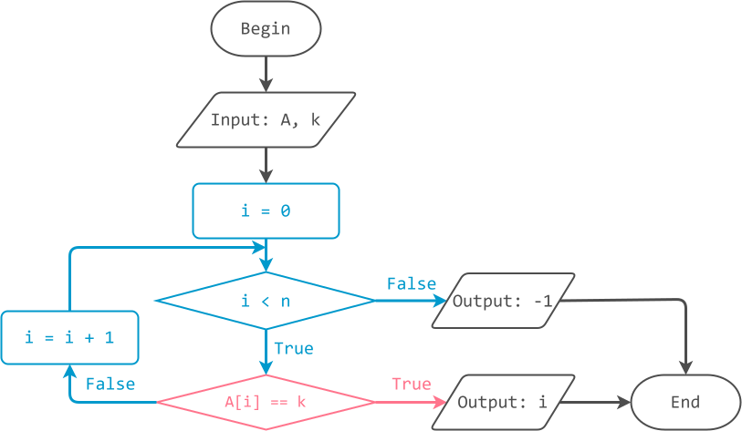

# Tìm kiếm tuần tự

!!! abstract "Tóm lược nội dung"

    Bài này trình bày bài toán tìm kiếm và thuật toán tìm kiếm tuần tự.

## Đặt vấn đề

Nhu cầu về thông tin của con người là thiết yếu, trong khi lượng dữ liệu lưu trữ trên các hệ thống là rất lớn. Làm sao con người có thể truy xuất được ngay thông tin mình cần trong bể thông tin rộng lớn đó?

## Bài toán và thuật toán tìm kiếm

Một cách tổng quát, bài toán tìm kiếm đề cập đến việc tìm một hoặc nhiều đối tượng thoả các yêu cầu cụ thể trong một tập hợp đối tượng có liên quan.

Trong bài này, phạm vi của bài toán tìm kiếm được giới hạn trong mảng một chiều và chỉ tìm một phần tử có giá trị *k* cho trước.  

!!! note "Bài toán tìm kiếm"
    
    Input:  
    - Mảng một chiều `A` gồm `n` phần tử đều là số nguyên.  
    - Giá trị `k` cần tìm.  

    Output:  
    - Vị trí của phần tử có giá trị `k` trong mảng `A`. Nếu không tìm thấy, trả về `-1`.  

Có nhiều thuật toán tìm kiếm khác nhau ứng với các yếu tố khác nhau như: loại dữ liệu, kích thước của tập dữ liệu, cách thức tổ chức và lưu trữ dữ liệu.

Đối với bài toán vừa nêu trên, có hai thuật toán cơ bản là: **tìm kiếm tuần tự** và **tìm kiếm nhị phân**.

Bài học này chỉ đề cập thuật toán tìm kiếm tuần tự, hay còn gọi là tìm kiếm tuyến tính.

??? info "Lợi ích và ứng dụng của thuật toán tìm kiếm"

    Tìm kiếm là hoạt động tương tác với dữ liệu mang lại nhiều lợi ích quan trọng. Nó giúp phát hiện thông tin liên quan, nâng cao hiểu biết về sự vật từ dữ liệu có sẵn và hỗ trợ việc ra quyết định. Trong thời đại số hóa hiện nay, tìm kiếm đóng vai trò then chốt trong việc cải thiện khả năng tương tác với thông tin.

    Các ứng dụng phổ biến của thuật toán tìm kiếm bao gồm:

    1. Tìm kiếm mẫu thông tin: từ ngữ trong tài liệu, số điện thoại trong danh bạ, tập tin trong máy tính, sách trong thư viện.
    
    2. Truy vấn cơ sở dữ liệu: khách hàng tìm kiếm sản phẩm, giá cả, khuyến mãi trên sàn thương mại điện tử.

    3. Truy hồi thông tin: bộ máy tìm kiếm giúp người dùng truy cập tài liệu hoặc trang web liên quan từ các nguồn trên mạng.
    
    4. Tối ưu hóa giải pháp: tìm giải pháp tối ưu trong số các phương án khả thi, như tìm đường đi ngắn nhất hoặc tiết kiệm chi phí nhất.

    5. Phân tích dữ liệu: xác định mẫu thông tin, xu hướng, điểm tương quan trong tập dữ liệu để rút ra hiểu biết và kết luận.

    6. Phát hiện bất thường: giúp hệ thống xác định vấn đề tiềm ẩn, kích hoạt cảnh báo hoặc thực hiện hành động phù hợp. 

## Thuật toán tìm kiếm tuần tự

### Ý tưởng

Hãy tưởng tượng hình ảnh tất cả lá bài đều úp, ta tìm xem một lá 3 nút (bất kỳ trong số bốn lá 3 nút) nằm ở vị trí nào.

Cách làm là lần lượt lật từng lá bài lên cho đến khi thấy được lá 3 nút.

Áp dụng cách trên cho mảng, ta lần lượt, hoặc còn gọi là tuần tự, so sánh từng phần tử với giá trị `k`, bắt đầu từ phần tử đầu tiên đến phần tử cuối cùng, khi nào *bắt gặp* `k` thì dừng. Cụ thể như sau:

!!! note "Thuật toán tìm kiếm tuần tự"

    Duyệt mảng `A` từ vị trí đầu đến cuối bằng biến `i`. Ứng với mỗi `i`, thực hiện:

    &emsp;Nếu `A[i]` đang xét bằng `k` thì trả về `i`, chính là vị trí tìm thấy.  
    
    Ngược lại, nếu đã duyệt hết mảng mà vẫn chưa có `i` nào trả về, thì trả về `-1`. (`-1` là tín hiệu quy ước cho biết không tìm thấy)  

### Lưu đồ thuật toán

{loading=lazy width=720px}

### Trực quan hóa thuật toán

<div>
    <iframe width="100%" height="680px" frameBorder=0 src="../visualize/linear-search.html"></iframe>
</div>

### Chương trình minh họa

``` py linenums="1"
# Hàm tìm kiếm tuần tự
def linear_search(A, k):
    n = len(A)

    # Duyệt mảng từ vị trí đầu đến cuối, so sánh A[i] và k
    for i in range(n):
        if A[i] == k:
            return i

    # Trả về -1, không tìm thấy
    return -1


# Chương trình chính
if __name__ == '__main__':
    array = [1, 7, 4, 0, 9, 4, 8, 8, 2, 4, 5, 5]
    key = 9

    found_at = linear_search(array, key)

    if found_at == -1:
        print(f'Không tìm thấy key = {key}')
    else:
        print(f'Tìm thấy key = {key} tại vị trí {found_at}')
```

Output:
``` pycon
Tìm thấy key = 9 tại vị trí 4
```

!!! question "Câu hỏi 1"

    Giả sử `key` nhập vào là `4`.  
    Bạn hãy cho biết kết quả in ra màn hình là gì?

    <div>
    <form id="answer-form">
        <label for="userInput_1">Lời giải của bạn:</label><br>
        <textarea id="userInput_1" name="userInput_1" required></textarea>
        <textarea id="solution_1">Found at position 2</textarea><br>
        <button class="submitButton" type="button" onclick="process_answer('userInput_1', 'solution_1', 'appreciate_1')">Submit</button>
        <div id="appreciate_1"></div>
    </form>
    </div>

    ??? tip "Đáp án"

        Có ba phần tử `4` trong mảng. Thuật toán tìm kiếm tuần tự thực hiện duyệt mảng từ đầu đến cuối, nên phần tử `4` ở vị trí `2` được phát hiện đầu tiên.  
        Như vậy, kết quả in ra là `Found at position 2`.

!!! note "Nhận xét"
    
    Nếu `k` xuất hiện nhiều lần thì thuật toán tìm kiếm tuần tự chỉ trả về **vị trí xuất hiện đầu tiên** của `k` theo trình tự duyệt mảng.

Bổ sung chương trình chính để thử tìm `key = 6`.

``` py linenums="1"
# Chương trình chính
if __name__ == '__main__':
    # ...

    key = 6

    found_at = linear_search(array, key)

    if found_at == -1:
        print(f'Không tìm thấy key = {key}')
    else:
        print(f'Tìm thấy key = {key} tại vị trí {found_at}')
```

Output:
``` pycon
Không tìm thấy key = 6
```

## Sơ đồ tóm tắt nội dung

{!grade-11/topic-F2/searching-algorithm-linear-search.mm.md!}
*Sơ đồ tóm tắt bài toán tìm kiếm và thuật toán tìm kiếm tuần tự*

## Google Colab

Các đoạn mã trong bài này được đặt tại <a href="https://colab.research.google.com/drive/1t09XEPd79MLfHUT2LGX3KVdKByfLAeCq?usp=sharing" target="_blank">Google Colab</a> để bạn có thể thử nghiệm theo cách của riêng mình.

## Some English words

| Vietnamese | Tiếng Anh | 
| --- | --- |
| bài toán tìm kiếm | searching problem |
| so sánh | compare |
| thuật toán tìm kiếm | searching algorithm |
| tìm kiếm tuần tự | sequential search, linear search[^1] |
| tìm thấy, không tìm thấy | found, not found |

 [^1]: Cả hai thuật ngữ này đều có thể được sử dụng thay thế cho nhau, trong đó *linear search*, nghĩa là *tìm kiếm tuyến tính*, được sử dụng rộng rãi hơn trong các tài liệu nước ngoài. Song bằng một cách nào đó, sách giáo khoa ở nước ta dịch là *tìm kiếm tuần tự*.  