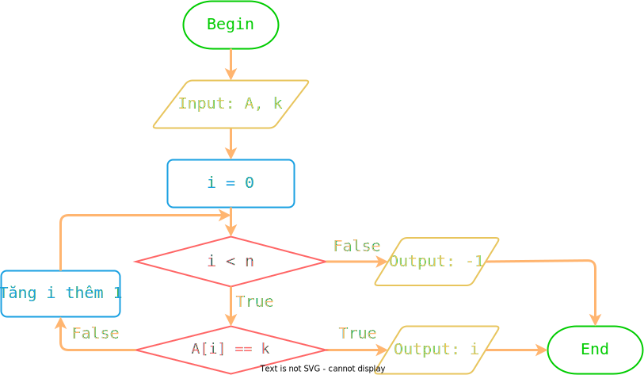
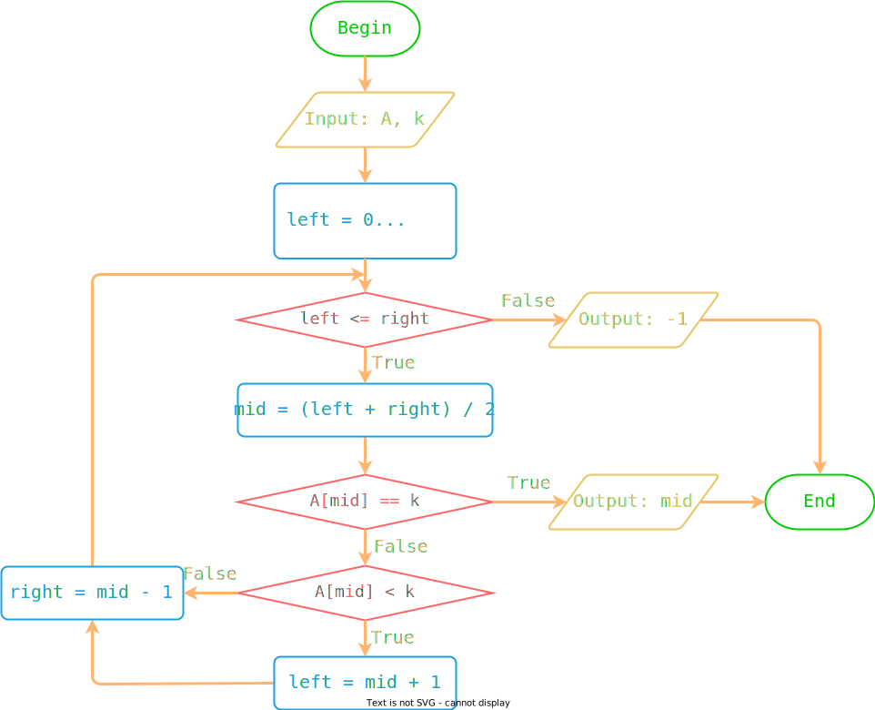

# Thuật toán tìm kiếm

!!! abstract "Tóm lược nội dung"

    Bài này trình bày hai thuật toán tìm kiếm là: tuần tự và nhị phân.

## Đặt vấn đề

Nhu cầu về thông tin của con người là thiết yếu, trong khi lượng dữ liệu lưu trữ trên các hệ thống là rất lớn. Làm sao con người có thể truy xuất được ngay thông tin mình cần trong bể thông tin cực lớn đó?

## Bài toán tìm kiếm

### Phát biểu bài toán tìm kiếm

Bài toán tìm kiếm đề cập đến việc tìm ra những phần tử cụ thể trong một tập hợp cho trước.

Trong bài này, phạm vi của bài toán tìm kiếm được giới hạn trong mảng một chiều và chỉ tìm một phần tử có giá trị *k* cho trước.  

!!! note "Phát biểu bài toán tìm kiếm trên mảng"
    
    Input:  
    - Mảng một chiều *A* gồm *n* phần tử đều là số nguyên.  
    - Giá trị *k* của phần tử cần tìm.  

    Output:  
    - Vị trí của phần tử *k* trong mảng *A*. Nếu không tìm thấy, trả về *-1*.  

??? info "Lợi ích và ứng dụng của bài toán tìm kiếm"

    Tìm kiếm là hoạt động tương tác với dữ liệu đem lại nhiều lợi ích, chẳng hạn như giúp phát hiện ra thông tin liên quan, giúp hiểu rõ hơn về sự vật từ lượng dữ liệu khổng lồ, giúp đưa ra quyết định. Bài toán và thuật toán tìm kiếm giúp cải thiện khả năng tương tác với thông tin trong thế giới số ngày nay.

    Bài toán tìm kiếm diễn ra trong những tình huống sau:  
    - Tìm một mẫu thông tin trong hệ thống. Đó có thể là từ ngữ trong tài liệu, số điện thoại trong danh bạ, tập tin trong máy, quyển sách trong thư viện.
    - Truy vấn cơ sở dữ liệu để lấy được các mẫu tin liên quan. Chẳng hạn, khách hàng truy vấn cơ sở dữ liệu của sàn thương mại điện tử để tìm sản phẩm, giá cả, khuyến mãi.
    - Bộ máy tìm kiếm giúp người dùng *truy hồi* thông tin theo nhu cầu, chẳng hạn *truy hồi* những tài liệu hoặc trang web liên quan từ các tài nguyên trên mạng.  
    - Tìm giải pháp tối ưu trong số các giải pháp khả thi cho một bài toán nào đó, chẳng hạn tìm đường đi ngắn nhất hoặc tốn chi phí ít nhất.
    - Chuyên gia phân tích dữ liệu thực hiện tìm kiếm để xác định các mẫu thông tin, các xu hướng, các điểm tương quan trong các tập dữ liệu, từ đó rút ra những hiểu biết và kết luận về đối tượng liên quan.
    - Phát hiện những điểm bất thường giúp hệ thống xác định những vấn đề tiềm ẩn, để kích hoạt cảnh báo hoặc có hành động tương ứng.  
    - v.v...  

## Thuật toán tìm kiếm

Có nhiều thuật toán tìm kiếm khác nhau ứng với các yếu tố khác nhau như: loại dữ liệu, kích thước của tập dữ liệu, cách thức tổ chức và lưu trữ dữ liệu.

Đối với bài toán phát biểu ở mục trên, bài này chỉ đề cập hai thuật toán cơ bản là: **tìm kiếm tuần tự** và **tìm kiếm nhị phân**.

### Tìm kiếm tuần tự

#### Ý tưởng

Ý tưởng chính của thuật toán này là lần lượt (tuần tự) dò từng phần tử, bắt đầu từ phần tử đầu tiên đến phần tử cuối cùng (từ trái sang phải), khi nào *bắt gặp* `k` thì dừng. Cụ thể như sau:

- Duyệt mảng `A` từ đầu đến cuối, lặp thao tác sau:  
&emsp;&emsp;Nếu phần tử `A[i]` đang xét bằng `k` thì trả về `i`, là vị trí tìm thấy.  
- Nếu đã duyệt hết mảng mà vẫn chưa có `i` nào, thì trả về `-1`. (`-1` là tín hiệu quy ước cho biết không tìm thấy)  

#### Lưu đồ thuật toán

<figure markdown>
  {loading=lazy}
  <figcaption>Hình 1. Lưu đồ thuật toán tìm kiếm tuần tự</figcaption>
</figure>

#### Chương trình minh họa
``` py linenums="1"
# Hàm tìm kiếm tuần tự
def linear_search(A, k):
    for i in range(len(A)):  # Duyệt mảng từ đầu đến cuối
        if A[i] == k:        # Nếu phần tử đang xét A[i] bằng k
            return i         # thì trả về i
    return -1                # Trả về -1


# Chương trình chính
array = [1, 7, 4, 0, 9, 4, 8, 8, 2, 4]
key = int(input('Please enter the key to be searched for: '))

found_position = linear_search(array, key)  # Gọi hàm linear_search

if found_position == -1:
    print('Not found')
else:
    print('Found at position', found_position)
```

Output:
``` pycon
Please enter the key to be searched for: 8
Found at position 6
```

!!! note "Nhận xét"
    
    Nếu `k` xuất hiện nhiều lần trong mảng, thì thuật toán tìm kiếm tuần tự sẽ trả về **vị trí xuất hiện đầu tiên** của `k` theo trình tự duyệt mảng.  

!!! question "Câu hỏi 1"

    Giả sử `key` nhập vào là `4`.  
    Bạn hãy cho biết kết quả in ra màn hình là gì?

    <div>
    <form id="answer-form">
        <label for="userInput_1">Lời giải của bạn:</label><br>
        <textarea id="userInput_1" name="userInput_1" required></textarea>
        <textarea id="solution_1">Found at position 2</textarea><br>
        <button class="submitButton" type="button" onclick="process_answer('userInput_1', 'solution_1', 'appreciate_1')">Submit</button>
        <div id="appreciate_1"></div>
    </form>
    </div>

    ??? tip "Đáp án"

        Có ba phần tử `4` trong mảng. Thuật toán tìm kiếm tuần tự thực hiện duyệt mảng từ đầu đến cuối, nên phần tử `4` ở vị trí `2` được phát hiện đầu tiên.  
        Như vậy, kết quả in ra là `Found at position 2`.

### Tìm kiếm nhị phân

#### Ý tưởng

Ý tưởng chính của thuật toán này gồm hai thao tác:

1. Chia mảng gốc thành hai mảng con *trái* và *phải*.
2. Xét xem `k` nằm ở mảng con nào.

Lặp đi lặp lại hai thao tác này cho đến khi tìm thấy `k` hoặc không còn chia đôi mảng được nữa.

Cụ thể như sau:

- Đặt mốc trái `left` là `0`, mốc phải `right` là vị trí cuối của mảng, tức `n - 1`.  

- Trong khi mốc `left` vẫn chưa vượt quá mốc `right`, lặp các thao tác sau:  
    - Xác định mốc giữa `mid` bằng cách lấy `left` cộng `right` chia 2.
    - Nếu `A[mid]` bằng `k` thì `mid` chính là vị trí tìm thấy, trả về `mid`.
    - Nếu `A[mid]` nhỏ hơn `k` thì *dời* mốc `left`: `left = mid + 1` để xét mảng con bên phải.
    - Nếu `A[mid]` lớn hơn `k` thì *dời* mốc `right`: `right = mid - 1` để xét mảng con bên trái.

- Nếu mốc `left` đã vượt quá mốc `right` mà chưa có `mid` nào trả về thì trả về -1. (-1 là tín hiệu quy ước cho biết không tìm thấy)  

#### Lưu đồ thuật toán

<figure markdown>
  {loading=lazy}
  <figcaption>Hình 2. Lưu đồ thuật toán tìm kiếm nhị phân</figcaption>
</figure>

#### Chương trình minh họa

``` py linenums="1"
# Hàm tìm kiếm nhị phân
def binary_search(A, k):
    left = 0                       # Mốc trái
    right = len(A) - 1             # Mốc phải

    while left <= right:           # Trong khi mốc trái chưa vượt quá mốc phải
        mid = (left + right) // 2  # thì xác định mốc giữa

        if A[mid] == k:            # Nếu phần tử giữa bằng k
            return mid             # thì trả về mốc giữa
        elif A[mid] < k:           # Nếu phần tử giữa nhỏ hơn k
            left = mid + 1         # thì xét đoạn bên phải
        else:                      # Ngược lại, phần tử giữa lớn hơn k
            right = mid - 1        # thì xét đoạn bên trái

    return -1  # Trả về -1


# Chương trình chính
array = [0, 1, 2, 4, 4, 4, 7, 8, 8, 9]
key = int(input('Please enter the key to be searched for: '))

found_position = binary_search(array, key)  # Gọi hàm binary_search

if found_position == -1:
    print('Not found')
else:
    print('Found at position', found_position)
```

Output:
``` pycon
Please enter the key to be searched for: 8
Found at position 7
```

!!! question "Câu hỏi 2"

    Bạn có nhận xét gì về mảng trong chương trình này so với mảng trong chương trình tìm kiếm tuần tự?

    ??? tip "Đáp án"

        Trong chương trình này, mảng có thứ tự tăng dần, trong khi mảng của chương trình tìm kiếm tuần tự lại không có thứ tự.

!!! note "Nhận xét"
    
    Muốn thực hiện tìm kiếm nhị phân, trước hết mảng phải được sắp thứ tự, hoặc tăng dần hoặc giảm dần.  

## So sánh

### Giống nhau

Cả hai thuật toán đều áp dụng cho mảng hoặc danh sách.

### Khác nhau

Hai thuật toán có một vài khác biệt chủ yếu sau:

| | Tìm kiếm tuần tự | Tìm kiếm nhị phân |
| --- | --- | --- |
| Ý tưởng | Xét từng phần tử từ đầu mảng cho đến khi tìm thấy. | Xét xem phần tử cần tìm nằm ở nửa trái hay nửa phải của mảng. |
| Vị trí tìm thấy | Là vị trí xuất hiện đầu tiên tính từ đầu mảng. | Có thể là bất kỳ vị trí nào. |  
| Áp dụng | Phù hợp cho tập hợp dữ liệu nhỏ và không có thứ tự. | Phù hợp cho tập dữ liệu lớn và đã sắp xếp thứ tự. |
| Độ phức tạp thời gian | $O(n)$ | $O(log n)$ |

## Sơ đồ tóm tắt nội dung

{!grade-11/topic-F2/searching-algorithm.mm.md!}
*Hình 3. Sơ đồ tóm tắt thuật toán tìm kiếm*

## Google Colab

Các đoạn mã trong bài này được đặt tại <a href="https://colab.research.google.com/drive/1xhy3RfkEaeQQuWfXm1b5Ev_txYnw9jjr?usp=sharing" target="_blank">Google Colab</a> để bạn có thể thử nghiệm theo cách của riêng mình.

## Some English words

| Vietnamese | Tiếng Anh | 
| --- | --- |
| bài toán và thuật toán tìm kiếm | searching problem, searching algorithm |
| tìm kiếm nhị phân | binary search | 
| tìm kiếm tuần tự | sequential search, linear search[^1] | 

 [^1]: Cả hai thuật ngữ này đều có thể được sử dụng thay thế cho nhau, trong đó *linear search*, nghĩa là *tìm kiếm tuyến tính*, được sử dụng rộng rãi hơn trong các tài liệu nước ngoài. Song bằng một cách nào đó, sách giáo khoa ở nước ta dịch là *tìm kiếm tuần tự*.  