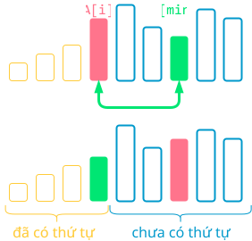
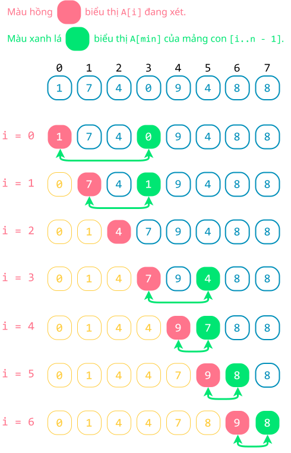
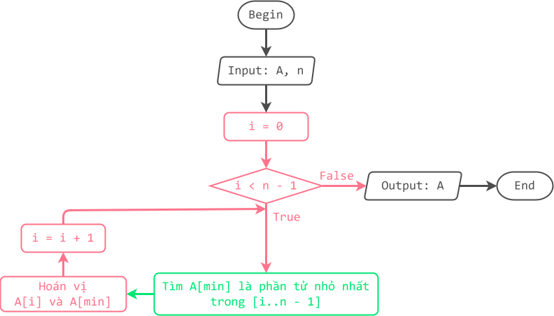

# Sắp xếp chọn

!!! abstract "Tóm lược nội dung"

    Bài này trình bày bài toán sắp xếp và thuật toán sắp xếp chọn.

## Đặt vấn đề

Với bảng điểm của lớp, làm sao để lấy ra 10 bạn có điểm số cao nhất hoặc thấp nhất?

Một cách làm đơn giản là ta sắp xếp bảng điểm trước, sau đó mới lấy ra 10 phần tử đầu tiên hoặc 10 phần tử cuối cùng tùy theo yêu cầu.

## Bài toán và thuật toán sắp xếp

Sắp xếp dữ liệu là tác vụ cơ bản và quan trọng trong xử lý dữ liệu, tạo thuận lợi cho việc tìm kiếm, truy xuất và phân tích dữ liệu.

Sắp xếp dữ liệu là tiến trình tổ chức lại dữ liệu theo một trật tự có nghĩa nào đó, thường là tăng dần hoặc giảm dần.

Trong chủ đề F, ta chỉ xét bài toán đơn giản là sắp xếp mảng một chiều theo thứ tự **không giảm**, nghĩa là phần tử liền sau **lớn hơn hoặc bằng** phần tử liền trước, từ đây trở đi tạm gọi là **tăng dần**.

!!! note "Bài toán sắp xếp"
    
    Input:

    - Mảng một chiều `A` gồm `n` phần tử đều là số nguyên.  
 
    Output:

    - Mảng một chiều `A` có thứ tự tăng dần.

Có nhiều thuật toán sắp xếp khác nhau, hầu hết thực hiện thao tác so sánh các phần tử với nhau để xác định một phần tử sẽ đứng trước hay đứng sau một phần tử khác.

Bài học này đề cập thuật toán **sắp xếp chọn**.

??? info "Lợi ích và ứng dụng"
        
    Trong lập trình, sắp xếp dữ liệu giúp cho tập dữ liệu trở nên dễ đọc hơn cũng như việc tìm kiếm và xử lý dữ liệu thuận tiện hơn.

    Nhìn chung, thuật toán sắp xếp có hai loại ứng dụng: hỗ trợ tìm kiếm thông tin và so khớp dữ liệu. Một số bài toán liên quan là:

    - Bài toán quản lý, trong đó cần sắp xếp mã định danh, họ tên, thời gian, nơi chốn, v.v...
    - Bài toán đồ thị như Prim, Dijkstra, Kruscal, v.v..., trong đó cần sắp xếp các cạnh theo trọng số.
    - Bài toán thống kê như tìm trung vị, tìm tứ phân vị.
    - Bài toán tìm phần tử trùng lắp, trộn các tập dữ liệu, chia để trị, tìm kiếm theo khoảng.
    - Bài toán liên quan đến lập mô hình hoặc mô phỏng thế giới thực.

    Hiện nay, các ngôn ngữ lập trình và hệ thống phần mềm đã có sẵn công cụ sắp xếp để người dùng dễ dàng sử dụng. Song việc tìm hiểu các thuật toán sắp xếp vẫn là cần thiết giúp người học phát triển tư duy và kỹ năng lập trình.

## Sắp xếp chọn

### Ý tưởng

Hãy tưởng tượng, ta cần chọn đội hình gồm những cầu thủ có phong độ tốt nhất từ những cầu thủ hiện có để thi đấu.

Ta thực hiện bằng cách: chọn cầu thủ có phong độ tốt nhất, chọn cầu thủ có phong độ tốt thứ hai, chọn cầu thủ có phong độ tốt thứ ba, v.v...

Áp dụng cách trên cho mảng, nếu xem "*nhỏ nhất*" đồng nghĩa "*tốt nhất*", thì ta sẽ chọn phần tử nhỏ nhất trước, rồi chọn tiếp phần tử nhỏ nhất tiếp theo, rồi chọn tiếp phần tử nhỏ nhất tiếp theo nữa, v.v... Cụ thể như sau:

!!! note "Thuật toán sắp xếp chọn"
    
    Duyệt từng phần tử `A[i]` từ đầu đến áp cuối, lặp các thao tác sau:

    - Tìm phần tử nhỏ nhất `A[min]` của mảng con từ vị trí `i` đến cuối mảng.  
    - Hoán vị `A[i]` và `A[min]`.  

<figure markdown="span">
{loading=lazy}
<figcaption>Phác hoạ ý tưởng chính</figcaption>
</figure>

### Minh hoạ

<figure markdown="span">
{loading=lazy width=400px}
<figcaption>Tiến trình sắp xếp chọn</figcaption>
</figure>

### Lưu đồ

{loading=lazy}

### Trực quan hoá

<div>
    <iframe width="100%" height="690px" frameBorder=0 src="../visualize/selection-sort.html"></iframe>
</div>  

### Viết chương trình

Khai báo thư viện `numpy`.

```py linenums="1"
import numpy as np
```

Viết hàm `selection_sort()` để thực hiện thuật toán sắp xếp chọn.

```py linenums="4"
# Hàm select_sort() dùng để thực hiện sắp xếp chọn
def selection_sort(A):
    # n là số lượng phần tử
    n = len(A)

    # Duyệt từng phần tử A[i] trong phạm vi [0..n - 2]
    for i in range(n - 1):
        # Tìm vị trí phần tử nhỏ nhất của mảng con [i..n - 1]
        min = i
        for j in range(i + 1, n):
            if A[j] < A[min]:
                min = j

        # Hoán vị A[i] và A[min]
        A[i], A[min] = A[min], A[i]
```

Trong chương trình chính, ta gọi hàm `selection_sort()` ra thực hiện sắp xếp mảng `Array`.

```py linenums="20"
# Chương trình chính
if __name__ == '__main__':
    # Khởi tạo mảng Array
    Array = np.array([1, 7, 4, 0, 9, 4, 8, 8])

    # In mảng ban đầu
    print(f'Mảng gốc chưa có thứ tự: {Array}')

    # Gọi hàm select_sort()
    selection_sort(Array)

    # In mảng sau khi sắp xếp
    print(f'Mảng có thứ tự tăng dần: {Array}')
```

Output:

```pycon
Mảng gốc chưa có thứ tự: [1 7 4 0 9 4 8 8]
Mảng có thứ tự tăng dần: [0 1 4 4 7 8 8 9]
```

## Sơ đồ tóm tắt

<div>
    <iframe style="width: 100%; height: 360px" frameBorder=0 src="../mindmaps/selection-sort.html">Sơ đồ tóm tắt</iframe>
</div>

## Mã nguồn

Các đoạn mã trong bài được đặt tại:

1. [GitHub](https://github.com/vtchitruong/gdpt-2018/blob/main/grade-11/topic-f2/selection-sort.py){:target="_blank"}

2. [Google Colab](https://colab.research.google.com/drive/1VBtZAQbqQTRyQx1hsF0Ez68VPa5h3I7Y?usp=sharing){:target="_blank"}

## Some English words

| Vietnamese | Tiếng Anh | 
| --- | --- |
| hoán vị (hai phần tử) | swap |
| sắp xếp chọn | selection sort |
| so sánh | compare |