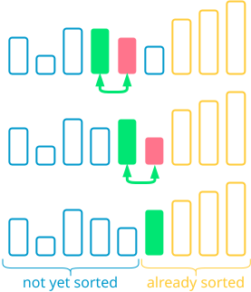
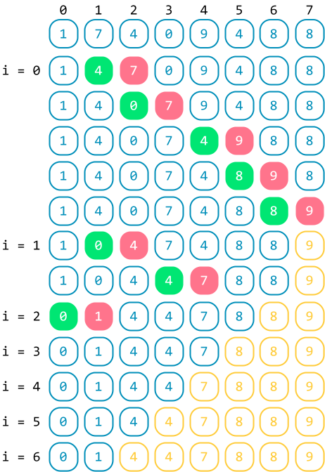
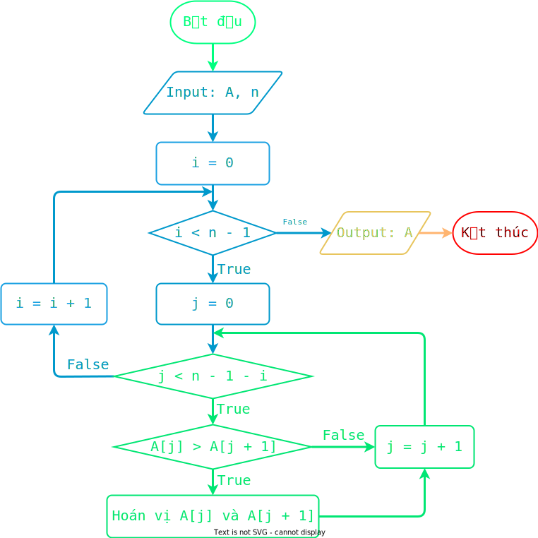

# Sắp xếp nổi bọt

!!! abstract "Tóm lược nội dung"

    Bài này trình bày thuật toán sắp xếp nổi bọt.

## Bài toán và thuật toán sắp xếp

Tương tự [bài học trước](../topic-F2/sorting-algorithm-selection-sort.md/#bai-toan-va-thuat-toan-sap-xep){:target="_blank"}, ta chỉ xét bài toán đơn giản là sắp xếp mảng một chiều các số nguyên theo thứ tự **tăng dần**.

## Thuật toán sắp xếp nổi bọt

### Ý tưởng

Hãy tưởng tượng hình ảnh các bọt nước ở dưới đáy nổi dần lên trên bề mặt. Khi ở dưới đáy, bọt nước có kích thước nhỏ và khi đến gần bề mặt, bọt nước có kích thước lớn dần.

Tạm xem đầu mảng là đáy nước và cuối mảng là bề mặt, ta sắp xếp mảng bằng cách lần lượt cho các phần tử lớn hơn *nổi lên* bề mặt. Cụ thể như sau:

!!! note "Thuật toán sắp xếp nổi bọt"

    Duyệt mảng `A` từ vị trí `0` đến áp cuối bằng biến `i`. Ứng với mỗi `i`, thực hiện:
    
    &emsp;Duyệt mảng con từ vị trí `0` đến vị trí trước `i` phần tử cuối, tức vị trí trước `n – 1 – i` (Vì `i` phần tử cuối đã đứng đúng thứ tự của chúng qua các lần duyệt của vòng lặp ngoài), bằng biến `j`. Ứng với mỗi `j`, thực hiện:

    &emsp;&emsp;So sánh và hoán vị hai phần tử cạnh nhau `A[j]` và `A[j + 1]` sao cho phần tử nhỏ hơn đứng trước và phần tử lớn hơn đứng sau.

Như vậy, sau mỗi lần lặp của vòng lặp trong (biến `j`), các phần tử lớn sẽ *trôi* về phía cuối mảng, và sau mỗi lần lặp của vòng lặp ngoài (biến `i`), phần tử lớn nhất sẽ về đúng vị trí của nó là ở cuối mảng.

Có thể thấy, với mỗi lần lặp tiếp theo của vòng lặp ngoài (biến `i`), phạm vi duyệt sẽ thu nhỏ lại, từ đầu mảng cho đến trước phần tử lớn nhất của lần duyệt trước đó.  

<figure markdown="span">
{loading=lazy}
<figcaption>Minh họa ý tưởng thuật toán sắp xếp nổi bọt</figcaption>
</figure>

### Ví dụ

<figure markdown="span">
{loading=lazy width=400px}
<figcaption>Tiến trình sắp xếp nổi bọt</figcaption>
</figure>

### Lưu đồ thuật toán

{loading=lazy width=720px}

### Trực quan hóa thuật toán

<div>
    <iframe width="100%" height="690px" frameBorder=0 src="../visualize/bubble-sort.html"></iframe>
</div>  

### Chương trình minh họa

``` py linenums="1"
# Hàm sắp xếp nổi bọt
def bubbleSort(A):
    n = len(A)

    # Duyệt mảng A từ vị trí 0 đến áp cuối
    for i in range(n - 1):
        # Duyệt mảng con từ vị trí 0 đến trước i phần tử cuối
        for j in range(n - 1 - i):
            # So sánh và hoán vị hai phần tử cạnh nhau
            if A[j] > A[j + 1]:
                A[j], A[j + 1] = A[j + 1], A[j]


# Chương trình chính
if __name__ == '__main__':
    array = [1, 7, 4, 0, 9, 4, 8, 8]
    print(f'Mảng gốc chưa có thứ tự: {array}')
    bubbleSort(array)
    print(f'Mảng có thứ tự tăng dần: {array}')
```

Output:

```pycon
Mảng gốc chưa có thứ tự: [1, 7, 4, 0, 9, 4, 8, 8]
Mảng có thứ tự tăng dần: [0, 1, 4, 4, 7, 8, 8, 9]
```

## Sơ đồ tóm tắt nội dung

{!grade-11/topic-F2/sorting-algorithm-bubble-sort.mm.md!}
*Sơ đồ tóm tắt bài toán sắp xếp và thuật toán sắp xếp nổi bọt*

## Google Colab

Các đoạn mã trong bài này được đặt tại <a href="https://colab.research.google.com/drive/1c3INW2H5BhjXAfn18KiXWXlA0vLvDo7n?usp=sharing" target="_blank">Google Colab</a> để bạn có thể thử nghiệm theo cách của riêng mình.

## Some English words

| Vietnamese | Tiếng Anh | 
| --- | --- |
| hoán vị (hai phần tử) | swap |
| sắp xếp nổi bọt | bubble sort |
| so sánh | compare |