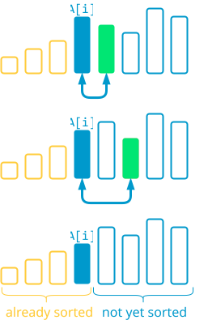
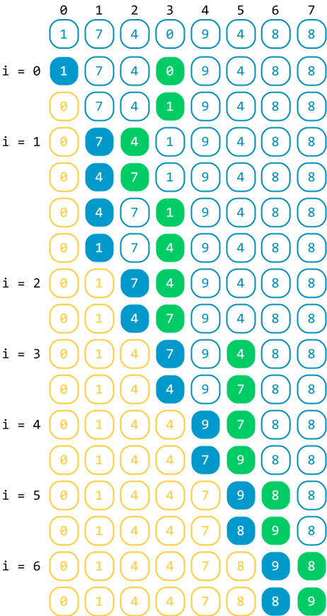
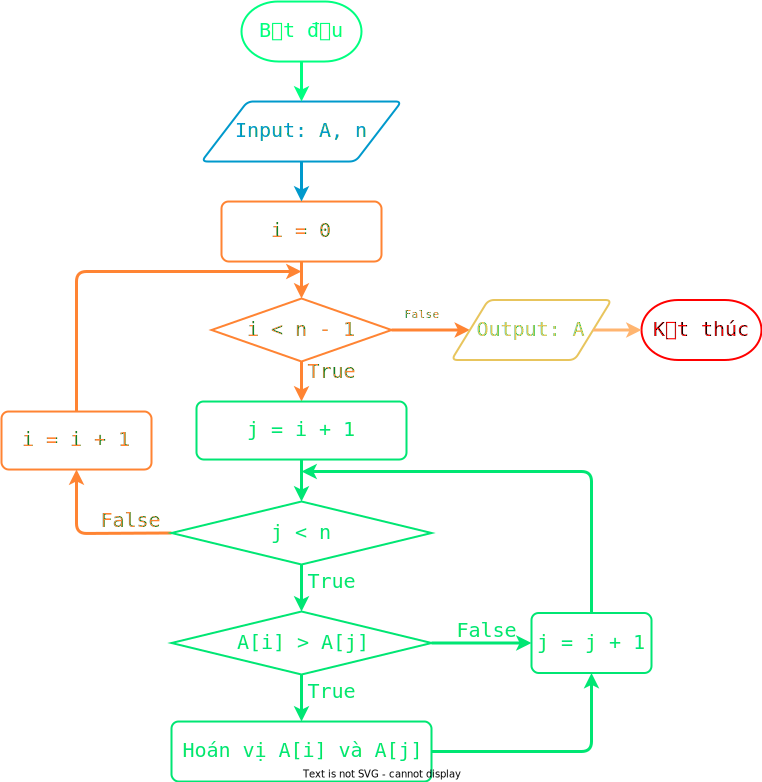

# Sắp xếp tráo đổi

!!! abstract "Tóm lược nội dung"

    Bài này trình bày thuật toán sắp xếp tráo đổi.

## Bài toán và thuật toán sắp xếp

Tương tự [bài học trước](../topic-F2/sorting-algorithm-selection-sort.md/#bai-toan-va-thuat-toan-sap-xep){:target="_blank"}, ta chỉ xét bài toán đơn giản là sắp xếp mảng một chiều các số nguyên theo thứ tự **tăng dần**.

## Thuật toán sắp xếp tráo đổi

### Ý tưởng

Ý tưởng chính của thuật toán sắp xếp tráo đổi là lặp lại nhiều lần thao tác so sánh phần tử đang xét với các phần tử theo sau nó và tráo đổi (hoán vị) sao cho phần tử nhỏ hơn lên trước và phần tử lớn hơn ra sau. Cụ thể như sau:

!!! note "Thuật toán sắp xếp tráo đổi"

    Duyệt mảng `A` từ vị trí `0` đến áp cuối bằng biến `i`. Ứng với mỗi `i`, thực hiện:

    &emsp;Duyệt mảng con từ vị trí `i + 1` đến cuối mảng `A` bằng biến `j`. Ứng với mỗi `j`, thực hiện:
    
    &emsp;&emsp;So sánh và tráo đổi (hoán vị) hai phần tử `A[i]` và `A[j] sao cho phần tử nhỏ hơn đứng trước và phần tử lớn hơn đứng sau.

Như vậy, sau mỗi lần duyệt của vòng lặp ngoài (biến `i`), phần tử nhỏ nhất của mảng con, tính từ vị trí `i` đến cuối mảng `A`, sẽ được đưa về vị trí đầu của mảng con đó, cũng chính là vị trí `i`. 

<figure markdown="span">
{loading=lazy}
<figcaption>Minh họa ý tưởng thuật toán sắp xếp tráo đổi</figcaption>
</figure>

### Ví dụ

<figure markdown="span">
{loading=lazy width=400px}
<figcaption>Tiến trình sắp xếp tráo đổi</figcaption>
</figure>

### Lưu đồ thuật toán

{loading=lazy width=720px}

### Trực quan hóa thuật toán

<div>
    <iframe width="100%" height="690px" frameBorder=0 src="../visualize/exchange-sort.html"></iframe>
</div>   

### Chương trình minh họa

``` py linenums="1"
# Hàm sắp xếp tráo đổi
def exchangeSort(A):
    n = len(A)

    # Duyệt mảng A từ vị trí 0 đến áp cuối
    for i in range(n - 1):
        # Duyệt mảng con từ vị trí i + 1 đến cuối mảng A
        for j in range(i + 1, n):
            # So sánh và tráo đổi A[i] và A[j]
            if A[i] > A[j]:
                A[i], A[j] = A[j], A[i]


# Chương trình chính
if __name__ == '__main__':
    array = [1, 7, 4, 0, 9, 4, 8, 8]
    print(f'Mảng gốc chưa có thứ tự: {array}')
    exchangeSort(array)
    print(f'Mảng có thứ tự tăng dần: {array}')
```

Output:

```pycon
Mảng gốc chưa có thứ tự: [1, 7, 4, 0, 9, 4, 8, 8]
Mảng có thứ tự tăng dần: [0, 1, 4, 4, 7, 8, 8, 9]
```

## Sơ đồ tóm tắt nội dung

{!grade-11/topic-F2/sorting-algorithm-exchange-sort.mm.md!}
*Sơ đồ tóm tắt bài toán sắp xếp và thuật toán sắp xếp tráo đổi*

## Google Colab

Các đoạn mã trong bài này được đặt tại <a href="https://colab.research.google.com/drive/1dg_zTANTcBFwKDcV3MdsN5Ksw2Hy9fr_?usp=sharing" target="_blank">Google Colab</a> để bạn có thể thử nghiệm theo cách của riêng mình.

## Some English words

| Vietnamese | Tiếng Anh | 
| --- | --- |
| hoán vị (hai phần tử) | swap |
| sắp xếp tráo đổi | exchange sort |
| so sánh | compare |