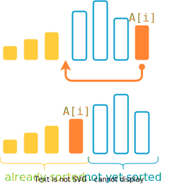
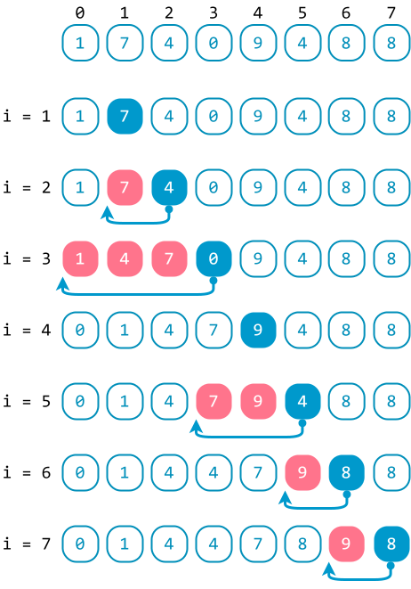
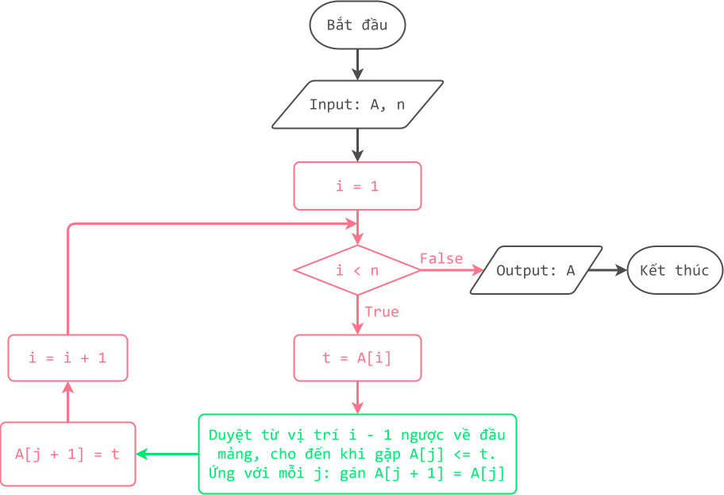

# Sắp xếp chèn

!!! abstract "Tóm lược nội dung"

    Bài này trình bày thuật toán sắp xếp chèn.

## Bài toán và thuật toán sắp xếp

Tương tự [bài học trước](../topic-F2/sorting-algorithm-selection-sort.md/#bài-toán-và-thuật-toán-sắp-xếp){:target="_blank"}, ta chỉ xét bài toán đơn giản là sắp xếp mảng một chiều các số nguyên theo thứ tự **tăng dần**.

## Thuật toán sắp xếp chèn

### Ý tưởng

Hãy tưởng tượng hình ảnh cả lớp đang xếp một hàng dọc.

Xét một bạn Tèo nào đó. Lần lượt các bạn đứng trước Tèo mà cao hơn Tèo thì lùi về sau một vị trí, cho đến khi *gặp* một bạn không cao hơn Tèo thì dừng. Lúc này, do các bạn cao đã lùi về sau, một chỗ trống sẽ *lộ ra* cho Tèo đứng chèn vào.   

Dựa vào cách thức trên, ý tưởng chính của thuật toán sắp xếp chèn là lặp lại nhiều lần thao tác di chuyển một phần tử lên trước các phần tử lớn hơn nó. Cụ thể như sau:


!!! note "Thuật toán sắp xếp chèn"

    Duyệt mảng `A` từ vị trí `1` đến cuối bằng biến `i`. Ứng với mỗi `i`, thực hiện ba thao tác:

    1. Lưu giá trị của `A[i]` vào biến tạm `t`. (Vì `A[i]` sẽ bị ghi đè bởi các phần tử `A[j]` trong thao tác tiếp theo)
    
    2. Khởi tạo `j = i – 1`.

        Dùng vòng lặp while, duyệt mảng con từ vị trí `i - 1` ngược về đầu mảng bằng biến `j`. Ứng với mỗi `j`, thực hiện dịch chuyển `A[j]` về sau một vị trí.
        
        Vòng lặp while dừng khi gặp phần tử `A[j]` nào đó bằng `t` (tức bằng `A[i]`) hoặc `j` đã đến vị trí đầu mảng, không còn `A[j]` nào để xét.
    
    3. Chèn `A[i]` vào "*chỗ trống*" bằng cách gán biến tạm `t` cho `A[j + 1]` (Vì sau khi vòng lặp while dừng, `j` là vị trí mà `A[j]` không còn lớn hơn `A[i]` nữa, và `j + 1` là vị trí mà `A[i]` được chèn vào).

<figure markdown="span">
{loading=lazy}
<figcaption>Minh họa ý tưởng thuật toán sắp xếp chèn</figcaption>
</figure>

### Ví dụ

<figure markdown="span">
{loading=lazy width=400px}
<figcaption>Tiến trình sắp xếp chèn</figcaption>
</figure>

### Lưu đồ thuật toán

{loading=lazy width=720px}

### Trực quan hóa thuật toán

<div>
    <iframe width="100%" height="690px" frameBorder=0 src="../sorting-visualize/insertion-sort.html"></iframe>
</div>   

### Chương trình minh họa

``` py linenums="1"
# Hàm sắp xếp chèn
def insertionSort(A):
    n = len(A)

    # Duyệt mảng A từ vị trí 1 đến cuối
    for i in range(1, n):        
        # Lưu giá trị A[i] vào biến tạm t
        t = A[i]       
        
        # Duyệt mảng con từ vị trí i - 1 ngược về đầu mảng
        j = i - 1
        while j >= 0 and A[j] > t:
            
            # Dịch chuyển A[j] về phía sau một vị trí
            A[j + 1] = A[j]

            # Giảm j để tiếp tục xét những A[j] mà lớn hơn t
            j = j - 1
        
        # Chèn t vào vị trí j + 1
        A[j + 1] = t  # (1)


# Chương trình chính
if __name__ == '__main__':
    array = [1, 7, 4, 0, 9, 4, 8, 8]
    print(f'Mảng gốc chưa có thứ tự: {array}')
    insertionSort(array)
    print(f'Mảng có thứ tự tăng dần: {array}')
```
{ .annotate }

1.  Sau khi vòng lặp while kết thúc, `j` là vị trí mà `A[j]` nhỏ hơn hoặc bằng `A[i]`, còn `j + 1` là vị trí sẽ được `A[i]` đứng chèn vào.

Output:

```pycon
Mảng gốc chưa có thứ tự: [1, 7, 4, 0, 9, 4, 8, 8]
Mảng có thứ tự tăng dần: [0, 1, 4, 4, 7, 8, 8, 9]
```

## Sơ đồ tóm tắt nội dung

{!grade-11/topic-F2/sorting-algorithm-insertion-sort.mm.md!}
*Sơ đồ tóm tắt bài toán sắp xếp và thuật toán sắp xếp chèn*

## Google Colab

Các đoạn mã trong bài này được đặt tại <a href="https://colab.research.google.com/drive/1zkDywixSi1Le7XikA4njlg72Kpz5E7dY?usp=sharing" target="_blank">Google Colab</a> để bạn có thể thử nghiệm theo cách của riêng mình.

## Some English words

| Vietnamese | Tiếng Anh | 
| --- | --- |
| biến tạm thời | temporatory variable |
| hoán vị (hai phần tử) | swap |
| sắp xếp chèn | insertion sort |
| so sánh | compare |