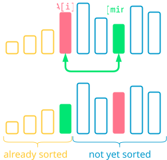
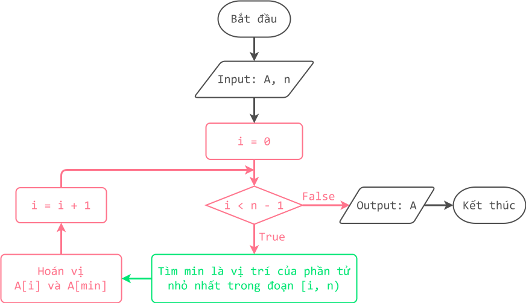

# Thuật toán sắp xếp chọn và sắp xếp chèn

!!! abstract "Tóm lược nội dung"

    Bài này trình bày hai thuật toán sắp xếp:

    - Sắp xếp chọn
    - Sắp xếp chèn

## Đặt vấn đề

Với bảng điểm của lớp, làm sao để lấy ra 10 bạn có điểm số cao nhất hoặc thấp nhất?

Một cách làm đơn giản là ta sắp xếp bảng điểm trước, sau đó mới lấy ra 10 phần tử đầu tiên hoặc 10 phần tử cuối cùng tùy theo yêu cầu.

## Bài toán và thuật toán sắp xếp

Sắp xếp là quy trình tổ chức lại dữ liệu theo một thứ tự có nghĩa nào đó, chẳng hạn: thứ tự theo bảng chữ cái, thứ tự từ thấp đến cao, thứ tự từ ngắn đến dài, hoặc một thứ tự phù hợp yêu cầu.

Trong bài này, ta chỉ xét bài toán đơn giản là sắp xếp mảng các số nguyên theo thứ tự **không giảm**, nghĩa là phần tử liền sau **lớn hơn hoặc bằng** phần tử liền trước. Để cho tiện, ta tạm gọi là **tăng dần**.

!!! note "Phát biểu bài toán sắp xếp trên mảng"
    
    Input:  
    - Mảng một chiều *A* gồm *n* phần tử đều là số nguyên.  
 
    Output:  
    - Mảng một chiều *A* có thứ tự tăng dần.  

Có nhiều thuật toán sắp xếp mà hầu hết trong số đó thực hiện thao tác so sánh các phần tử với nhau để xác định một phần tử sẽ đứng trước hay đứng sau một phần tử khác.

Đối với bài toán sắp xếp vừa nêu, bài viết này đề cập hai thuật toán sau:

- Sắp xếp chọn
- Sắp xếp chèn

??? info "Lợi ích và ứng dụng của thuật toán sắp xếp"
        
    Trong lập trình, sắp xếp dữ liệu là thao tác quan trọng vì nó giúp cho tập dữ liệu trở nên dễ đọc hơn cũng như việc tìm kiếm và xử lý dữ liệu thuận tiện hơn.

    Nhìn chung, thuật toán sắp xếp có hai loại ứng dụng chủ yếu, đó là hỗ trợ tìm kiếm thông tin và so khớp dữ liệu. Một số bài toán cần đến đến sắp xếp dữ liệu là:

    - Bài toán quản lý, trong đó cần sắp xếp mã định danh, họ tên, thời gian, nơi chốn, v.v...
    - Bài toán liên quan đồ thị như Prim, Dijkstra, Kruscal, v.v..., trong đó cần sắp xếp các cạnh theo trọng số.
    - Bài toán liên quan đến những thao tác như: tìm trung vị, tìm tứ phân vị, tìm phần tử trùng lắp, trộn các tập dữ liệu, "*chia để trị*", tìm kiếm "*theo khoảng*".   
    - Bài toán liên quan đến lập mô hình hoặc mô phỏng thế giới thực.

    Hiện nay, các ngôn ngữ lập trình và hệ thống phần mềm đã có sẵn công cụ sắp xếp để người dùng dễ dàng sử dụng. Song việc tìm hiểu các thuật toán sắp xếp vẫn là cần thiết giúp người học phát triển tư duy và kỹ năng lập trình.

## Thuật toán sắp xếp chọn

### Ý tưởng

Hãy tưởng tượng, ta cần chọn đội hình gồm những cầu thủ có phong độ tốt nhất từ những cầu thủ hiện có để thi đấu. Ta thực hiện bằng cách: chọn cầu thủ có phong độ tốt nhất, chọn cầu thủ có phong độ tốt thứ hai, chọn cầu thủ có phong độ tốt thứ ba, v.v...

Áp dụng cách trên cho mảng, nếu xem "*nhỏ nhất*" đồng nghĩa "*tốt nhất*", thì ta sẽ chọn phần tử nhỏ nhất trước, rồi chọn tiếp phần tử nhỏ nhất tiếp theo, rồi chọn tiếp phần tử nhỏ nhất tiếp theo nữa, v.v...  

Như vậy, ý tưởng của thuật toán sắp xếp chọn như sau:

!!! note "Ý tưởng thuật toán sắp xếp chọn"
    
    Duyệt mảng từ đầu đến cuối, lặp thao tác:

    - Ứng với mỗi phần tử `A[i]`, tìm phần tử nhỏ nhất `A[m]` tính từ vị trí `i` đến cuối mảng.  
    - Hoán vị `A[i]` và `A[m]`.  

<figure markdown>
  {loading=lazy} 
  <figcaption>Hình 1. Minh họa ý tưởng thuật toán sắp xếp chọn</figcaption>  
</figure>

### Lưu đồ thuật toán

<figure markdown>
  {loading=lazy}
  <figcaption>Hình 2. Lưu đồ thuật toán sắp xếp chọn</figcaption>
</figure>

### Trực quan hóa thuật toán

<div>
    <iframe width="100%" height="690px" frameBorder=0 src="../sorting-visualize/selection-sort.html"></iframe>
</div>  

### Chương trình minh họa

``` py linenums="1"
# Hàm tìm vị trí của phần tử nhỏ nhất trong mảng tính từ vị trí start
def min_position(A, start):
    n = len(A)
    min = start
    for i in range(start + 1, n):
        if A[i] < A[min]:
            min = i
    return min


# Hàm sắp xếp chọn
def selection_sort(A):
    n = len(A)
    for i in range(n - 1):
        # Tìm vị trí của phần tử nhỏ nhất tính từ i
        m = min_position(A, i)

        # Hoán vị A[i] và A[m]
        A[i], A[m] = A[m], A[i]


# Chương trình chính
if __name__ == '__main__':
    array = [1, 7, 4, 0, 9, 4, 8, 8, 2, 4]
    selection_sort(array)  # Gọi hàm selection_sort

    print('Mảng sau khi sắp xếp:', array)
```

## Thuật toán sắp xếp chèn

### Ý tưởng

Ý tưởng của thuật toán có thể được minh họa qua hình ảnh cả lớp đang xếp một hàng dọc. Tại một bạn Tèo nào đó đang xét, lần lượt các bạn đứng trước Tèo mà cao hơn Tèo lùi về sau một vị trí, cho đến khi *gặp* một bạn không cao hơn Tèo thì dừng. Lúc này, do các bạn cao đã lùi về sau, một chỗ trống sẽ *lộ ra* cho Tèo đứng chèn vào.   

Dựa vào hình ảnh trên, ý tưởng của thuật toán sắp xếp chèn như sau:  

!!! note "Ý tưởng thuật toán sắp xếp chèn"

    Duyệt mảng từ đầu đến cuối, lặp các thao tác:

    - Ứng với mỗi phần tử `A[i]`, duyệt mảng từ vị trí `i - 1` ngược về đầu mảng cho đến khi *gặp* được một `A[j]` không lớn hơn `A[i]` thì dừng, lặp thao tác: cho mỗi `A[j]` lùi về sau một vị trí.
    - Cho `A[i]` chèn vào *chỗ trống* do các `A[j]` lùi về sau *để lại*.  

<figure markdown>
  {loading=lazy} 
  <figcaption>Hình 3. Minh họa ý tưởng thuật toán sắp xếp chèn</figcaption>  
</figure>

### Lưu đồ thuật toán

<figure markdown>
  {loading=lazy}
  <figcaption>Hình 4. Lưu đồ thuật toán sắp xếp chèn</figcaption>
</figure>

### Trực quan hóa thuật toán

<div>
    <iframe width="100%" height="690px" frameBorder=0 src="../sorting-visualize/insertion-sort.html"></iframe>
</div>   

### Chương trình minh họa

``` py linenums="1"
# Hàm sắp xếp chèn
def insertion_sort(A):
    n = len(A)

    for i in range(1, n):
        # Lưu A[i] vào biến tạm tmp vì A[i] sẽ bị ghi đè
        tmp = A[i]

        # Cho j xuất phát từ phần tử đứng trước A[i]
        j = i - 1

        # Nếu A[j] nào lớn hơn A[i] (lưu trong tmp)
        # thì cho A[j] đó "lùi" ra sau một vị trí (ghi đè lên phần tử đứng sau)
        while j >= 0 and A[j] > tmp:
            A[j + 1] = A[j]
            j = j - 1

        # Chèn A[i] (lưu trong tmp) vào “chỗ trống”
        A[j + 1] = tmp


# Chương trình chính
if __name__ == '__main__':
    array = [1, 7, 4, 0, 9, 4, 8, 8, 2, 4]
    insertion_sort(array)  # Gọi hàm insertion_sort

    print('Mảng sau khi sắp xếp:', array)
```

## Sơ đồ tóm tắt nội dung

{!grade-11/topic-F2/sorting-algorithm-selection-insertion.mm.md!}
*Hình 5. Sơ đồ tóm tắt thuật toán sắp xếp chọn và sắp xếp chèn*

## Google Colab

Các đoạn mã trong bài này được đặt tại <a href="https://colab.research.google.com/drive/1zkDywixSi1Le7XikA4njlg72Kpz5E7dY?usp=sharing" target="_blank">Google Colab</a> để bạn có thể thử nghiệm theo cách của riêng mình.

## Some English words

| Vietnamese | Tiếng Anh | 
| --- | --- |
| hoán vị (hai phần tử) | swap |
| sắp xếp chèn | insertion sort |
| sắp xếp chọn | selection sort |
| so sánh | compare |