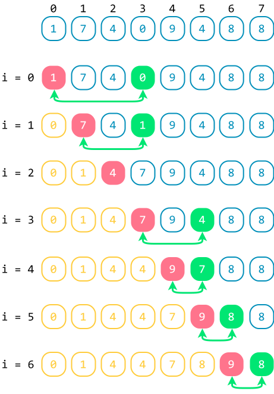

# Sắp xếp chọn

!!! abstract "Tóm lược nội dung"

    Bài này trình bày bài toán sắp xếp và thuật toán sắp xếp chọn.

## Đặt vấn đề

Với bảng điểm của lớp, làm sao để lấy ra 10 bạn có điểm số cao nhất hoặc thấp nhất?

Một cách làm đơn giản là ta sắp xếp bảng điểm trước, sau đó mới lấy ra 10 phần tử đầu tiên hoặc 10 phần tử cuối cùng tùy theo yêu cầu.

## Bài toán và thuật toán sắp xếp

Sắp xếp dữ liệu là quá trình cơ bản và quan trọng trong xử lý dữ liệu, tạo thuận lợi cho việc tìm kiếm, truy xuất và phân tích dữ liệu.

Sắp xếp dữ liệu là quá trình tổ chức lại dữ liệu theo một trật tự có nghĩa nào đó, thường là tăng dần hoặc giảm dần.

Trong chủ đề F, ta chỉ xét bài toán đơn giản là sắp xếp mảng một chiều các số nguyên theo thứ tự **không giảm**, nghĩa là phần tử liền sau **lớn hơn hoặc bằng** phần tử liền trước, và tạm gọi là **tăng dần**.

!!! note "Bài toán sắp xếp"
    
    Input:  
    - Mảng một chiều `A` gồm `n` phần tử đều là số nguyên.  
 
    Output:  
    - Mảng một chiều `A` có thứ tự tăng dần.

Có nhiều thuật toán sắp xếp khác nhau, hầu hết trong số đó thực hiện thao tác so sánh các phần tử với nhau để xác định một phần tử sẽ đứng trước hay đứng sau một phần tử khác.

Mỗi thuật toán có ưu điểm và hạn chế riêng. Tuỳ vào loại dữ liệu và yêu cầu, ta sẽ chọn thuật toán phù hợp.

Bài viết này đề cập thuật toán sắp xếp chọn.

??? info "Lợi ích và ứng dụng của thuật toán sắp xếp"
        
    Trong lập trình, sắp xếp dữ liệu giúp cho tập dữ liệu trở nên dễ đọc hơn cũng như việc tìm kiếm và xử lý dữ liệu thuận tiện hơn.

    Nhìn chung, thuật toán sắp xếp có hai loại ứng dụng: hỗ trợ tìm kiếm thông tin và so khớp dữ liệu. Một số bài toán cần đến đến sắp xếp dữ liệu là:

    - Bài toán quản lý, trong đó cần sắp xếp mã định danh, họ tên, thời gian, nơi chốn, v.v...
    - Bài toán liên quan đồ thị như Prim, Dijkstra, Kruscal, v.v..., trong đó cần sắp xếp các cạnh theo trọng số.
    - Bài toán liên quan đến những thao tác như: tìm trung vị, tìm tứ phân vị, tìm phần tử trùng lắp, trộn các tập dữ liệu, "*chia để trị*", tìm kiếm "*theo khoảng*".   
    - Bài toán liên quan đến lập mô hình hoặc mô phỏng thế giới thực.

    Hiện nay, các ngôn ngữ lập trình và hệ thống phần mềm đã có sẵn công cụ sắp xếp để người dùng dễ dàng sử dụng. Song việc tìm hiểu các thuật toán sắp xếp vẫn là cần thiết giúp người học phát triển tư duy và kỹ năng lập trình.

## Thuật toán sắp xếp chọn

### Ý tưởng

Hãy tưởng tượng, ta cần chọn đội hình gồm những cầu thủ có phong độ tốt nhất từ những cầu thủ hiện có để thi đấu. Ta thực hiện bằng cách: chọn cầu thủ có phong độ tốt nhất, chọn cầu thủ có phong độ tốt thứ hai, chọn cầu thủ có phong độ tốt thứ ba, v.v...

Áp dụng cách trên cho mảng, nếu xem "*nhỏ nhất*" đồng nghĩa "*tốt nhất*", thì ta sẽ chọn phần tử nhỏ nhất trước, rồi chọn tiếp phần tử nhỏ nhất tiếp theo, rồi chọn tiếp phần tử nhỏ nhất tiếp theo nữa, v.v...  

Như vậy, ý tưởng của thuật toán sắp xếp chọn như sau:

!!! note "Thuật toán sắp xếp chọn"
    
    Duyệt mảng `A` từ vị trí đầu đến cuối bằng biến `i`. Ứng với mỗi `i`, thực hiện:

    - Tìm phần tử nhỏ nhất `A[min]` trong mảng con từ vị trí `i` đến cuối mảng.  
    - Hoán vị `A[i]` và `A[min]`.  

<figure markdown="span">
{loading=lazy}
<figcaption>Minh họa ý tưởng thuật toán sắp xếp chọn</figcaption>
</figure>

### Ví dụ

<figure markdown="span">
{loading=lazy width=400px}
<figcaption>Tiến trình sắp xếp chọn</figcaption>
</figure>

### Lưu đồ thuật toán

{loading=lazy width=720px}

### Trực quan hóa thuật toán

<div>
    <iframe width="100%" height="690px" frameBorder=0 src="../sorting-visualize/selection-sort.html"></iframe>
</div>  

### Chương trình minh họa

``` py linenums="1"
# Hàm sắp xếp chọn
def selectionSort(A):
    n = len(A)

    # Duyệt mảng A từ vị trí 0 đến áp cuối
    for i in range(n - 1):
        # Tìm vị trí phần tử nhỏ nhất của mảng con tính từ i đến cuối
        min = i
        for j in range(i + 1, n): 
            if A[j] < A[min]:
                min = j

        # Hoán vị A[min] và A[i]
        A[i], A[min] = A[min], A[i]


# Chương trình chính
if __name__ == '__main__':
    array = [1, 7, 4, 0, 9, 4, 8, 8]
    print(f'Mảng gốc chưa có thứ tự: {array}')

    selectionSort(array)
    print(f'Mảng có thứ tự tăng dần: {array}')
```

Output:

```pycon
Mảng gốc chưa có thứ tự: [1, 7, 4, 0, 9, 4, 8, 8]
Mảng có thứ tự tăng dần: [0, 1, 4, 4, 7, 8, 8, 9]
```

## Sơ đồ tóm tắt nội dung

{!grade-11/topic-F2/sorting-algorithm-selection-sort.mm.md!}
*Sơ đồ tóm tắt bài toán sắp xếp và thuật toán sắp xếp chọn*

## Google Colab

Các đoạn mã trong bài này được đặt tại <a href="https://colab.research.google.com/drive/1VBtZAQbqQTRyQx1hsF0Ez68VPa5h3I7Y?usp=sharing" target="_blank">Google Colab</a> để bạn có thể thử nghiệm theo cách của riêng mình.

## Some English words

| Vietnamese | Tiếng Anh | 
| --- | --- |
| hoán vị (hai phần tử) | swap |
| sắp xếp chọn | selection sort |
| so sánh | compare |